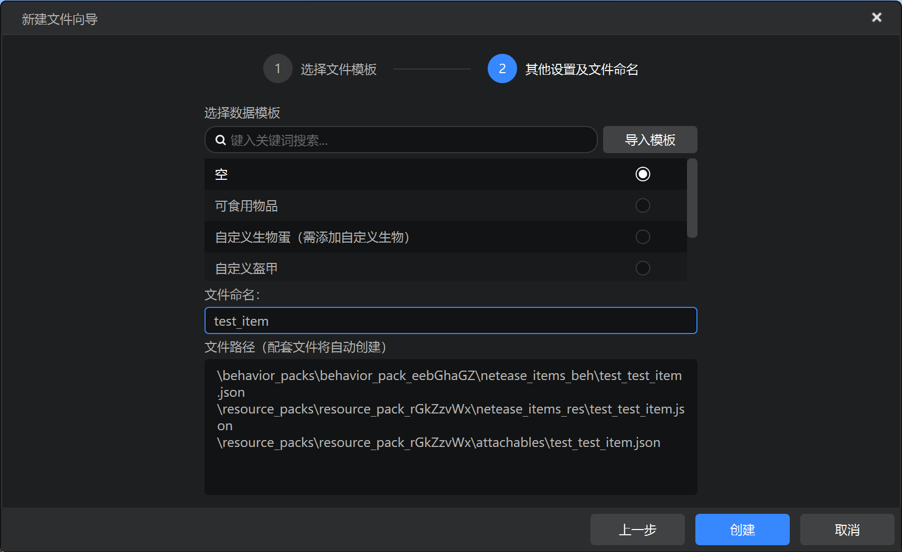
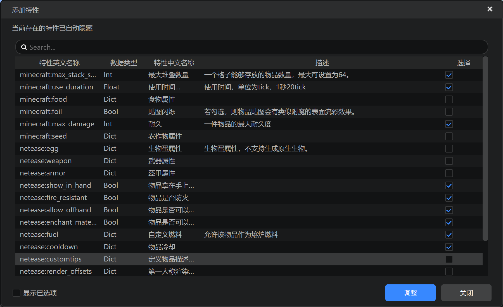
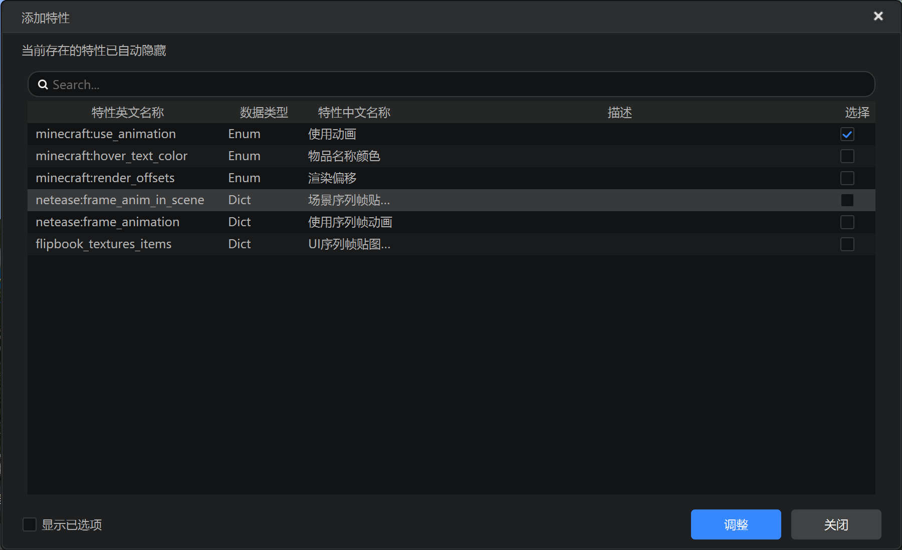

# 基本属性

在接下来的章节中，我们以先在《我的世界》开发工作台编辑器中添加属性，然后打开具体路径来观察JSON文件的方式回顾学习各种自定义对象的JSON文件写法。接下来，我们先回顾之前的自定义奖励物品。我们首先学习各类常见的基本属性。

## 在编辑器中添加



我们在编辑器中添加一个标识符为`test:test_item`的物品。



我们在“行为包属性”中添加如上图所示属性。



我们在“资源包”属性中添加如上图所示属性。这样，我们便通过编辑器添加了一些常用的基本属性。

## 实际文件

然后我们一起来查看自定义物品的实际文件。物品分为客户端和服务端两个文件，客户端文件在资源包的`netease_items_res`文件夹中，服务端文件在行为包的`netease_items_beh`文件夹中。

我们打开资源包中的客户端文件，查看如下：

```json
{
    "format_version": "1.10",
    "minecraft:item": {
        "components": {
            "minecraft:icon": "test:test_item",
            "minecraft:use_animation": "eat"
        },
        "description": {
            "category": "Construction",
            "identifier": "test:test_item"
        }
    }
}
```

行为包中的服务端文件，查看如下：

```json
{
    "format_version": "1.10",
    "minecraft:item": {
        "components": {
            "minecraft:max_damage": 0,
            "minecraft:max_stack_size": 64,
            "minecraft:use_duration": 0.0,
            "netease:allow_offhand": {
                "value": true
            },
            "netease:cooldown": {
                "category": "",
                "duration": 0
            },
            "netease:enchant_material": {
                "value": true
            },
            "netease:fire_resistant": {
                "value": true
            },
            "netease:fuel": {
                "duration": 0
            },
            "netease:show_in_hand": {
                "value": true
            }
        },
        "description": {
            "category": "Construction",
            "identifier": "test:test_item"
        }
    }
}
```

`format_version`代表该文件的格式版本，控制接口字段的结构。在`minecraft:item`对象下，有两个对象，`description`对象定义了物品的标识符和分类，`components`对象定义了物品的组件，对应编辑器中的“属性”。

有些组件本身直接就是一个值，例如上面行为包中的`minecraft:max_damage`等。有些组件本身是一个对象，对象中定义了该属性的各个子属性，例如`netease:cooldown`等。

关于基本属性中各个组件的含义和用法，可以参见官方文档[自定义基础物品](https://mc.163.com/dev/mcmanual/mc-dev/mcguide/20-%E7%8E%A9%E6%B3%95%E5%BC%80%E5%8F%91/15-%E8%87%AA%E5%AE%9A%E4%B9%89%E6%B8%B8%E6%88%8F%E5%86%85%E5%AE%B9/1-%E8%87%AA%E5%AE%9A%E4%B9%89%E7%89%A9%E5%93%81/1-%E8%87%AA%E5%AE%9A%E4%B9%89%E5%9F%BA%E7%A1%80%E7%89%A9%E5%93%81.html?catalog=1)。
