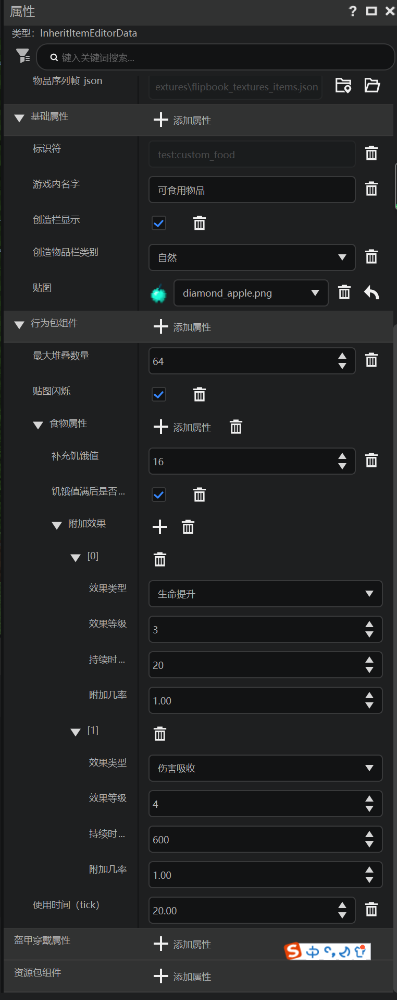

# 食物

在本节中，我们学习食物的自定义物品JSON文件。

## 在编辑器中添加



在前面的系列教程中，我们添加过钻石苹果自定义物品。它的属性如上述所示。

## 实际文件

在我们的例子中，我们依旧只需要展示行为包文件：

```json
{
    "format_version": "1.10",
    "minecraft:item": {
        "components": {
            "minecraft:foil": true,
            "minecraft:food": {
                "can_always_eat": true,
                "effects": [
                    {
                        "amplifier": 3,
                        "chance": 1.0,
                        "duration": 20,
                        "name": "health_boost"
                    },
                    {
                        "amplifier": 4,
                        "chance": 1.0,
                        "duration": 600,
                        "name": "absorption"
                    }
                ],
                "nutrition": 16
            },
            "minecraft:max_stack_size": 64,
            "minecraft:use_duration": 20.0
        },
        "description": {
            "category": "Nature",
            "identifier": "test:custom_food"
        }
    }
}
```

`minecraft:foil`用于物品是否开启铂晕效果，即类似附魔效果的光效。

`minecraft:food`用于自定义食用效果。`can_always_eat`对应是否可以在满饥饿值状态下食用，类似于金苹果、附魔金苹果。`effects`是食用后出发的状态效果。`nutrition`是食用后恢复的饥饿值。更多的属性可以在基岩版开发维基的[`minecraft:food`](https://wiki.mcbe-dev.net/p/Manual:Minecraft:food#tabber-1.12.0)页面找到名称及其用法。

