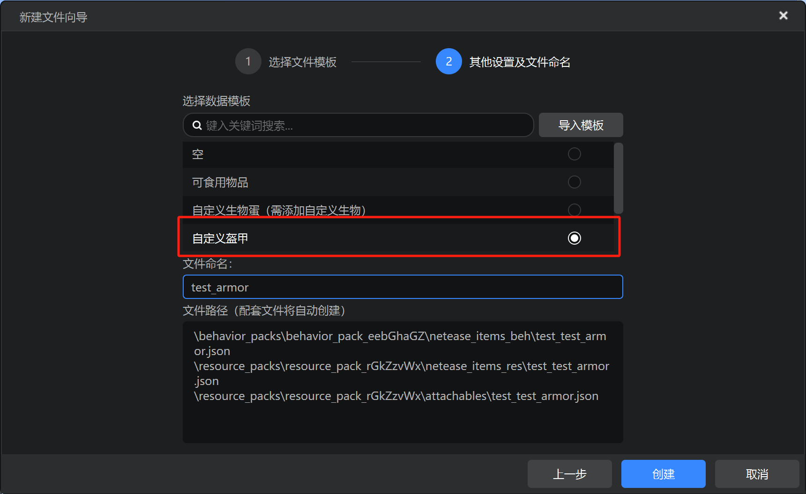
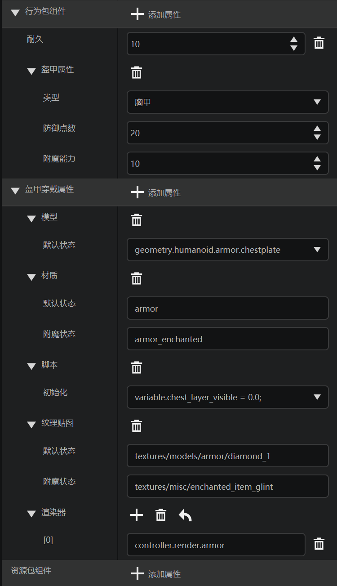
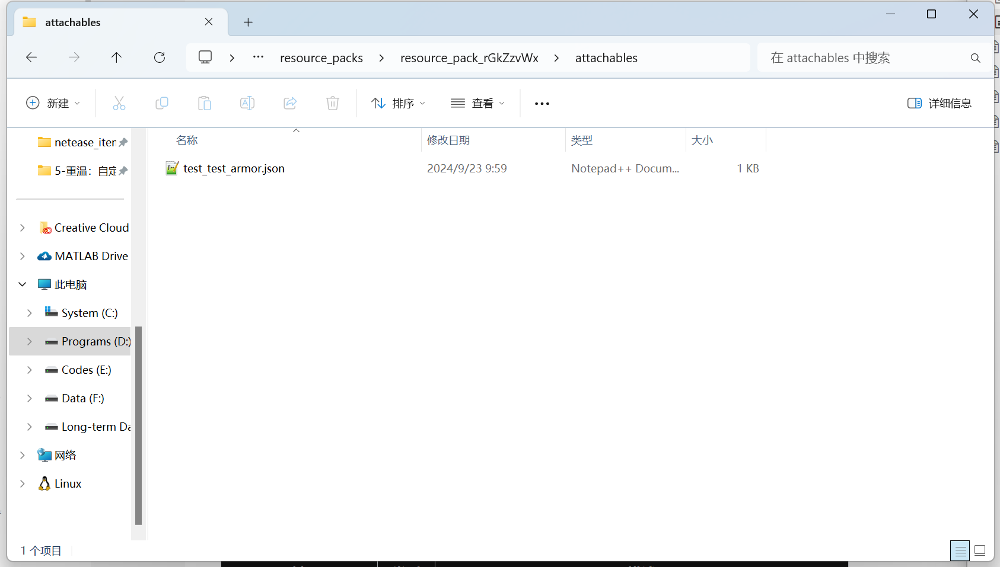

# 盔甲

在本节中，我们学习盔甲的自定义物品JSON文件。

## 在编辑器中添加



我们创建一个标识符为`test:test_armor`的自定义物品，注意，为了快速创建一个盔甲，我们可以选择“自定义盔甲”数据模板。



此时，我们会额外的看到“盔甲穿戴属性”一栏被填充了内容，这也是自定义盔甲时与众不同的一处。我们会在下面的JSON文件讲解中实际看到这一点。

## 实际文件

首先我们查看盔甲物品的行为包文件：

```json
{
    "format_version": "1.10",
    "minecraft:item": {
        "components": {
            "minecraft:max_damage": 10,
            "netease:armor": {
                "armor_slot": 1,
                "defense": 20,
                "enchantment": 10
            }
        },
        "description": {
            "category": "Equipment",
            "identifier": "test:test_armor"
        }
    }
}
```

可以看到，`netease:armor`组件定义了盔甲相关参数，`armor_slot`为1代表着定义的是胸甲，`defense`是提供的护甲值的量，`enchantment`是附魔能力。此外，还有一些其它参数，可以参考官方文档[自定义盔甲](https://mc.163.com/dev/mcmanual/mc-dev/mcguide/20-%E7%8E%A9%E6%B3%95%E5%BC%80%E5%8F%91/15-%E8%87%AA%E5%AE%9A%E4%B9%89%E6%B8%B8%E6%88%8F%E5%86%85%E5%AE%B9/1-%E8%87%AA%E5%AE%9A%E4%B9%89%E7%89%A9%E5%93%81/3-%E8%87%AA%E5%AE%9A%E4%B9%89%E7%9B%94%E7%94%B2.html?catalog=1)的解释。

盔甲和其他物品有一点不同之处在于，他需要使用附着物（Attachable）来盔甲穿戴在玩家身上的效果。附着物是一种类似于客户端实体的对象，这一点在我们之后章节回顾学习了实体JSON写法之后你可以清晰地看到。你可以理解为，附着物是一种挂接在玩家身上的额外部件，而盔甲便是使用这一种对象来渲染穿戴效果。



我们打开资源包的`attachables`文件夹，便可以看到对应的附着物JSON文件，我们观察此文件：

```json
{
    "format_version": "1.10.0",
    "minecraft:attachable": {
        "description": {
            "geometry": {
                "default": "geometry.humanoid.armor.chestplate"
            },
            "identifier": "test:test_armor",
            "materials": {
                "default": "armor",
                "enchanted": "armor_enchanted"
            },
            "render_controllers": [
                "controller.render.armor"
            ],
            "scripts": {
                "parent_setup": "variable.chest_layer_visible = 0.0;"
            },
            "textures": {
                "default": "textures/models/armor/diamond_1",
                "enchanted": "textures/misc/enchanted_item_glint"
            }
        }
    }
}
```

首先，在`identifier`字段处我们可以看到该附着物的标识符，这里需要与物品的标识符保持一致，为`test:test_armor`。

`textures`是该附着物对应的纹理，这里就是盔甲穿戴的纹理。

`materials`是该附着物渲染用的材质，一般无需更改。

`geometry`是该附着物使用的模型，这里需要注意，应该与盔甲对应部位模型一致。对于原版而言，有以下四种模型：

| 模型标识符                           | 说明 |
| ------------------------------------ | ---- |
| `geometry.humanoid.armor.helmet`     | 头盔 |
| `geometry.humanoid.armor.chestplate` | 胸甲 |
| `geometry.humanoid.armor.leggings`   | 护腿 |
| `geometry.humanoid.armor.boots`      | 靴子 |

你也可以自定义一些你自己的与原版盔甲不同的模型，相关内容都在上面提供过的自定义盔甲官方文档里有详细说明。

`scripts/parent_setup`是会在父对象（即玩家）初始化时执行的脚本，这里可以使用四种变量来调控玩家渲染效果，更具体的内容，请查看上面提供的自定义盔甲官方文档：

| 变量标识符                         | 说明 |
| ------------------------------------ | ---- |
| `variable.helmet_layer_visible`      | 是否显示玩家皮肤的头盔层 |
| `variable.chest_layer_visible` | 是否显示玩家皮肤的胸甲层 |
| `variable.leg_layer_visible`   | 是否显示玩家皮肤的护腿层 |
| `variable.boot_layer_visible`      | 是否显示玩家皮肤的靴子层 |
