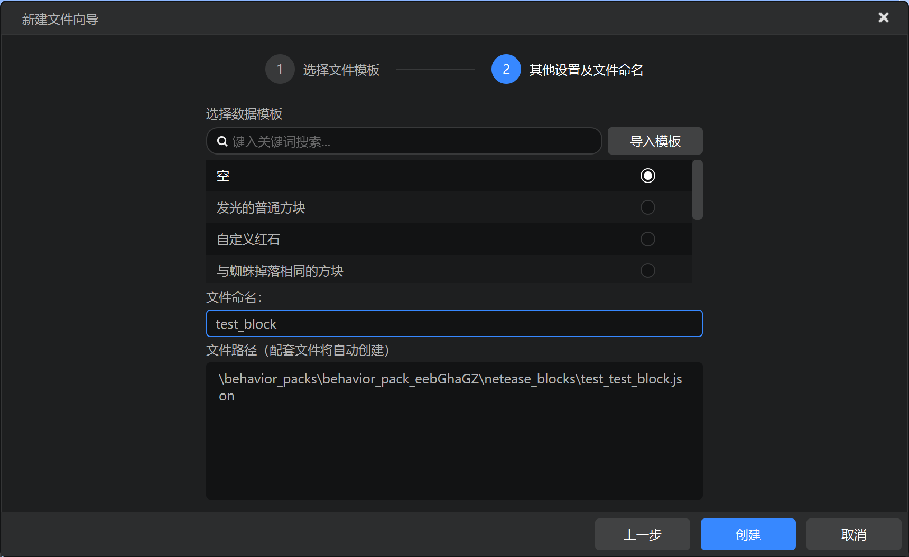
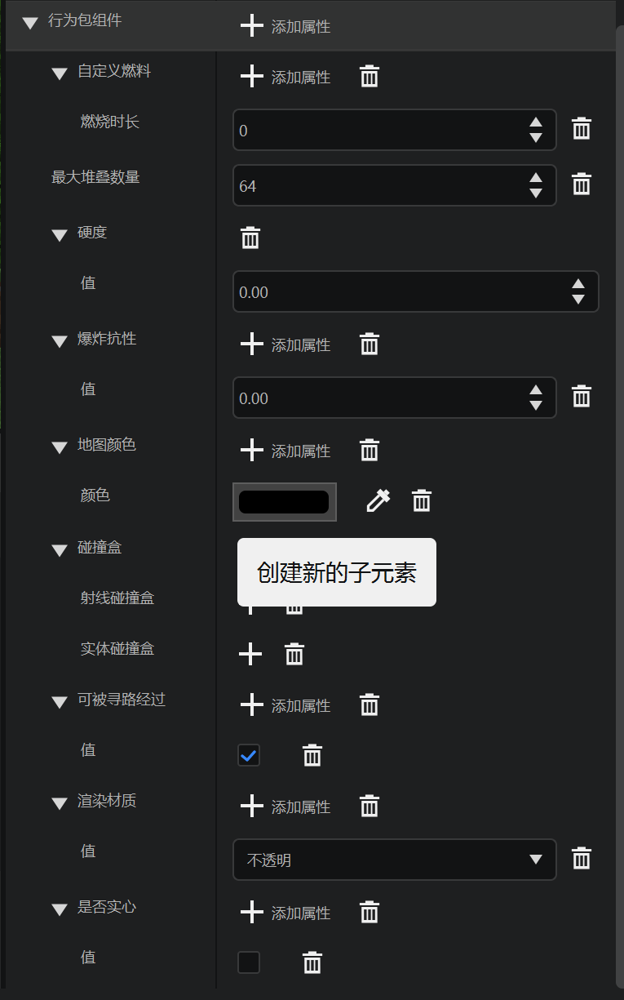
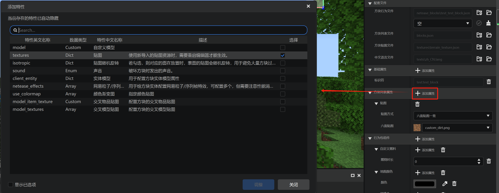
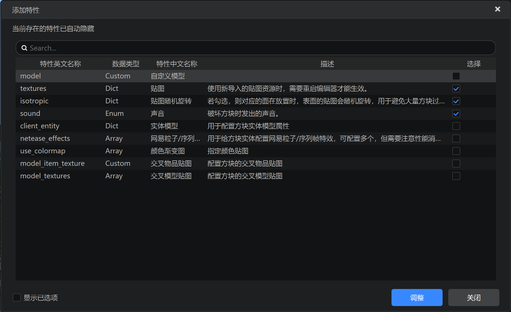
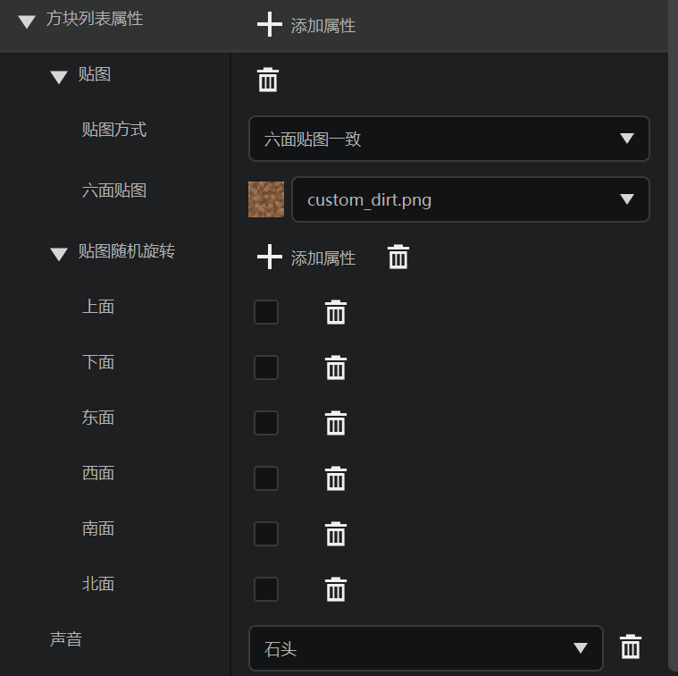

# 基本属性

在下面这几节中我们一起来回顾学习方块相关的自定义JSON文件。首先，我们在编辑器中新建一个自定义方块作为示例并观察他的JSON结构。

## 在编辑器中创建



我们创建一个空的标识符为`test:test_block`的方块。


我们在行为包组件中添加一些最基本的常用组件作为示例。



以上是添加了行为包组件之后的编辑器中显示效果。



我们再在“方块属性列表”栏中添加一些属性。





我们如图所示添加一些内容。

## 实际文件

虽然只有行为包中有存储方块定义的`netease_blocks`文件夹，但实际上方块也需要在客户端中进行定义。在客户端中定义方块的是一个独立文件`blocks.json`文件，这个文件就位于客户端的根目录中。我们先查看`blocks.json`文件：

```json
{
    "format_version": [
        1,
        1,
        0
    ],
    "test:loot": {
        "textures": "test:barrel_side"
    },
    "test:test_block": {
        "isotropic": {
            "down": false,
            "east": false,
            "north": false,
            "south": false,
            "up": false,
            "west": false
        },
        "sound": "stone",
        "textures": "test:custom_dirt"
    }
}
```

可以看到，我们定义过的所有方块其实都会出现在这同一文件中，该文件中可以定义方块的一系列客户端属性。`textures`用于定义方块使用的纹理，`sound`用于定义方块使用的音效，`isotropic`用于定义方块是否具有“各向异性”效果，即贴图随着坐标不同随机旋转或变化。

我们再来观察方块的行为包定义文件。方块的行为包定义文件位于行为包的`netease_blocks`文件夹下，打开之后如下所示：

```json
{
    "format_version": "1.10.0",
    "minecraft:block": {
        "components": {
            "minecraft:destroy_time": {
                "value": 0.0
            },
            "minecraft:explosion_resistance": {
                "value": 0.0
            },
            "minecraft:map_color": {
                "color": "#000000"
            },
            "minecraft:max_stack_size": {
                "value": 64
            },
            "netease:aabb": {
                "clip": [

                ],
                "collision": [

                ]
            },
            "netease:fuel": {
                "duration": 0
            },
            "netease:pathable": {
                "value": true
            },
            "netease:render_layer": {
                "value": "opaque"
            },
            "netease:solid": {
                "value": false
            }
        },
        "description": {
            "identifier": "test:test_block"
        }
    }
}
```

整个结构与物品、实体非常类似，只是组件有所不同。

`minecraft:destroy_time`用于指定方块的硬度，原版方块的硬度可以在Minecraft Wiki的[方块挖掘时间](https://zh.minecraft.wiki/w/%E6%8C%96%E6%8E%98/%E6%96%B9%E5%9D%97%E6%8C%96%E6%8E%98%E6%97%B6%E9%97%B4)页面找到。`minecraft:explosion_resistance`用于指定方块的爆炸抗性。`minecraft:map_color`用于指定方块在地图上显示的颜色。

`netease:aabb`是中国版自定义的组件，可以指定方块的碰撞箱和击中箱。`netease:fuel`可以用来指定方块成为熔炉燃料。`netease:pathable`用于指定是否可被生物寻路。`netease:render_layer`用于指定该方块在渲染时的渲染图层，也即渲染时的透明性。`netease:solid`用于指定方块是否有固体属性。

关于更多的方块组件内容及使用方法，可以参考官方文档自定义方块的[JSON组件](https://mc.163.com/dev/mcmanual/mc-dev/mcguide/20-%E7%8E%A9%E6%B3%95%E5%BC%80%E5%8F%91/15-%E8%87%AA%E5%AE%9A%E4%B9%89%E6%B8%B8%E6%88%8F%E5%86%85%E5%AE%B9/2-%E8%87%AA%E5%AE%9A%E4%B9%89%E6%96%B9%E5%9D%97/1-JSON%E7%BB%84%E4%BB%B6.html?catalog=1)章节。