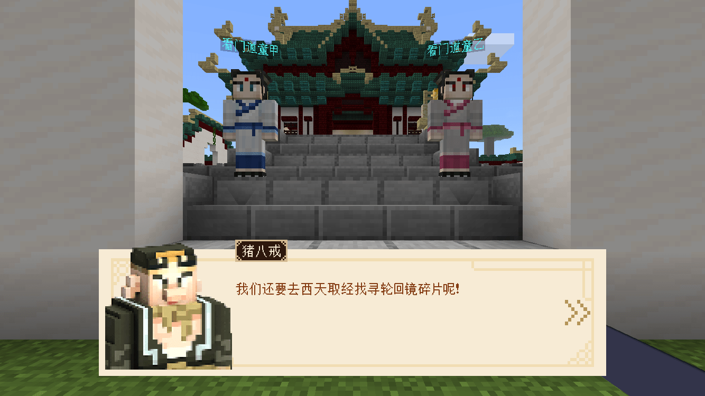
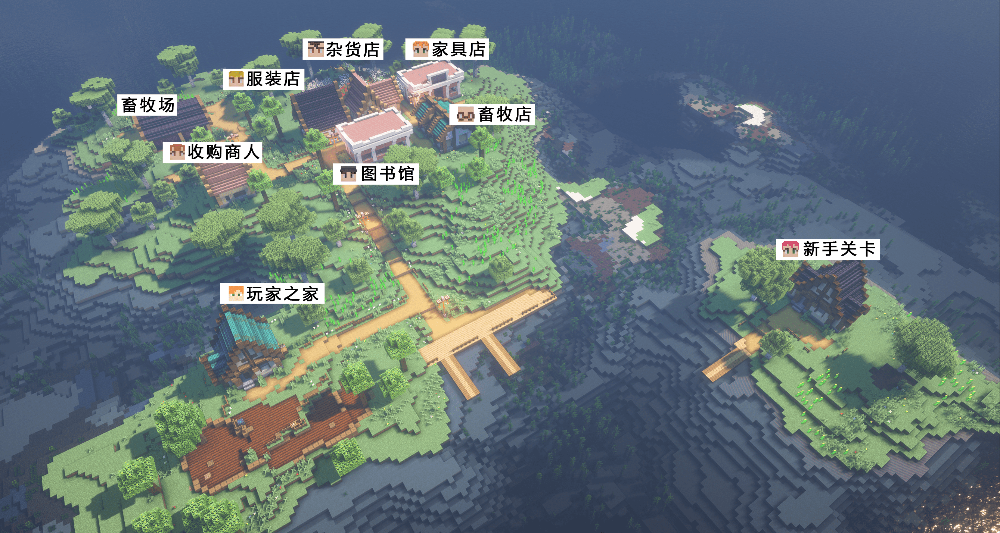
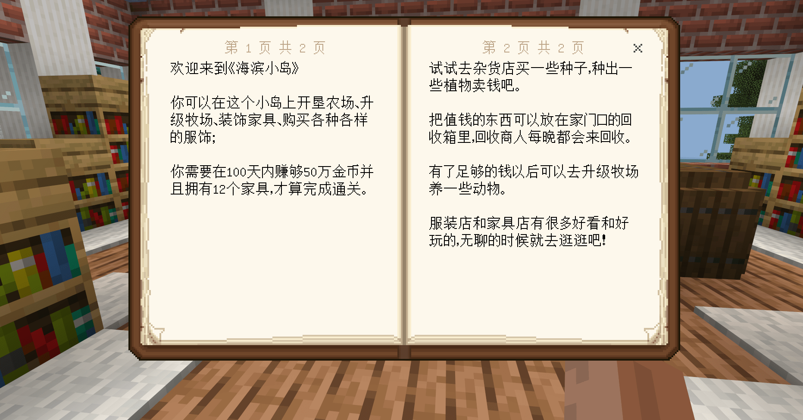

# 玩法地图为什么需要新手引导？

玩法地图相较于普通的玩法组件会更加局限、规整，正因为这样，玩法地图才需好的引导；引导都有哪些好处？为什么需要新手引导？

### 玩家可以更好、更快的了解核心玩法

最重要的一点，引导需要能够让玩家了解地图的玩法，不需要花费大量的学习时间明白地图是怎么玩的；也可以让玩家对地图的玩法记忆更深刻。

### 融入地图背景，增强游戏代入感

合理的使用新手引导，可以让玩家对地图的背景更加了解，有更清晰的认知；同时利用一些剧情和带有背景色彩的文字描述使玩家融入到地图的故事中，增强代入感。

例如在季度玩法《三打白骨精》中，就利用剧情通过和其它玩法人物进行对话了解玩法背景，可以使玩家在第一时间知道自己身处西游的世界，扮演悟空西天取经。

### 新手引导很重要，但并不是所有玩法地图都需要

如果是以开放生存为核心玩法的地图，其乐趣就是需要玩家在世界中漫无目的的探索，并在探索时不断发现新的玩法，那么是否需要新手引导就取决于玩法地图的作者来判断；但不建议有核心玩法的玩法地图完全舍弃新手引导。

以[《我的海滨农场》](../../20-玩法地图教程/第00章：示例下载/示例下载.md)为例，其主要玩法是玩家在小岛上通过种植庄稼、养殖畜牧并且在规定时间内赚到足够的钱才可以获得胜利！这一目标点则需要新手引导告知给玩家。

### 明确游戏内容，在游戏的初期吸引玩家继续

在新手引导部分展露一些出彩、亮点的游戏内容可以大程度的吸引玩家继续游戏，并对后续的游戏内容报以期待。

