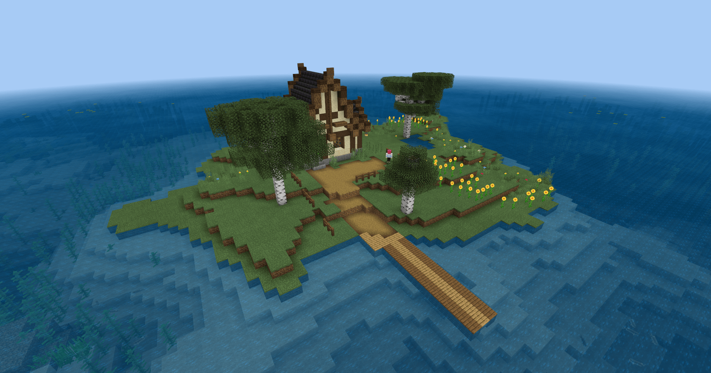
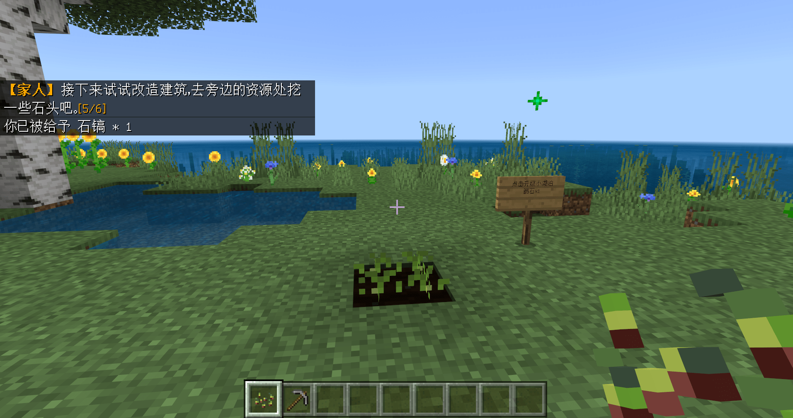
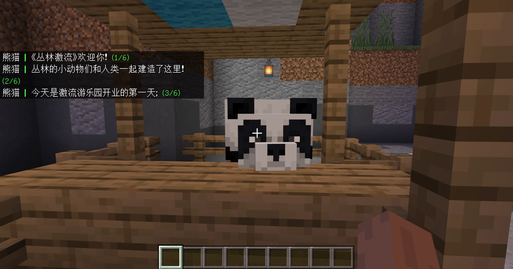
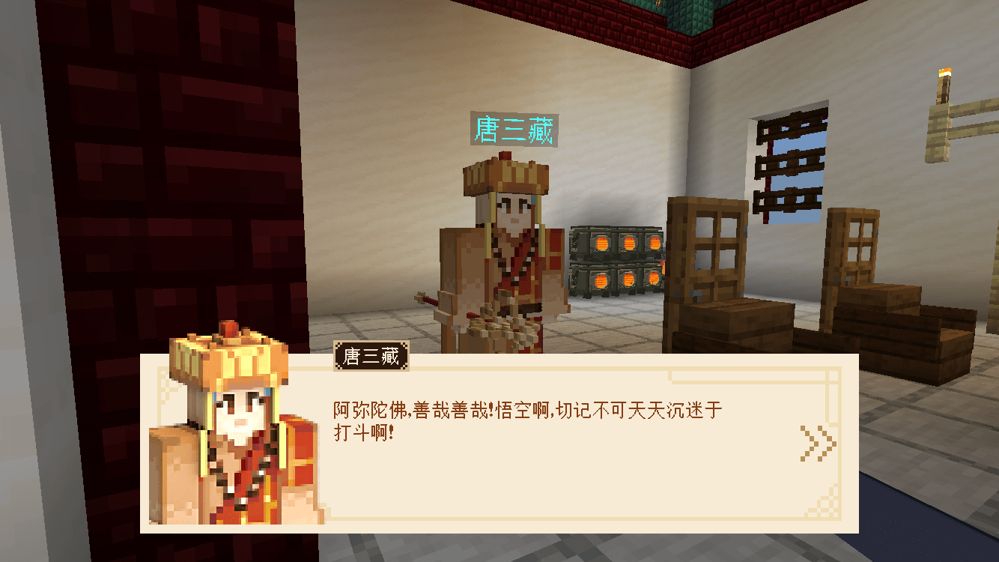
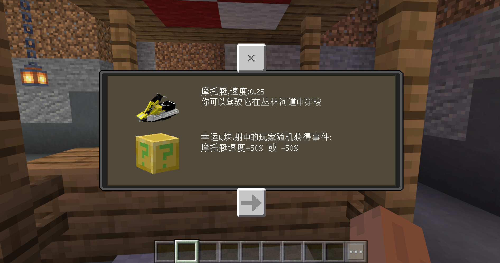
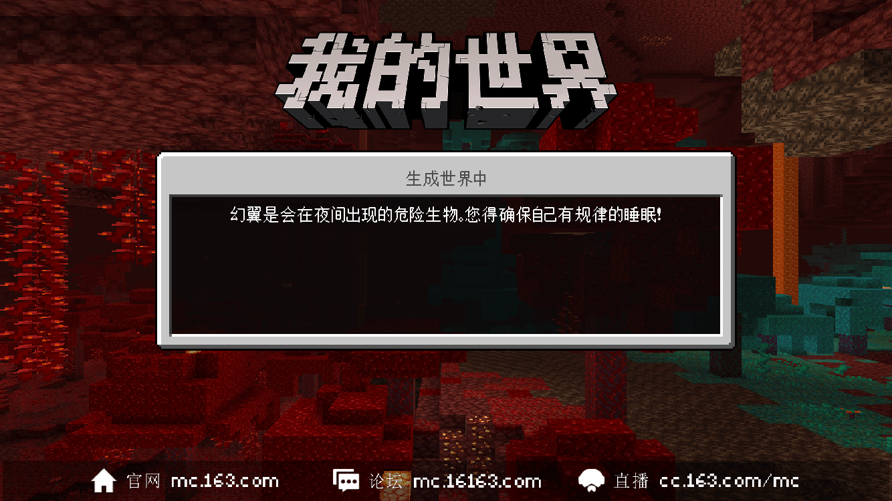

---
front:
hard: 入门
time: 10分钟
---
# 可以用什么形式进行新手引导？

引导的形式可以有很多，每个开发者都有自己对引导独特的理解，怎么能将引导最大程度的发挥其作用是需要开发者们用心设计的；本节将介绍多种引导形式并展开举例。

常见的玩法地图引导形式可以有：引导关卡、NPC对话、剧情任务、镜头语言、引导手册、其它

## 引导关卡

将一些游戏玩法的内容拆解并在关卡内一步步引导玩家进行操作，熟络游戏核心玩法。通常引导关卡都会在正式开始游戏前出现；若游戏玩法复杂，且不仅只有一条核心玩法，那引导关卡也可以有多个，并在不同的游戏阶段出现。

在[《我的海滨农场》](../../20-玩法地图教程/第08章：在开头添加引导关卡/课程01.使用MODSDK自定义NPC的聊天对话.md)中，玩家会先出现在新手小岛中，玩家需要与NPC对话，简单了解地图的玩法背景；然后在NPC的指引下完成一些简单的操作：种菜、采集石头、升级建筑；这些都是在正式游戏时的循环玩法。

完成这些简单的操作后，玩家才可以乘坐小船离开新手岛屿并正式开始游戏。

## NPC对话

在一些RPG / 生存类型的玩法地图中，经常会有一些与剧情或故事背景相关的人物NPC，可以通过这些NPC对话，提示玩家需要注意的游戏内容；同时添加对话剧情，也可以带入游戏的背景，增强玩家对地图的代入感。

## 剧情任务

这一引导形式应该会被大部分玩家及开发者熟知，很多的地图和除我的世界以外的游戏都或多或少的有剧情任务。

而由剧情任务作为主线贯穿整个玩法的地图，不需要过多的引导，玩家可以根据任务提示一步步摸索游玩，当然任务提示也算是引导的一种。

## 镜头语言

通过控制玩家的摄像头，利用镜头语言来传达信息并引导玩家。

例如直接控制玩家看向某个地方，直接的引导玩家目标地点；虽然比较生硬，但也最直观、简便。

## 引导手册

在游戏大厅放置引导手册，将游戏内容列举在手册中供玩家翻阅；在开始游戏前就可以了解到几乎所有的游戏内容。相对其它引导形式来说，这是最简单的引导之一，也很受开发者和玩家青睐。非常适用于小游戏地图。

当然也可以在游戏时提供引导手册，玩家可以在游玩的过程中随时翻阅。

## 其它

在一些需要玩家等待的地方委婉的添加引导，如PVP地图中玩家在死亡、复活阶段添加有关玩法技巧的提示。

或者适当添加跳跃性的文字提示，每隔一段时间或是玩家游玩到某个阶段，在玩家屏幕上显示。

虽然很生硬直接，但适当的与其它引导形式相结合，就会产生不同的效果。

