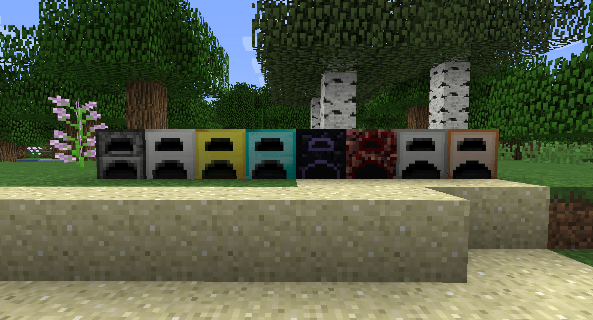

---
front:
hard: 入门
time: 5分钟
---
# 什么样的玩法需要新手引导？

几乎所有的玩法组件都需要新手引导的帮助，才能让玩家们有更好的游戏体验；也有部分玩法并不需要新手引导，那到底什么样的玩法需要新手引导呢？

## 存在核心玩法，玩家在游戏时会产生活动循环

这样的组件会有一个核心玩法，玩家将围绕核心玩法展开，在此基础上添加多种元素；将各种各样的元素结合起来，不断地扩充玩法。

例如端游版的“工业”模组，玩家需要通过建造机器寻找量产资源、减少资源消耗的方法。找到最优解和与他人不同的玩法是工业模组的魅力所在。

工业中大量的机器、矿物等元素，如果没有新手引导，很多玩家可能会在开始游戏的初期就困难重重，甚至无法游玩导致被劝退，因此这样的玩法就很需要新手引导。

## 打造新手引导体验的目的

如果仅仅是为了能够让玩家更快的了解游戏内容，可能就没有太多必要费尽心思打造尽可能完美的新手引导；其实新手引导的目的还有很多：

- 给玩家留下良好的第一印象
- 能够使玩家掌握要领并快速体验游戏，而不是被劝退
- 尽可能吸引玩家继续游玩

其实这些目的总结来说就是能够让玩家有更好的游戏体验。当引导不足或根本没有时，玩家会因无法理解而举步维艰，游戏进度不能推进；若引导过度，不能以正常的玩家视角体验游戏，像培训一样被一步一步的指导。

## 玩法不足以支撑一个核心玩法时，不一定需要新手引导

一些体量比较小的组件，有时不一定需要新手引导。比如：更多的武器、更多的怪物等，在大多数情况下，这类的组件通常只有一条主线玩法，玩家也仅根据这条线游玩。即采集 > 合成 > 提升能力；游戏流程较短，玩家需要理解的信息量也就很少。

比如，“更多的熔炉”模组添加了额外的特殊熔炉，使用原版的普通熔炉和其它材料合成活动，特殊熔炉在普通熔炉的基础上增加了格数和烧制速度。其内容基本时采用原版的合成、采集、创造背包直接获取的方式，玩家可以很直接就能了解到所有内容，因此这里如果要做新手引导，则就需要实际考虑是否有必要了。

