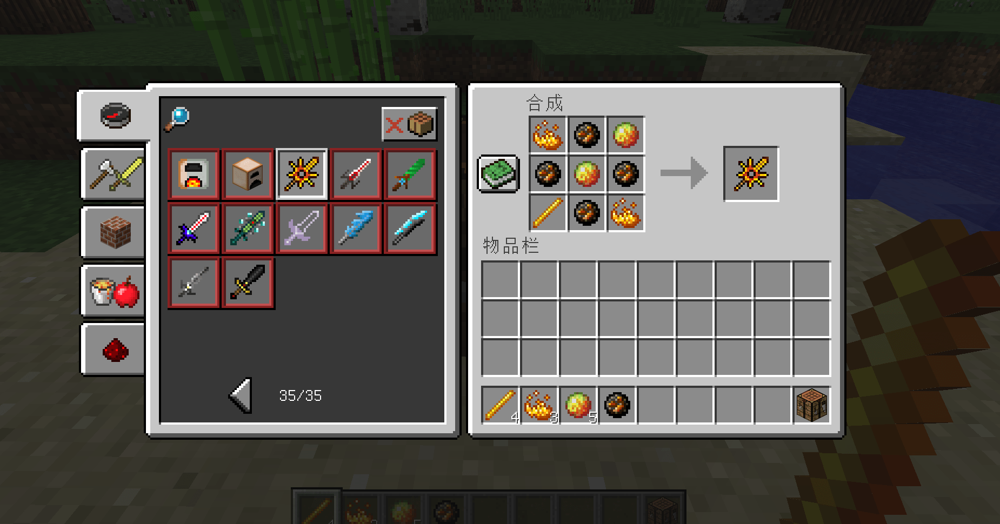
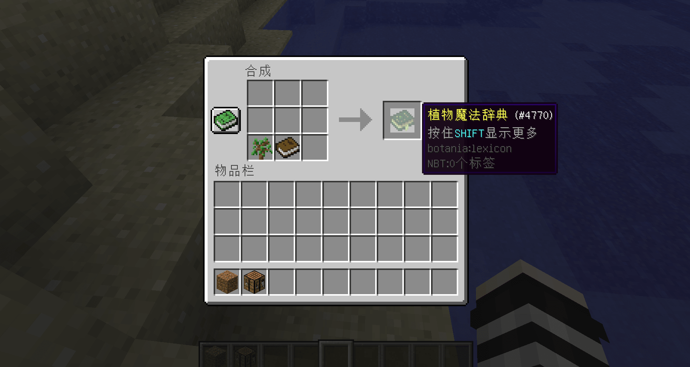
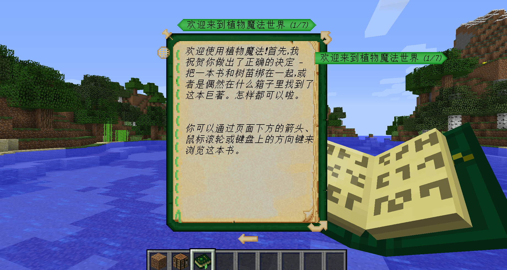
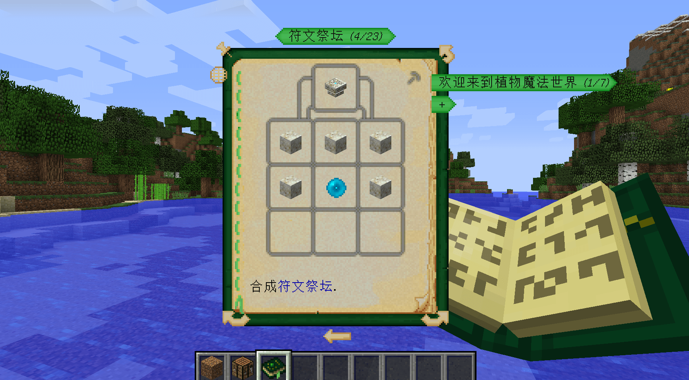
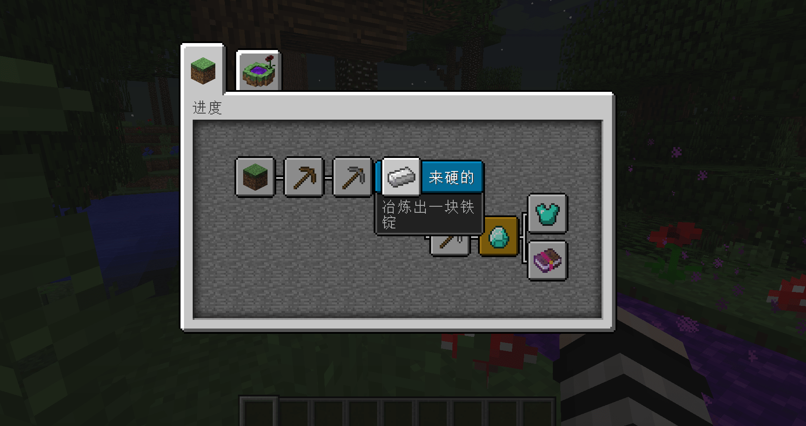
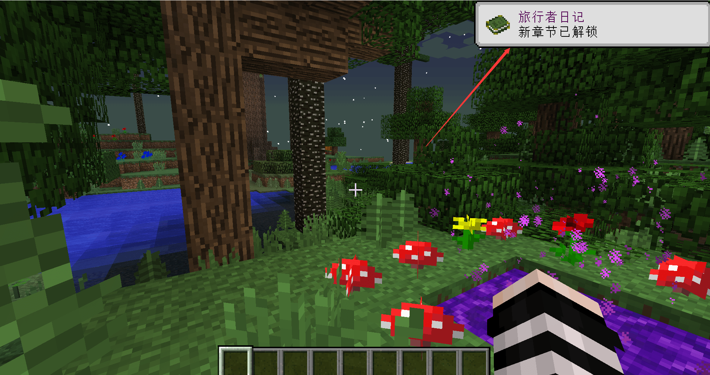
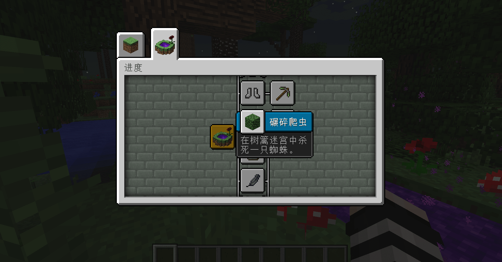
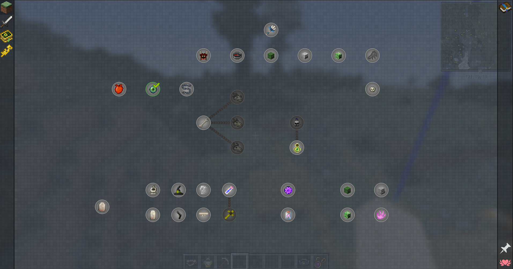
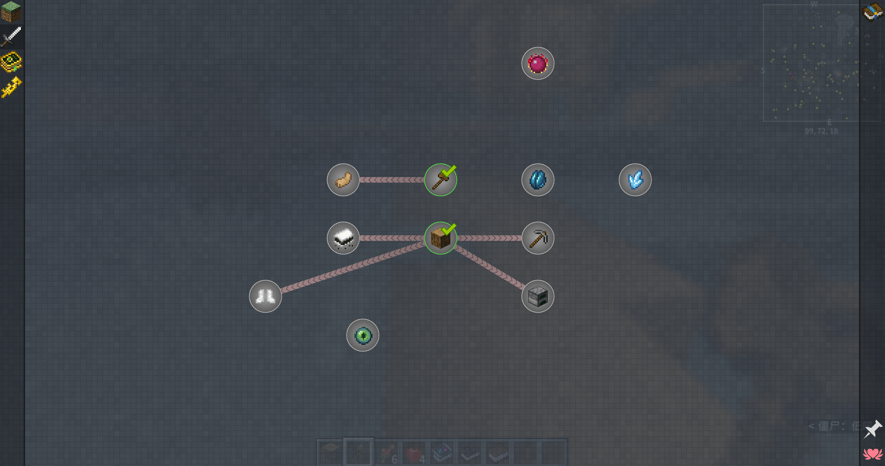

---
front:
hard: 进阶
time: 10分钟
---
# 新手引导过去在我的世界玩法中的体现

原版我的世界中，玩家基本按照采集 > 合成 > 强化能力 的方式循环往复。所以，组件如果也按照这种方式去设计游戏内容，玩家就可以自然的用我的世界本身的玩法引导自己；比如某个“更多的武器”模组，添加了数十种新的武器，当玩家收集到材料后就可以合成这些武器，从而强化能力。

## 玩法手册

将所有玩法的内容和攻略放在一本书中供任何人参阅，比起各式各样妙趣横生的引导方式，更加的直接，全面。于是，玩法手册这一引导方式被非常多的作者和玩家喜爱，我们可以在很多大体量的端游版模组、手游版组件中看到这类引导形式。

比如在端游版的“植物魔法”模组中，使用树苗和一本书可以合成一个植物魔法辞典，打开辞典，里面记录了关于这个模组玩法的方方面面。

在打开辞典的第一页，首先介绍了辞典的使用方式，“你可以通过页面下方的箭头、鼠标滚轮或键盘上的方向键来浏览这本书”，简单的一句话，其实也是很重要的引导；毕竟，如果连书都不会看，又怎么能看懂书上的内容呢？

目录的功能也很重要，玩家可以通过目录精准找到自己想要学习的内容；同时也将内容分为一个个小的章节，通过标题来展示。

玩法手册中，常见的形式分为：文字信息、步骤图文、内嵌合成表、实体纸娃娃。

这些形式也作用于不同的玩法上，比如内嵌合成表可以非常直观的展示物品的合成配方：

## 规则型成就系统

在端游版中，我的世界有一个存在了很久的系统：成就。打开成就菜单，可以看到由一条或多条线连接的成就，每个成就会有图标、标题和目标，玩家则可以根据成就推动游戏进度。

在端游版的“暮色森林”模组中，也有同样的成就系统，完成时会在右上角进行提示；打开成就栏可以看到所有的游戏流程目标。

但是，与达成目标型的成就系统相比，不强调保持玩家对玩法的新鲜感；而常被用来介绍游戏流程。为玩家如何实现目标做出限制，推动玩家去一一解决问题探索更多未知的可能。

## 任务手册

任务手册在端游版的一些大型整合包中颇为常见，它不仅仅作为引导，大多数情况下也作为独立的任务系统在游戏中推动游戏发展，这些任务可能涉及多个模组的内容。

这种引导方式对安排玩家的学习顺序提供了帮助。一个整合包带有多款模组玩法时，需要注意玩家能够接受新信息的能力和学习速度。

在游戏初期，通常会有一些非常简单、易于完成的任务；完成这些任务才可以继续向前推进，否则就无法继续游戏流程，有非常强烈的指导性，能够让玩家在游戏中有明确的目标；在整个游戏过程中都受到引导。

