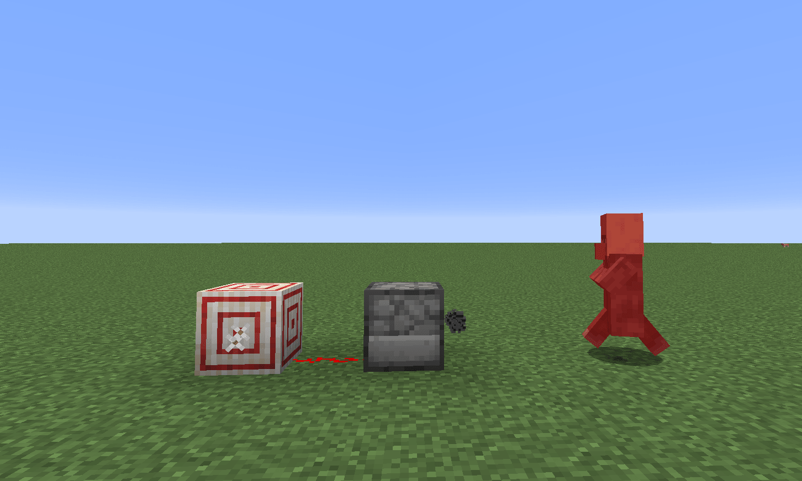

# 小型玩法的引导核心

接下来，将玩法分为：小型、中型和大型，来分析一下不同体量的玩法要怎么区分，并且如何恰当的建立引导核心。

## 小型玩法的标准

**大部分情况下，玩法设计的内容都很贴近我的世界游戏本身；**在游玩的过程中，可以根据我的世界原版的游戏知识去理解组件的内容。(很多开发者在设计玩法时也会自然的向原版靠拢)

**包含两个及以上的玩法点，并且存在玩法循环；**原版游戏中，最浅显易懂的一条玩法循环就是：探索 > 收集 > 合成 > 强化能力。我的世界最有魅力的地方在于玩法与玩法之间是相乘的关系，简单的玩法经过反应就可以有非常多的新玩法出现；如红石和各个方块、生物之间的配合。

对于一个小型的玩法来说，其主要有两个及以上的玩法点并且可以产生一条循环；还是拿“突变生物”模组举例，这个模组的核心玩法和循环在于：发现并与突变怪物战斗 > 获得怪物的战利品 > 合成装备强化自身。

## 小型玩法的引导

小型玩法的引导不需要过多的设计，因为其玩法本身需要玩家理解的内容较少，深度也较浅；如果玩法也很贴近原版风格，过度的引导甚至会使玩家的新鲜感骤降。所以，就要尽量依赖原版的引导设计：

比如玩法中有新增的生物，设计生物会在某种情况下自然生成；如在夜晚会和怪物们一同生成，那么玩家在游玩的过程中，能够直接发现这种生物，就可以对生物进行攻击或交互等行为。这就很贴近原版体系。

如果玩法中新增的生物并不会自然生成，而是使用某种特殊的方式召唤生成，若生成方式比较复杂，可以使用浅显易懂的玩法手册，引导玩家；

------

总而言之，对于小型玩法而言，可以先整理组件中的玩法点并将之归纳进原版体系，用原版玩法去解释玩家付出努力后得到的回报；

