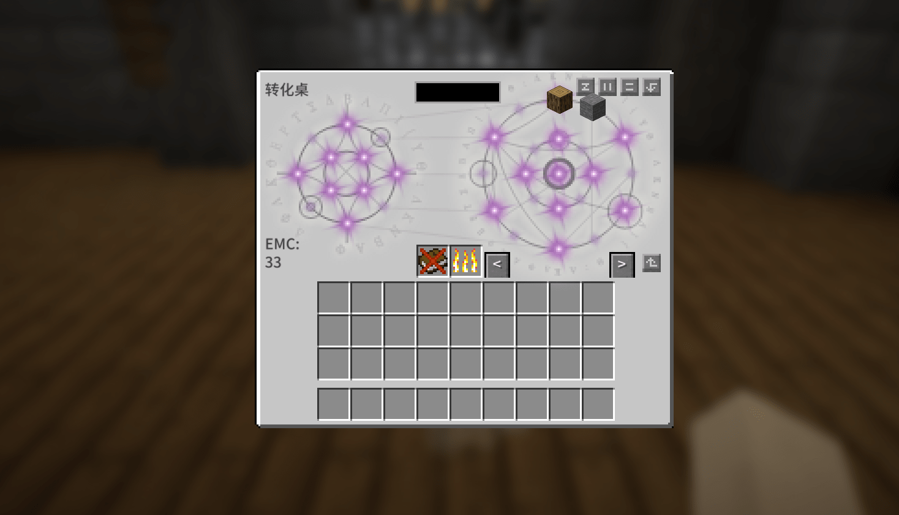
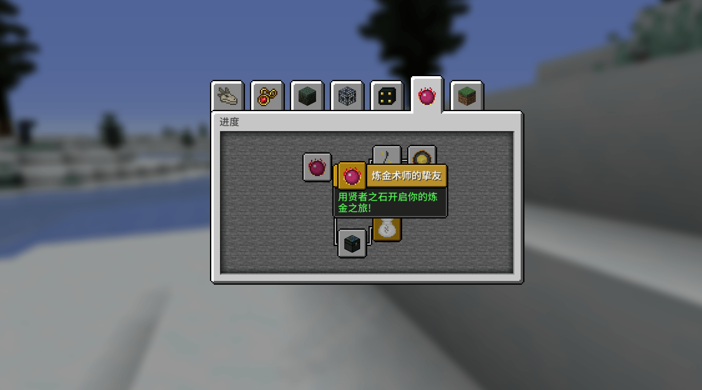

---
front:
hard: 进阶
time: 5分钟
---
# 中型玩法的引导核心

中型与小型玩法最大的区别就是**“是否有自创的游戏体系”**，一部分或所有的玩法内容脱离原版我的世界的玩法，形成玩法循环；同时玩法的流程更加线性、流畅。

“等价交换”模组中添加了新的“货币”：EMC值，使用交换桌可以将游戏内的物品转换为EMC值，也可以使用EMC值来转换成任意物品。（探索收集 > 转换EMC > 使用EMC）

## 中型玩法的引导

自创、创新的游戏体系，在被玩家慢慢发掘时，会有非常大的惊喜和乐趣。所以，引导的核心需要使人产生行为反射，使用分阶段的方式清楚的传达它，有助于玩家在游玩的过程中慢慢领悟玩法。

所以，将引导藏在一个个目标下，但不把所有目标以开始就告诉玩家；使用规则型的成就系统，是一个非常好的引导方式。

在不同时期隐式的提供成就引导，玩家可以在探索的过程中慢慢发现玩法，并且循序渐进，最终深入并理解所有玩法。

------

总之就是将玩法拆成一个个需要玩家去实现的目标，不一定要固化，完全使用规则性成就；发挥创意，以此为核心改编引导形式也是完全适合的。

