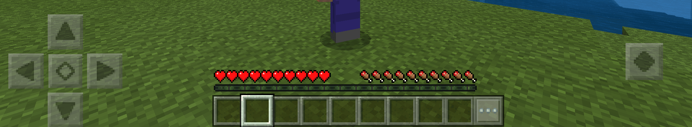

# 典型的UI定位及举例

## 高频查看但无交互

顾名思义这类UI玩家需要高频率的去关注，但是不用去进行操作，这类一般都是用于实时显示与玩家相关的各类数值有关的内容，这类UI需要保证玩家可以很方便就查看不会被遮挡，并且不会产生混淆，通常需要动态更新内容。

### 血条/饥饿值

原版的血条和饥饿值就是最典型的需要高频查看，但是不需要玩家进行交互的内容，玩家需要快速了解自身的状态。

### 装备耐久度

直观反映装备的耐久数值，原版仅用类似进度条的方法显示，有开发者通过获取装备耐久值显示在屏幕的其他位置更加直观的展示了装备的具体耐久度数值。

### 小地图

这个属于模组内容，可以帮助玩家更好的探索世界，通过小地图玩家可以更加直观的知道自己所处的位置，方便玩家进行探索。

## 高频查看和交互

玩家需要直观的看到内容，并且对内容进行交互，这类内容通常在UI里面占比不大，而且主要是集中在方便点击的区域。

### 快捷物品栏

快捷物品栏就是原版一个非常典型的高查看和交互的区域，玩家需要经常通过查看物品栏来快速确定接下来的目标，常用的道具也会放在快速物品栏内便于切换

### 组件一级按钮

操作按键，需要玩家大量的点击进行人物控制，同时玩家也可以根据按键反馈来判断人物当前的状态，部分模组也是用了按钮UI来释放技能，让玩家更加方便操作

## 低频查看及交互

偶尔需要进行查看的内容，大多是通过一级菜单进入的二级菜单按钮，多用于背包及和其他物品交互后打开的UI界面

### 游戏设置按钮

游戏设置就是很常见的低查看按钮，玩家通常只有在需要进行游戏设置时才会点击，点击后就进入全屏UI模式无法操作人物，所以玩家不会大量的去点击按钮操作。

### 背包按钮

背包也是点击快捷物品栏旁的按钮后进入背包，打开背包UI时玩家不可操作游戏角色，以便进入背包模式后玩家可以更加方便和专注的调整背包内物品

