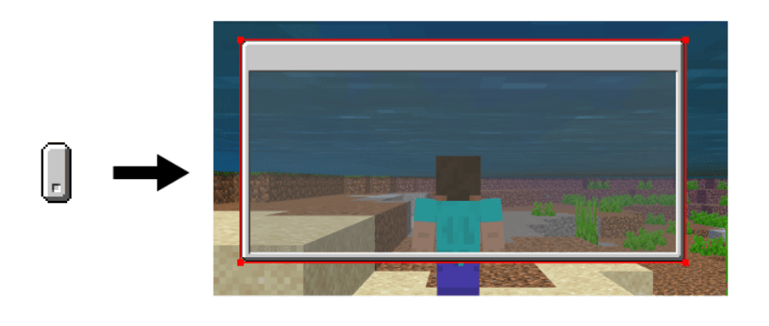
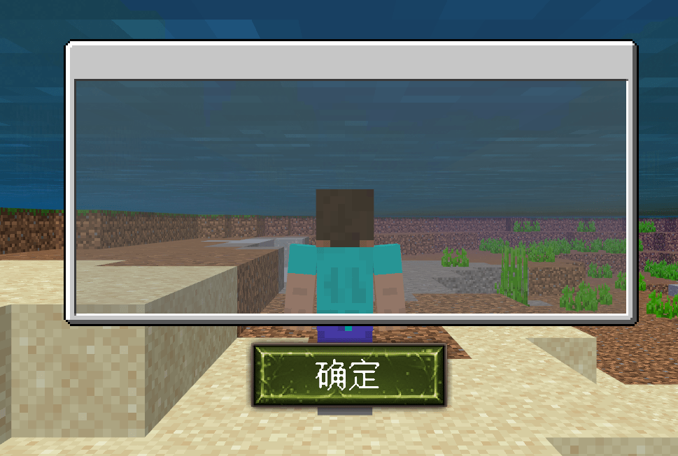

# 需要注意的点

## 使用九宫格制作自适应的内容

九宫格是绘制UI经常会使用的方法，九宫格的好处有：

- 绘制简单，但是需要一定的想象力，需要在绘制时就考虑清楚使用九宫格后会是什么样子。

- 大小可以随意拉伸，边缘会随着长宽进行变化。

- 图片分辨率小，占用内存少。

我的世界原版就有大量的UI内容是运用九宫格的方式进行制作的，九宫格只需要设置好四个边缘的像素，就可以自适应屏幕，非常的方便后期修改以及素材复用

## 表现出明显的像素感

因为游戏的本体UI界面是16x16的分辨率，过高的分辨率导致像素感缺失对于玩家来说是比较突兀的。

手绘的像素UI，推荐绘制的分辨率不要超过32x32，超过以后像素感就没有那么强了，并且可能因为看起过于圆滑的UI导致整体的UI风格和原版脱节。

## 注意屏幕的安全区

尽量不要把UI或者关闭按钮设置在屏幕的边缘而且把按钮设置的非常的小，因为部分屏幕存在一个安全区的概念，尤其是曲面屏更常见。安全区就是手机为了防止玩家触碰边缘进行误操作，而专门设置的一块区域，这块区域点击时是无效的。

所以在设计按钮位置时，尽量离屏幕边缘区域有一定的距离，以防按钮在部分机型上无法被点击。