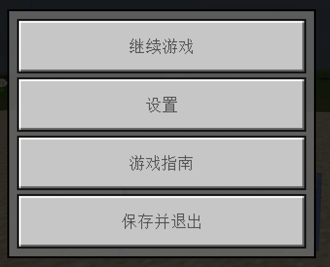
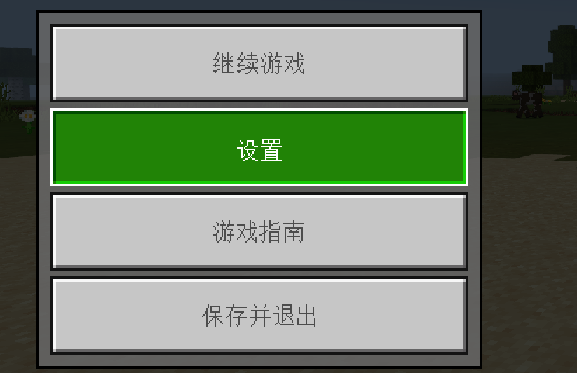
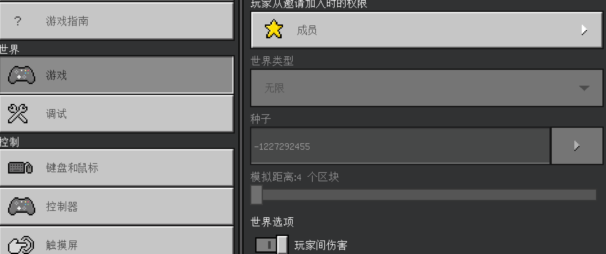
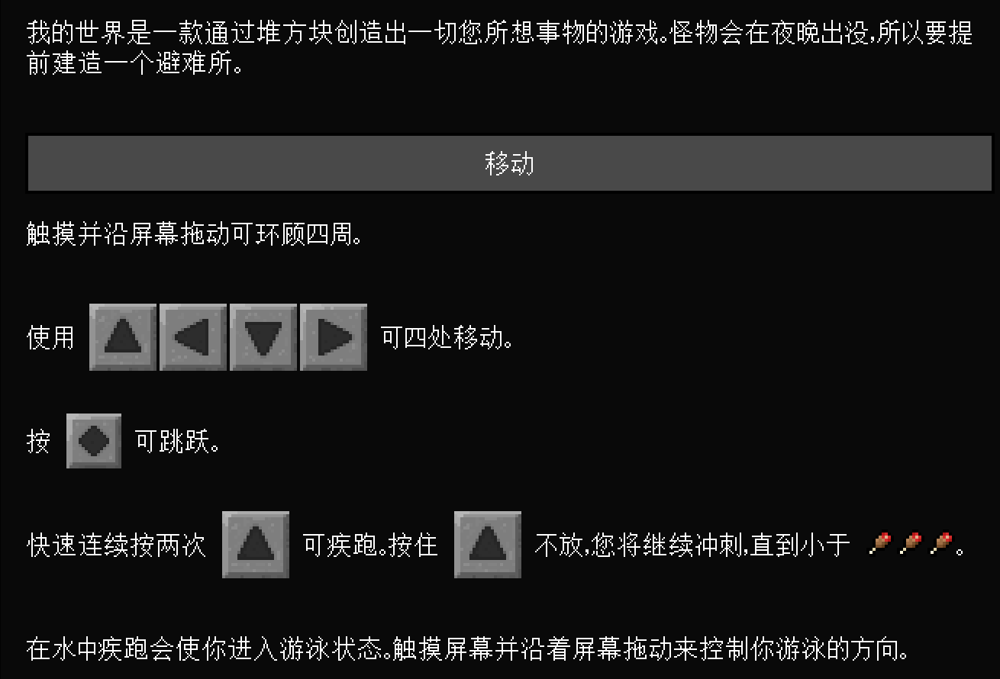
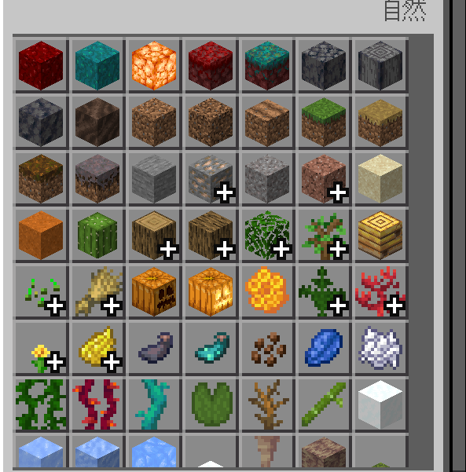

# UI常见用例

## 按钮

我们通常说的按钮是指某一个点击以后有反馈的UI，比如确定按钮就是一个很常见的按钮功能使用方式。但其实UI内大部分的交互都是由不同的按钮组件组成，并非是只有给与用户反馈的按钮才是按钮组件，所以我们需要根据不同的场景去选择性使用按钮功能。

### 默认：无操作时按钮外观

按钮在没有任何操作时的外观，如果按钮无法填写文字时，就需要按钮本身的图案有足够的识别度，其他人可以通过按钮的图案就能大致理解按钮的功能是什么。

原版的按钮使用颜色和绘制方式使这个按钮看起来像是凸出来的感觉，可以很容易的让人联想到这个图片是可以点击的。

### 按下：按下后按钮外观反馈

按钮在按下时需要给到用户交互反馈，常见的有更改按钮的颜色和大小。按下时需要和常规时按钮做出较为明显的区别。

原版的按钮按下后，周围描边颜色变为白色，同时原按钮的灰白色变成绿色更加显眼，颜色绘制也由凸起变成下凹，可以看出按下的按钮图标上方的边缘是暗色，下半部是亮色和常规时按钮是相反的颜色，这样在视觉上就会给人一种凹陷的感觉。

### 高亮：区别其他同类按钮外观（针对鼠标操作）

高亮一般用于反馈用户鼠标目前悬停所在的按钮模块，高亮的同时提醒用户此处按钮是处于可以点击交互的状态，高亮需要做一个明显区别于默认按钮外观，但同样需要区别按下按钮外观。

原版的按钮鼠标悬停在上方时会显示与按下同样颜色的绿色，基本与按下一样，区别在于高亮的绘制方式为按钮的边缘上方亮色而下方为暗色，这样给用户的视觉效果就还是凸起的感觉，这样可以较为合理的区分高亮和按下按钮的外观效果。

### 禁用：不可使用按钮

提示玩家此按钮不可交互，一般禁用按钮的颜色都是尽量接近背景色，与可点击的按钮相比更加的不起眼，同时禁用的按钮鼠标悬浮在上方不会有任何的高亮反馈，点击时也没有任何的交互反馈。

原版的禁用内容就采用了接近背景深灰色的浅灰，相对可点击的按钮更加不起眼。同时部分禁用内容作了下凹的绘制方法，更加区分和普通的可点击按钮，让用户一眼就能明白哪个按钮是可点击哪个按钮是不可点击的。

## 文本

文本是美化排版和丰富内容所必须的内容，当图片无法清晰的传达所有需要的信息时，这时候就需要用到文字来补充图片无法展示的信息，所以文本在UI里面是不可缺少的一部分，下面就让我们来看看有哪些基础的文本使用方法吧。

### 富文本的使用

单纯的文本阅读起来是较为枯燥的，所以可以在文本当中穿插一些图片，包括一些跳转链接帮助用户更加方便阅读和理解。

原版的游戏指南就把UI图标直接显示在文字中间，这样比文字更加容易让玩家理解。

### 字体/字号的选择

通常字体和字号我们使用默认大小即可，一般没有特殊的必要不需要额外设置字体的大小，字体如果需要做出大小差异，最好不要超过2倍左右的大小区别，不然会造成较大文字过于醒目而较小的文字被忽略。

### 文字排版设计

任何文字不经过排版都是不便于阅读的，最简单的排版就是进行换行，把标题和内容作区分，之间没有什么关联的大段落进行隔断处理。

## 滚动列表

### 暗示可滑动

滚动列表的长度不应当刚好显示全部内容，需要有部分显示半截内容，如滑动框的长度不应该显示8行物品，而应该显示7行半物品。这样用户通过半截内容就可以自然的联想到通过下滑屏幕来观看未显示全的内容。

## 词缀（Tips）

### 提升设计美观程度

通常Tips都是不可见的，玩家只有通过点击特定的UI才会显示我们想要知道的信息，并且在显示一段时间或者点击其他UI的时候就会隐藏不会阻挡玩家观察主要的UI内容，因为在UI内显示大量的文字说明是非常影响美观程度的，所以在很多需要文字说明但是不需要长期显示在UI上的信息，我们都可以考虑制作成Tips来简化UI，提升UI的美观程度。