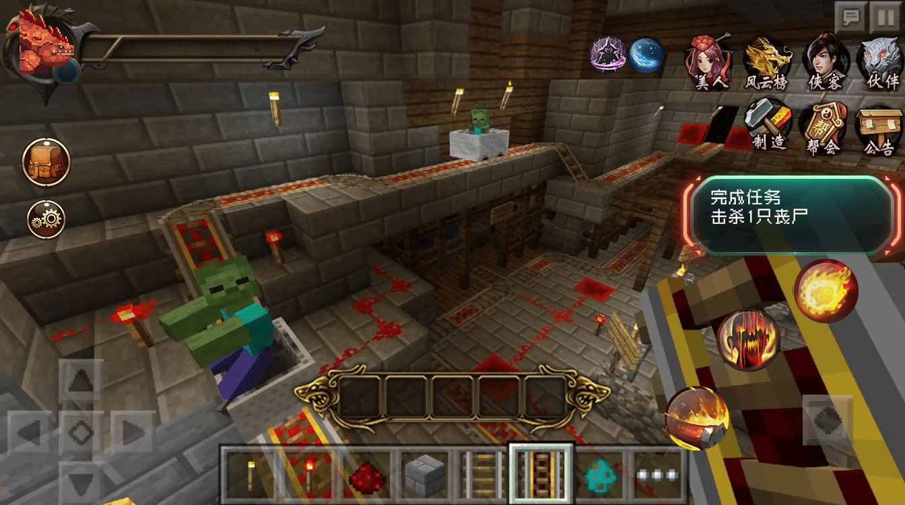

# UX设计应注意的几点

## 注意内容

我们需要在设计UI的时候同时考虑到UX的设计，UX即为即用户体验，因为我们所有的UI都是面向用户的，只有做到相对合理才能提升用户的游戏体验。

### 减少一级界面UI数量

我的世界是拥有大量衍生模组的游戏，所以开发者要在一级界面上尽量保持整洁，把一些不需要实时显示和查看评率不高的UI界面放入二级或三级UI内，一级UI尽量做到最简介才能拥有更好的组件适配性。如果每个开发者都把自己的UI全部放在一级界面上，那么玩家只需要加几个组件就会导致整个屏幕都是不同的UI。

（负面例子)

组件<怪异录>在UI设计中就较好的考虑到了这一点，所以把一级界面也隐藏了起来，玩家只有在手持怪异录时一级菜单才会从物品栏处弹出。怪异录虽然界面简单，但是因为是一款偏RPG风格的组件，玩家的血量只靠原版红心是无法完美显示的，所以他们在尽量减少界面UI的前提下，在原版血条的位置给玩家增加了简易的血条饥饿条，更方便玩家显示大数值的血量。同时他们考虑到了和其他组件的兼容，预留了指令，玩家可以通过输入指令来隐藏怪异录的血量显示，这样就最大程度的不会和其他组件冲突。

### 菜单界面尽量保持同一位置

很典型的就是关闭按钮，如果你一级菜单的关闭按钮在左边，而你二级菜单的关闭按钮突然变到右边，三级菜单的按钮跑到屏幕中间，这样用户在点击按钮的时候就需要整个屏幕到处点击了，无疑是增加用户点击的难度。

### 减少需要大量使用操作的步骤

能一步达成的设计，不要用很多步骤去完成。比如你的组件传送是通过UI来传送的，而且玩家会经常使用到这个传送功能，那么你就不要把传送界面放到三级或者四级界面，不要让玩家需要先打开主界面UI，然后在一堆分类中找到传送分类，再在一堆传送点内通过搜索按钮输入坐标名字去找到自己想要传送的地点进行操作。我们应该在一级菜单或者二级菜单下直接找到需要的传送功能，并且通过玩家设置传送点的时间和使用的频率来判断传送点的显示顺序，这样可以帮助玩家快速找到想要的传送目标。

### 考虑不同端的操作习惯

电脑端和移动端的操作习惯是有很大不同的。

电脑端游戏玩家主要是依靠键盘进行操作，而移动端大部分是依靠手指点击屏幕。

而电脑端的玩家显示器更加的大，所以可以支持更多的UI显示，而移动端则需要尽量的避免过多的UI显示在屏幕上导致玩家误触。

电脑端的模组需要在UI上标注按键盘上的什么键可以直接打开UI，而手机则不需要。但是电脑版需要和原版按键进行区分，不能占用到原版按键所使用的键。

## 统一的UX标准的好处

### 降低玩家学习成本

这里举一个最简单的例子，电脑端上一般都是以WASD作为控制方向键，基本上所有的3D游戏都是这样控制角色的移动，而空格键就是跳跃。所以大部分的基础操作玩家都不需要再次重新学习，玩家只需要根据原有的经验去学习游戏所特有的一部分按键既可以快速上手掌握游戏的玩法。

移动端也是这样，所有的moba类游戏技能都是在右边，这样所有擅长这类游戏的玩家，不管到了哪个moba手游，都可以快速的上手，他们需要理解的只是英雄之间的差异，并不需要再次去熟悉最基础的操作。

而我们设计UI时也一定要遵循一定的设计标准，比如在手游我的世界中，最常见的就是打开背包行为，玩家只需要点击一下快捷背包键就可以打开背包。

如果我们设计成需要先把物品栏里面的背包放置在地上在打开背包，这样繁琐的步骤无疑是打破了大部分玩家的常识习惯，大部分的玩家下意识的寻找打开背包的按钮，但是无法找到，部分人也许会因为没有办法按照常规的操作打开背包去怀疑是否是作者制作的内容出现了BUG。