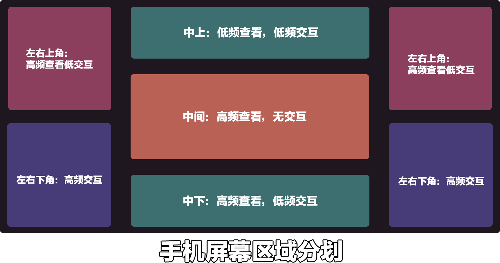

# 手机端的UX设计标准

## 手机屏幕区域的定位

大部分手机都是长方形的屏幕，所以我做了一个比较直观的区域划分图，下面我就根据这个区域划分逐步的讲解一下有关区域的UI设计的一些案例

### 中间：高频查看，无交互

中间区域，这块一般是用来显示游戏画面的，除非是展开式UI，比如玩家背包之类的UI，通常长期显示的UI是不会放置在正中心的，这块区域的UI设计时尽量要做到不会遮挡玩家视线，同时不会影响到玩家操作。

### 中上/下：高频查看低频交互

中下区域因为有快捷物品栏的存在，玩家需要经常检索物品栏内的道具情况，所以查看的频率较高，而且物品之间的切换，所以玩家也较为习惯于点击中下方的内容，一些低频交互的UI可以显示在物品栏的附近，方便玩家查看和点击使用。

### 左右下角：高频交互

左右下角主要是移动按钮和跳跃按钮，以手机玩家的习惯，左右下角相对来说是最高频率使用的UI，尤其是右下角，只有跳跃按键一个，不过需要注意玩家在创造模式下飞行是会额外出现升降按钮的，如果不考虑进去可能会导致按键重叠冲突。

### 左右上角：高频查看低交互

手游的左上角是聊天框，右上角目前只有一个跑步和移动状态的切换，所以左右上角都是较为空闲的，而且左右上角也在玩家手指操控的上方，既不会被手指挡住，又不会被其他原版的UI挡住，所以非常适合放一些高频率查看，但是低频率交互的内容，比如小地图，玩家状态信息显示栏之类的UI。

## 常见UI推荐放置位置

### 一级菜单按钮：右侧偏上边缘

原版右侧的上方是没有什么按钮，只需要注意不要和切换运动模式按钮重叠即可，而且由于玩家相对移动按钮，其实右侧的跳跃按钮点击频率并不是那么高，所以可以更加方便的进行较为复杂的按键操作。

但是注意右侧中间偏下位置还是比较容易误触的，所以尽量在中间偏上的位置放置一级菜单按钮为优。

### 玩家属性信息：左上/快捷物品栏上方

玩家的基础属性数值是需要经常查看的，比如血量饥饿值，这种必须要放在玩家可以随时看到的地方，按照玩家的习惯，放在原版的血量位置是最合理的，但是这块区域只适合放一些简单的如血条之类的小型UI，如果UI的高度过高会遮挡很大一部分的游戏视角。所以如果需要制作一个大的属性显示框，那么可以考虑放在左上角，拥有更大的位置的同时，也不会遮挡太多重要的游戏视野。

### 小地图：右上/左上

小地图相对来说是需要占位面积较大的一类UI内容，而且玩家查看的频率也较高，所以需要显示在方便查看的位置，而屏幕的左右上角就非常适合这一类的UI显示，既没有大量的原版的UI遮挡，有不会被误操作

但是相对较大的占位面积类UI我们最好提供一个可以隐藏收起的UI功能，在玩家点击时这个UI可以隐藏起来。

### 技能按钮：跳跃键的四周

很多具有RPG元素的组件都有技能设定，在手机屏幕上最合适的就是跳跃键的附近，可以参考moba游戏，做在跳跃键的旁边，也可以简单一些，做在跳跃键上方一些。

同样是高频交互区域，跳跃键相对来说不需要长时间点击控制，而移动按钮是需要长时间点击控制的，所以这类需要点击的技能更推荐放置在跳跃键的右下角区域。

### 设置按钮：中上

设置按钮玩家大部分情况下并不会随时点击，所以可以放置在一个比较醒目，但是不容易误触到的地方，而原版的设置按钮也是在中上，这样玩家只要进行原版菜单操作就一定会注意到组件的设置按钮并点击查看。

## 常见需要注意的问题

### 常见的手机分辨率和适配方法

首先我们可以在我的世界开发者工作台里面进行各种分辨率的测试，善用里面的预设分辨率和自定义分辨率，尽量多测试几种极端屏幕比例。

### 异形屏的适配

常见的异形屏有刘海、转孔屏。

### 允许玩家动态调整按钮的位置

这个可以在设置里面加一个自定义按钮位置，这样可以方便各种按键习惯的玩家挑战自己所需要的按钮位置，也方便玩家添加多个组件UI位置调整，不至于冲突。

### 向大众手游学习（降低玩家的学习成本）

这边推荐学习的手游一定要足够大众，这样玩家操作习惯可以更快的适应，如果可以尽量找3D的手游，去学习他们的按键布置，比如前段时间大伙的射击吃鸡游戏，上面的按键布置，包括按键大小分布都有很多可以借鉴学习的地方。