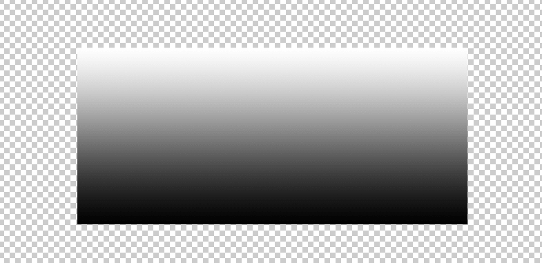
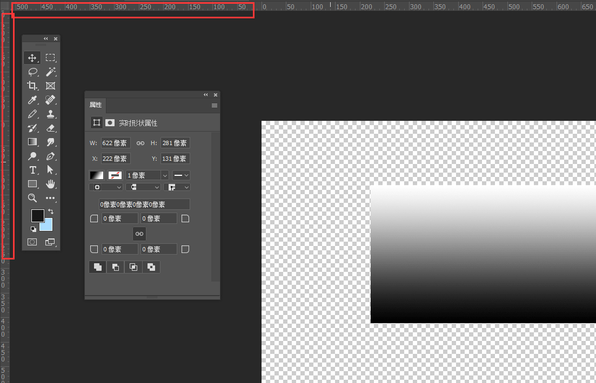

# 工具的使用

## 常用功能

因为Photosthop后期处理图片更加方便，虽然看似功能很多很复杂但其实绘制像素图片只需要掌握其中极少部分即可，那么我这边就给简单的说一下绘制像素UI可能会用到的功能。

### 像素网格的开启/关闭

像素网格在视图-显示-像素网格内关闭或开启

可以看出来开启了像素网格后每个像素之间就会有一条一条的白线做为区分，很多新手会觉得这是一种不错的辅助方式，但其实这些细线会导致颜色出现一些差异，比如这两个圆圈同样是纯黑色绘制的，但是左边开启了像素网格后的黑色圆圈，明显别右边关闭像素网格的圆圈看起来会更加灰一些。这样很容易导致视觉错误让绘制出来的图案比预想中的颜色要偏差一些。

### 像素图片缩放

像素图片的缩放也是一个比较多新手会碰到的问题，如何使用PS进行无损的缩放，可以使用缩放模式中的 **邻近插值** 。

#### 缩放时使用插值：邻近

很多新手使用图片缩放时，直接使用默认模式，把16*16的像素放大到64*64以后边缘就会进行虚化，看着整个图片都非常的模糊。

其实只需要在缩放的时候选择邻近，这样缩放出来的图片就不会被虚化边缘了。

同理，在放大整个图形大小时，如果不想图片被虚化边缘，重新采样处也要改成邻近

### 快速导出图片

当我们做UI时，会有大量的图层，每个图层都独立导出会非常麻烦，这时我们只要找到图层框，右键点击我们想要导出的内容，并选择快速导出为PNG，这样导出的图片，是不会有多余的透明内容

使用整体导出功能导出后的图片

使用图层独立导出的图片

### 使用辅助线切割

有时我们绘制UI时需要对齐其他UI来使UI看着更整齐，PS有自带吸附功能，但是仅仅使用吸附功能并不能自动匹配所有的边缘，所以这个时候我们可能就需要制作辅助线

CTRL+R打开标尺，这时你的PS因多了下面这两条标尺。

用鼠标点击标尺并拖动，就能直接拖出来一条辅助线了，辅助线并不会被导出，他只会在PS内辅助你对齐图片。

### 改变颜色属性

绘制像素内容时，常用的功能有 **图像-调整-亮度/对比度**  以及  **色相/饱和度** 。

#### 亮度/对比度

亮度是调整整体颜色的明度，亮度越高，这个颜色就看起来越明亮。

对比度是调整整体颜色的对比，对比度越高，白色会越白，黑色会越黑，整体对比会越明显。

#### 色相/饱和度

色相就是改变颜色，比如红色改变色相后可以变成蓝色，也可以变成绿色。

饱和度是指颜色的纯度，饱和度越高的颜色看起来越鲜艳。