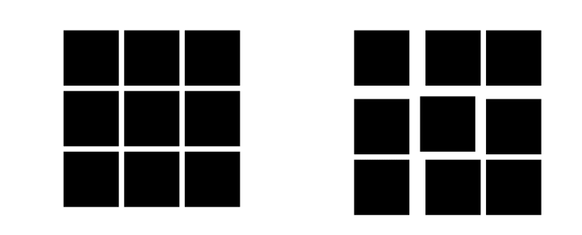

# 规范设计

## 设计的统一性

在设计UI时，设计的统一非常的重要，这里的尺寸有图标的尺寸，图标之间的间隔，文字的大小，颜色之间的合理性，下面就来一起看看有哪些比较需要注意到的内容。

### 图片尺寸大小x

如果想要让玩家感受到比较明显的像素感，这里推荐的分辨率是不超过32x32大小的一个图标，因为如果达到64x64就会变得比较写实了，相对的像素感就会大幅度减弱。

如果你确定了自己的分辨率，就尽量保持这个分辨率进行绘制，比如你绘制了16x分辨率的UI，然后你的物品图标全部是用32x绘制，这样在其他人看起来就是非常不协调的，给人一种很强的拼接感。

### 各个图片的间隔

每个图片之间的间隔需要有统一的规范，才能让UI看起来更加的整齐舒服。根据图片的功能决定图片之间的间隔，背包的物品栏，之间间隔不宜过大，不然会导致玩家拖动物品时较为麻烦。

技能UI之间的间隔需要相隔较远，不然容易误触其他技能。

### 颜色的含义

颜色的运用在我们生活中随处可见，很多时候我们甚至不需要看内容，我们只是通过背景文字颜色我们就能大概猜到想要表达什么。

比如红绿灯，就是在潜移默化的告诉我们，绿色代表着一种确定、安全、可通行。而黄色则代表需要注意、有一些提醒的意思。而红色则代表禁止，警告的意思。

生活中类似的例子有很多，所以我们本能的也对部分颜色有较为潜意识的理解。

#### 带有明快清新绿色代表确定

大部分创作者在绘制UI的确定按钮或者类似功能的按钮时都是选择绿色或者接近的颜色，因为绿色相对其他颜色更加的明快，相对灰色白色也更加容易注意到。

#### 带有警告性质的红色代表取消

红色大部分情况下都有一种警告的意味在里面，大部分能看到红色都会仔细观察一下红色的内容里面有什么。所以红色很适合用做一些需要谨慎操作的UI背景色。

#### 灰色的代表无效

灰色在大部分背景下都是存在感较低的颜色，尤其是越接近背景色的灰色越容易被忽略。这样也是在提示玩家，这里有一个按钮，但是它并没有生效。