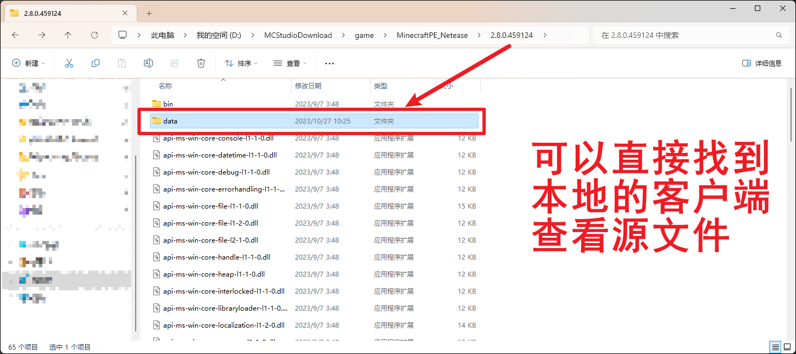
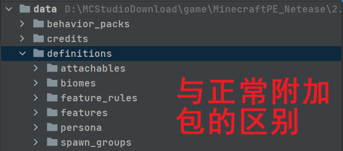
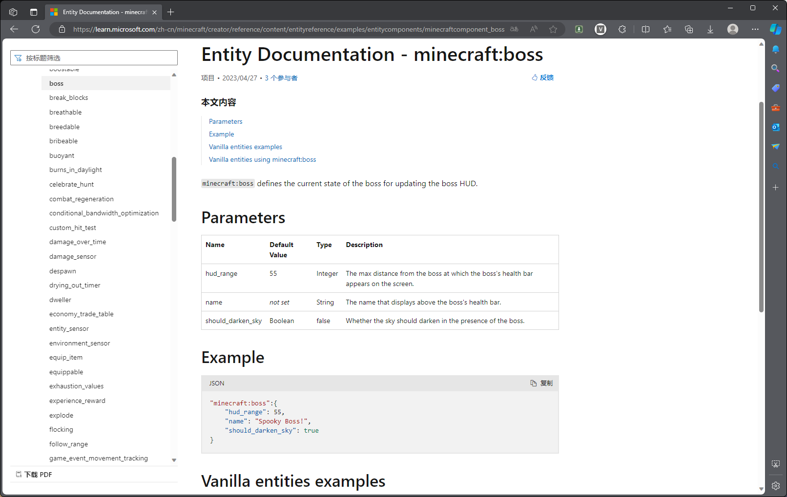
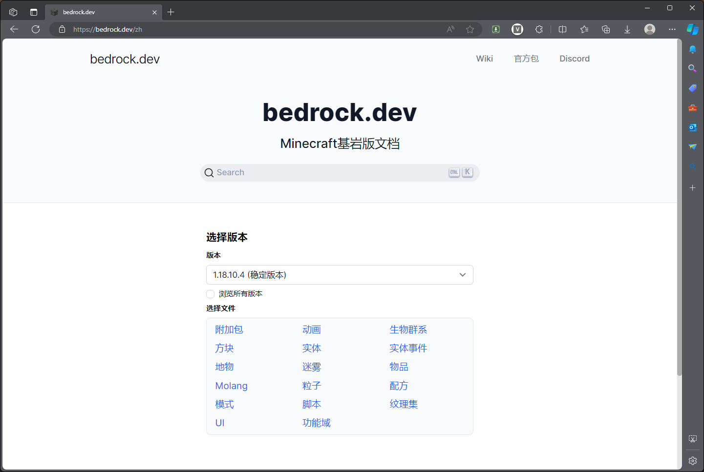
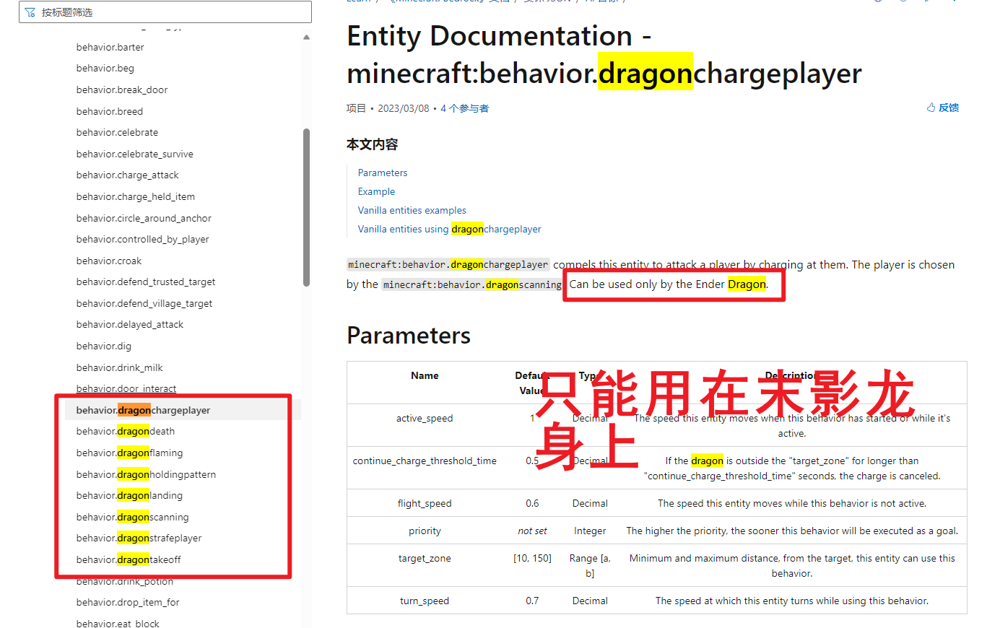
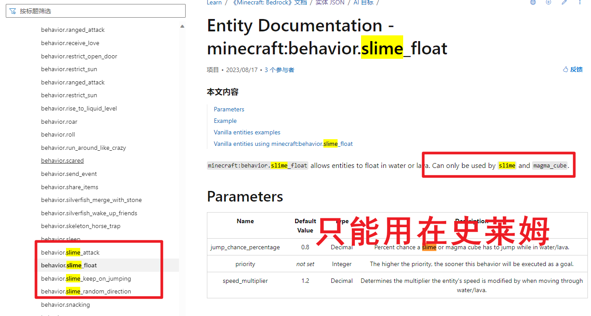
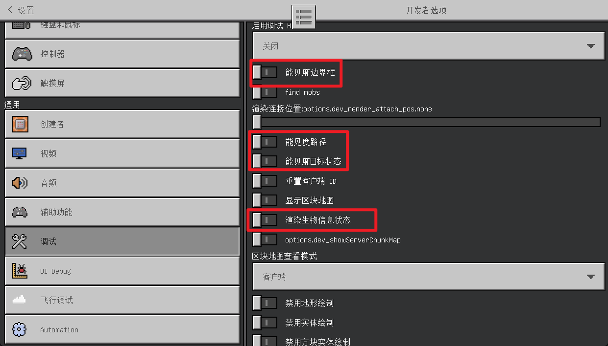
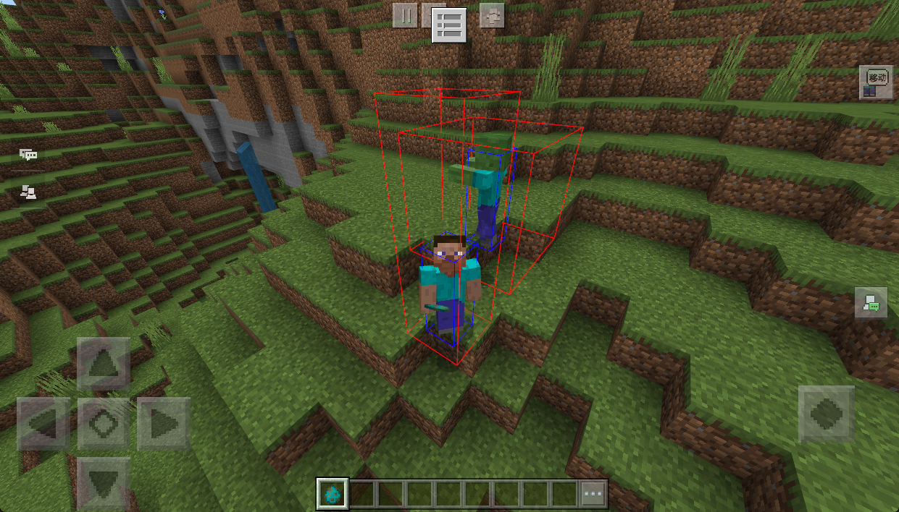
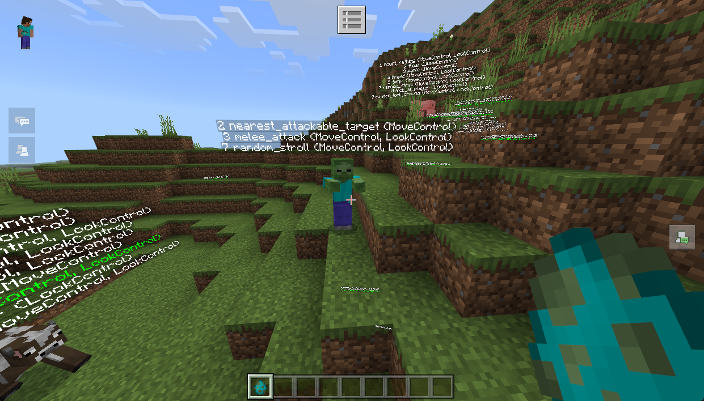
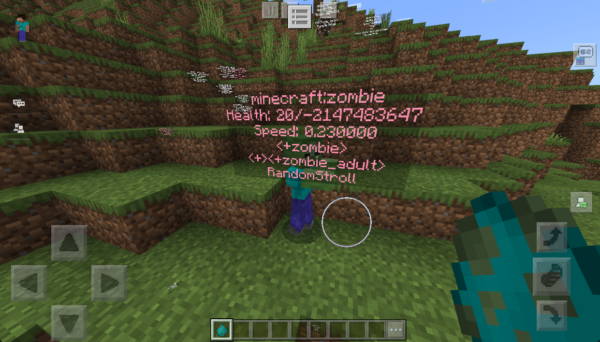

# 实体基础

> 温馨提示：开始阅读这篇指南之前，我们希望你对《我的世界》基岩版附加包有一定了解，有能力撰写 JSON 数据格式，并能够独立阅读《我的世界》开发者官网-开发指南或其他技术引用文档。

本文将帮助你从零开始修改原版僵尸的行为，从而帮助你认识和了解生物行为的构成。

本系列不特意涉及实体资源的相关教程，如果对这一块不熟悉的同学，请自行前往前往官网查看相关教程。

在本教程中，您将学习以下内容。

- ✅如何查看原版行为文件；
- ✅认识和了解行为文件的基本构成；
- ✅尝试修改原版僵尸的行为并实现僵尸的基础行为：
  - 手动还原最基础的僵尸行为；
  - 出生随机大小的僵尸；

请点击[这里](https://g79.gdl.netease.com/Entity.zip)下载本章节课程的教学包


## 原版僵尸的行为

### 如何查看原版文件

在本地游戏测试客户端的目录中（MC Studio 安装目录下的 `\game\MinecraftPE_Netease` 可以找到），我们可以直接查看和学习生物的行为 JSON 是如何编写的：



使用打开目录之后跟我们正常编写的附加包并无差别，略微的区别就是像是 `attachables`、`biomes`、`feature_rules`、`features` 这样的定义是保存在 `definitions` 目录下的（我们自己写是需要写在 `behavior_packs` 对应目录下）：



如此，我们就可以在对应行为包下找到相关的原版行为 JSON 定义了。使用 `vanilla` 开头的包就是我们的原版资源了，后面跟随的是版本信息，通常来说，我们应该**尽可能查看高版本的行为**，因为更高的版本意味着一些改进和修复。

比如，我们查看 `zombie` 的最新 JSON 文件（在 `vanilla_1.17.20\entities` 目录）和第一版 JSON 文件（在 `vanilla\entities` 目录下）就可以发现，最新版本的 JSON 除了在行为文件使用的版本`format_version` 上有差异外，还多了一个 `minecraft:shareables` [组件](https://learn.microsoft.com/zh-cn/minecraft/creator/reference/content/entityreference/examples/entitycomponents/minecraftcomponent_shareables)，这个组件允许实体分享和拾取一些道具，这直接导致了僵尸能够拾取地上物品的行为 ：


### 格式概述

实体行为都保存在行为包的 `entities` 文件夹中。行为文件扩展名都为 `.json`，这跟游戏加载项中的许多文件都使用相同的扩展名，如果你想避免混淆，可以为行为文件使用再次扩展的扩展名 `.behavior.json`。对于其他再次扩展的扩展名，请参阅[此表](https://learn.microsoft.com/zh-cn/minecraft/creator/documents/introductiontoaddentity)。

这些文件是用 JSON 编写的，基本结构如下所示：

```json
{
    "format_version": "1.17.20",
    "minecraft:entity": {
        "description": {
            "identifier":"minecraft:zombie",
            "is_spawnable":true,
            "is_summonable":true,
            "is_experimental": false
        },
        "component_groups": {},
        "components": {},
        "events": {}
    }
}
```

在 `description` 标签中，一些基本属性定义了游戏如何注册实体：

| 参数名称             | 类型   | 描述                                                         |
| :------------------- | :----- | :----------------------------------------------------------- |
| `identifier`         | 字符串 | 实体的标识符。 如果这是加载项中的自定义实体，则应使用示例中所示的自定义唯一命名空间。 |
| `runtime_identifier` | 字符串 | 游戏内部使用的标识符。 这可用于从尚未作为组件提供的原版实体继承自定义机制。 每个实体只能指定一个运行时标识符。**仅在确实需要时才使用**。 如果一个原版实体的机制变成了组件，通过运行时标识符依赖这些机制可能会失去功能。 |
| `is_spawnable`       | 布尔值 | 如果为 `true`，则该实体的刷怪蛋将添加到创意物品栏中。        |
| `is_summonable`      | 布尔值 | 如果为 `true`，则可以使用 `/summon` 命令来召唤实体。         |
| `is_experimental`    | 布尔值 | 如果为 `true`，则实体可以使用实验功能。 该实体只会在实验世界中工作。 |
| `animations`         | 对象   | 行为动画或动画控制器的列表。 这些可用于在实体上运行命令或事件。 |
| `scripts`            | 对象   | 脚本的工作方式类似于它们在客户端实体文件中的工作方式，并且可用于播放行为动画。 |

> ❗️**注意：**
>
> 行为目录下**也是可以使用动画控制器**的，其结构跟资源文件下的动画控制器具有相同的通用格式，不同的是，行为包属于服务端的文件，它允许您触发命令，而不是动画。我们会在后续的章节中介绍到这一部分，这有助于实现一些复杂的生物行为。

### 组件和组件组

组件是可以添加到实体的属性或机制。 添加组件有两种方式：直接添加到 **component** 标签或使用**组件组**。

- 添加到基本 **component 标签**的组件始终处于活动状态，除非通过事件中的组件组移除。
- **组件组**包含一个或多个组件，每个组件默认情况下处于非活动状态，但可以通过事件启用或禁用。 例如，这可用于创建实体的变体，例如 baby（婴儿）。

比如我们以原版僵尸的行为 JSON 为例（精简之后）：

```json
{
    "format_version": "1.17.20",
    "minecraft:entity": {
        "description": {
            "identifier": "minecraft:zombie",
            "is_spawnable": true,
            "is_summonable": true,
            "is_experimental": false
        },
        "component_groups": {
            "minecraft:zombie_baby": {
                "minecraft:is_baby": {},
                "minecraft:scale": {
                    "value": 0.5
                },
                "minecraft:movement": {
                    "value": 0.35
                }
            },
            "minecraft:zombie_adult": {
                "minecraft:movement": {
                    "value": 0.23
                }
            }
        },
        "components": {
            "minecraft:physics": {}
            // Zombie Components
            // Zombie Behaviors
        }
    }
}

```

在 `compoents` 下的组件始终处于活动状态，而 `minecraft:zombie_baby` **组件组**中的组件只有在添加该组之后才会处于活动状态，这需要 `events` 来配合使用。

#### 如何学习组件

完整的可用组件列表可以再[此处](https://learn.microsoft.com/zh-cn/minecraft/creator/reference/content/entityreference/examples/componentlist)找到。官方文档不仅有详细的参数解释，还基本都配套有一些例子和原版的应用：



另一个常用的[基岩版文档网站](https://bedrock.dev/zh)也建议存储起来。这两个网站通常需要配合起来查阅。



我们也可以通过查看《我的世界》默认实体的行为文件，来了解组件以及应该在实践中如何使用（参考上方的 #如何查看原版文件）。

#### 核心组件

| 组件名称                                                     | 选项                                                         | 描述                                                         |
| :----------------------------------------------------------- | :----------------------------------------------------------- | :----------------------------------------------------------- |
| `minecraft:physics`                                          | `has_collision` `has_gravity`                                | 99% 的自定义实体都需要此组件。 它允许实体留在地面上并以您期望的方式对交互和冲击做出反应。 |
| `minecraft:scale`                                            | `value`                                                      | 设置实体的比例。                                             |
| `minecraft:collision_box`                                    | `width` `height`                                             | 设置实体的碰撞盒。 只能更改 `width` 和 `height`。 碰撞盒始终具有一个与世界轴对齐的方形基础。 |
| `minecraft:type_family`                                      | `family`                                                     | 设置实体所在的类型系列的列表。 类型系列可以由其他实体进行测试。 例如，测试他们对哪些生物怀有敌意。 |
| `minecraft:movement`                                         | `value`                                                      | 设置实体的移动速度。 《我的世界》中大多数动物的常规速度为 0.25。 |
| `minecraft:movement.basic`                                   | [查看文档](https://learn.microsoft.com/zh-cn/creator/Reference/Content/EntityReference/Examples/EntityComponents/minecraftComponent_movement.basic.md) | 允许实体在地面上移动。                                       |
| `minecraft:navigation.walk`                                  | [查看文档](https://learn.microsoft.com/zh-cn/creator/Reference/Content/EntityReference/Examples/EntityComponents/minecraftComponent_navigation.walk.md) | 允许实体在世界中游走。 还有其他类型的导航，比如悬停。        |
| `minecraft:is_baby` `minecraft:is_ignited` `minecraft:is_saddled` `minecraft:is_sheared` `minecraft:is_tamed` `minecraft:is_illager_captain` | :---                                                         | 这些组件本身不做任何事情，但可以在动画、动画控制器或渲染控制器中查询它们，允许您通过实体行为控制动画和其他视觉效果。 |
| `minecraft:variant` `minecraft:mark_variant` `minecraft:skin_id` | `value`                                                      | 这些组件的工作方式与上面的类似，但它们不仅可以存储开/关状态，还可以存储整数值。 |

#### 优先级 - priority

选项 `priority` 可用于所有行为组件（AI 目标）。 `0` 所有行为组件的最高优先级和默认优先级为 0。 数字越大，优先级越低。 如果实体正忙于进行一个低优先级的行为，当出现了一个高优先级的行为时，该实体将立即切换到更高优先级的行为。

在以下示例中，`hurt_by_target` 组件具有更高的优先级。 如果实体在漫步时受到攻击，它会立即瞄准攻击者。

```json
"minecraft:behavior.hurt_by_target": {
    "priority": 1
},
"minecraft:behavior.random_stroll": {
    "priority": 4
}
```

一种比较推荐的书写方式就是参考原版的僵尸，把**组件和行为进行区分**（并不特别需要 `//` 注释），这样可以让我们更加容易找到 AI 组件并控制他们的优先级，避免发生冲突：

```json
"components": {
    "minecraft:is_hidden_when_invisible": {},
    "minecraft:nameable": {},
    "minecraft:physics": {}
    // Zombie Components
    // Zombie Behaviors
}
```

#### 专属组件-组件的隐性规则

有时候我们的组件无法使用，除了排查生物使用的版本信息（`format_version`）、是否存在优先级冲突、是否没有添加依赖的基础组件（请参考 #如何调试生物行为 查看）之外，还应该考虑这个组件是否是为某个生物准备的专属组件。

比如原版的末影龙就会有许多硬编码的组件供他专用：



我们查看史莱姆的相关组件也可以看到类似的说明：



如果我们仍然想要使用相关组件的话，那么就需要把 `runtime_identifier` 改成支持对应组件的实体才可以了。

### 事件

事件用于在实体中添加和移除组件组。 在此示例中，移除了一个旧的组件组，添加了两个新的组件组：

```json
"events": {
    "compass:example_event": {
        "remove": {
            "component_groups": ["compass:group_a"]
        },
        "add": {
            "component_groups": ["compass:group_b","compass:group_c"]
        }
    }
}
```

事件可以由许多组件触发，例如 `minecraft:interact` 或 `minecraft:environment_sensor`、通过行为动画或 summon 命令。 以下命令将在运行上述事件时生成实体。

```txt
/summon compass:example_entity ~ ~ ~ compass:example_event
```

#### 内置事件

《我的世界》中内置了一些事件，当实体在特定条件下生成时运行。

| 事件名称                       | 描述                                                         |
| :----------------------------- | :----------------------------------------------------------- |
| `minecraft:entity_born`        | 该事件在实体通过繁殖产生时运行。                             |
| `minecraft:entity_spawned`     | 该事件在实体生成时运行。 请注意，它在手动执行 `/summon` 时不会运行。 |
| `minecraft:entity_transformed` | 当另一个实体转换为该实体时，该事件将运行。                   |
| `minecraft:on_prime`           | 该事件在实体被激活并即将爆炸时运行。                         |

#### 随机化器

如果要随机指定将哪个组件组添加到实体，可以使用 randomize 函数。 您指定一个对象数组，每个对象都可以添加和移除组件组。 游戏将随机选择并运行这些对象之一。

或者，您可以向选项添加权重选项以更改每个选项的概率。 所有权重加起来为 100%。 在以下示例中，实体将以 20% (1:4) 的概率生成为 baby，而在其他情况下，不会添加任何组件组：

```json
"events": {
    "minecraft:entity_spawned": {
        "randomize": [
            {
               "weight": 40
            },
            {
               "weight": 10,
               "add": {
                   "component_groups": ["baby"]
               }
            }
        ]
    }
}
```

#### 序列

有时，您需要在同一事件中接连运行多个事件实例。 例如，您可能希望随机化实体的两个方面，如颜色和标记图案。 在这种情况下，您可以使用序列。 序列的结构类似于随机化器，但列表中的每个项都是按顺序执行的。 序列与过滤器结合使用也非常有用，将在下一节中解释。

序列和随机化器可以无限嵌套。

在此示例中，将在生成实体时添加组 `initial`。 之后，baby 组件将像上一节一样随机化。

```json
"events": {
            "minecraft:entity_spawned":{
               "sequence": [
                   {
                       "add": {
                           "component_groups": ["initial"]
                       }
                    },
                   {
                       "randomize": [
                           {
                               "weight": 40
                           },
                           {
                               "weight": 10,
                               "add": {
                                   "component_groups": ["baby"]
                               }
                           }
                       ]
                    }
               ]
            }
        }
```

#### 过滤器

过滤器通过测试当前实体（交互实体或世界）的特定属性来调节事件或事件的一部分。 过滤器可以在任何事件中使用，但也可以直接在某些组件中使用。

一个事件最多包含五个参数。 参数 `test` 和 `value` 是必需的，其他是可选的：

| 测试类型   | 要测试的属性                                                 |
| :--------- | :----------------------------------------------------------- |
| `value`    | 要测试的值。 测试字符串时可以是字符串，测试数值时可以是数值，也可以是布尔值。 |
| `subject`  | 运行测试的实体。 默认情况下为 `self`，但它也可以针对交互中涉及的其他实体。 |
| `operator` | 比较值的方式。 默认为 `equals`，但也可以比较大小（数值）或是否不相等。 |
| `domain`   | 仅由少数测试使用，提供额外的上下文，例如，`has_equipment` 测试可测试物品栏的栏位。 |

事件中过滤器的最简示例可能如下所示：只有当实体具有 `event_allowed` 标签时才能添加组件组。

```json
"events": {
    "compass:example_event": {
        "filters": {
            "test": "has_tag",
            "value":"event_allowed"
        },
        "add": {
            "component_groups": ["baby"]
        }
    }
}
```

如果您想使用多个过滤器，您可以使用列表 `all_of`、`any_of` 或 `none_of` 对它们进行分组，分别对应所有过滤器、一个过滤器或无过滤器，仅在满足相应条件时成功。 这些列表可以无限嵌套。

在以下示例中，我们将向过滤器添加第二个条件。 仅当实体具有上一个示例中的标签**并且**距离最近的玩家少于 10 个方块时，该事件才会运行。

```json
"events": {
    "compass:example_event": {
        "filters": {
            "all_of":[
               {"test": "has_tag", "value": "event_allowed"},
               {"test": "distance_to_nearest_player", "operator": "<", "value": 10}
            ]
        },
        "add": {
            "component_groups": ["baby"]
        }
    }
}
```

### 原版僵尸行为组件分析

有了以上的基本了解之后，我们阅读原版僵尸的行为就很容易一些了，大家可以自行阅读一下，会发现就只是**简单的组件堆叠**。

这里只提一个比较特殊一些的地方，那就是僵尸变成溺尸的组件 `minecraft:transformation` 使用的特殊用法：

```json
"minecraft:transformation": {
    "into": "minecraft:drowned<minecraft:as_adult>",
    "transformation_sound": "convert_to_drowned",
    "drop_equipment": true,
    "delay": {
        "value": 15
    }
}
```

这里的 `into` 的参数除了带有溺尸的标识符外，还用 `<>` 标识了转换之后所要触发的事件。

另一个特殊的地方是僵尸转换的时候会判断自己是否是 `baby`，会转换成对应的溺尸，这是通过事件的序列和过滤器实现的：

```json
"minecraft:convert_to_drowned": {
    "sequence": [
        {
            "filters": {
                "test": "has_component",
                "operator": "!=",
                "value": "minecraft:is_baby"
            },
            "add": {"component_groups": ["minecraft:convert_to_drowned"]},
            "remove": {"component_groups": ["minecraft:start_drowned_transformation"]}
        },
        {
            "filters": {
                "test": "has_component",
                "value": "minecraft:is_baby"
            },
            "add": {"component_groups": ["minecraft:convert_to_baby_drowned"]},
            "remove": {"component_groups": ["minecraft:start_drowned_transformation"]}
        }
    ]
}
```

## 基础僵尸行为还原

### 僵尸行为分析

原版的僵尸有非常多的特性，行为 JSON 有多达 590 多行，我们现在来尝试，自己一步一步还原出僵尸的基础行为。

我们来分析一下僵尸有哪些状态，分别有什么样的行为：

- **小僵尸**：体型小，跑得快。
- **成年僵尸**：正常体型，跑得不快。
- **通用行为**：移动、攻击玩家、在白天燃烧。

在不考虑转换成溺尸的情况下，这就是僵尸的基础行为了。根据我们的分析，就可以搭建出基础的行为 JSON 框架：

```json
{
    "format_version": "1.17.20",
    "minecraft:entity": {
        "description": {
            "identifier": "minecraft:zombie",
            "is_spawnable": true,
            "is_summonable": true,
            "is_experimental": false
        },
        "component_groups": {
            "minecraft:zombie_baby": {
                // baby 僵尸的组件
            },
            "minecraft:zombie_adult": {
                // 成年僵尸的组件
            }
        },
        "components": {
            // 僵尸的通用组件：行为、在白天燃烧
            // 僵尸的通用行为：攻击玩家
        },
        "events": {
        }
    }
}
```

首先，根据上面所学的知识，我们让我们修改过的僵尸，能够按相同的概率来加载 `minecraft:zombie_baby` 组和 `minecraft:zombie_adult` 组，这有助于之后的开发和测试：

```json
{
    "format_version": "1.17.20",
    "minecraft:entity": {
        "description": {
            "identifier": "minecraft:zombie",
            "is_spawnable": true,
            "is_summonable": true,
            "is_experimental": false
        },
        "component_groups": {
            "minecraft:zombie_baby": {
                "minecraft:scale": {
                    "value": 0.5
                }
            },
            "minecraft:zombie_adult": {
            }
        },
        "components": {
            // 僵尸的通用组件：行为、在白天燃烧
            // 僵尸的通用行为：攻击玩家
        },
        "events": {
            "minecraft:entity_spawned": {
                "randomize": [
                    {
                        "weight": 1,
                        "add": {
                            "component_groups": [
                                "minecraft:zombie_adult"
                            ]
                        }
                    },
                    {
                        "weight": 1,
                        "add": {
                            "component_groups": [
                                "minecraft:zombie_baby"
                            ]
                        }
                    }
                ]
            }
        }
    }
}

```

`minecrat:scale` 组件是用来控制实体模型大小的组件，处于 `baby` 组的僵尸只有成年僵尸一半的体型。

这样，我们就修改了原版的僵尸行为，实现了按 1:1 比例生成成年僵尸和幼年僵尸的行为：


有了这个基础，我们再来一步一步还原僵尸的基础行为。

### 实体移动

在我的世界中，实体有能力通过行走、游泳或者飞行在世界中移动。想要自定义的实体获得这些能力，请记住按照以下步骤添加相关的组件：

- **设置实体移动速度**的组件；
- 用于**设置实体移动方式**（行走、飞行等）的组件；
- 用于**设置实体导航功能**的组件， 以便让他们可以生成路径；
- 设置**实体移动的位置/时间**（AI 目标）的组件；

#### 移动速度

实体首先需要的是速度组件，这设置了实体在世界中的移动速度。

| 组件                                                         | 说明                 |
| ------------------------------------------------------------ | -------------------- |
| [minecraft:movement](https://wiki.bedrock.dev/entities/vanilla-usage-components.html#movement) | 设置移动速度（必填） |
| [minecraft:underwater_movement](https://wiki.bedrock.dev/entities/vanilla-usage-components.html#underwater-movement) | 设置水中的移动速度。 |
| [minecraft:flying_speed](https://wiki.bedrock.dev/entities/vanilla-usage-components.html#flying-speed) | 设置空中的飞行速度。 |

我们需要**始终添加**上 `minecraft:movement` 组件，其他两个按需加入。

所有像是海豚一类的能够游泳的实体，都包括了 `minecraft:underwater_movement`，而只有少部分飞行实体（蜜蜂、末影龙）包括了 `minecraft:flying_speed`，不清楚原因。

#### 移动类型

移动类型是实体在世界中移动方式的硬编码行为。

您的实体**只能包含一种移动类型**。根据您的实体选择一种最符合要求的组件就可以。一般来说，`basic`、`amphibious`、`fly` 都是非常好用且常用的组件。

| 组件                                                         | 说明                                                 |
| ------------------------------------------------------------ | ---------------------------------------------------- |
| [minecraft:movement.amphibious](https://bedrock.dev/docs/stable/Entities#minecraft%3Amovement.amphibious) | 这种移动控制允许生物在水中游泳并在陆地上行走。       |
| [minecraft:movement.basic](https://bedrock.dev/docs/stable/Entities#minecraft%3Amovement.basic) | 此组件是实体的移动基础组件。                         |
| [minecraft:movement.fly](https://bedrock.dev/docs/stable/Entities#minecraft%3Amovement.fly) | 这种移动控制会导致生物飞行。                         |
| [minecraft:movement.generic](https://bedrock.dev/docs/stable/Entities#minecraft%3Amovement.generic) | 这种移动控制允许生物飞行、游泳、攀爬等。             |
| [minecraft:movement.hover](https://bedrock.dev/docs/stable/Entities#minecraft%3Amovement.hover) | 此移动控制会导致生物悬停。                           |
| [minecraft:movement.jump](https://bedrock.dev/docs/stable/Entities#minecraft%3Amovement.jump) | 移动控制使生物在移动时跳跃，跳跃之间有指定的延迟。   |
| [minecraft:movement.skip](https://bedrock.dev/docs/stable/Entities#minecraft%3Amovement.skip) | 此移动控制会导致生物在移动时跳跃。                   |
| [minecraft:movement.sway](https://bedrock.dev/docs/stable/Entities#minecraft%3Amovement.sway) | 这种移动控制使生物左右摇摆，给人的感觉就是它在游泳。 |

#### 运动修改器

这是有关实体如何在世界中移动的附加信息。这些组件对于普通实体来说基本是不需要的，但您应该了解它们。

| 组件                                                         | 说明                           |
| ------------------------------------------------------------ | ------------------------------ |
| [minecraft:water_movement](https://bedrock.dev/docs/stable/Entities#minecraft%3Awater_movement) | 设置实体在水中所经历的摩擦     |
| [minecraft:rail_movement](https://bedrock.dev/docs/stable/Entities#minecraft%3Arail_movement) | 设置实体（仅）可以在轨道上移动 |
| [minecraft:friction_modifier](https://bedrock.dev/docs/stable/Entities#minecraft%3Afriction_modifier) | 设置实体在陆地上所经历的摩擦   |

#### 导航

导航组件有非常多的参数，比如可以设置实体是否可以打开门或避免阳光照射。如何设置这些字段通常比您选择的导航组件更重要！

之所以有这么多导航组件，是因为每个组件都给出了略有不同的硬编码行为。选择其名称/描述与实体将要执行的导航类型最匹配的导航组件。

在任何情况下，您**只能有一个**导航组件。

| 组件                                                         | 说明                                                         |
| ------------------------------------------------------------ | ------------------------------------------------------------ |
| [minecraft:navigation.climb](https://bedrock.dev/docs/stable/Entities#minecraft%3Anavigation.climb) | 允许此实体生成包含垂直墙的路径，就像原版蜘蛛一样。           |
| [minecraft:navigation.float](https://bedrock.dev/docs/stable/Entities#minecraft%3Anavigation.float) | 允许该实体像普通的 Ghast 一样通过在空中飞行来生成路径。      |
| [minecraft:navigation.generic](https://bedrock.dev/docs/stable/Entities#minecraft%3Anavigation.generic) | 允许此实体通过行走、游泳、飞行和攀爬以及上下跳跃来生成路径。 |
| [minecraft:navigation.fly](https://bedrock.dev/docs/stable/Entities#minecraft%3Anavigation.fly) | 允许该实体像鹦鹉一样在空中生成路径。                         |
| [minecraft:navigation.swim](https://bedrock.dev/docs/stable/Entities#minecraft%3Anavigation.swim) | 允许此实体生成包含水的路径。                                 |
| [minecraft:navigation.walk](https://bedrock.dev/docs/stable/Entities#minecraft%3Anavigation.walk) | 允许该实体像普通生物一样通过四处走动和上下跳跃来生成路径。   |

#### 导航能力

导航组件只能告诉实体如何生成路径，但不会说明在何时何地生成路径。这就是 **AI 组件**的用途。

AI 目标以**优先级**为前缀，并遵循优先级来选择要运行的行为。将首先选择优先级较低的行为来执行。

生成路径的 AI 组件太多，无法在本文档中列出。我们将提供一些示例：

| 组件                                                         | 说明                                                        |
| ------------------------------------------------------------ | ----------------------------------------------------------- |
| [minecraft:behavior.random_stroll](https://bedrock.dev/docs/stable/Entities#minecraft%3Abehavior.random_stroll) | 随机漫步，需要同时拥有 `movement` 和 `look_at` 相关的组件。 |
| [minecraft:behavior.follow_owner](https://bedrock.dev/docs/stable/Entities#minecraft%3Abehavior.follow_owner) | 允许该实体跟随主人。                                        |
| [minecraft:behavior.move_to_water](https://bedrock.dev/docs/stable/Entities#minecraft%3Abehavior.move_to_water) | 允许实体在陆地的情况下返回水体中。                          |
| [minecraft:behavior.stroll_towards_village](https://bedrock.dev/docs/stable/Entities#minecraft%3Abehavior.stroll_towards_village) | 允许该实体在搜索范围内移动到村庄的随机位置。                |

完整的 AI 组件可以参考[这个列表](https://bedrock.dev/docs/stable/Entities#AI%20Goals)。

#### 为僵尸添加基础的行走能力

按照我们上述提过的步骤，首先在 `baby` 和 `adult` 组件组中添加上**移动速度**的定义，因为僵尸始终会处于这两个组件组中的其中一个：

```json
"component_groups": {
    "minecraft:zombie_baby": {
        "minecraft:scale": {
            "value": 0.5
        },
        "minecraft:movement": {
            "value": 0.35
        }
    },
    "minecraft:zombie_adult": {
        "minecraft:movement": {
            "value": 0.23
        }
    }
}
```

然后移动方式我们选择最基础的 `basic`，**导航**我们选择最基础的 `navigation.walk`，我们都添加进公用的组件中去。当然别忘了最基础的 `physics` 组件以及设置血量的 `health` 组件：

```json
"minecraft:physics": {},
"minecraft:health": {
    "value": 20,
    "max": 20
},	// 设置血量
"minecraft:jump.static":{}, // 让僵尸拥有跳跃的能力，也就是能够上高一格方块的能力
"minecraft:movement.basic": {},
"minecraft:navigation.walk": {
    "is_amphibious": true,
    "can_pass_doors": true,
    "can_walk": true,
    "can_break_doors": true
}
```

然后再加入一个随机漫步的 **AI 组件**：

```json
"minecraft:behavior.random_stroll": {
    "priority": 7,
    "interval": 20,
    "speed_multiplier": 1
}
```

进入游戏测试，就可以看见我们的僵尸行走了起来：


### 实体攻击

要让实体具备攻击能力，需要许多不同的组件才能正常工作：

- 向目标移动的**移动**和**导航**能力；
- 自主选择攻击哪个实体的**目标选择**能力；
- **攻击**能力，如近战或远程；
- **攻击伤害和效果**的设置；

#### 选择目标

> ❗️**注意**
>
> 即时你正在制作一个**不具备移动能力**的实体（如炮塔），**仍然需要添加导航**组件，以便让你的实体能够找到要射击的实体。

有许多方法能够让实体产生敌意。最常见的类型，就是如下所示的 `nearest_attackable_target` 组件，它通常允许您定义的实体有兴趣攻击哪些实体：

```json
"minecraft:behavior.nearest_attackable_target": {
    "must_see": true, // 如果 Ture，那么目标实体必须在视线范围内
    "reselect_targets": true, // 如果一个目标比当前的目标更近，那么允许实体选择更近的这一个目标
    "within_radius": 25.0, // 检测范围
    "must_see_forget_duration": 17.0, // 如果 "must_see" = true, 这个时间就定义了忘记目标前的时间
    "entity_types": [
        {
            "filters": {
                // 要攻击的实体类型，这里是选择的玩家
                "test": "is_family",
                "subject": "other",
                "value": "player"
            },
            "max_dist": 48.0
        }
    ]
}
```

为了实现更精细的控制，您还可以考虑下列组件：

| 组件                                                     | 说明                                                |
| -------------------------------------------------------- | --------------------------------------------------- |
| minecraft:behavior.nearest_attackable_target             | 目标实体满足给定要求                                |
| minecraft:behavior.nearest_prioritized_attackable_target | 允许在每个过滤器后设置优先级 “priority”： [integer] |
| minecraft:behavior.defend_trusted_target                 | 目标实体会损害筛选器中指定的任何实体                |

但其实还有一个——`minecraft:lookat`。这个组件跟上面三个略微不同，因为它是用于检测和瞄准尝试眼神接触的实体。这个有所了解就好，用得不多。它的结构是这样的：

```json
"minecraft:lookat": {
    "search_radius": 64.0,
    "set_target": true, // 如果为真，则成为有效目标
    "look_cooldown": 5.0,
    "filters": {
        "all_of": [
            {
                "subject": "other",
                "test": "is_family",
                "value": "player"
            },
            {
                "test": "has_equipment",
                "domain": "head",
                "subject": "other",
                "operator": "not",
                "value": "carved_pumpkin"  // 所有没有带雕刻南瓜头的玩家都会成为有效目标
            }
        ]
    }
}
```

#### 攻击能力类型

以下是能够使用的攻击类型，我们只介绍其中最常用的两种：

| 组件                                                         | 说明                                   |
| ------------------------------------------------------------ | -------------------------------------- |
| [minecraft:behavior.melee_attack](https://wiki.bedrock.dev/entities/entity-attack.html#melee) | 对单个目标造成伤害                     |
| [minecraft:behavior.ranged_attack](https://wiki.bedrock.dev/entities/entity-attack.html#ranged) | 向目标发射弹射物                       |
| [minecraft:area_attack](https://wiki.bedrock.dev/entities/entity-attack.html#area) | 对射程内的任何物体进行有效的近战攻击   |
| [minecraft:behavior.knockback_roar](https://wiki.bedrock.dev/entities/entity-attack.html#knockback-roar) | 与 minecraftarea_attack 类似，但更灵活 |

##### 近战攻击

近战攻击是最常见的类型，它们会造成击退：

```json
"minecraft:attack": {
    "damage": 3,	// 伤害值，可以设置为负数（此时为治疗效果）
    "effect_name": "slowness", // 非必须参数，原版的效果都可以
    "effect_duration": 20	// 非必须参数，攻击效果持续的时间
},
"minecraft:behavior.melee_attack": {
    "priority": 3,
    "melee_fov": 90.0, // 可以理解为攻击角度
    "speed_multiplier": 1,	// 有目标时移动速度的乘积
    "track_target": false,
    "require_complete_path": true
}
```

##### 远程攻击

以指定的时间间隔向目标发射指定的抛射物，这里造成的伤害就取决于抛射物：

```json
"minecraft:behavior.ranged_attack": {
    "priority": 2,
    "ranged_fov": 90.0, // 能够进行有效攻击的角度
    "attack_interval_min": 1.0,
    "attack_interval_max": 3.0,
    "attack_radius": 15.0
},
"minecraft:shooter": {
    "def": "minecraft:arrow"
}
```

#### 为僵尸添加添加基础的攻击能力

我们让成年僵尸拥有更高的攻击力（2点），然后省略掉其余的部分，精简之后的 JSON 如下：

```json
{
    "format_version": "1.17.20",
    "minecraft:entity": {
        "description": {
            // ...省略...
        },
        "component_groups": {
            "minecraft:zombie_baby": {
                // ...省略...
                "minecraft:attack": {
                    "damage": 1
                }
            },
            "minecraft:zombie_adult": {
                // ...省略...
                "minecraft:attack": {
                    "damage": 2
                }
            }
        },
        "components": {
			// ...省略...
            "minecraft:behavior.nearest_attackable_target": {
                "priority": 2,
                "must_see": true, // 如果 Ture，那么目标实体必须在视线范围内
                "reselect_targets": true, // 如果一个目标比当前的目标更近，那么允许实体选择更近的这一个目标
                "within_radius": 25.0, // 检测范围
                "must_see_forget_duration": 17.0, // 如果 "must_see" = true, 这个时间就定义了忘记目标前的时间
                "entity_types": [
                    {
                        "filters": {
                            // 要攻击的实体类型，这里是选择的玩家
                            "test": "is_family",
                            "subject": "other",
                            "value": "player"
                        },
                        "max_dist": 48.0
                    }
                ]
            },
            "minecraft:behavior.melee_attack": {
                "priority": 3,
                "melee_fov": 90.0,
                "speed_multiplier": 1,
                "track_target": false,
                "require_complete_path": true
            }
            // ...省略...
        },
        "events": {
			// ...省略...
        }
    }
}
```

至此，我们就可以开始享受“跑路”了：


## 如何调试生物行为

在我们的测试客户端中，可以点击「设置」找到「调试」选项卡，下图中圈起来的就是跟生物行为相关的一些选项的（默认都是关闭的）：



- 能见度边框：是否显示实体的碰撞箱；
  
- 能见度路径：查看实体生成的路径，如果玩家有导航的能力，那么就会按照路径进行移动；
- 能见度目标状态：能够查看实体的 AI 组件列表，包含优先级、正在执行的、以及 **AI 组件依赖的基础组件**（括号里面就是依赖的组件）；
  

- 渲染生物信息状态：能够查看实体的属性列表、当前处于的**组件组**和正在执行的 AI 组件信息；
  

## 课后作业

本次课后作业，内容如下：

- 尝试在 `_b/entities` 新增一个 `zombie.json` 文件，修改原版僵尸的行为，使其具有基础的攻击和移动能力；
- 打开游戏客户端的调试功能，观察实体的行为；
