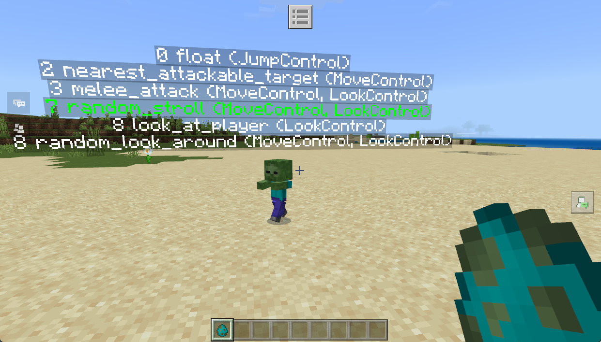
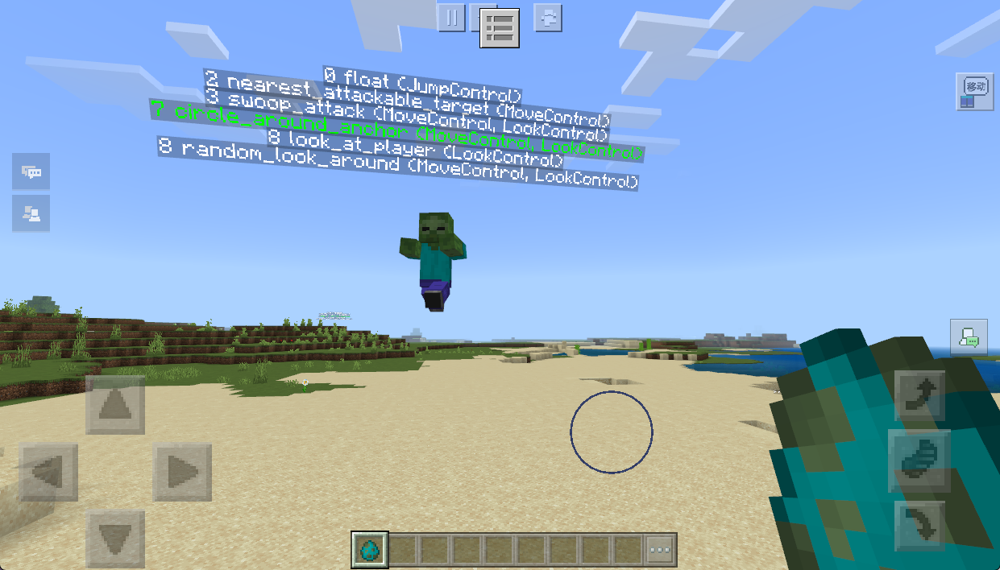

# 行为切换实战

> 温馨提示：开始阅读这篇指南之前，我们希望你对《我的世界》基岩版附加包有一定了解，有能力撰写 JSON 数据格式，并能够独立阅读《我的世界》开发者官网-开发指南或其他技术引用文档。

本文将修改**原版僵尸**的行为，实现一个可在**行走**和**飞行**之间切换的进化版僵尸，来扩展你对生物行为实现方式的理解。

注意，本文仅仅是借用这个简单的例子来进行说明，学习重点还是在行为的实现思路上。

在本教程中，您将学习以下内容。

- ✅行为包动画控制器实现更复杂的生物行为的**思路**；
- ✅飞行生物的实现；
- ✅切换组件组的几种方式；

请点击[这里](https://g79.gdl.netease.com/FlyingZombies.zip)下载本章节课程的教学包

## 成果展示

僵尸在行走一段距离之后会自动切换成飞行模式：


而在飞行一段时间之后又会自动切换成行走模式：


这样既能提高僵尸搜寻怪物的效率，又能提高玩家在生存时的游戏难度 ：


## 基础行为编写实战

根据生物的状态，我们很自然的可以把生物组件组分成两个部分 `walk` 和 `fly` 组，加上上节课的 `adult` 和 `baby` 组，那就自然而然的能够搭出如下的基础结构：

```json
{
    "format_version": "1.16.0",
    "minecraft:entity": {
        "description": {
            "identifier": "minecraft:zombie",
             // ..省略..
        },
        "component_groups": {
            "walk": {
                // ...省略..
            },
            "fly": {
                // ...省略..
            },
            "baby": {
                // ...省略..
            },
            "adult": {
                // ...省略..
            }
        },
        "components": {
            // 基础组件
            // AI 组件
        },
        "events": {
            "minecraft:entity_spawned": {
                "randomize": [
                    {
                        "weight": 1,
                        "add": {
                            "component_groups": [
                                "adult", "walk"
                            ]
                        }
                    },
                    {
                        "weight": 1,
                        "add": {
                            "component_groups": [
                                "baby", "walk"
                            ]
                        }
                    }
                ]
            },
            // 行走和飞行切换的自定义事件，先省略...
        }
    }
}
```

### 飞行的实现

我们目前没有飞行实体的编写经验，最直接的方式就是去**借鉴原版**的实现方式。

飞行的敌对生物，很容易想到[幻翼（phantom）](https://zh.minecraft.wiki/w/%E5%B9%BB%E7%BF%BC)，我们利用上节课的方法，直接去查看原版的实现方式（注意尽可能查看更新版本的行为文件，因为组件涉及更新和修复）：

```json
{
    "format_version": "1.16.0",
    "minecraft:entity": {
        "description": {
            "identifier": "minecraft:phantom",
            // ...省略..
        },
        "component_groups": {
        },
        "components": {
			// ...省略无关组件..
            "minecraft:physics": {
                "has_gravity": false
            },
            "minecraft:pushable": {
                "is_pushable": true,
                "is_pushable_by_piston": true
            },
            "minecraft:attack": {
                "damage": 6
            },
            "minecraft:movement": {
                "value": 1.8
            },
            "minecraft:movement.glide": {
                "start_speed": 0.1,
                "speed_when_turning": 0.2
            },
            "minecraft:follow_range": {
                "value": 64,
                "max": 64
            },
            "minecraft:behavior.swoop_attack": {
                "priority": 2,
                "damage_reach": 0.2,
                "speed_multiplier": 1.0,
                "delay_range": [10.0, 20.0]
            },
            "minecraft:behavior.circle_around_anchor": {
                "priority": 3,
                "radius_change": 1.0,
                "radius_adjustment_chance": 0.004,
                "height_adjustment_chance": 0.002857,
                "goal_radius": 1.0,
                "angle_change": 15.0,
                "radius_range": [5.0, 15.0],
                "height_offset_range": [-4.0, 5.0],
                "height_above_target_range": [20.0, 40.0]
            }
        }
    }
}
```

很容易看出来，幻翼的飞行主要是依靠 `movement.glide` 行走方式和 `circle_around_anchor` 来实现的（以及 `physics` 组件设置没有重力）。比较奇怪的是，幻翼本身并没有导航组件，全是依靠 AI 组件来实现路径选择的。

并且攻击使用的 [`swoop_attack` 组件](https://learn.microsoft.com/zh-cn/minecraft/creator/reference/content/entityreference/examples/entitygoals/minecraftbehavior_swoop_attack)。

> 对于我们不熟悉的组件，除了查看原版生物的使用方法之外，还可以去看看[文档](https://learn.microsoft.com/zh-cn/minecraft/creator/reference/content/entityreference/examples/componentlist)，就算是英文也不用担心，毕竟现代浏览器的翻译功能非常完善。

我们稍加更改之后，就可以直接复制过来到我们的 `fly` 组件组下了：

```json
"fly": {
    "minecraft:physics": {
        "has_gravity": false
    },
    "minecraft:follow_range": {
        "value": 64,
        "max": 64
    },
    // 基础的飞行组件，还是需要符合我们上节课说的步骤：移速、方式、导航、其他AI组件的思路
    // 这里的基础移速在 adult 和 baby 状态下定义
    "minecraft:movement.glide": {
        "start_speed": 0.4,
        "speed_when_turning": 0.6
    },
    // 原版的 phantom 没有 navigation 组件，所有的转向都是由 circle_around_anchor 完成的

    // AI 组件
    "minecraft:behavior.swoop_attack": {
        "priority": 3,
        "speed_multiplier": 2.25,
        // 这里设置成没有延迟，是因为避免攻击之后又执行 circle_around_anchor 组件跑开
        "delay_range": [0.0, 0.0]
    },
    "minecraft:behavior.circle_around_anchor": {
        "priority": 7,
        "radius_change": 1.0,
        // 一直在改变，变向实现了实体在行走的效果
        "radius_adjustment_chance": 0.35,
        "height_adjustment_chance": 0.002857,
        "goal_radius": 1.0,
        "angle_change": 15.0,
        "radius_range": [5.0, 15.0],
        "height_offset_range": [-1.0, 3.0],
        "height_above_target_range": [3.0, 5.0]
    }
},
```

### 行走实现

有了我们的飞行，根据上节课所学的知识，加上对于攻击方式和行走 AI 组件的区分，很容易写出下列的行为：

```json
"walk": {
    "minecraft:physics": {
        // 走在地上肯定是需要重力的，这里与飞行的行为对应
        "has_gravity": true
    },
    // 基础组件，还是需要符合我们上节课说的步骤：移速、方式、导航、其他AI组件的思路
    // 这里的基础移速在 adult 和 baby 状态下定义
    "minecraft:movement.basic": {},
    "minecraft:navigation.walk": {
        "is_amphibious": true,
        "can_pass_doors": true,
        "can_walk": true,
        "can_break_doors": true
    },
    // AI 组件
    "minecraft:behavior.melee_attack": {
        "priority": 3,
        "speed_multiplier": 1
    },
    "minecraft:behavior.random_stroll": {
        "priority": 7,
        "interval": 20,
        "speed_multiplier": 1,
        "must_reach": false
    }
},
```

这里有一个小细节：对于组件组中会互相冲突的组件，尽量都写入各自的组件组中，比如这里的 `physics` 组件，如果我们使用覆盖的方式的话，可能就会出问题，**下列就是错误示范**：

```json
{
    // 下列是错误示范
    // 省略了其他无关部分
    "minecraft:entity": {
        "component_groups": {
            "walk": {
                // 会覆盖掉默认的 physics 组件
                "minecraft:physics": {
                    "has_gravity": true
                },
            },
            "fly": {
                // 会覆盖掉默认的 physics 组件
                "minecraft:physics": {
                    "has_gravity": false
                },

            },
        },
        "components": {
            // 如果我们有两个组件组需要对同一个组件或者行为进行定义，不要采用覆盖的方式：
            "minecraft:physics": {},
        }
    }
}
```

### 行为测试

上面行为组我们就定义了行走和飞行两种状态，我们要测试的话，只需要基于上节课学到的**事件序列**知识，改造一下原版出生事件就可以进行测试了，比如我们默认加入 `walk` 组：

```json
 "events": {
     "minecraft:entity_spawned": {
         "sequence": [
             {
                 // 55开的几率生成成年和幼年僵尸
                 "randomize": [
                     {
                         "weight": 1,
                         "add": {
                             "component_groups": [
                                 "adult"
                             ]
                         }
                     },
                     {
                         "weight": 1,
                         "add": {
                             "component_groups": [
                                 "baby"
                             ]
                         }
                     }
                 ]
             },
             {
                 // 默认加入的行走行为组件组
                 "add": {
                     "component_groups": ["walk"]
                 }
             }
         ]
     }
 }
```

进入游戏，生物拥有正常的行走行为：



我们要测试飞行也是一样的，只需要把默认加入的组件替换成 `fly` 就行了：

```json
 "events": {
     "minecraft:entity_spawned": {
         "sequence": [
             {
                 // 55开的几率生成成年和幼年僵尸
			 	 // ...省略...
             },
             {
                 // 默认加入的行走行为组件组
                 "add": {
                     "component_groups": ["fly"]
                 }
             }
         ]
     }
 }
```

进入游戏，观察实体，发现能够正常的进行飞行：



## 行为切换实战

这是我们这篇文章主要想讨论的东西，也是实现更复杂生物行为的基础。

下面我们将对如何进行行为切换进行一些讨论。

### 行为切换的基础：事件

在讨论之前，我们需要先把基础打好，也就是通过事件来添加或者删除对应的组件组：

```json
"event":{
    // ..省略自带的实体生成事件..
    // 自定义事件
    "tutorial:convert_to_fly": {
        "add": {
            "component_groups": ["fly"]
        },
        "remove": {
            "component_groups": ["walk"]
        }
    },
    "tutorial:convert_to_walk": {
        "add": {
            "component_groups": ["walk"]
        },
        "remove": {
            "component_groups": ["fly"]
        }
    }
}
```

那么如何**基于我们的需求**来触发这些事件呢？下面是一些思路的讨论。

### 最容易想到的办法：Timer

[`timer` 组件](https://learn.microsoft.com/zh-cn/minecraft/creator/reference/content/entityreference/examples/entitycomponents/minecraftcomponent_timer)是比较常用的用来触发事件的组件，它的作用就是在一段时间之后触发事件。一个例子：

```json
"minecraft:timer":{
    "looping": true,
    "randomInterval":true,
    "time": [0.0, 0.0],
    "time_down_event": {
        "event":"minecraft:times_up"
    }
}
```

在原版的很多地方也很看到 `timer` 的身影，比如原版的尸壳（husk）会在 30 秒后会变成僵尸：

```json
"minecraft:timer": {
    "looping": false,
    "time": 30,
    "time_down_event": {
        "event": "minecraft:convert_to_zombie"
    }
}
```

基于此，我们就可以让我们自定义的僵尸，每隔一段时间就切换一次行走方式：

```json
{
    // 省略了其他无关部分
    "minecraft:entity": {
        "component_groups": {
            "walk": {
                // 10s 后切换飞行
                "minecraft:timer":{
                    "looping": false,
                    "randomInterval":false,
                    "time": [10.0, 10.0],
                    "time_down_event": {
                        "event":"tutorial:convert_to_fly"
                    }
                }
            },
            "fly": {
                // 10s 后切换行走
                "minecraft:timer":{
                    "looping": false,
                    "randomInterval":false,
                    "time": [0.0, 0.0],
                    "time_down_event": {
                        "event":"tutorial:convert_to_walk"
                    }
                }
            },
        }
    }
}
```

Timer 虽然能够在 `[a,b]` 范围内触发我们的事件，但是总体来说生物行为还是比较呆板和固定的。

### 更好的办法：触发器和传感器

在基岩版中，有一些特殊情况发生时，会有对应的[触发器](https://learn.microsoft.com/zh-cn/minecraft/creator/reference/content/entityreference/examples/triggerlist)可以触发事件的响应：

| 触发器                                                       | 说明                                                         |
| :----------------------------------------------------------- | :----------------------------------------------------------- |
| [minecraft:on_death](https://learn.microsoft.com/zh-cn/minecraft/creator/reference/content/entityreference/examples/entitytriggers/minecrafttrigger_on_death) | 当实体死亡时触发。只能用在 `ender_dragon` 末影龙上。         |
| [minecraft:on_friendly_anger](https://learn.microsoft.com/zh-cn/minecraft/creator/reference/content/entityreference/examples/entitytriggers/minecrafttrigger_on_friendly_anger) | 当同类型的实体进入 `angry` 组件时触发。                      |
| [minecraft:on_hurt_by_player](https://learn.microsoft.com/zh-cn/minecraft/creator/reference/content/entityreference/examples/entitytriggers/minecrafttrigger_on_hurt_by_player) | 被玩家攻击时触发。                                           |
| [minecraft:on_hurt](https://learn.microsoft.com/zh-cn/minecraft/creator/reference/content/entityreference/examples/entitytriggers/minecrafttrigger_on_hurt) | 被实体攻击时触发。                                           |
| [minecraft:on_ignite](https://learn.microsoft.com/zh-cn/minecraft/creator/reference/content/entityreference/examples/entitytriggers/minecrafttrigger_on_ignite) | 当实体被点燃时。                                             |
| [minecraft:on_start_landing](https://learn.microsoft.com/zh-cn/minecraft/creator/reference/content/entityreference/examples/entitytriggers/minecrafttrigger_on_start_landing) | 但实体开始着陆。只能用在 `ender_dragon` 末影龙上。           |
| [minecraft:on_start_takeoff](https://learn.microsoft.com/zh-cn/minecraft/creator/reference/content/entityreference/examples/entitytriggers/minecrafttrigger_on_start_takeoff) | 实体开始起飞。只能用在 `ender_dragon` 末影龙上。             |
| [minecraft:on_target_acquired](https://learn.microsoft.com/zh-cn/minecraft/creator/reference/content/entityreference/examples/entitytriggers/minecrafttrigger_on_target_acquired) | 当实体获得目标时触发。                                       |
| [minecraft:on_target_escape](https://learn.microsoft.com/zh-cn/minecraft/creator/reference/content/entityreference/examples/entitytriggers/minecrafttrigger_on_target_escape) | 当实体没有目标时触发。                                       |
| [minecraft:on_wake_with_owner](https://learn.microsoft.com/zh-cn/minecraft/creator/reference/content/entityreference/examples/entitytriggers/minecrafttrigger_on_wake_with_owner) | 当实体作为宠物时，主人睡觉起床时触发。需要通过 `tame` 组件或者命令把实体标记为宠物。 |

比如，我们可以让我们的僵尸在发现目标后切换成飞行的状态，而没有目标时恢复行走状态：

```json
{
    // 省略了其他无关部分
    "minecraft:entity": {
        "components": {
            "minecraft:on_target_acquired": {
                "event": "tutorial:convert_to_fly",
                "target": "self"
            },
            "minecraft:on_target_escape": {
                "event": "tutorial:convert_to_walk",
                "target": "self"
            },
        }
    }
}
```

效果演示：


以上的触发器都是微软硬编码好的。还有一种类似的触发方式是基于组件的传感器：

| 传感器                                                       |                                                              |
| :----------------------------------------------------------- | :----------------------------------------------------------- |
| [minecraft:block_sensor](https://learn.microsoft.com/zh-cn/minecraft/creator/reference/content/entityreference/examples/entitycomponents/minecraftcomponent_entity_sensor) | 当列表里面的方块在实体周围被破坏时触发。                     |
| [mincraft:damage_sensor](https://learn.microsoft.com/zh-cn/minecraft/creator/reference/content/entityreference/examples/entitycomponents/minecraftcomponent_damage_sensor) | 当实体被指定实体或者指定伤害类型伤害时触发。                 |
| [minecraft:entity_sensor](https://learn.microsoft.com/zh-cn/minecraft/creator/reference/content/entityreference/examples/entitycomponents/minecraftcomponent_entity_sensor) | 当定义范围内的其他实体满足配置条件时触发。                   |
| [minecraft:environment_sensor](https://learn.microsoft.com/zh-cn/minecraft/creator/reference/content/entityreference/examples/entitycomponents/minecraftcomponent_environment_sensor) | 根据环境条件触发。比如夜晚、白天等。自由度较高。             |
| [minecraft:rail_sensor](https://learn.microsoft.com/zh-cn/minecraft/creator/reference/content/entityreference/examples/entitycomponents/minecraftcomponent_rail_sensor) | 实体在经过已激活或已停用的轨道时触发。                       |
| [minecraft:target_nearby_sensor](https://learn.microsoft.com/zh-cn/minecraft/creator/reference/content/entityreference/examples/entitycomponents/minecraftcomponent_target_nearby_sensor) | 定义实体的范围，在该范围内，它可以查看或感知其他实体以定位它们。苦力怕检测爆炸就是使用的这一传感器。 |

比如，我们让自定义僵尸在距离目标超过 6 格距离时切换成飞行状态，否则就行走：

```json
{
    // 省略了其他无关部分
    "minecraft:entity": {
        "components": {
            "minecraft:target_nearby_sensor": {
                "inside_range": 5.5,
                "outside_range": 6.0,
                "must_see": true,
                "on_inside_range": {
                    "event": "tutorial:convert_to_walk",
                    "target": "self"
                },
                "on_outside_range": {
                    "event": "tutorial:convert_to_fly",
                    "target": "self"
                },
                "on_vision_lost_inside_range": {
                    "event": "tutorial:convert_to_walk",
                    "target": "self"
                }
            },
        }
    }
}
```

又或者使用 `environment_sensor` 加上[过滤器](https://learn.microsoft.com/zh-cn/minecraft/creator/reference/content/entityreference/examples/filterlist)来制作一个晚上飞行，白天行走的僵尸：

```json
{
    // 省略了其他无关部分
    "minecraft:entity": {
        "component_groups": {
            "walk": {
                "minecraft:environment_sensor": {
                    "triggers": [
                        {
                            "filters": {
                                "test": "is_daytime",
                                "value": false
                            },
                            "event": "tutorial:convert_to_fly"
                        }
                    ]
                },
                // 其他组件
            },
            "fly": {
                "minecraft:environment_sensor": {
                    "triggers": [
                        {
                            "filters": {
                                "test": "is_daytime",
                                "value": true
                            },
                            "event": "tutorial:convert_to_walk"
                        }
                    ]
                },
                // 其他组件
            },
        },
    }
}
```

只需要我们熟悉这些传感器和过滤器，我们就可以制作行为更加丰富的实体。其他的这些传感器大家可以自行去了解和实验。

### 进阶办法：动画控制器 +  Molang

上面提到的都是基于组件的，那下面我们就来讨论一个基于动画控制器的方法。

我们在上一节课中提到，在行为包中也可以给实体使用动画控制器，只不过与资源包中的控制器功能不同（行为包是允许使用命令的）。对于动画控制器不熟悉的同学可以去官网查看相关教程。

这里举几个例子来帮助大家快速理解。

#### 例1：随机间隔计时器

新增一个空的、只用于计时的**动画文件** `tutorial_zombie.animation.json` 文件到**行为包**下的 `animations`（因为动画控制器只能读取到同目录下的动画文件）：

```json
{
    "format_version": "1.8.0",
    "animations": {
        "animation.tutorial_zombie.random_interval": {
            "animation_length": 100
        }
    }
}
```

同样，在**行为包**下的 `animation_controllers` 目录下新增 `controller.animation.tutorial_zombie.json`：

```json
{
    "format_version": "1.10.0",
    "animation_controllers": {
        // 随机间隔控制器示例
        "controller.animation.zombie.random_interval": {
            "initial_state": "default",
            "states": {
                "default": {
                    "transitions": [
                        {
                            "walking": "query.is_on_ground"
                        },
                        {
                            "flying": "!query.is_on_ground"
                        }
                    ]
                },
                "walking": {
                    "on_entry": [
                        "variable.random_interval = math.random(2, 7);",
                        "/say walking random interval started"
                    ],
                    "animations": [
                        "tutorial:random_interval"
                    ],
                    "transitions": [
                        {
                            "flying": "query.anim_time >= variable.random_interval"
                        }
                    ],
                    "on_exit": [
                        // 触发自定事件
                        "@s tutorial:convert_to_fly",
                        "/say walking random interval finished"
                    ]
                },
                "flying": {
                    "on_entry": [
                        "variable.random_interval = math.random(2, 7);",
                        "/say flying random interval started"
                    ],
                    "animations": [
                        "tutorial:random_interval"
                    ],
                    "transitions": [
                        {
                            "walking": "query.anim_time >= variable.random_interval"
                        }
                    ],
                    "on_exit": [
                        // 触发自定事件
                        "@s tutorial:convert_to_walk",
                        "/say flying random interval finished"
                    ]
                }
            }
        }
    }
}
```

> 这里需要知道的是，动画控制器文件中的 `query.` 可以缩写为 `q.`，自定义的变量 `variable.` 也可以缩写为 `v.`

此时的 `zombie.json` 文件如下：

```json
{
    "format_version": "1.16.0",
    "minecraft:entity": {
        "description": {
            "identifier": "minecraft:zombie",
            "is_experimental": false,
            "is_spawnable": true,
            "is_summonable": true,
            "animations": {
                // 新增的用于计时的动画
                "tutorial:random_interval": "animation.tutorial_zombie.random_interval",
                // 随机间隔计时器
                "random_interval": "controller.animation.zombie.random_interval"
            },
            "scripts": {
                "animate": [
                    "random_interval"
                ]
            }
        },
      	// 省略其他无关内容....
```

此时，我们就可以不加入任何组件的情况下，实现行走和飞行的互相转换：


#### 例2：基于行走距离切换

我们上面所有的实现方式都是被动触发式的，比如时间到了、环境变了。如果我们想要实现行走一段距离之后切换飞行的话，组件的方式就已经不实用了。

原版有一个 Molang 变量是 `query.walk_distance`，它会返回实体行走的总长度。我们基于此实现下列控制器：

```json
// 基于行走距离来切换飞行
"controller.animation.zombie.base_on_walk_distance": {
    "initial_state": "default",
    "states": {
        "default": {
            "transitions": [
                {
                    "walking": "query.is_on_ground"
                },
                {
                    "flying": "!query.is_on_ground"
                }
            ]
        },
        "walking": {
            "on_entry": [
                "/say start walking",
                // query.walk_distance 返回的是实体行走的总距离
                "variable.distance2fly = query.walk_distance + math.random(1, 3);"
            ],
            "on_exit": [
                // 触发自定事件
                "@s tutorial:convert_to_fly",
                "/effect @s levitation 2 1 true"
            ],
            "transitions": [
                {
                    "flying": "query.walk_distance >= variable.distance2fly"
                }
            ]
        },
        "flying": {
            "on_entry": [
                "/say start flying",
                // query.time_stamp 返回的是当前世界的世界戳
                // 游戏1s对应20帧，这里（* 20）是把秒转换成游戏时间戳
                "variable.time2fall = query.time_stamp + math.random(4, 10) * 20;"
            ],
            "on_exit": [
                // 触发自定事件
                "@s tutorial:convert_to_walk",
                "/effect @s levitation 0",
                // 为了让实体更平滑的降落
                "/effect @s slow_falling 5 0 true"
            ],
            "transitions": [
                {
                    "walking": "query.time_stamp >= variable.time2fall"
                }
            ]
        }
    }
}
```

此时的 `zombie.json` 如下所示：

```json
    "format_version": "1.16.0",
    "minecraft:entity": {
        "description": {
            "identifier": "minecraft:zombie",
            "is_experimental": false,
            "is_spawnable": true,
            "is_summonable": true,
            "animations": {
                // 基于行走距离来切换
                "base_on_walk_distance": "controller.animation.zombie.base_on_walk_distance"
            },
            "scripts": {
                "animate": [
                    "base_on_walk_distance"
                ]
            }
            // 省略其他无关内容....
```

重新进入游戏，实体就会在行走一段随机距离之后切换飞行。又会在飞行一段时间之后切换回行走。

上面两个例子，都是为了帮助我们理解这样的生物行为切换方式，主要目的是**扩展思路**。其实这样的方式，还能实现很多其他的功能，比如控制实体飞行等，这里就不做具体演示了。

## 小结

我们想要制作复杂的生物行为，首先我们就需要对[生物组件](https://learn.microsoft.com/zh-cn/minecraft/creator/reference/content/entityreference/examples/componentlist)、[过滤器](https://learn.microsoft.com/zh-cn/minecraft/creator/reference/content/entityreference/examples/filterlist)、[AI 组件](https://learn.microsoft.com/zh-cn/minecraft/creator/reference/content/entityreference/examples/aigoallist)、[触发器](https://learn.microsoft.com/zh-cn/minecraft/creator/reference/content/entityreference/examples/triggerlist)、[Molang 变量](https://learn.microsoft.com/zh-cn/minecraft/creator/reference/content/molangreference/examples/molangconcepts/queryfunctions)具有基础的了解外，还需要对他们的运用有所了解（可以查看原版实体）。

另外，动画控制器 + Molang 的方式也能够让我们的生物支持更丰富的行为。

虽然原版已经有足够的组件供我们使用，但仍然有些功能无法实现，我们将会在下一节中继续说明自定义行为的实现。

## 课后作业

本次课后作业，内容如下：

- 尝试在 `_b/entities` 新增一个 `zombie.json` 文件，修改原版僵尸的行为，使其具备基础的飞行和行走的转换能力，并尝试以下的方法：
  - 基于组件的方式；
  - 基于触发器的方式；
  - 基于传感器的方式；
  - 基于动画控制器的方式；
