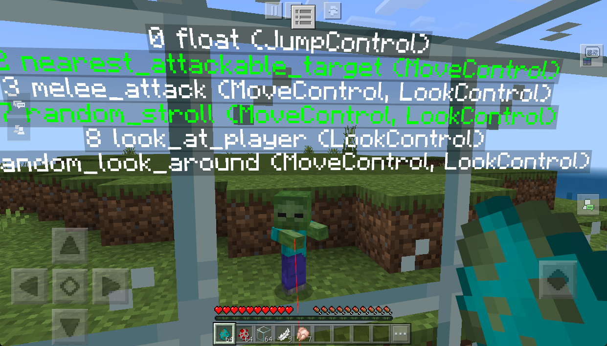
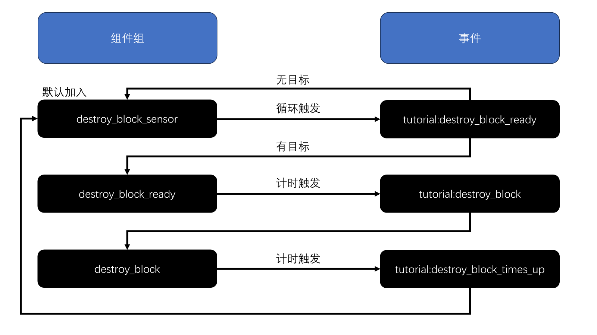

# 特殊行为-拆墙

> 温馨提示：开始阅读这篇指南之前，我们希望你对《我的世界》基岩版附加包有一定了解，有能力撰写 JSON 数据格式，对 Python 进行模组开发有了解，并能够独立阅读《我的世界》开发者官网-开发指南或其他技术引用文档。

本文将修改**原版僵尸**的行为，实现一个可以拆除墙体的僵尸。

在本教程中，您将学习以下内容。

- ✅自定义生物行为的实现；
- ✅拆墙行为的实现；

请点击[这里](https://g79.gdl.netease.com/DestroyWalls.zip)下载本章节课程的教学包

## 如何检测被墙体阻隔

想要实体在被墙体阻隔时，仍然保留对目标的仇恨的话，首先第一步就需要改造一下攻击目标选择的组件：

```json
"minecraft:behavior.nearest_attackable_target": {
    "priority": 2,
    "must_see": false, // 如果 Ture，那么目标实体必须在视线范围内
```

把 `must_see` 组件改为 `false`，这样，就可以在被墙体阻隔的情况下仍然被实体所选择：



下一个问题就到了**如何检测被墙体阻隔**了。

我们检查和查阅所有的组件也好，Molang 变量也好，发现并没有能够直接使用的，我们只能曲线救国了。

### break_blocks组件

我们查阅组件列表发现有一个 [`eat_blocks` 组件](https://learn.microsoft.com/zh-cn/minecraft/creator/reference/content/entityreference/examples/entitygoals/minecraftbehavior_eat_block?view=minecraft-bedrock-stable)，但是实际测试之后并不能使用，原因就是因为这个组件是模拟山羊用来吃掉脚下方块的组件，想要达到拆墙的效果并不可行，效果演示：


另外还发现了一个 [`break_blocks` 组件](https://learn.microsoft.com/zh-cn/minecraft/creator/reference/content/entityreference/examples/entitycomponents/minecraftcomponent_break_blocks?view=minecraft-bedrock-stable)，这可能是一个符合要求的选择，但是如果只是单纯加入，就会表现得横冲直撞（即使在没有目标时）：


我们想要他在发现目标之后再进行一个短暂的破坏（也就是说需要冷却），我们可以使用上节课说到的传感器和 Timer 组件来配合使用：

```json
{
    // 省略了其他无关信息
    "minecraft:entity": {
        "component_groups": {
            "destroy_block_sensor": {
                // 这里不能使用传感器，是因为如果当加入传感器时已经有了目标时，就无法触发事件了
                // 所以之类我们改成了使用 Timer 来 Tick 检测的方式
                "minecraft:timer": {
                    "looping": true,
                    "randomInterval": true,
                    "time": [1, 1.5],
                    "time_down_event": {
                        "event": "tutorial:destroy_block_ready"
                    }
                }
            },
            "destroy_block_ready": {
                "minecraft:timer": {
                    "looping": false,
                    "randomInterval": true,
                    "time": [1, 1.5],
                    "time_down_event": {
                        "event": "tutorial:destroy_block"
                    }
                }
            },
            "destroy_block": {
                "minecraft:break_blocks": {
                    "breakable_blocks": [
                        "stone",
                        "glass"
                    ]
                },
                "minecraft:timer": {
                    "looping": true,
                    "randomInterval": true,
                    // 给一个足够短的时间，让它只能破坏一堵墙
                    "time": [0.2, 0.2],
                    "time_down_event": {
                        "event": "tutorial:destroy_block_times_up"
                    }
                }
            }
        },
        "events": {
            // 自定义事件
            "tutorial:destroy_block_ready": {
                // 如果有目标的话，则加入 "destroy_block_ready" 组件组，否则就继续执行 Timer
                "filters": {
                    "test": "has_target"
                },
                "add": {
                    "component_groups": ["destroy_block_ready"]
                },
                "remove": {
                    "component_groups": ["destroy_block_sensor"]
                }

            },
            "tutorial:destroy_block": {
                "add": {
                    "component_groups": ["destroy_block"]
                },
                "remove": {
                    "component_groups": ["destroy_block_ready"]
                }
            },
            "tutorial:destroy_block_times_up": {
                "add": {
                    "component_groups": ["destroy_block_sensor"]
                },
                "remove": {
                    "component_groups": ["destroy_block"]
                }
            }
        }
    }
}
```

看上去有点长，但实际上这个流程还是很清晰的：



我们加入游戏之后测试：


可以看到，虽然也能达到类似效果，但是这个 `break_blocks` 组件是机械暴力的拆掉路径上的所有方块，并没有检测的功能。

### 动画控制器+Molang

还记得我们上节课提到过一个 `query.walk_distance` 的 Molang 变量，它会返回实体当前行走的总长度。

如果说一个实体在有目标的情况下长时间没有移动（总路程没变），是不是也可以侧面说明实体被“墙体”挡住了？

理论存在，开始实践。首先添加上控制器：

```json
{
    "format_version": "1.10.0",
    "animation_controllers": {
        // 破坏墙体
        "controller.animation.zombie.destroy_wall": {
            "initial_state": "default",
            "states": {
                "default": {
                    "on_entry": [
                        "/say start wall check...",
                        // 刚开始检测时的初始距离
                        "v.start_distance = query.walk_distance;",
                        // 需要检测的时间，游戏一帧是 20 帧，这里 x * 20 就是 x 秒
                        "v.time2check = query.time_stamp + 1 * 20;"
                    ],
                    "transitions": [
                        {
                            // 移动的距离足够短并且时间到了 tick 时间，条件满足则开始破坏方块
                            "start_destroy_block": "query.walk_distance - v.start_distance < 1 && query.time_stamp >= v.time2check"
                        },
                        {
                            // 不满足条件则进入冷却重新进入检测
                            "cooldown": "query.walk_distance - v.start_distance >= 1 && query.time_stamp >= v.time2check"
                        }
                    ]
                },
                "start_destroy_block": {
                    "on_entry": [
                        "/say start destroy wall",
                        // 需要检测的时间，游戏一帧是 20 帧，这里 x * 20 就是 x 秒
                        "v.time2check = query.time_stamp + 0.1 * 20;",
                        "@s tutorial:destroy_block"
                    ],
                    "on_exit": [
                        "/say finished destroy wall",
                        "@s tutorial:destroy_block_finished"
                    ],
                    "transitions": [
                        {
                            "cooldown": "query.time_stamp >= v.time2check"
                        }
                    ]
                },
                "cooldown": {
                    "on_entry": [
                        "/say destroy wall in cooling",
                        // 需要检测的时间，游戏一帧是 20 帧，这里 x * 20 就是 x 秒
                        "v.time2cooldown = query.time_stamp + 1 * 20;"
                    ],
                    "transitions": [
                        {
                            "default": "query.time_stamp >= v.time2cooldown"
                        }
                    ]
                }
            }
        }
    }
}
```

此时的 `zombie.json` 如下：

```json
{
    "format_version": "1.16.0",
    "minecraft:entity": {
        "description": {
            // ...省略基础定义...
            "animations": {
                "destroy_block_sensor": "controller.animation.zombie.destroy_wall"
            },
            "scripts": {
                "animate": [
                    {
                        // 只有在有目标的情况下才执行控制器的逻辑
                        "destroy_block_sensor": "query.has_target"
                    }
                ]
            }
        },
        "component_groups": {
            "destroy_block": {
                "minecraft:break_blocks": {
                    "breakable_blocks": [
                        "stone",
                        "glass"
                    ]
                }
            },
            // ...省略 baby/ adult 和 walk 行为组
        },
        "components": {
            // ...省略组件...
        },
        "events": {
			// ...省略出生事件...
            // 自定义事件
            "tutorial:destroy_block": {
                "add": {
                    "component_groups": ["destroy_block"]
                }
            },
            "tutorial:destroy_block_finished": {
                "remove": {
                    "component_groups": ["destroy_block"]
                }
            }
        }
    }
}
```

这其实跟上面第一种方式的本质区别就是用更加灵活的 Molang 变量替代了死板的 `Timer` 组件。

这样做之后的区别就是，僵尸不会再一股脑的破坏掉路径上的所有方块，而是会在检测走不动时，才会开始尝试破坏方块：


这样虽然也是模拟了检测的情况，也尽最大可能还原了拆墙的行为逻辑，但是也不是真正意义上的检测。

我们会发现原版的组件和 Molang 变量似乎并不能真正满足需求了，如果我们想要实体行更好用，这时候就需要用到我们的自定义生物行为了。

## 自定义生物行为

> 如果对这个内容不熟悉的同学，请自行前往阅读[官方文档](https://mc.163.com/dev/mcmanual/mc-dev/mcguide/20-%E7%8E%A9%E6%B3%95%E5%BC%80%E5%8F%91/15-%E8%87%AA%E5%AE%9A%E4%B9%89%E6%B8%B8%E6%88%8F%E5%86%85%E5%AE%B9/3-%E8%87%AA%E5%AE%9A%E4%B9%89%E7%94%9F%E7%89%A9/01-%E8%87%AA%E5%AE%9A%E4%B9%89%E5%9F%BA%E7%A1%80%E7%94%9F%E7%89%A9.html?catalog=1)。

在最新的 2.9 版本中，[`getEntitiesOrBlockFromRay` 接口](https://mc.163.com/dev/mcmanual/mc-dev/mcdocs/1-ModAPI/%E6%8E%A5%E5%8F%A3/%E4%B8%96%E7%95%8C/%E5%AE%9E%E4%BD%93%E7%AE%A1%E7%90%86.html#getentitiesorblockfromray)新增了对射线上方块获取的支持，这个 API 接口可以从指定位置发射一条射线，获取与射线相交的实体和方块信息。

我们可以以此为基础来创造一个使用**最短路径**破坏墙体来攻击目标的自定义僵尸，实现之后的演示如下：


完整代码示例如下：

```python
# coding=utf-8
import mod.server.extraServerApi as serverApi
from mod.common.utils.mcmath import Vector3

CustomGoalCls = serverApi.GetCustomGoalCls()
CompFactory = serverApi.GetEngineCompFactory()


class DestroyWall(CustomGoalCls):
    def __init__(self, entityId, argsJson):
        super(DestroyWall, self).__init__(entityId, argsJson)
        self.mEntityId = entityId
        self.mTimeCounter = 0

    # region 继承函数
    def CanUse(self):
        if self._HasTarget() and self._IsTargetAlive() and self._HasBlockBetweenTargetAndCanDestroyBlock():
            return True
        return False

    def CanContinueToUse(self):
        return self.CanUse()

    def CanBeInterrupted(self):
        return True

    def Start(self):
        self.mTimeCounter = 0
        self._FaceToTarget()

    def Stop(self):
        pass

    def Tick(self):
        self.mTimeCounter += 1
        perSec = self.mTimeCounter % 20 == 0
        if perSec:
            # 限制僵尸 1s 只能破坏一个方块
            self._DestroyFrontBlock()

    # endregion

    # region 类函数
    def _HasTarget(self):
        #是否有仇恨目标
        comp = CompFactory.CreateAction(self.mEntityId)
        targetId = comp.GetAttackTarget()
        hasTarget = targetId != "-1"
        return hasTarget

    def _IsTargetAlive(self):
        comp = CompFactory.CreateAction(self.mEntityId)
        targetId = comp.GetAttackTarget()
        comp = CompFactory.CreateGame(serverApi.GetLevelId())
        alive = comp.IsEntityAlive(targetId)
        return alive

    # 跟目标之间是否存在方块并且是否能够破坏
    def _HasBlockBetweenTargetAndCanDestroyBlock(self):
        blockDictList = self._GetFirstBlockFromRay()
        if len(blockDictList) == 0:
            return False
        blockDict = blockDictList[0]
        blockPos = blockDict['pos']
        selfPos = CompFactory.CreatePos(self.mEntityId).GetFootPos()
        distance2block = (Vector3(blockPos) - Vector3(selfPos)).Length()
        return distance2block < 2  # 2 是手长，也就是只有够得到的方块才能够被破坏

    # 面向目标
    def _FaceToTarget(self):
        comp = CompFactory.CreateAction(self.mEntityId)
        targetId = comp.GetAttackTarget()
        targetPosX, targetPosY, targetPosZ = CompFactory.CreatePos(targetId).GetFootPos()
        entityPosX, entityPosY, entityPosZ = CompFactory.CreatePos(self.mEntityId).GetFootPos()
        diffPos = (targetPosX - entityPosX, targetPosY - entityPosY, targetPosZ - entityPosZ)
        CompFactory.CreateRot(self.mEntityId).SetRot(serverApi.GetRotFromDir(diffPos))

    # 破坏生物面前的方块
    def _DestroyFrontBlock(self):
        blockDictList = self._GetFirstBlockFromRay()
        if blockDictList:
            blockDict = blockDictList[0]
            blockPos = blockDict['pos']
            blockInfoComp = CompFactory.CreateBlockInfo(self.mEntityId)
            dimensionId = CompFactory.CreateDimension(self.mEntityId).GetEntityDimensionId()
            blockInfoComp.SetBlockNew(blockPos, {'name': 'minecraft:air'}, 0, dimensionId)

    # 获得视线范围内第一个方块信息
    def _GetFirstBlockFromRay(self):
        dimensionId = CompFactory.CreateDimension(self.mEntityId).GetEntityDimensionId()
        comp = CompFactory.CreateAction(self.mEntityId)
        targetId = comp.GetAttackTarget()
        targetPosX, targetPosY, targetPosZ = CompFactory.CreatePos(targetId).GetFootPos()
        entityPosX, entityPosY, entityPosZ = CompFactory.CreatePos(self.mEntityId).GetFootPos()

        # 这里获取碰撞箱的高度，因为 FootPos 是从脚底开始计算的坐标，这里加上碰撞箱 -0.2 模拟的是头部眼睛的高度
        _, collisionBoxHeight = CompFactory.CreateCollisionBox(self.mEntityId).GetSize()
        _, targetCollisionBoxHeight = CompFactory.CreateCollisionBox(targetId).GetSize()

        targetPosY = targetPosY + targetCollisionBoxHeight - 0.2
        entityPosY = entityPosY + collisionBoxHeight - 0.2

        rot = (targetPosX - entityPosX, targetPosY - entityPosY, targetPosZ - entityPosZ)
        distance = int(Vector3(rot).Length() - 1)   # 这个地方用小数会非常卡，所以取一个 int，主要是防止射线击穿实体

        blockDictList = serverApi.getEntitiesOrBlockFromRay(
            dimensionId, (entityPosX, entityPosY, entityPosZ), rot, distance, False,
            serverApi.GetMinecraftEnum().RayFilterType.OnlyBlocks
        )

        return blockDictList

    # endregion

```

此时的 `zombie.json` 文件如下：

```json
// ...省略其他无关信息...
"component_groups": {
    "destroy_block": {
        "minecraft:behavior.python_custom:destroy_wall": {
            "priority": 1,
            "module_path": "destroyWallScripts.destroyWall",
            "class_name": "DestroyWall",
            "control_flags": ["move"]
        }
    },
```

### 破坏时间的支持

上面的方块破坏是无差别破坏路径上的所有方块，连基岩也逃不过，这明显是不合理的。

我们可以通过配置配合 [`GetDestroyTotalTime` 接口](https://mc.163.com/dev/mcmanual/mc-dev/mcdocs/1-ModAPI/%E6%8E%A5%E5%8F%A3/%E4%B8%96%E7%95%8C/%E6%96%B9%E5%9D%97%E7%AE%A1%E7%90%86.html#getdestroytotaltime)来限制自定义实体能够破坏方块的种类。我们稍微改造一下 `_HasBlockBetweenTargetAndCanDestroyBlock` 函数：

```python
# 跟目标之间是否存在方块并且是否能够破坏
def _HasBlockBetweenTargetAndCanDestroyBlock(self):
    blockDictList = self._GetFirstBlockFromRay()
    if len(blockDictList) == 0:
        return False
    blockDict = blockDictList[0]
    blockPos = blockDict['pos']
    selfPos = CompFactory.CreatePos(self.mEntityId).GetFootPos()
    distance2block = (Vector3(blockPos) - Vector3(selfPos)).Length()
    if distance2block > 2:
        # 2 是手长，也就是只有够得到的方块才能够被破坏
        return False
    # 还需要检测手上的物品是否能够破坏掉方块
    destroyTotalTime = self._GetTargetBlockDestroyTime(blockDict['identifier'])
    canDestroy = destroyTotalTime > 0
    return canDestroy

def _GetTargetBlockDestroyTime(self, blockIdentifier):
    blockInfoComp = CompFactory.CreateBlockInfo(self.mEntityId)
    carriedItem = CompFactory.CreateItem(self.mEntityId).GetEntityItem(serverApi.GetMinecraftEnum().ItemPosType.CARRIED, 0)
    totalTime = blockInfoComp.GetDestroyTotalTime(blockIdentifier, None if not carriedItem else carriedItem['itemName'])
    return totalTime
```

并且我们新增对破坏时间的支持，也就是说，实体真的需要这么多时间来破坏方块：

```python
# coding=utf-8
import mod.server.extraServerApi as serverApi
from mod.common.utils.mcmath import Vector3

CustomGoalCls = serverApi.GetCustomGoalCls()
CompFactory = serverApi.GetEngineCompFactory()

# 省略了其他无关的函数...
class DestroyWall(CustomGoalCls):
    def __init__(self, entityId, argsJson):
        super(DestroyWall, self).__init__(entityId, argsJson)
        self.mEntityId = entityId
        self.mTimeCounter = 0
        self.mTargetBlockDestroyTime = 0  # 目标方块破坏时间

    def Start(self):
        self.mTimeCounter = 0
        self._FaceToTarget()
        self._ResetDestroyTime()  # 开始执行时设置目标方块破坏时间

    def Tick(self):
        self.mTimeCounter += 1
        time2destroy = self.mTimeCounter >= int(self.mTargetBlockDestroyTime * 20)  # 1 秒 20 帧
        perSec = self.mTimeCounter % 20 == 0
        if time2destroy:
            self._DestroyFrontBlock()
            self._ResetDestroyTime()
        elif perSec:
            # 使用 /say 命令来监控实体当前的状态
            leftTime = self.mTargetBlockDestroyTime - self.mTimeCounter / 20.0
            CompFactory.CreateCommand(self.mEntityId).SetCommand('/say 正在破坏方块，还剩:{}s'.format(leftTime))

    def _ResetDestroyTime(self):
        blockDict = self._GetFirstBlockFromRay()[0]
        self.mTargetBlockDestroyTime = self._GetTargetBlockDestroyTime(blockDict['identifier'])
        # 使用 /say 命令在游戏中输出破坏时间
        CompFactory.CreateCommand(self.mEntityId).SetCommand('/say 破坏时间：{}s'.format(self.mTargetBlockDestroyTime))

```

一番改造之后，可以进入游戏查看效果：


### 动画支持

可以看到，虽然支持了破坏时间，但是并没有破坏的动画，显得非常呆板。我们尝试给正在破坏方块的实体加入一个破坏方块的动画。

如果是我们自定义的实体，可以很方便的使用自定义的 `query.mod.xxx` 或者直接使用播放动画的接口来实现播放自己动画的效果。

但我们这里使用的是原版资源，原版是通过 `variable.attack_time` 来实现的攻击动画，查看原版的动画文件也是使用的 Molang 来实现：

```json
"animation.humanoid.attack.rotations.v1.0" : {
    "loop" : true,
    "bones" : {
        "body" : {
            "rotation" : [ 0.0, "(math.sin(math.sqrt(variable.attack_time) * 360) * 11.46) - this", 0.0 ]
        },
        "leftarm" : {
            "rotation" : [ "(math.sin(math.sqrt(variable.attack_time) * 360) * 11.46)", 0.0, 0.0 ]
        },
        "rightarm" : {
            "rotation" : [ "math.sin(1.0 - math.pow(1.0 - variable.attack_time, 3.0) * 180.0) * (variable.is_brandishing_spear ? -1.0 : 1.0 )", "variable.is_brandishing_spear ? 0.0 : (math.sin(math.sqrt(variable.attack_time) * 360) * 11.46) * 2.0", 0.0 ]
        }
    }
},
```

而 `variable.attack_time` 我们无法更改。所以我们只能曲线救国了。

虽然不能触发原版的攻击动画，但是可以用玩家的 `swim` 动画来代替（模拟有动画的情况），最终效果如下：


怎么实现的呢？首先我们需要把动画加入到实体之中去，为了不破坏原版文件，我们使用代码的方式无侵入式的加入玩家的有用动画：

```python
# -*- coding: utf-8 -*-
import mod.client.extraClientApi as clientApi

CompFactory = clientApi.GetEngineCompFactory()


class CustomEntityClientSystem(clientApi.GetClientSystemCls()):

    def __init__(self, namespace, name):
        super(CustomEntityClientSystem, self).__init__(namespace, name)
        self.ListenEvent()

    def ListenEvent(self):
        self.ListenForEvent(clientApi.GetEngineNamespace(), clientApi.GetEngineSystemName(), "OnLocalPlayerStopLoading",
                            self, self.OnLocalPlayerStopLoading)
        self.ListenForEvent(clientApi.GetEngineNamespace(), clientApi.GetEngineSystemName(), "AddEntityClientEvent",
                            self, self.OnAddEntityClientEvent)

    def OnLocalPlayerStopLoading(self, args=None):
        gameComp = CompFactory.CreateGame(clientApi.GetLevelId())
        zombieEntityList = gameComp.GetEntitiesAroundByType(clientApi.GetLocalPlayerId(), 48,
                                                            clientApi.GetMinecraftEnum().EntityType.Zombie)
        for _entityId in zombieEntityList:
            # 这里考虑的存量的僵尸
            self.RegisterZombieAnimate(_entityId)

    def OnAddEntityClientEvent(self, args):
        entityId = args['id']
        engineTypeStr = args['engineTypeStr']
        # 这里是考虑的新增的僵尸
        if engineTypeStr == 'minecraft:zombie':
            self.RegisterZombieAnimate(entityId)

    def RegisterZombieAnimate(self, entityId=None):
        if entityId is None:
            entityId = clientApi.GetLevelId()
        actorRender = CompFactory.CreateActorRender(entityId)
        actorIdentifier = 'minecraft:zombie'
        actorRender.AddActorAnimation(actorIdentifier, "custom_attack", "animation.player.swim")
        actorRender.AddActorScriptAnimate(actorIdentifier, "custom_attack", "query.variant == 1.0")
        res = actorRender.RebuildActorRender(actorIdentifier)
        print '================RegisterZombieAnimate=========', res

```

我们需要给动画绑定一个条件，我们在第一课 `实体基础` 的时候了解过很多用于标识物体状态的组件，比如 `minecraft:variant`、`minecraft:mark_variant`、`minecraft:skin_id` 等，我们这里直接选择一个使用就行了。

对应的我们也需要在 `zombie.json` 加入组件和对应的事件：

```json
{
    // 省略了其他无关内容
    "format_version": "1.16.0",
    "minecraft:entity": {
        "component_groups": {
            "destroy_block": {
                "minecraft:behavior.python_custom:destroy_wall": {
                    "priority": 1,
                    "module_path": "destroyWallScripts.destroyWall",
                    "class_name": "DestroyWall",
                    "control_flags": ["move"]
                }
            },
            "destroy_block_attack": {
                "minecraft:variant": {
                    "value": 1
                }
            },
            "destroy_block_attack_not_play": {
                "minecraft:variant": {
                    "value": 0
                }
            },
        },
        "events": {
            // 自定义事件
            "tutorial:destroy_block_attack": {
                "add": {
                    "component_groups": ["destroy_block_attack"]
                },
                "remove": {
                    "component_groups": ["destroy_block_attack_not_play"]
                }
            },
            "tutorial:cancel_destroy_block_attack": {
                "add": {
                    "component_groups": ["destroy_block_attack_not_play"]
                },
                "remove": {
                    "component_groups": ["destroy_block_attack"]
                }
            },
        }
    }
}
```

这里有一个细节是一旦我们加入了 `minecraft:variant` 这样用于标记的组件之后，除非我们主动改变数值，否则标记就会一直存在。所以我们这里还需要一个额外的 `destroy_block_attack_not_play` 组件组来控制。

然后在我们自定义行为开始和结束的时候，使用 API 对应触发事件就行了：

```python
class DestroyWall(CustomGoalCls):

    def Start(self):
        # ...........
        self._TriggerEntityEvent("tutorial:destroy_block_attack")  # 设置超远距离的攻击

    def Stop(self):
        self._TriggerEntityEvent("tutorial:cancel_destroy_block_attack")  # 还原普通攻击

    def _TriggerEntityEvent(self, eventName):
        comp = CompFactory.CreateEntityEvent(self.mEntityId)
        comp.TriggerCustomEvent(self.mEntityId, eventName)
        # 使用 /say 命令输出打印
        CompFactory.CreateCommand(self.mEntityId).SetCommand('/say 触发自定义事件：{}'.format(eventName))
```

## 小结

我们这节课使用了原版组件、动画控制器以及自定义生物行为来实现我们的拆墙。会发现，其实实现生物行为的思路有很多，虽然网易给出的自定义行为能够突破微软组件的限制，但也是需要再足够了解 API 的情况下。

另外复杂的生物行为也可能会存在性能问题。这在后续自己实现生物行为的时会更了解到这一点。

## 课后作业

本次课后作业，内容如下：

- 尝试在 `_b/entities` 新增一个 `zombie.json` 文件，修改原版僵尸的行为，使其具备拆墙的行为（多种方式）；
- 打开客户端的调试功能，观察并测试；
