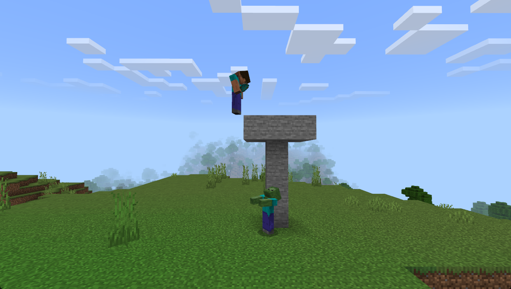
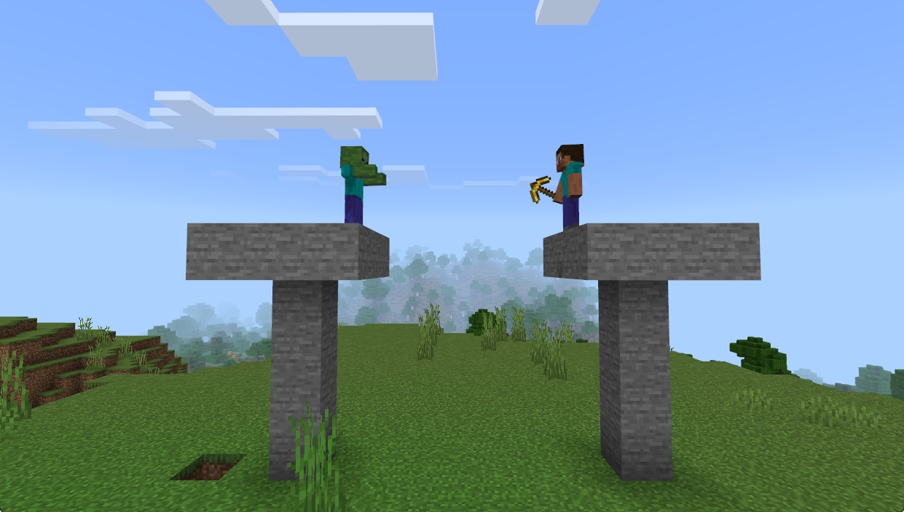

# 特殊行为-搭路

> 温馨提示：开始阅读这篇指南之前，我们希望你对《我的世界》基岩版附加包有一定了解，有能力撰写 JSON 数据格式，对 Python 进行模组开发有了解，并能够独立阅读《我的世界》开发者官网-开发指南或其他技术引用文档。

本文将修改**原版僵尸**的行为，实现一个可以在脚下搭路追击目标的功能。

在本教程中，您将学习以下内容。

- ✅自定义生物行为的实现；
- ✅搭路行为的实现；

请点击[这里](https://g79.gdl.netease.com/BuildRoads.zip)下载本章节课程的教学包

## 需要搭路的几种情况

原版僵尸的行为十分呆板，如果玩家躲藏到高空，那么原版的僵尸对于玩家来说几乎没有任何威胁。

所以为了增加游戏难度，我们来实现一下僵尸追击的功能。首先，第一个问题就是，如何检测什么时候应该执行搭路的行为呢？我们先来分析一波，理清思路。

### 存在高度差

最容易想到的一个情况就是实体跟目标之间存在高度差。因为在原版游戏中，如果我们与目标有一定的距离之后，目标会停留在我们的脚下驻足观望站在高处的我们：



在这种情况下，我们需要检测存在高度差，并且已经长时间驻足的情况。长时间驻足我们在上一节课中学习了，可以使用动画控制器 + `query.walk_distance` ，来完成。问题是**高度差如何检测**。

翻看原版组件之后发现并没有什么好的办法。所以不得不**使用自定义生物行为**了。

### 没有路

还有一种情况是，目标与实体之间不存在高度差，但就是没有路给实体过去：



这种情况如果不选择像我们之前课程介绍的那样切换飞行状态**飞过去**，那么也就只能搭路了。

不过也要考虑是不是被墙体阻隔，这是上节课的内容。我们这里只是提一下。

## 代码实现

经过上面的分析之后，写代码逻辑就很清晰了，完整代码如下：

```python
# coding=utf-8
import mod.server.extraServerApi as serverApi
from math import floor
from mod.common.utils.mcmath import Vector3

CustomGoalCls = serverApi.GetCustomGoalCls()
CompFactory = serverApi.GetEngineCompFactory()


class PutBlock(CustomGoalCls):
    def __init__(self, entityId, argsJson):
        super(PutBlock, self).__init__(entityId, argsJson)
        self.mEntityId = entityId
        self.mTimeCounter = 0
        #
        self.mDimensionId = CompFactory.CreateDimension(self.mEntityId).GetEntityDimensionId()

    # region 继承函数
    def CanUse(self):
        if self._HasTarget() and self._IsTargetAlive() and (self._CheckHeightDifferenceWithTarget() or self._CheckPathAheadForFooting()):
            return True
        return False

    def CanContinueToUse(self):
        return self.CanUse()

    def CanBeInterrupted(self):
        return True

    def Start(self):
        self.mTimeCounter = 0
        CompFactory.CreateCommand(self.mEntityId).SetCommand("/say 开始搭方块")

    def Stop(self):
        CompFactory.CreateCommand(self.mEntityId).SetCommand("/say 结束搭方块")

    def Tick(self):
        self.mTimeCounter += 1
        perSec = self.mTimeCounter % 20 == 0
        if perSec:
            self._PutBlockToTarget()

    # endregion

    # region 类函数
    def _HasTarget(self):
        #是否有仇恨目标
        comp = CompFactory.CreateAction(self.mEntityId)
        targetId = comp.GetAttackTarget()
        hasTarget = targetId != "-1"
        return hasTarget

    def _IsTargetAlive(self):
        comp = CompFactory.CreateAction(self.mEntityId)
        targetId = comp.GetAttackTarget()
        comp = CompFactory.CreateGame(serverApi.GetLevelId())
        alive = comp.IsEntityAlive(targetId)
        return alive

    # 检查与目标之间是否存在高度差
    def _CheckHeightDifferenceWithTarget(self):
        comp = CompFactory.CreateAction(self.mEntityId)
        targetId = comp.GetAttackTarget()

        targetPos = CompFactory.CreatePos(targetId).GetFootPos()
        selfPos = CompFactory.CreatePos(self.mEntityId).GetFootPos()
        heightDifference = abs(targetPos[1] - selfPos[1])

        return heightDifference >= 1.0  # 因为是获取的 FootPos，所以这里的 2 就是 2 个方块的高度

    # 检查前往目标的路径，脚下是否有路
    def _CheckPathAheadForFooting(self):
        blockInfoComp = CompFactory.CreateBlockInfo(self.mEntityId)
        aheadBlockPos = self._GetPathAheadForFootingBlockPos()
        blockDict = blockInfoComp.GetBlockNew(aheadBlockPos, self.mDimensionId)

        return not blockDict or blockDict['name'] == 'minecraft:air'

    # 获取前方脚下的方块位置（这个是不依赖导航，前往目标的最近位置）
    def _GetPathAheadForFootingBlockPos(self):
        comp = CompFactory.CreateAction(self.mEntityId)
        targetId = comp.GetAttackTarget()

        targetPosX, targetPosY, targetPosZ = CompFactory.CreatePos(targetId).GetFootPos()
        entityPosX, entityPosY, entityPosZ = CompFactory.CreatePos(self.mEntityId).GetFootPos()
        # 去掉 y 方向上的不同，因为我们是要检测的是目标前方脚下一格的位置
        diff = Vector3(targetPosX - entityPosX, 0, targetPosZ - entityPosZ).Normalized()
        result = (entityPosX + diff[0], entityPosY - 0.5, entityPosZ + diff[2])
        result = tuple(map(int, map(floor, result)))  # 把实体坐标转换成方块坐标
        return result

    # 向目标搭建搭建方块
    def _PutBlockToTarget(self):
        if self._CheckHeightDifferenceWithTarget():
            # 第一种情况：存在高度差，那么就需要实体自己跳一下，然后在脚下搭建一个方块
            self._JumpAndPutBlockOnFoot()
        else:
            # 第二种情况：那就是在前方搭建一个方块
            self._PutBlockToAheadFoot()

    def _JumpAndPutBlockOnFoot(self):
        resBlockPos = CompFactory.CreatePos(self.mEntityId).GetFootPos()
        resBlockPos = tuple(map(int, map(floor, resBlockPos)))  # 把实体坐标转换成方块坐标
        # 先把自己弹起来
        actionComp = CompFactory.CreateAction(self.mEntityId)
        actionComp.SetMobKnockback(0, 0, 0.65, 0.65, 1)

        # 需要等待实体跳起来之后再放置方块
        CompFactory.CreateGame(self.mEntityId).AddTimer(0.3, self._PutBlock, resBlockPos)

    def _PutBlockToAheadFoot(self):
        resBlockPos = self._GetPathAheadForFootingBlockPos()
        self._PutBlock(resBlockPos)

    def _PutBlock(self, resBlockPos):
        CompFactory.CreateBlockInfo(self.mEntityId).SetBlockNew(resBlockPos, {'name': "minecraft:stone"}, 0, self.mDimensionId)

    # endregion

```

代码量不大，里面有几个比较容易忽略的点。

- **实体坐标转换成方块坐标**：因为实体和方块使用的坐标体系不太一样，方块在 `x` 和 `z` 方向上会有 0.5 的偏移量，所以我们这里直接使用了诸如 `resBlockPos = tuple(map(int, map(floor, resBlockPos)))` 这样的代码来进行转换，不熟悉的同学可以直接记住这个方法；
- **计算方向向量**：我们使用了 `Vector3` 模块的 `Normalized` 函数，这个方法会返回长度为 1 时的标准向量。与之类似的有一个方法是 `Normalize`，区别在于前者是返回一个标准化后的向量，而后者没有返回，而是把 `a.Normalize()` 中的 `a` 给标准化。这是比较容易混淆和搞错的地方。

另外，上面的方法并没有检测实体长时间没有移动的情况，会导致实体在发现目标之后就直接开始检测是否需要搭方块，实际效果如下：


我们需要配合动画控制和上节课提到的 `query.walk_distance` 来让行为更合理。

### 动画控制器 + Molang 控制开始

先把我们的 `zombie.json` 文件给准备好，添加上对应的组件组和事件：

```json
{
    // 省略其他无关内容...
    "format_version": "1.16.0",
    "minecraft:entity": {
        "description": {
            "animations": {
                "put_block_sensor": "controller.animation.zombie.put_block"
            },
            "scripts": {
                "animate": [
                    {
                        // 只有在有目标的情况下才执行控制器的逻辑
                        "put_block_sensor": "query.has_target"
                    }
                ]
            }
        },
        "component_groups": {
            "putBlock": {
                "minecraft:behavior.python_custom:put_block": {
                    "priority": 1,
                    "module_path": "putBlockScripts.putBlock",
                    "class_name": "PutBlock",
                    "control_flags": ["move"]
                }
            },
        },
        "events": {
            // 自定义事件
            "tutorial:put_block": {
                "add": {
                    "component_groups": ["putBlock"]
                }
            },
            "tutorial:put_block_finished": {
                "remove": {
                    "component_groups": ["putBlock"]
                }
            }
        }
    }
}
```

我们控制器的逻辑也很简单，就是检测在长时间没有移动的情况下，加入 `putBlock` 组件组，尝试开始搭建方块，然后在工作一次之后进入冷却时间就行了：

```json
{
    "format_version": "1.10.0",
    "animation_controllers": {
        // 搭建方块的检测
        "controller.animation.zombie.put_block": {
            "initial_state": "default",
            "states": {
                "default": {
                    "on_entry": [
                        "/say start put block check...",
                        // 刚开始检测时的初始距离
                        "v.start_distance = query.walk_distance;",
                        // 需要检测的时间，游戏一帧是 20 帧，这里 x * 20 就是 x 秒
                        "v.time2check = query.time_stamp + 2 * 20;"
                    ],
                    "transitions": [
                        {
                            // 移动的距离足够短并且时间到了 tick 时间，条件满足则开始搭建方块
                            "start_put_block": "query.walk_distance - v.start_distance < 2 && query.time_stamp >= v.time2check"
                        },
                        {
                            // 不满足条件则进入冷却重新进入检测
                            "cooldown": "query.walk_distance - v.start_distance >= 1 && query.time_stamp >= v.time2check"
                        }
                    ]
                },
                "start_put_block": {
                    "on_entry": [
                        "/say start put block",
                        // 需要检测的时间，游戏一帧是 20 帧，这里 x * 20 就是 x 秒
                        // 这里工作时间设置成跟代码中一样的 1 秒时间，这样就刚好能工作一次
                        "v.time2check = query.time_stamp + 1 * 20;",
                        "@s tutorial:put_block"
                    ],
                    "on_exit": [
                        "@s tutorial:put_block_finished"
                    ],
                    "transitions": [
                        {
                            "cooldown": "query.time_stamp >= v.time2check"
                        }
                    ]
                },
                "cooldown": {
                    "on_entry": [
                        "/say put block in cooling",
                        // 需要检测的时间，游戏一帧是 20 帧，这里 x * 20 就是 x 秒
                        "v.time2cooldown = query.time_stamp + 1 * 20;"
                    ],
                    "transitions": [
                        {
                            "default": "query.time_stamp >= v.time2cooldown"
                        }
                    ]
                }
            }
        }
    }
}
```

加入之后测试，行为就正常多了：


## 小结

原版组件的性能始终是要更好的，所以多数情况下，我们会在原版组件实在是无法满足的时候才会使用自定义行为（为了图方便也不是不可以）。

并且会尝试使用动画控制器 + Molang 的混合方式，熟悉之后也就是思路的问题了。

## 课后作业

本次课后作业，内容如下：

- 尝试在 `_b/entities` 新增一个 `zombie.json` 文件，修改原版僵尸的行为，使其具备搭方块的行为；
- 打开客户端的调试功能，观察并测试；
