# 时间规则

> 温馨提示：开始阅读这篇指南之前，我们希望你对《我的世界》基岩版附加包有一定了解，有能力撰写 JSON 数据格式，对 Python 进行模组开发有了解，并能够独立阅读《我的世界》开发者官网-开发指南或其他技术引用文档。

本文将带你了解 MC 中的时间的问题，并从零开始带你搭建起一个基础的 UI 来帮助我们了解当前 MC 中的时间情况。

在本教程中，您将学习以下内容。

- ✅MC 中的时间规则；
- ✅简单 UI 搭建指南；

## MC 中的时间规则

> 这一部分可以查看 MC 的[官方介绍](https://zh.minecraft.wiki/w/%E6%98%BC%E5%A4%9C%E6%9B%B4%E6%9B%BF)。

## 时间换算

在我的世界中的时间正好是现实时间中**流逝速度**的 72 倍。这是因为现实世界中的 1 天有 24 * 60 = 1440 分钟，而在我的世界中，1 个完整的 Minecraft 天只有 20 分钟。1440 / 20 = 72，正好是 72 倍。

如果要进行时间单位的换算的话，那么可以得到下面两个表。

一个表是 Minecraft → 现实时间的换算表：

|  Minecraft时间   | Minecraft 刻 |        现实时间        |
| :--------------: | :----------: | :--------------------: |
|       1秒        |     0.27     |        0.0138秒        |
|      1分钟       |     16.6     |         0.83秒         |
|      1小时       |    1,000     |          50秒          |
|       1天        |    24,000    |         20分钟         |
|    1周（7天）    |   168,000    |        2.3小时         |
|  1个月（30天）   |   720,000    |         10小时         |
| 1年（365.25 天） |  8,766,000   | 121.75小时（5.072916天 |

另一个表是现实时间 → Minecraft 时间的换算表：

|     现实时间      |              Minecraft时间              |
| :---------------: | :-------------------------------------: |
| 1⁄20秒（1游戏刻） |                  3.6秒                  |
|        1秒        |            1分钟12秒（72秒）            |
|       10秒        |             12分钟（720秒）             |
|       50秒        |          1小时（60分，3600秒）          |
|       1分钟       |               1小时12分钟               |
|       1小时       |                   3天                   |
|        1天        |             2.4个月 = 72天              |
|        1周        |    约1.385年 ≈ 17个月 = 72周 = 504天    |
|       1个月       |    6年 = 72个月 ≈ 308.5周 = 2,160天     |
|        1年        | 72年 ≈ 876.5个月 ≈ 3,757周 ≈ 26,297.5天 |

## 游戏刻

你可以把游戏想象成一个巨大的机器，它需要不断地运转才能工作。MC 就是这样一个机器。就像时钟里的每个部件都要跟着钟摆的节奏一起动一样，游戏里的每个事情都要跟着游戏的节奏一起发生。我们把游戏的节奏叫做**游戏循环**，它就像是游戏的心跳。每次心跳，游戏就会更新一下自己的状态，比如玩家的位置，方块的变化，怪物的行动等等。我们把每次心跳的时间叫做一**刻（tick）**，它是游戏的最小时间单位。

游戏的一刻是指 Minecraft 的游戏循环运行一次所占用的时间。正常情况下，游戏固定以**每秒钟 20 刻**的速率运行，因此一刻的时间为 0.05 秒（50 毫秒，或一秒钟的二十分之一），使得游戏内的[一天](https://zh.minecraft.wiki/w/%E6%98%BC%E5%A4%9C%E6%9B%B4%E6%9B%BF)刚好持续 **24000 刻**，也就是 20 分钟。

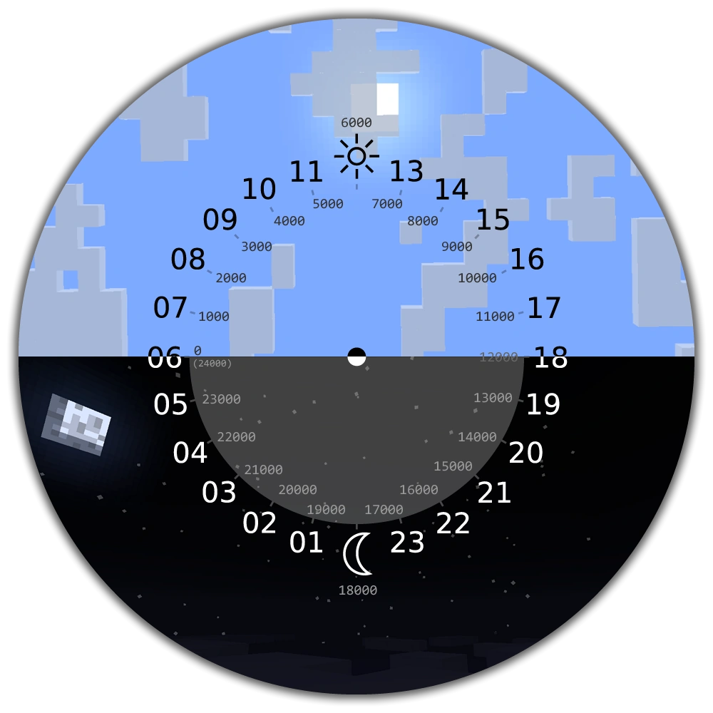

## 游戏中的时间

有了上面我们对 MC 时间的了解，加上时间刻与现实时间的换算关系，我们就知道了游戏中的一天是如何度过的了。

### 白天

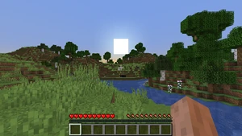

白天是一天周期中最长的一节，历时 10 分钟。

开始：0 刻（早上06:00:00.0）

中午：6000 刻（下午12:00:00.0）

结束：12000 刻（下午06:00:00.0）

### 日落

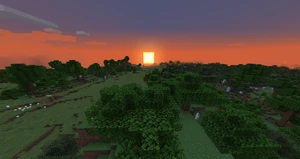

日落是介于白天和夜晚之间的时间段，持续 1 分半钟。

开始：12000 刻（下午06:00:00.0）

中点：12400 刻（下午06:54:00.0）

结束：13800 刻（下午07:48:00.0）

### 夜晚

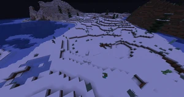

夜晚持续 7 分钟。

开始：13800 刻（下午07:48:00.0）

午夜：18000 刻（早上12:00:00.0）

结束：22200 刻（早上04:12:00.0）

> 晴朗的夜晚时，玩家可以在 12542 刻（下午06:32:31.2）到 23460 刻（早上05:27:36.0）时睡觉。在雨天，玩家可以在 12010 刻（下午06:00:36.0）到 23992 刻（早上05:59:31.2）时睡觉。

### 日出/黎明

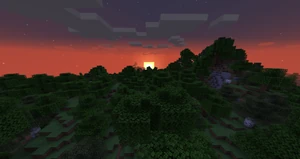

日出是介于夜晚和白天之间的时间段，持续 1 分半钟。

开始：22200 刻（早上04:12:00.0）

中点：23100 刻（早上05:06:00.0）

结束：24000（0）刻（早上06:00:00.0）

## 月相

游戏中每过一天，时间计数便会增加 24000 刻。虽然每天的交替是一样的，但[月亮](https://zh.minecraft.wiki/w/%E6%9C%88%E4%BA%AE)会经历 8 种月相。虽然没有命令直接更改月相，但`/time add 24000`命令可以快进至下一个月相。进一步而言，使用以下命令可以直接指定不同的月相：

| 命令               | 月相   |
| :----------------- | :----- |
| `/time set night`  | 满月   |
| `/time set 38000`  | 亏凸月 |
| `/time set 62000`  | 下弦月 |
| `/time set 86000`  | 残月   |
| `/time set 110000` | 新月   |
| `/time set 134000` | 娥眉月 |
| `/time set 158000` | 上弦月 |
| `/time set 182000` | 盈凸月 |

游戏中月亮的原版贴图，自行对应：

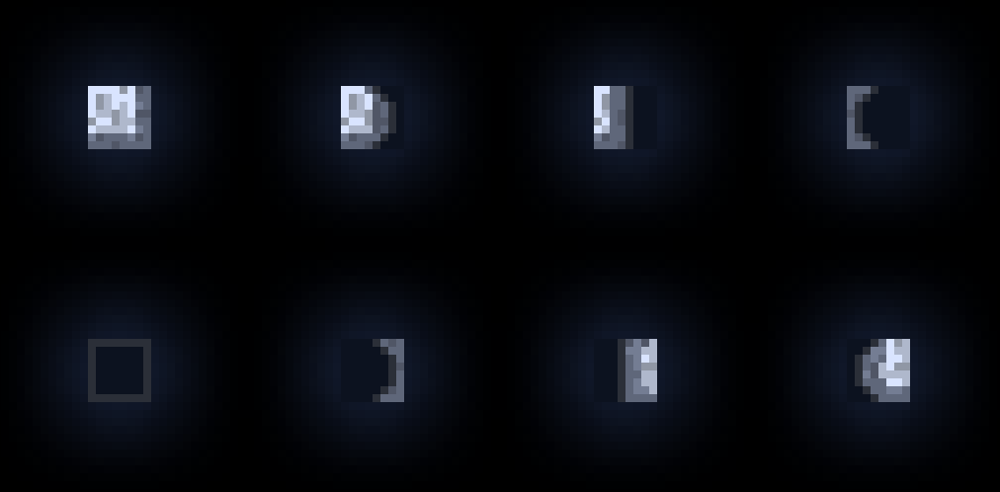

## 昼夜更替

如果开启了命令。我们可以使用 `/gamerule doDaylightCycle [*true/false*]` 来控制是否开启昼夜更替。

当我们关闭昼夜更替之后，游戏中的时间刻虽然会继续运行，但是数值上不会有所变动了，而是**固定在某一刻**。

## 时间相关的 API

我们可以在[官方的文档](https://mc.163.com/dev/mcmanual/mc-dev/mcdocs/1-ModAPI/%E6%8E%A5%E5%8F%A3/Api%E7%B4%A2%E5%BC%95%E8%A1%A8.html?catalog=1#%E6%97%B6%E9%97%B4)中查看到最新的、与时间相关的 API：

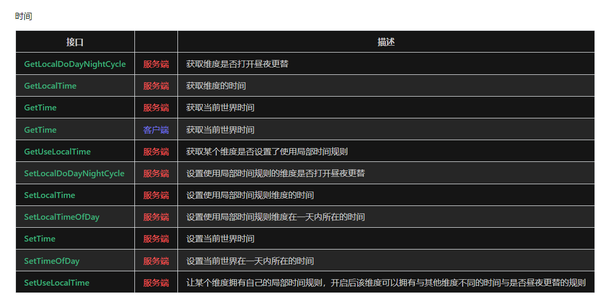

看着这么多，如果不算设置昼夜更替的 API 的话，其实总体就分为了两类：

- 获取时间类；
- 设置时间类；

不管是维度的局部时间，还是其他任何时间，都符合上面介绍的时间规则。

## 实操：左上角时钟 UI 显示

接下来我们将带大家实操制作一个 UI，能够实时显示当前维度的时间，效果如下：


### Step1. 新增界面文件

首先，打开我们的 MC Studio，在界面一览选择新建一个「界面文件」：

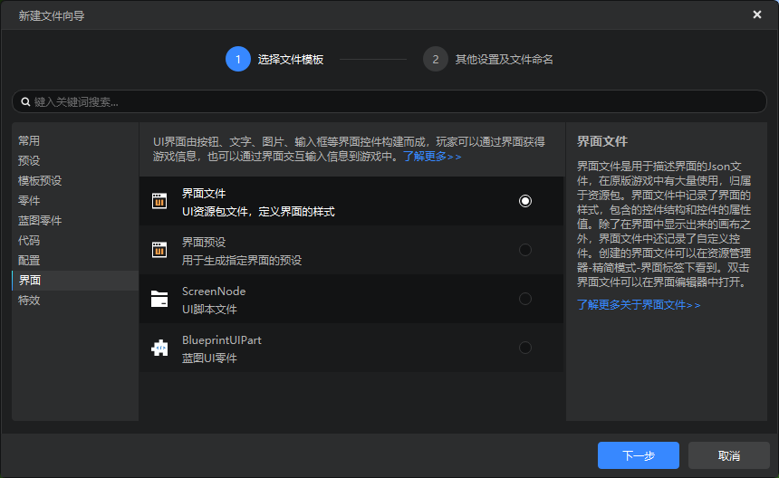

点击下一步之后命名为「timeDisplayUI」就可以了：

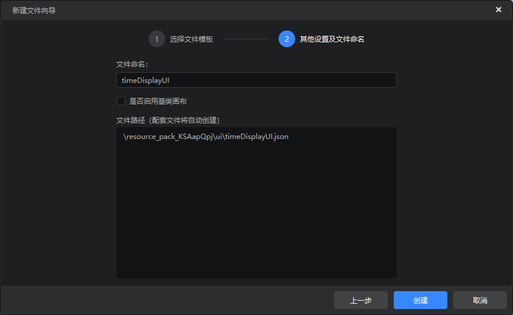

我们的需求很简单，只需要在界面的左上角，使用「文本」控件显示出当前维度的时间就可以了，所以整个界面也十分简单，一个「文本」控件，设置在左上方即可：

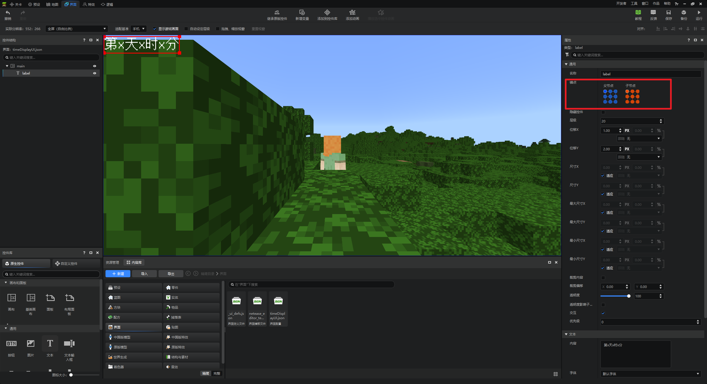

把文本大小选择为大，并且把层级设置在 20 层以上（保证在原版的 UI 上方，不会被遮挡），这样方便我们查看。

OK，界面文件就此告成。

### Step2. 注册 UI

注册和创建 UI 需要监听 `UiInitFinished` 之后执行：

```python
# -*- coding: utf-8 -*-
import mod.client.extraClientApi as clientApi

CompFactory = clientApi.GetEngineCompFactory()


class TimeRuleClientSystem(clientApi.GetClientSystemCls()):

    def __init__(self, namespace, name):
        super(TimeRuleClientSystem, self).__init__(namespace, name)
        self.ListenEvent()
        self.mUINode = None

    def ListenEvent(self):
        self.ListenForEvent(clientApi.GetEngineNamespace(), clientApi.GetEngineSystemName(), "UiInitFinished",
                            self, self.OnUiInitFinished)

    def UnListenEVent(self):
        self.UnListenForEvent(clientApi.GetEngineNamespace(), clientApi.GetEngineSystemName(), "UiInitFinished",
                              self, self.OnUiInitFinished)

    def Destroy(self):
        self.UnListenEVent()

    def OnUiInitFinished(self, args=None):
        # 注册 UI
        uiClsPath = 'timeRuleScripts.uIScripts.UIScript'
        uiScreenDef = 'timeDisplayUI.main'
        clientApi.RegisterUI('timeRuleMod', 'timeDisplayUI', uiClsPath, uiScreenDef)
        # 创建 UI
        self.mUINode = clientApi.CreateUI('timeRuleMod', 'timeDisplayUI', {"isHud": 1})
        if self.mUINode:
            self.mUINode.Init()  # 调用初始化函数
```

### Step3. UI 代码

UI 代码也非常简单，也就两个功能：1）每秒更新 `label` 的文字；2）把游戏时间转换成与现实世界对应的时间。

完整代码如下：

```python
# -*- coding: utf-8 -*-
import mod.client.extraClientApi as clientApi

ScreenNode = clientApi.GetScreenNodeCls()

CompFactory = clientApi.GetEngineCompFactory()
gameComp = CompFactory.CreateGame(clientApi.GetLevelId())


class UIScript(ScreenNode):
    def __init__(self, namespace, name, param):
        ScreenNode.__init__(self, namespace, name, param)
        self.mPlayerId = clientApi.GetLocalPlayerId()

        # 组件注册地址
        self.mLabelPath = '/label'

        # 界面需要使用的自定义属性
        self.mTimeCounter = 0

    def Create(self):
        print("===== UI Create =====")

    # 1 秒 30 帧
    def Update(self):
        self.mTimeCounter += 1
        perSec = self.mTimeCounter % 30 == 0
        if perSec:
            self.UpdateLabelContent()

    # region 类函数
    # --------------------------------------------------------------------------------------------
    def Init(self):
        print '=== UI 初始化 ==='
        self.UpdateLabelContent()

    def UpdateLabelContent(self):
        timeComp = CompFactory.CreateTime(clientApi.GetLevelId())
        pressedTime = timeComp.GetTime()
        timeStr = self.GameTime2RealTime(pressedTime)
        self.GetLabel(self.mLabelPath).SetText(timeStr)

    def GameTime2RealTime(self, gameTick):
        # 定义游戏中一天的刻数
        gameDayTicks = 24000
        # 定义游戏中一小时的刻数
        gameHourTicks = gameDayTicks / 24
        # 定义游戏中一分钟的刻数
        gameMinuteTicks = gameHourTicks / 60
        # 计算游戏中的天数
        gameDay = gameTick // gameDayTicks + 1
        # 计算游戏中的小时数
        gameHour = (gameTick % gameDayTicks) // gameHourTicks
        # 计算游戏中的分钟数
        gameMinute = (gameTick % gameHourTicks) // gameMinuteTicks
        # 把游戏中的小时数转换成现实中的小时数，加上6小时的偏移量
        realHour = (gameHour + 6) % 24
        # 把现实中的小时数、分钟数转换成字符串，补齐两位
        realHourStr = str(realHour).zfill(2)
        realMinuteStr = str(gameMinute).zfill(2)
        # 返回转换后的格式
        return "第{}天第{}时第{}分".format(gameDay, realHourStr, realMinuteStr)

    def GetLabel(self, path):
        control = self.GetBaseUIControl(path)
        if control:
            return control.asLabel()
        return None

    # endregion
```

### Step4. 测试并验证

我们可以尝试使用 `/time set xxx` 命令来设置当前的时间，来验证 UI 代码的正确性。比如 `/time set 0` 界面会正确显示上面规则介绍的 `06:00:00` 这个时间：

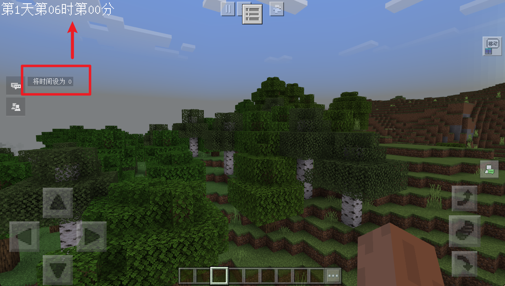

至此，UI 就完成了。

## 课后作业

本次课后作业，内容如下：

- 给模组左上角新增一个当前时间显示的 UI；
- 熟悉并测试时间相关的 API；
