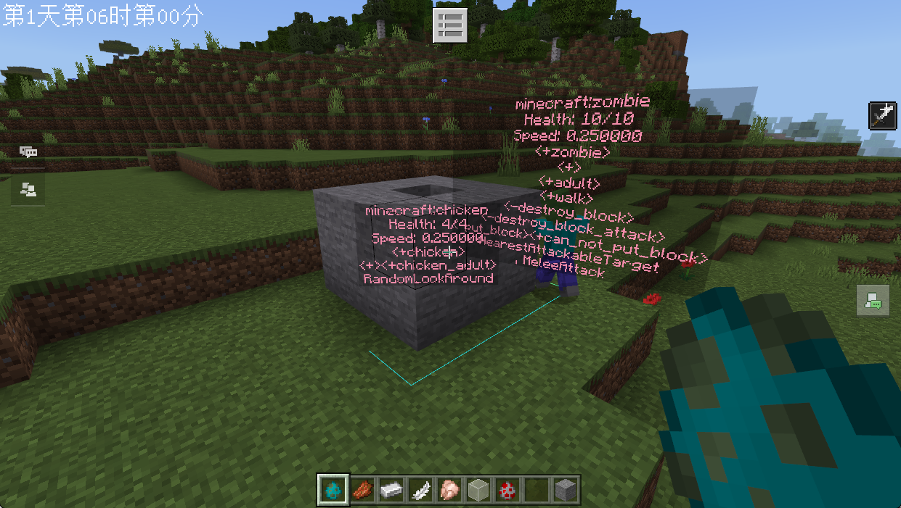
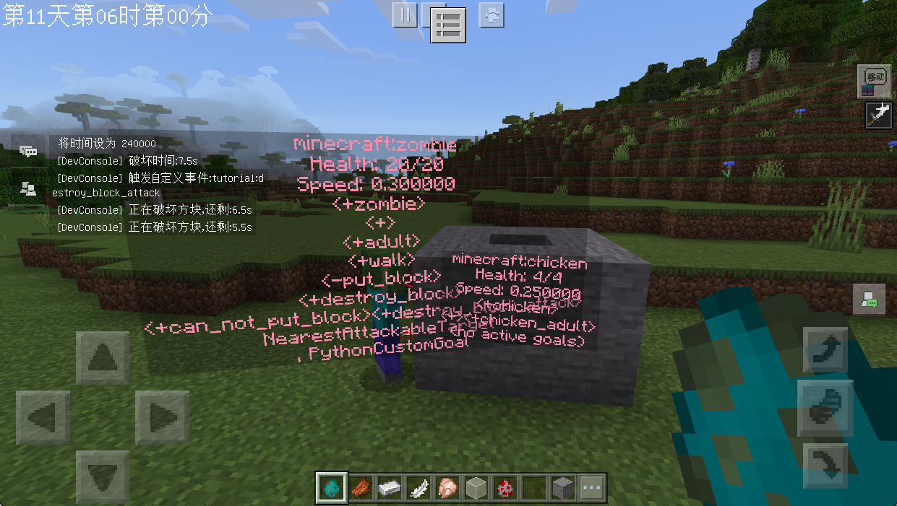
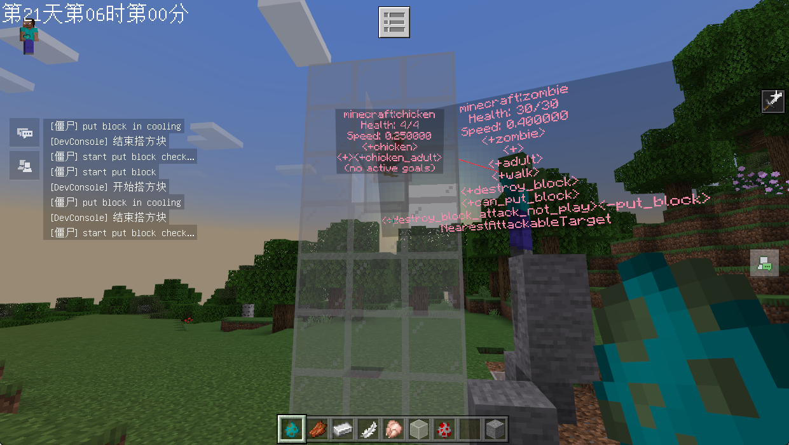

# 可成长的怪物体系

> 温馨提示：开始阅读这篇指南之前，我们希望你对《我的世界》基岩版附加包有一定了解，有能力撰写 JSON 数据格式，对 Python 进行模组开发有了解，并能够独立阅读《我的世界》开发者官网-开发指南或其他技术引用文档。

本文将带你了解怪物属性的 API，并结合之前学习的课程，带你搭建一个可跟随时间成长的超级僵尸。

## 成果演示

我们这节课将配合上一节课提到的时间规则，来实现一个可以跟随时间成长的超级僵尸，这个成长不仅仅是**属性上**的成长，还包括生物行为的丰富：

我们的需求很简单，先来简单梳理一下：


- 最开始就是普通的僵尸；
- 到游戏进行到第 10 天时，所有僵尸都拥有**破坏墙体**的能力；
- 到游戏进行到 20 天以后，所有僵尸除了拥有破坏墙体的能力之外，还拥有**搭路**的能力；

## 实践

要满足需求，这就需要对应改造一下我们的系统和我们的自定义僵尸，我们一步一步来。

### Step1. 改造 zombie 行为文件

我们首先要定义三种强度的僵尸事件，用来支持僵尸行为的变更，不过在此之前我们还要考虑一件事。

我们之前搭路的行为是直接在 `query.has_target` 之后就开始生效了，现在我们需要把这个行为做一个开关。最容易想到的办法就是像之前课程播放破坏方块动画的那样，使用一个用于设置状态的组件，比如我们使用 `minecraft:mark_variant`：

```json
// 省略其他无关内容
"minecraft:entity": {
    "description": {
        "animations": {
            "put_block_sensor": "controller.animation.zombie.put_block"
        },
        "scripts": {
            "animate": [
                {
                    // 只有在有目标的情况下，并且能够搭建方块时才执行控制器的逻辑
                    "put_block_sensor": "query.has_target && query.mark_variant == 1"
                }
            ]
        }
    },
    "component_groups": {
        // 搭建方块的能力
        "can_not_put_block": {
            "minecraft:mark_variant": {
                "value": 0
            }
        },
        "can_put_block": {
            "minecraft:mark_variant": {
                "value": 1
            }
        },
```

这样我们就可以使用组件组来标识该实体是否拥有该能力了。

然后定义好触发我们三种强度僵尸的事件：

```json
"events": {
    // 自定义的强度1：就是普通的僵尸
    "tutorial:zombie_level_1": {
        "add": {
            "component_groups": ["can_not_put_block"]
        },
        "remove": {
            "component_groups": ["destroy_block", "destroy_block_attack", "can_put_block", "put_block"]
        }
    },
    // 自定义强度2：能够拆墙，但是不能够铺路的僵尸
    "tutorial:zombie_level_2": {
        "add": {
            "component_groups": ["destroy_block", "can_not_put_block"]
        },
        "remove": {
            "component_groups": ["can_put_block", "put_block"]
        }
    },
    // 自定义强度3：既能够拆墙，又能够搭路的僵尸
    "tutorial:zombie_level_3": {
        "add": {
            "component_groups": ["destroy_block", "can_put_block"]
        },
        "remove": {
            "component_groups": ["can_not_put_block"]
        }
    }
```

至此，基础的 `zombie.json` 就改造完成了。

### Step2. 代码检测新的一天

核心代码如下：

```python
def __init__(self, namespace, name):
    super(TimeRuleServerSystem, self).__init__(namespace, name)
    self.ListenEvent()
    # 组件缓存，避免重复创建
    self.mTimeComp = CompFactory.CreateTime(serverApi.GetLevelId())
    #
    self.mTimeCounter = 0
    self.mLastDay = 0  # 上一次的天数，用来判断是否是新的一天
    self.mCurrentDay = 0  # 今天的天数

def Update(self):
    self.mTimeCounter += 1
    # 每一秒都检查
    if self.mTimeCounter % 30 == 0:
        self._TriggerZombieEventIfNewDay()

def _TriggerZombieEventIfNewDay(self):
    # 从游戏开始经过的总帧数
    passedTime = self.mTimeComp.GetTime()
    # 从游戏开始经过的游戏天数
    day = passedTime / 24000
    if day != self.mCurrentDay:
        self.mCurrentDay = day
    isNewDay = self.mLastDay != self.mCurrentDay
    self.mLastDay = self.mCurrentDay

    if isNewDay:
        self._ResetAllZombieLevel()
```

为了配合玩家可能使用的 `/time set` 指令，所以我们这里每一秒都检测一下是否是新的一天。如果满足条件，那么重置当前世界中所有的僵尸等级。

### Step3. 重置僵尸等级和属性函数

有了检测是否进入新一天的代码了，那么我们可以着手开始考虑僵尸的属性和能力了。

首先需要定义好等级对应的属性值，以及游戏天数和僵尸等级的对应关系：

```python
# 僵尸的标识符
ZombieIdentifier = 'minecraft:zombie'
# 僵尸的等级与天数的对应关系
ZombieLevelDay = {
    1 : 1,
    10: 2,
    20: 3
}
# 僵尸等级与僵尸属性的对应关系
ZombieLevelAttr = {
    1: {
        serverApi.GetMinecraftEnum().AttrType.HEALTH: 10,
        serverApi.GetMinecraftEnum().AttrType.SPEED : 0.25,
        serverApi.GetMinecraftEnum().AttrType.DAMAGE: 1
    },
    2: {
        serverApi.GetMinecraftEnum().AttrType.HEALTH: 20,
        serverApi.GetMinecraftEnum().AttrType.SPEED : 0.3,
        serverApi.GetMinecraftEnum().AttrType.DAMAGE: 2
    },
    3: {
        serverApi.GetMinecraftEnum().AttrType.HEALTH: 30,
        serverApi.GetMinecraftEnum().AttrType.SPEED : 0.4,
        serverApi.GetMinecraftEnum().AttrType.DAMAGE: 3
    }
}
```

由于我们保存了当前的游戏天数，所以很容易的写出重置一个僵尸的函数：

```python
def _SetEntityLevelAndAttrAccordCurrentDay(self, entityId):
    # 使用事件来触发对应僵尸的等级的行为
    zombieLevel = self._GetZombieLevelByDay(self.mCurrentDay)
    eventName = 'tutorial:zombie_level_' + str(zombieLevel)
    CompFactory.CreateEntityEvent(entityId).TriggerCustomEvent(entityId, eventName)
    # 根据僵尸等级来设置僵尸的属性值
    attrComp = CompFactory.CreateAttr(entityId)
    for _attrName, _attrValue in ZombieLevelAttr[zombieLevel].items():
        attrComp.SetAttrMaxValue(_attrName, _attrValue)
        attrComp.SetAttrValue(_attrName, _attrValue)

# 根据天数来获取当前僵尸等级
def _GetZombieLevelByDay(self, day):
    for threshold, level in sorted(ZombieLevelDay.items(), reverse=True):
        if day >= threshold:
            return level
    return 1  # 默认等级为1
```

重置所有僵尸，我们需要借助 [`serverApi.GetEngineActor()` API](https://mc.163.com/dev/mcmanual/mc-dev/mcdocs/1-ModAPI/%E6%8E%A5%E5%8F%A3/%E4%B8%96%E7%95%8C/%E5%AE%9E%E4%BD%93%E7%AE%A1%E7%90%86.html#getengineactor) 来完成：

```python
# 重置所有僵尸的等级
def _ResetAllZombieLevel(self):
    print '=====重置所有僵尸等级===='
    for entityId, entityDict in serverApi.GetEngineActor().items():
        for _dimensionId, _identifier in entityDict.items():
            if _identifier == ZombieIdentifier:
                self._SetEntityLevelAndAttrAccordCurrentDay(entityId)
```

### Step4. 考虑新增的僵尸

新增的僵尸也需要立刻适配当前世界天数对应的等级，这需要我们关注[实体新增的事件](https://mc.163.com/dev/mcmanual/mc-dev/mcdocs/1-ModAPI/%E4%BA%8B%E4%BB%B6/%E4%B8%96%E7%95%8C.html#addentityserverevent)，我们需要在代码中进行监听，当新增时自动触发对应的事件：

```python
def ListenEvent(self):
    self.ListenForEvent(serverApi.GetEngineNamespace(), serverApi.GetEngineSystemName(), "AddEntityServerEvent", self,
                        self.OnAddEntityServerEvent)

def UnListenEvent(self):
    self.UnListenForEvent(serverApi.GetEngineNamespace(), serverApi.GetEngineSystemName(), "AddEntityServerEvent", self,
                          self.OnAddEntityServerEvent)

def Destroy(self):
    self.UnListenEvent()

def OnAddEntityServerEvent(self, args):
    entityId = args['id']
    engineTypeStr = args['engineTypeStr']
    if engineTypeStr == ZombieIdentifier:
        self._SetEntityLevelAndAttrAccordCurrentDay(entityId)
```

### Step5. 测试并验证

首先，我们使用命令 `/time set 0`，可以看到僵尸对于在方块内的目标并没有任何办法，属性值和组件组也跟我们设定的一样：



然后，当使用命令 `/time set 240000` 把游戏进程过渡到第 10 天之后时，这时候僵尸属性值发生了变化，并且拥有了破坏墙体的能力：



当我们使用命令 `/time set 480000` 把游戏进程过渡到 20 天之后时，僵尸已经有能力击杀在高处的目标：



## 课后作业

本次课后作业，内容如下：

- 改造原版的 `zombie.json` 并配合上节课的时间管理系统来进行管理生物行为和属性值，达到一个跟随时间不断变强的僵尸。
