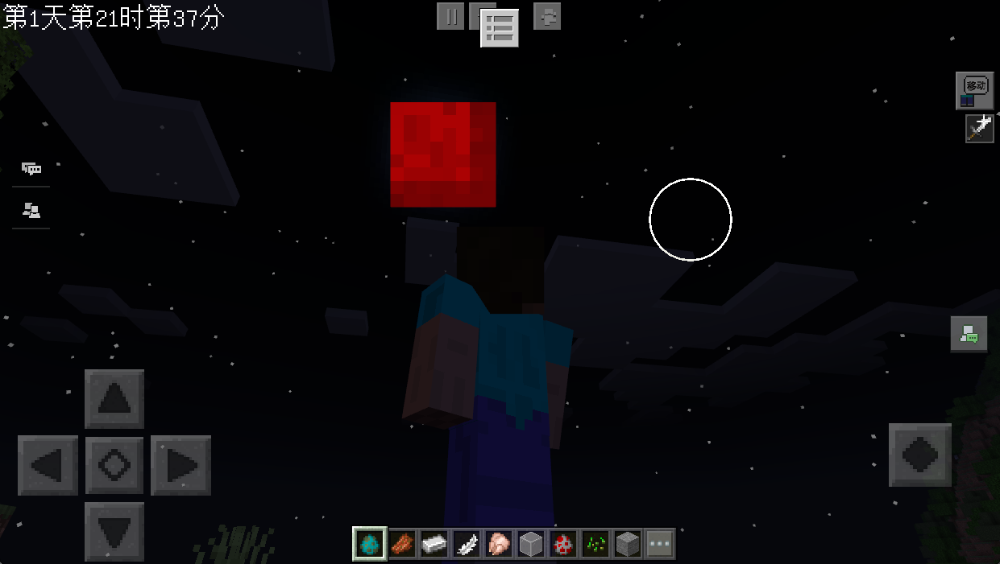
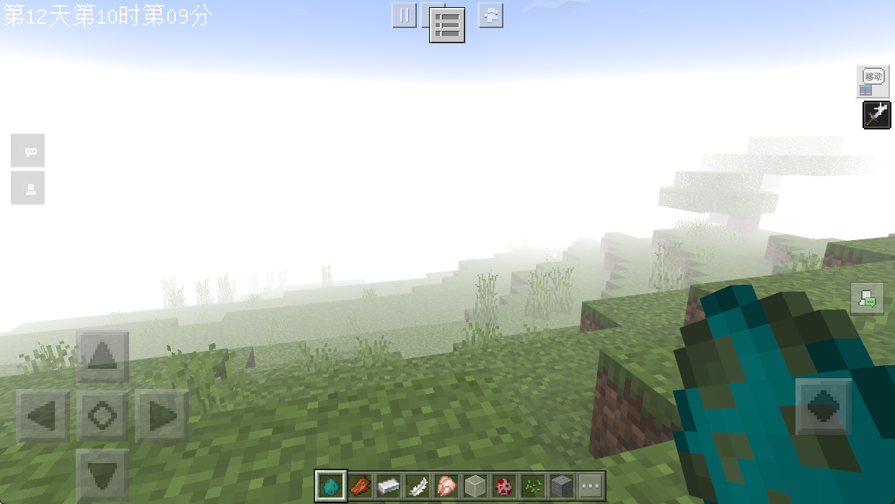
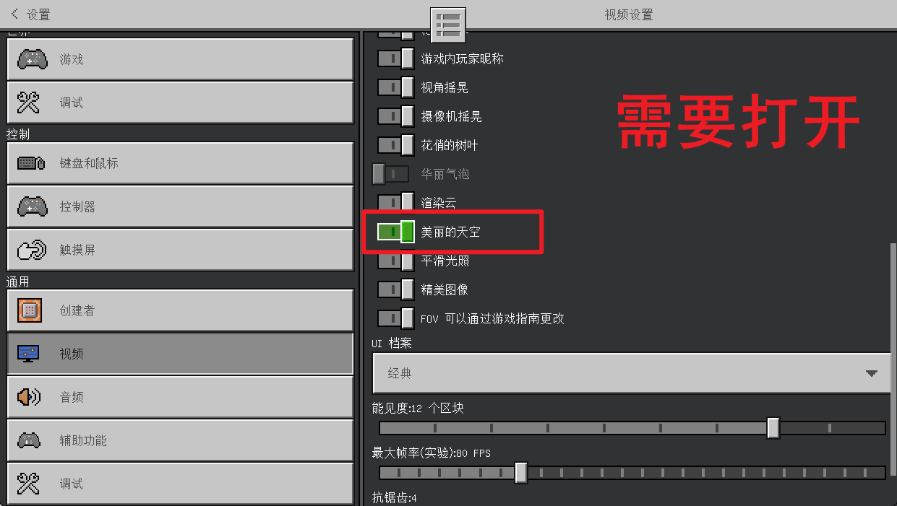
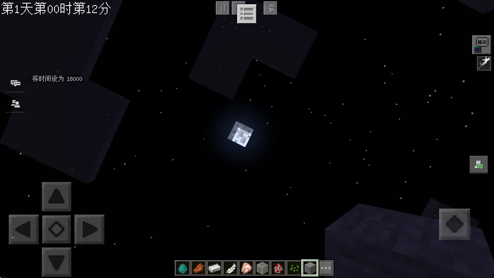
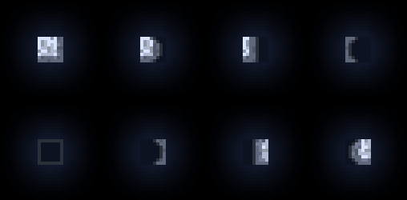
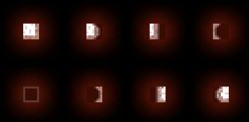
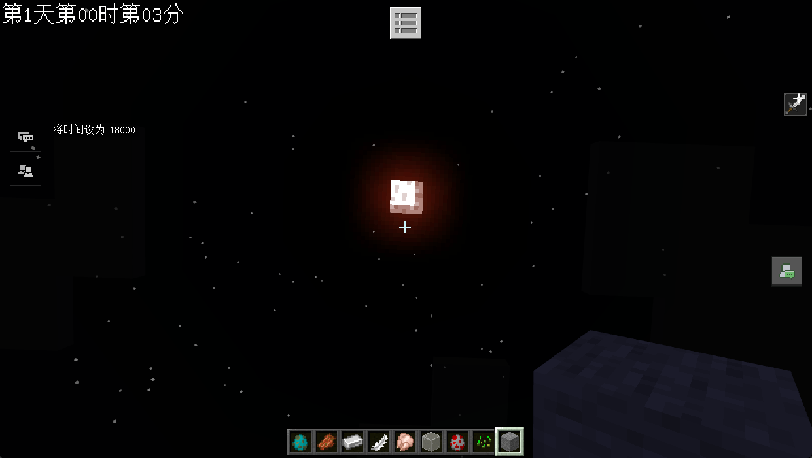
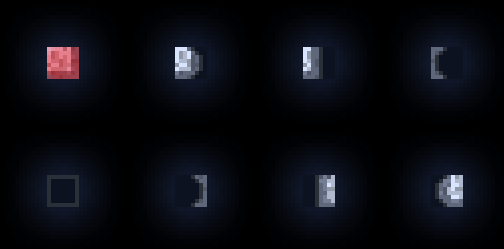
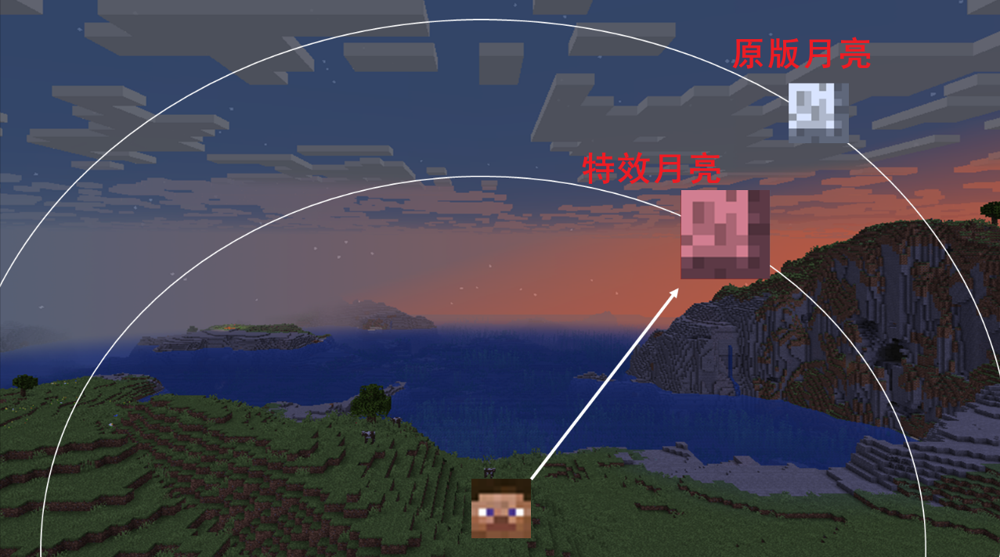
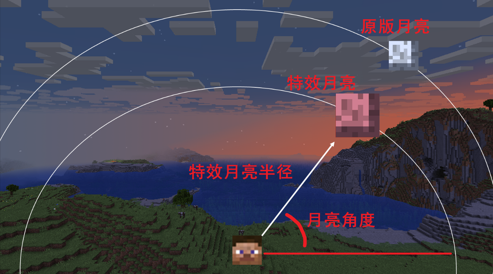

# 随机事件

> 温馨提示：开始阅读这篇指南之前，我们希望你对《我的世界》基岩版附加包有一定了解，有能力撰写 JSON 数据格式，对 Python 进行模组开发有了解，并能够独立阅读《我的世界》开发者官网-开发指南或其他技术引用文档。

本文将带你在时间管理系统存在的前提（之前的课程）下，来触发我们的自定义事件，一个是血月，一个是大雾天。

在本教程中，您将学习以下内容。

- ✅血月的实现原理；
- ✅雾天的实现原理；
- ✅原版粒子的进阶使用知识；

## 随机事件的规则

我们这一次课程要给我们的世界加入两种随机事件，一个是在晚上触发的血月：



另一个就是在白天触发的大雾天气：



并且他们会跟随游戏天数的增加而增加出现的概率。

### 触发逻辑

我们先来搭建最基础的部分，就是先触发这两种事件，然后再去实现具体的效果。

这两个事件我们可以换个角度来理解，都是需要在白天切换黑夜，黑夜切换白天的节点来判断触发的：

```python
def Update(self):
    self.mTimeCounter += 1
    # 每一秒都检查
    if self.mTimeCounter % 30 == 0:
        self._TriggerRandomEventIfNewDayOrNight()

# 在新的白天或者夜晚触发随机事件
def _TriggerRandomEventIfNewDayOrNight(self):
    # 从游戏开始经过的总帧数
    passedTime = self.mTimeComp.GetTime()
    previousTick = self.mCurrentTime
    self.mCurrentTime = passedTime

    # 计算当前时间位置
    currentTime = self.mCurrentTime % self.mTicksPerDay
    previousTime = previousTick % self.mTicksPerDay

    # 检查是否发生了昼夜交替
    if currentTime < (self.mTicksPerDay / 2) <= previousTime:
        self._HandleNightToDayTransition()
    elif currentTime >= (self.mTicksPerDay / 2) > previousTime:
        self._HandleDayToNightTransition()

    # 更新白天/夜晚状态
    self.mCurrentTimeIsDayTime = currentTime < (self.mTicksPerDay / 2)
```

## 血月的实现

首先，我们需要在「设置」→ 「视频」里面把「美丽的天空」选项打开：



这样才能在晚上看见月亮：



进一步的，我们想要把这个月亮给变成红色的呢，有以下几种思路。

### 修改原版资源

原版所有的资源文件，几乎都支持更改，包括不局限于：原版生物行为、动画、控制器、贴图文件等。月亮当然也不例外。

原版资源下的月亮位于目录：`\data\resource_packs\vanilla\textures\environment\moon_phases.png`，截图如下：



我们想要修改资源，直接复制一份原版的，然后修改保存到**现项目**资源文件下的 `textures/environment/moon_phases.png` 就行了。

不过直接修改有一个问题，假如我们把原版资源修改成了这样（别在意颜色...）：



你会发现即使不是血月（特定时间）的晚上，也会是血月：



因为这个贴图不支持动态更改，意味着改了的话，在加载模组的情况下，就没有办法再进行动态的变更和改动了。

没办法，我们又只能曲线救国了。既然月亮的贴图是能变的，我们之前也介绍过**月相**的这个概念，我们的思路就有了。

我们只让满月的贴图变成血月：



其他的月相不变，然后让时间在某一个周期内循环，比如 24000 刻到 48000 刻（也就是第二天），只有血月的时候才在第一个周期内运行。这样就达到要求了。

但为此，我们需要对应改造我们的时间管理系统，也需要对天数进行对应的存档（因为存档在某一天内一直循环）。存档的天数也需要同步到客户端进行显示。

还可能会影响原版掠夺者的生成（原版掠夺者会在 5.5 个游戏日后距离任一玩家 24 到 48 格生成）。

所以我们这里只提一下思路。具体的实现，大家感兴趣的话，可以在自己的模组中，自行尝试一下。

### 使用特效遮住月亮

我们来介绍一个比较特别的方法，那就是用特效来遮住月亮：



这有助于提高我们对原版粒子的理解和认识。

能这么做有几个重要的前提：

- √ 玩家和月亮贴图之间存在相当的距离；
- √ 我们可以获取月亮的角度；
- √ 特效可以绑定在实体身上，跟随实体实时运动；
- √ 我们可以通过自定义的变量来实时改变和控制特效的位置来遮挡住原版的月亮；

#### Step 1. 制作一个血月的贴图

首先，我们用软件制作一个血月的贴图：


并放置在资源文件下（`资源包/textures/particle/blood_moon.png`）备用。

#### Step 2. 在玩家身上绑定一个粒子动画

我们先来创建一个绑定在玩家身上播放的动画：

```json
{
    "format_version": "1.8.0",
    "animations": {
        "animation.blood_moon.play": {
            "loop": true,
            // 设置一个足够短的时间，让它以非常快的速度刷新用来遮挡原本的月亮
            "animation_length": 0.01,
            "particle_effects": {
                "0.0": [
                    {
                        "effect": "blood_moon",
                        // 我们这里绑定一个未知的 locator 这会默认绑定在玩家的 body 骨骼组上
                        "locator": "unknown"
                    }
                ]
            }
        }
    }
}
```

这个动画文件设置成循环播放，这样我们可以持续播放这个带有粒子的动画；

我们同时也需要使用 API 在客户端在玩家的渲染器中增加上述的动画：

```python
# -*- coding: utf-8 -*-
# ...省略了其他无关内容...
import mod.client.extraClientApi as clientApi

CompFactory = clientApi.GetEngineCompFactory()


class TimeRuleClientSystem(clientApi.GetClientSystemCls()):

    def __init__(self, namespace, name):
        super(TimeRuleClientSystem, self).__init__(namespace, name)
        self.ListenEvent()

    def ListenEvent(self):
        self.ListenForEvent(clientApi.GetEngineNamespace(), clientApi.GetEngineSystemName(), "AddPlayerCreatedClientEvent",
                            self, self.OnAddPlayerCreatedClientEvent)

    def OnAddPlayerCreatedClientEvent(self, args):
        playerId = args['playerId']
        if playerId == clientApi.GetLocalPlayerId():
            self.InitRender()

    # 初始化绑定，给玩家绑定上血月的相关 query.mod.xx 变量和相关动画
    def InitRender(self):
        queryVariableComp = CompFactory.CreateQueryVariable(clientApi.GetLocalPlayerId())
        queryVariableComp.Register("query.mod.moon_rot", 0)
        queryVariableComp.Register("query.mod.play_blood_moon", 0)
        # 测试，默认播放血月效果
        queryVariableComp.Set("query.mod.play_blood_moon", 1)

        actorRenderComp = CompFactory.CreateActorRender(clientApi.GetLocalPlayerId())
        actorRenderComp.AddPlayerParticleEffect("blood_moon", "tutorial:blood_moon")
        actorRenderComp.AddPlayerAnimation("play_blood_moon", "animation.blood_moon.play")
        actorRenderComp.AddPlayerScriptAnimate("play_blood_moon", "query.mod.play_blood_moon")
        res = actorRenderComp.RebuildPlayerRender()

```

#### Step 3. 特效文件

通过查阅官方 API，我们可以通过 `GetMoonRot` 获取到月亮的角度，那么就简单了。

我们通过观察可以发现，昼夜交替中的太阳月亮是只会在 x 轴上移动的，它们的移动轨迹近似于一个圆形：


那么已知了月亮的角度，那么只需要知道半径就可以计算出月亮当前的位置了：



假如月亮半径是 `variable.distance` 的话，那么很容易得出某一个具体的时间节点，月亮粒子的 x、y、z 位置应该如下：

```json
"minecraft:emitter_shape_point": {
    "offset": ["math.sin(query.mod.moon_rot) * variable.distance", "math.cos(query.mod.moon_rot) * variable.distance", 0]
}
```

- x：`math.sin(query.mod.moon_rot) * variable.distance`，就是 `sin` 函数乘以半径；
- y：`math.cos(query.mod.moon_rot) * variable.distance`，就是 `cos` 函数乘以半径；
- z：由于没有偏移，所以始终是 0

所以完整的粒子文件如下：

```json
{
    "format_version": "1.10.0",
    "particle_effect": {
        "description": {
            "identifier": "tutorial:blood_moon",
            "basic_render_parameters": {
                "material": "particles_blend",
                "texture": "textures/particle/blood_moon"
            }
        },
        "components": {
            "minecraft:emitter_local_space": {
                "position": true,
                "rotation": false
            },
            "minecraft:emitter_initialization": {
                "creation_expression": "variable.distance = 140;"
            },
            "minecraft:emitter_rate_steady": {
                // 用一个足够快的速度来产生粒子
                "spawn_rate": 200,
                // 限制最大的粒子数，避免造成卡顿
                "max_particles": 1
            },
            "minecraft:particle_lifetime_expression": {
                "max_lifetime": 0.01
            },
            "minecraft:emitter_lifetime_once": {
                "active_time": 0.01
            },
            "minecraft:emitter_shape_point": {
                "offset": ["math.sin(query.mod.moon_rot) * variable.distance", "math.cos(query.mod.moon_rot) * variable.distance", 0]
            },
            "minecraft:particle_appearance_billboard": {
                "size": [14, 14],
                "facing_camera_mode": "lookat_xyz",
                "uv": {
                    "texture_width": 128,
                    "texture_height": 128,
                    "uv": [0, 0],
                    "uv_size": [128, 128]
                }
            },
            "minecraft:particle_appearance_tinting": {
                "color": [1, 0, 0, 1]
            }
        }
    }
}
```

这里有一个**需要注意**的点，就是 `minecraft:emitter_local_space` 组件。它定义了是否使用实体的局部空间变量，`position` 和 `ratation` 分别是对应了「是否使用实体**局部坐标**」和「是否使用实体**局部旋转**」。

由于我们需要以玩家为中心来播放粒子，所以 `position` 为 `true`，而局部旋转则不需要，如果我们这里的 `rotation` 为 `true` 的话，就会出现粒子跟随玩家身体朝向来转动的效果：


#### Step 4. 把月亮角度传入 `query.mod.moon_rot`

为了缓解客户端的压力，我们每 3 帧更新一次 `query.mod.moon_rot` 的值：

```python
# -*- coding: utf-8 -*-
# 省略了其他无关的内容...
import mod.client.extraClientApi as clientApi

CompFactory = clientApi.GetEngineCompFactory()


class TimeRuleClientSystem(clientApi.GetClientSystemCls()):

    def __init__(self, namespace, name):
        super(TimeRuleClientSystem, self).__init__(namespace, name)
        self.mTimeCounter = 0
        #
        self.mSkyRenderComp = CompFactory.CreateSkyRender(clientApi.GetLevelId())
        self.mQueryVariableComp = CompFactory.CreateQueryVariable(clientApi.GetLocalPlayerId())

    def Update(self):
        self.mTimeCounter += 1
        if self.mTimeCounter % 3 == 0:
            moonRot = self.mSkyRenderComp.GetMoonRot()[2]
            self.mQueryVariableComp.Set('query.mod.moon_rot', moonRot)
```

#### Step 5. 测试效果

一切准备好之后，我们重新打开客户端进入游戏，输入指令 `/time set 11990` （11990 是一个足够接近月亮升起的时间，可以观察月亮升起的全过程）。

游戏效果如下：


## 雾天的实现

雾天的实现比较简单，基本上就依靠 `SetFogLength()` API 就可以了。比如在调试工具中运行下列代码：
```python
import mod.client.extraClientApi as clientApi
levelId = clientApi.GetLevelId()
comp = clientApi.GetEngineCompFactory().CreateFog(levelId)
comp.SetFogLength(0.1, 32)
```

就可以实现比较好的雾天的效果：


## 服务端客户端改造

至此，我所有客户端的效果都改造完成了，我们只需要有对应的事件来触发客户端的渲染就可以了。

客户端代码：

```python
# -*- coding: utf-8 -*-
# 省略了无关内容....
import mod.client.extraClientApi as clientApi

CompFactory = clientApi.GetEngineCompFactory()


class TimeRuleClientSystem(clientApi.GetClientSystemCls()):

    def __init__(self, namespace, name):
        super(TimeRuleClientSystem, self).__init__(namespace, name)
        self.ListenEvent()
        self.mQueryVariableComp = CompFactory.CreateQueryVariable(clientApi.GetLocalPlayerId())
        self.mFogComp = CompFactory.CreateFog(clientApi.GetLevelId())

    def ListenEvent(self):
        # 自定义事件
        self.ListenForEvent("timeRuleMod", "timeRuleServerSystem", "BloodMoonEvent", self, self.OnBloodMoonEvent)
        self.ListenForEvent("timeRuleMod", "timeRuleServerSystem", "FoggyWeatherEvent", self, self.OnFoggyWeatherEvent)

    def OnBloodMoonEvent(self, args):
        flag = args['flag']
        self.mQueryVariableComp.Set('query.mod.play_blood_moon', 1 if flag else 0)

    def OnFoggyWeatherEvent(self, args):
        flag = args['flag']
        self._FoggyWeather(flag)

    def _FoggyWeather(self, isOpen):
        if isOpen:
            self.mFogComp.SetFogLength(0.1, 32)
        else:
            self.mFogComp.ResetFogLength()

```

服务端代码：

```python
# -*- coding: utf-8 -*-
# 省略了无关内容...
import mod.server.extraServerApi as serverApi
import random

CompFactory = serverApi.GetEngineCompFactory()

class TimeRuleServerSystem(serverApi.GetServerSystemCls()):
    def __init__(self, namespace, name):
        super(TimeRuleServerSystem, self).__init__(namespace, name)
        #
        self.mIsBloodMoon = False  # 是否开启了血月
        self.mIsFoggyWeather = False  # 是否开启了大雾天气

    # region 类函数
    # --------------------------------------------------------------------------------------------
    def _HandleDayToNightTransition(self):
        self._CloseDayEvent()
        self._TriggerNightEvent()

    def _CloseDayEvent(self):
        if self.mIsFoggyWeather:
            # 让客户端关闭大雾天气渲染
            self.BroadcastToAllClient("FoggyWeatherEvent", {'flag': False})
            self.mIsFoggyWeather = False

    def _TriggerNightEvent(self):
        if random.random() < self._GetEventProbability():
            # 通知全部玩家
            CompFactory.CreateCommand(serverApi.GetLevelId()).SetCommand("/title @a title §c血月降临!!")
            self.mIsBloodMoon = True
            # 让客户端渲染血月
            self.BroadcastToAllClient("BloodMoonEvent", {'flag': True})

    def _HandleNightToDayTransition(self):
        self._CloseNightEvent()
        self._TriggerDayEvent()

    def _CloseNightEvent(self):
        if self.mIsBloodMoon:
            # 让客户端关闭血月渲染
            self.BroadcastToAllClient("BloodMoonEvent", {'flag': False})
            self.mIsBloodMoon = False

    def _TriggerDayEvent(self):
        if random.random() < self._GetEventProbability():
            CompFactory.CreateCommand(serverApi.GetLevelId()).SetCommand("/title @a title 大雾天气!!")
            # 通知客户端渲染大雾天气
            self.BroadcastToAllClient("FoggyWeatherEvent", {'flag': True})
            self.mIsFoggyWeather = True

    # 触发事件的概率。随天数的增加，概率逐渐增高，最多为 0.9，最少为 0.1
    def _GetEventProbability(self):
        return min(0.9, (0.1 + (self.mCurrentDay / 100.0)))

    # endregion
```

对于血月更多实体的生成，我们复用上一节课的代码加上一点判断就行了：

```python
# 省略掉其他无关内容
# 僵尸的数量限制
ZombieLimit = 100

class TimeRuleServerSystem(serverApi.GetServerSystemCls()):
    def Update(self):
        self.mTimeCounter += 1
        # 每一秒都检查
        if self.mTimeCounter % 30 == 0:
            # 血月的时候会检测生成更多的实体
            if not self.mCurrentTimeIsDayTime and self.mIsBloodMoon:
                self.SpawnZombieAroundPlayer()

    def SpawnZombieAroundPlayer(self):
        # 需要先检查当前世界上的僵尸数量
        if self.CurrentZombieNum() <= ZombieLimit:
            randomPlayerId = random.choice(serverApi.GetPlayerList())
            self.SpawnEntityAround(randomPlayerId, ZombieIdentifier, 10)	# 一次性生成 10 个，吓死玩家

    def CurrentZombieNum(self):
        count = 0
        for entityId, entityDict in serverApi.GetEngineActor().items():
            for _dimensionId, _identifier in entityDict.items():
                if _identifier == ZombieIdentifier:
                    count += 1
        return count
```

## 课后作业

本次课后作业，内容如下：

- 在本地还原血月和大雾天气的效果；
- 结合时间管理系统，在昼夜更替的时候概率触发；
