# 制作3D武器

> 温馨提示：开始阅读这篇指南之前，我们希望你对《我的世界》基岩版附加包有一定了解，有能力撰写 JSON 数据格式，并能够独立阅读《我的世界》开发者官网-开发指南或其他技术引用文档。

本文将帮助你从零开始创建一把属于自己的 3D 武器，包含第一、第三人称动画。

本文假定你熟悉 Molang、渲染控制器、动画和实体定义有基本的了解。本文不涉及美术资源的相关教程，如果对此感兴趣的同学可以自行学习和了解。

在本教程中，您将学习以下内容。

- ✅3D 武器的两种实现方式和原理；
- ✅3D 武器第一人称和第三人称动画的制作；

## 成果展示

通过本节课的学习，我们会逐步实现下列的一把自定义武器，拥有第一人称和第三人称的完整动画：


## 3D 武器的两种实现方式

我们先在 MC Studio 官方的内容库中“偷"一个 3D 武器的模型来使用，我这里选择的是下图所示的包：

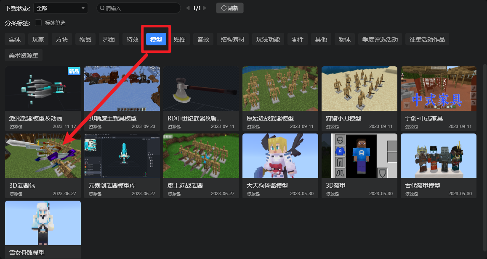

我们随便选择其中一个模型吧，比如下面这个：

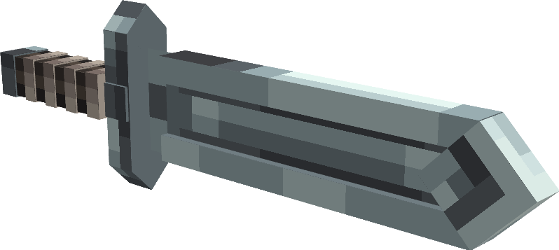

### 方法1：作为玩家的额外骨骼

第一种方法就是作为玩家的**额外骨骼**，挂接到玩家的渲染控制器上去。这种方法非常适合用于**仅涉及单一类型的实体**（比如玩家）模型，并且仅涉及一个装备位置的情况。这种方法也非常适合和方便在 Blockbench 中查看效果。

#### Step 1.对应玩家骨骼建模并对齐

首先我们需要对武器进行建模操作，当然我们这里直接使用了内容库中的内容，就不展开了。

然后需要**对应玩家的骨骼**进行**对齐**操作，如果我们不对默认的玩家骨骼进行修改，那么原版的玩家骨骼位置位于本地客户端的如下目录：`\data\skin_packs\vanilla\geometry.json`。我们如果使用 Blockbench 打开会发现该文件下有三个模型：

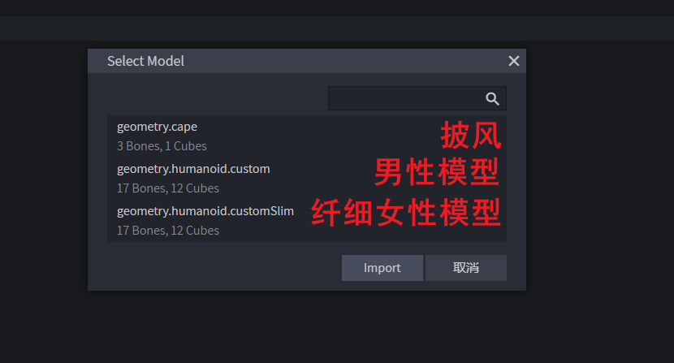

我们打开任一玩家模型就可以了，一般来说我们选择**纤细模型**，因为手臂模型更细，更需要对齐处理避免穿模。

接下来，我们只需要把我们的武器模型放在 `rightItem` 骨骼组下并对齐，这样就能完美的继承玩家的骨骼：

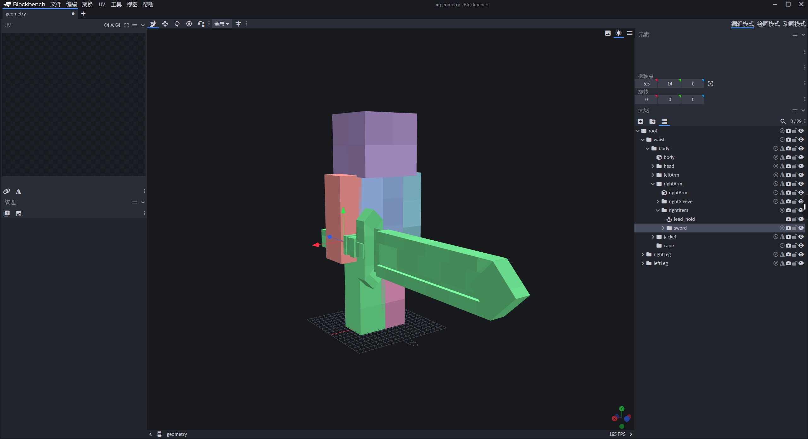

> 注意：我们操作的时候最好把原版骨骼复制一份，再在复制文件上进行操作。这样能避免误操作，对原版文件造成不必要的影响。

为了方便我们后续制作动画，我们需要把这个对齐好的模型先保存在一个临时目录下。

导出骨骼文件只需要把武器无关的骨骼全部删除掉就行了（删掉人物骨骼）：

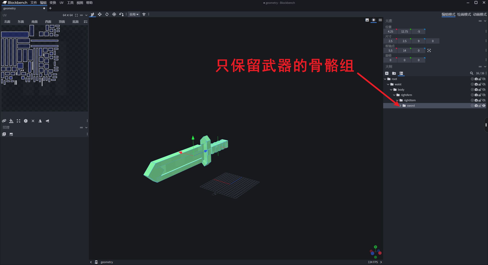

#### Step 2. 创建动画

如果我们需要自定义的攻击动作，那么我们就需要创建两个动画：一个是用于第三人称播放的人物动画，一个是用于第一人称播放的武器动画。

##### 第三人称动画

第三人称的动画很简单，就利用上面对齐好骨骼并且带有完整人物模型的直接 k 就行了，这里我们简单 k 一个只带手臂动作的简单动画：


这个动画只对 `rightArm` 和武器的根骨骼组 `sword` 进行了处理。

可以看到，由于我们这里有完整的骨骼和骨骼组，所以在 k 第三人称动画的时候非常方便。可以直接看到完整的效果。

##### 第一人称动画

但是第一人称就有点麻烦了。首先，我们隐藏掉所有的玩家骨骼（因为第一人称这些骨骼都是隐藏掉的）。

然后需要在 BlockBench **模拟游戏中第一人称的视角**。

第一步，在场景中右键，选择「保存相机角度」的选项：

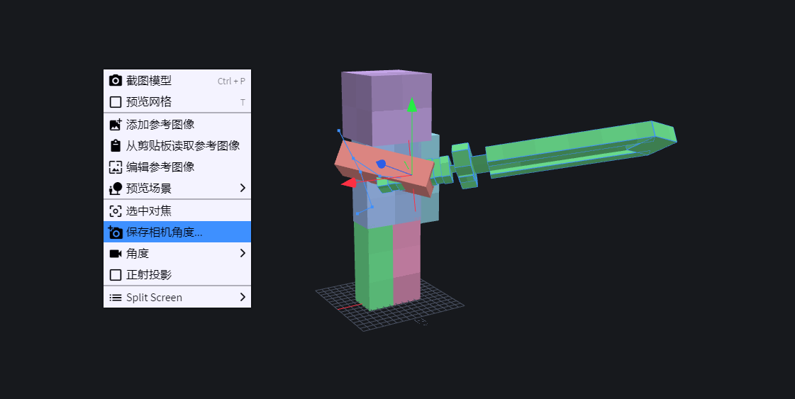

填入下图中的数据保存：

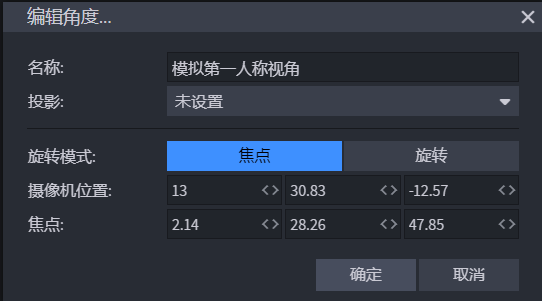

然后我们再「角度」中选择刚才保存好的相机视角：

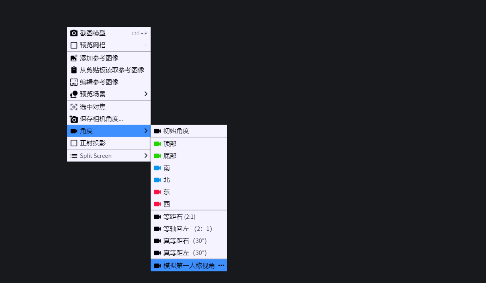

这是在模拟第一人称下的相机选项，但你会发现什么东西都看不见了，因为原版的游戏在第一人称时，手臂还会附加一个特殊的动画。

所以第二步，我们添加一个自定义的动画来模拟第一人称下手臂的位置：

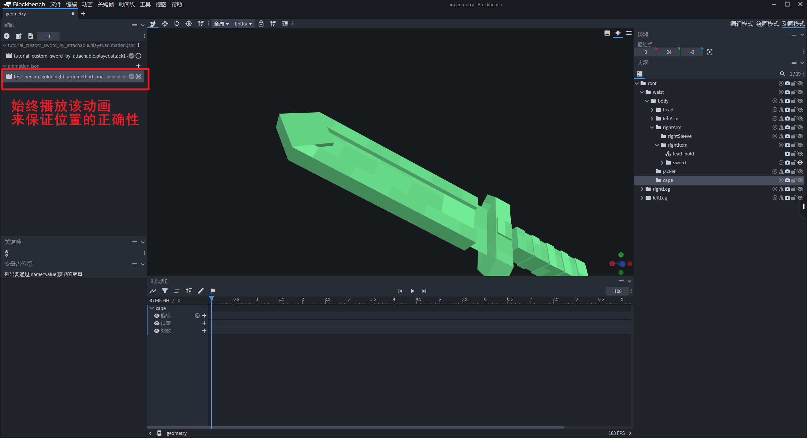

该动画文件如下：

```json
{
	"format_version": "1.8.0",
	"animations": {
		"animation.first_person_guide.right_arm.method_one": {
			"loop": true,
			"bones": {
				"rightArm": {
					"rotation": [95, -45, 115],
					"position": [13.5, -10, 12]
				},
				"rightItem": {
					"position": [0, 0, -1]
				}
			}
		}
	}
}
```

至此，我们就模拟好了第一人称下的武器位置。我们需要创建两个动画，第一个用于修正第一人称下的握持位置，第二个则是模拟第一人称下的攻击路径。

修正动画效果：

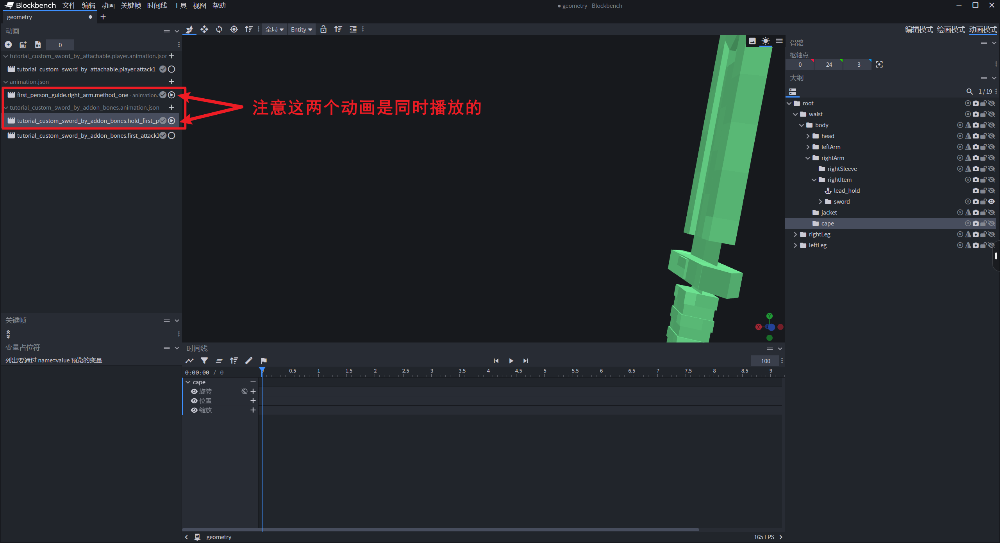

> 提醒：只需要点击动画右边的圆圈就可以同时播放多个动画了哦。

我们在 k 攻击动画的时候，需要同时把上述的「第一人称手臂模拟动画」和「第一人称握持修正动画」打开，再开始 k，这是麻烦的地方：


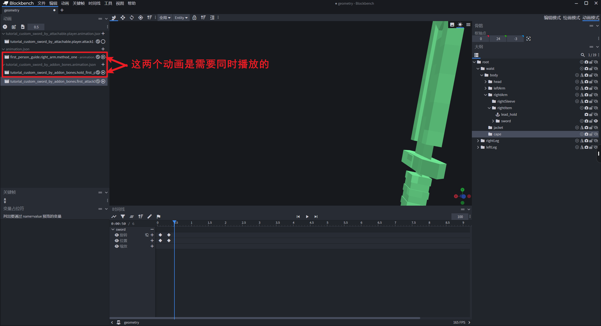

至此，我们的动画就制作完成了。导出我们的动画到资源包 `animations` 目录下即可。

#### Step 3. 准备动画控制器和渲染控制器

我们的武器相当于是一个额外的骨骼，所以需要一个额外的渲染控制器来控制是否进行渲染：

```python
{
    "format_version": "1.8.0",
    "render_controllers": {
        "controller.render.tutorial_custom_sword": {
            "geometry": "Geometry.custom_sword",
            "materials": [{"*": "Material.default"}],
            "textures": ["Texture.custom_sword"]
        }
    }
}
```

动画控制器也非常简单，不同视角的动画控制器播放不同的动画就可以了。

第三人称动画控制器：

```json
{
    "format_version": "1.10.0",
    "animation_controllers": {
        "controller.animation.custom_sword.third_attack": {
            "initial_state": "default",
            "states": {
                "default": {
                    "transitions": [
                        {
                            "third_person_attack1": "query.mod.custom_sword_attack == 1.0"
                        }
                    ]
                },
                "third_person_attack1": {
                    "animations": [
                        // 对应玩家动画
                        "third_person_attack1"
                    ],
                    "transitions": [
                        {
                            "default": "query.any_animation_finished && query.mod.custom_sword_attack == 0.0"
                        }
                    ]
                }
            }
        }
    }
}
```

第一人称动画控制器：

```json
{
    "format_version": "1.10.0",
    "animation_controllers": {
        "controller.animation.custom_sword_by_addon_bones": {
            "initial_state": "default",
            "states": {
                "default": {
                    "transitions": [
                        {
                            "first_person_attack1": "query.mod.custom_sword_attack == 1.0"
                        }
                    ]
                },
                "first_person_attack1": {
                    "animations": [
                        // 对应代码里面配置的动画名称
                        "custom_sword_first_attack"
                    ],
                    "transitions": [
                        {
                            "default": "query.any_animation_finished && query.mod.custom_sword_attack == 0.0"
                        }
                    ]
                }
            }
        }
    }
}
```

#### Step 4. 使用代码注册所有的资源

为了更少的侵入性，所以我们这里使用代码来把这些资源都挂接在玩家的渲染控制器下：

```python
# -*- coding: utf-8 -*-
import mod.client.extraClientApi as clientApi
import time

import config

CompFactory = clientApi.GetEngineCompFactory()

class TutorialClientSystem(clientApi.GetClientSystemCls()):

    def __init__(self, namespace, name):
        super(TutorialClientSystem, self).__init__(namespace, name)
        self.ListenEvent()

    def ListenEvent(self):
        self.ListenForEvent(clientApi.GetEngineNamespace(), clientApi.GetEngineSystemName(), "AddPlayerCreatedClientEvent",
                            self, self.OnAddPlayerCreatedClientEvent)

    def OnAddPlayerCreatedClientEvent(self, args):
        playerId = args['playerId']
        self.InitRender(playerId)  # 包括其他玩家也需要被初始化

    # 初始化绑定
    def InitRender(self, playerId):
        queryVariableComp = CompFactory.CreateQueryVariable(playerId)

        # 定义攻击的自定义变量，这里就是 query.mod.custom_sword_attack
        queryVariableComp.Register(config.AttackVarName, 0)
		# 第一种方法：作为玩家的附加骨骼添加进渲染控制器中进行控制
        self._InitMethodOne(playerId)

        # 两种方式都通用的第三人称动画和控制器
        actorRenderComp = CompFactory.CreateActorRender(playerId)
        actorRenderComp.AddPlayerAnimation("third_person_attack1", "animation.tutorial_custom_sword_by_attachable.player.attack1")
        actorRenderComp.AddPlayerAnimationController("custom_sword_third_attack", "controller.animation.custom_sword.third_attack")
        actorRenderComp.AddPlayerScriptAnimate("custom_sword_third_attack", "!variable.is_first_person")
        actorRenderComp.RebuildPlayerRender()

    # 为第一个方法进行初始化渲染
    def _InitMethodOne(self, playerId):
        actorRenderComp = CompFactory.CreateActorRender(playerId)
        # 3D武器：额外骨骼 —— 所需的就是把骨骼作为玩家的一部分添加上
        actorRenderComp.AddPlayerGeometry("custom_sword", "geometry.tutorial_custom_sword_by_addon_bones")
        actorRenderComp.AddPlayerTexture("custom_sword", "textures/models/tutorial_custom_sword")
        actorRenderComp.AddPlayerRenderController("controller.render.tutorial_custom_sword",
                                                  "query.get_equipped_item_name('main_hand') == 'custom_sword_by_addon_bones'")
        # 作为额外骨骼，还需要添加第一人称的动画文件和相关的控制器
        actorRenderComp.AddPlayerAnimation("custom_sword_first_hold", "animation.tutorial_custom_sword_by_addon_bones.hold_first_person")
        actorRenderComp.AddPlayerAnimation("custom_sword_first_attack", "animation.tutorial_custom_sword_by_addon_bones.first_attack1")
        actorRenderComp.AddPlayerAnimationController("custom_sword_first_attack_controller",
                                                     "controller.animation.custom_sword_by_addon_bones")
        actorRenderComp.AddPlayerScriptAnimate(
            "custom_sword_first_hold",
            "variable.is_first_person && query.get_equipped_item_name('main_hand') == 'custom_sword_by_addon_bones'"
        )
        actorRenderComp.AddPlayerScriptAnimate("custom_sword_first_attack_controller", "variable.is_first_person")

```

这里做几点说明：

- `query.get_equipped_item_name('main_hand') == 'custom_sword_by_addon_bones'` 这里对应的条件是当玩家主手有对应物品时生效，并且后面的标识符是不带前缀的，至少我自己测试时如果写了的是 `tutorial:custom_sword_by_addon_bones` 会失效；
- 这里判断第一人称要使用 `variable.is_first_person`。

#### Step 5. 处理攻击事件

首先客户端需要检测左键按下的事件，然后还需要把本地玩家的攻击状态同步给其他客户端：

```python
# -*- coding: utf-8 -*-
import mod.client.extraClientApi as clientApi
import time

import config

CompFactory = clientApi.GetEngineCompFactory()
gameComp = CompFactory.CreateGame(clientApi.GetLevelId())


class TutorialClientSystem(clientApi.GetClientSystemCls()):

    def __init__(self, namespace, name):
        super(TutorialClientSystem, self).__init__(namespace, name)
        self.ListenEvent()
        #
        self.mQueryVariableComp = CompFactory.CreateQueryVariable(clientApi.GetLocalPlayerId())
        self.mItemComp = CompFactory.CreateItem(clientApi.GetLocalPlayerId())
        #
        self.mCarriedItem = self.mItemComp.GetCarriedItem()  # 手持物品
        self.mAttackStep = 0  # 攻击的阶段
        self.mLastAttackTime = 0  # 上一次攻击的时间

    def ListenEvent(self):
        # 自定义事件
        self.ListenForEvent('tutorialMod', 'tutorialServerSystem', 'SyncAttackStateEvent', self, self.OnSyncAttackStateEvent)
        # 处理攻击相关的事件，监听左键按下事件
        self.ListenForEvent(clientApi.GetEngineNamespace(), clientApi.GetEngineSystemName(), "TapBeforeClientEvent",
                            self, self.OnLeftClick)
        self.ListenForEvent(clientApi.GetEngineNamespace(), clientApi.GetEngineSystemName(), "LeftClickBeforeClientEvent",
                            self, self.OnLeftClick)

    # 接受到其他客户端传来的同步事件
    def OnSyncAttackStateEvent(self, args):
        playerId = args['playerId']
        value = float(args['value'])
        CompFactory.CreateQueryVariable(playerId).Set(config.AttackVarName, value)

    def OnLeftClick(self, args=None):
        # 手持自定义武器并且上一次的攻击快要结束时，才会响应攻击
        if self._IsCarriedCustomWeapon():
            args['cancel'] = True  # 不响应原版的点击事件
            if self._LastAttackWillFinished():
                self._HandleAttack()

    def _IsCarriedCustomWeapon(self):
        self.mCarriedItem = self.mItemComp.GetCarriedItem()
        return self.mCarriedItem and self.mCarriedItem['itemName'] in config.CustomWeaponList

    def _LastAttackWillFinished(self):
        currentTime = time.time()
        return currentTime - config.AttackInterval > self.mLastAttackTime

    def _HandleAttack(self):
        self.mLastAttackTime = time.time()
        gameComp.AddTimer(0, self._SetAttackStateAndSyncToOtherClients, 'start')
        gameComp.AddTimer(0.2, self._SetAttackStateAndSyncToOtherClients, 'will_hit')
        gameComp.AddTimer(0.5, self._SetAttackStateAndSyncToOtherClients, 'end')

    def _SetAttackStateAndSyncToOtherClients(self, state):
        # 设置本地的自定义变量
        self.mQueryVariableComp.Set(config.AttackVarName, 1.0 if state in ['start', 'will_hit'] else 0)
        # 通知其他客户端更新数据
        self.NotifyToServer("SyncAttackStateEvent", {'playerId': clientApi.GetLocalPlayerId(), 'state': state})
```

服务端就是响应攻击以及同步玩家的攻击状态就可以了：

```python
# -*- coding: utf-8 -*-
#
import math
import mod.server.extraServerApi as serverApi
from mod.common.utils.mcmath import Vector3

CompFactory = serverApi.GetEngineCompFactory()
gameComp = CompFactory.CreateGame(serverApi.GetLevelId())


class TutorialServerSystem(serverApi.GetServerSystemCls()):
    def __init__(self, namespace, name):
        super(TutorialServerSystem, self).__init__(namespace, name)
        self.ListenEvent()

    def ListenEvent(self):
        # 自定义事件
        self.ListenForEvent('tutorialMod', 'tutorialClientSystem', "SyncAttackStateEvent", self, self.OnSyncAttackStateEvent)

    # region 监听事件
    # --------------------------------------------------------------------------------------------
    def OnSyncAttackStateEvent(self, args):
        playerId = args['playerId']
        state = args['state']
        if state == 'will_hit':
            weaponDamage = self._GetCarriedWeaponDamage(playerId)
            self._HurtFrontArea(playerId, 3, weaponDamage)
        else:
            relevantPlayers = CompFactory.CreatePlayer(playerId).GetRelevantPlayer([playerId])
            self.NotifyToMultiClients(relevantPlayers, 'SyncAttackStateEvent', {
                'playerId': playerId,
                'value'   : 1.0 if state == 'start' else 0.0
            })

    # endregion

    # region 类函数
    # --------------------------------------------------------------------------------------------
    def _GetCarriedWeaponDamage(self, playerId):
        itemComp = CompFactory.CreateItem(playerId)
        carriedItem = itemComp.GetPlayerItem(serverApi.GetMinecraftEnum().ItemPosType.CARRIED, 0)
        basicInfo = itemComp.GetItemBasicInfo(carriedItem['itemName'])
        return basicInfo['weaponDamage']

    # 攻击前方的区域
    def _HurtFrontArea(self, attacker, radius, damage, betweenAngle=75, knocked=True):
        attackerPos = CompFactory.CreatePos(attacker).GetFootPos()
        attackerRot = CompFactory.CreateRot(attacker).GetRot()
        # 计算攻击者朝向向量
        forwardVector = serverApi.GetDirFromRot(attackerRot)

        entityList = gameComp.GetEntitiesAround(attacker, 6, {
            'any_of': {
                'test'    : 'is_family',
                'subject' : 'other',
                'operator': 'not',
                'value'   : 'instabuild'
            }
        })

        for _entityId in entityList:
            entityPos = CompFactory.CreatePos(_entityId).GetFootPos()
            delta = Vector3(entityPos) - Vector3(attackerPos)

            # 计算角度
            angle = math.degrees(math.acos(Vector3.Dot(delta.Normalized(), Vector3(forwardVector).Normalized())))

            # 判断是否在扇形攻击范围内
            if betweenAngle == 0.0 or (angle < betweenAngle and delta.Length() < radius):
                CompFactory.CreateHurt(_entityId).Hurt(
                    damage, serverApi.GetMinecraftEnum().ActorDamageCause.EntityAttack, attacker, knocked=knocked
                )

    # endregion
```

#### Step 6. 进入游戏检查效果

进入游戏，就可以看到看到效果了：


### 方法2：绑定骨骼

第二种方法，就是把我们制作好的模型绑定在任何可附加的生物骨骼上。**原版**的三叉戟、望远镜、弓和盾牌都是采用的这种方法。

虽然这种方法能够应用在更多的生物上，但模型绑定也有一些特殊的地方。我们下面会进行说明。

#### Step 1. 改造模型文件

首先，我们需要导出我们的模型文件，然后确认模型文件的版本是 `1.16.0`，然后在根骨骼组下加入下列一行话：

```text
"binding": "query.item_slot_to_bone_name(context.item_slot)"
```

整个文件就会看起来像是这样：

```json
{
    "format_version": "1.16.0",
    "minecraft:geometry": [
        {
            "description": {
                "identifier": "geometry.tutorial_custom_sword_by_attachable",
                "texture_width": 64,
                "texture_height": 64,
                "visible_bounds_width": 4,
                "visible_bounds_height": 2.5,
                "visible_bounds_offset": [0, 0.75, 0]
            },
            "bones": [
                {
                    "name": "sword",
                    "binding": "query.item_slot_to_bone_name(context.item_slot)",
                    "pivot": [-6, 14, 0]
                },
            // ...............
```

这时候的模型文件就不需要对齐玩家的骨骼组了，而是默认会根据物品的槽位来对骨骼进行绑定：

- 如果是主手则绑定 `rightItem` 骨骼；
- 如果是副手则绑定 `leftItem` 骨骼；

这里我们也不对模型进行位置的修改了，只是把骨骼组的根改名为了 `sword`：

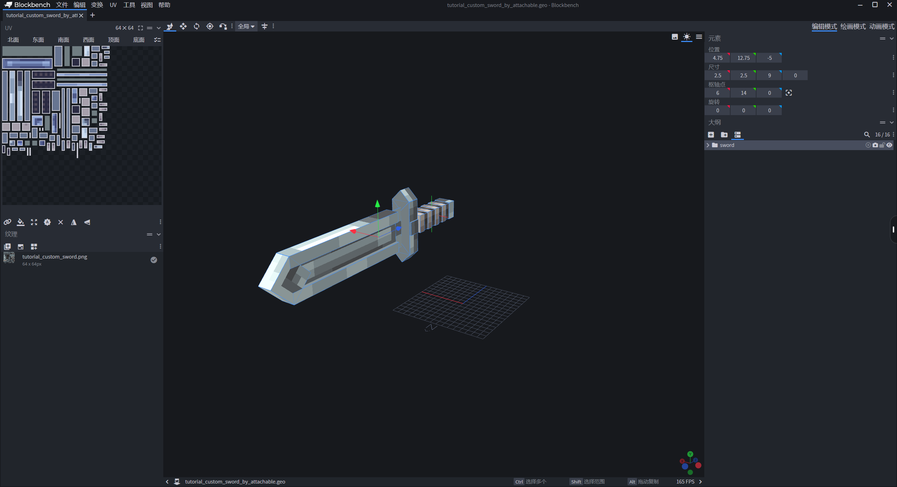

我们自己在创建模型的时候也要注意骨骼组名称不要跟原版的骨骼重名了。

#### Step 2. 创建动画

这时候我们使用 BlockBench 的动画模式，会发现菜单栏会出现几个选项供我们选择视角：

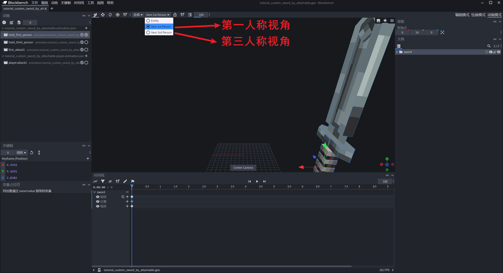

##### 第三人称修正动画

在选择第三人称视角的情况下，BlockBench 会自动出现一个玩家模型，这可以让我们来查看实际的情况情况：

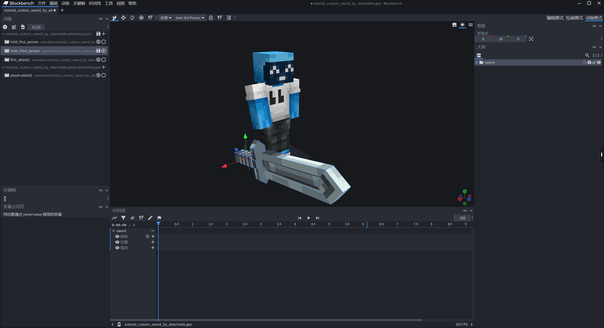

所以我们要做的就是创建一个动画来修正位置就可以了：

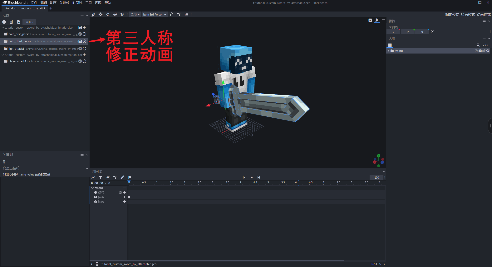

##### 第三人称攻击动画

如果我们想要自定义的第三人称攻击动画，我们仍然需要把骨骼拖入原版的玩家骨骼之中，然后完成第三人称动画：


这时候吊诡的地方就出现了，我们先完成动画，之后再进行说明。

##### 第一人称动画

跟第一种方法一样，我们需要一个手持修正的动画和一个攻击动画，这里就演示一下成果：


#### Step 3. 准备动画控制器

第三人称的玩家动画控制器已经准备好了，我们只需要准备用于 attachable 里面的动画控制器就可以：

```json
{
    "format_version": "1.10.0",
    "animation_controllers": {
        "controller.animation.custom_sword.first_attack": {
            "initial_state": "default",
            "states": {
                "default": {
                    "transitions": [
                        {
                            "first_person_attack1": "query.mod.custom_sword_attack == 1.0"
                        }
                    ]
                },
                "first_person_attack1": {
                    "animations": [
                        // 对应 attachable 里面配置的动画名称
                        "first_person_attack1"
                    ],
                    "transitions": [
                        {
                            "default": "query.any_animation_finished && query.mod.custom_sword_attack == 0.0"
                        }
                    ]
                }
            }
        }
    }
}
```

#### Step 4. attable 文件

我们需要在资源包下的 `attable` 文件夹下创建一个用于匹配我们自定义物品的附加物品定义文件：

```json
{
    "format_version": "1.10",
    "minecraft:attachable": {
        "description": {
            "identifier": "tutorial:custom_sword_by_attachable",
            "materials": {
                "default": "entity_alphatest",
                "enchanted": "entity_alphatest_glint"
            },
            "textures": {
                "default": "textures/models/tutorial_custom_sword",
                "enchanted": "textures/misc/enchanted_item_glint"
            },
            "geometry": {
                "default": "geometry.tutorial_custom_sword_by_attachable"
            },
            "animations": {
                // 第一人称手持动画
                "hold_first_person": "animation.tutorial_custom_sword_by_attachable.hold_first_person",
                // 第三人称手持动画
                "hold_third_person": "animation.tutorial_custom_sword_by_attachable.hold_third_person",
                // 第一人称下的攻击动画
                "first_person_attack1": "animation.tutorial_custom_sword_by_attachable.first_attack1",
                "first_person_attack2": "animation.tutorial_custom_sword_by_attachable.first_attack2",
                // 第一人称下的攻击动画控制器
                "first_person_attack_controller": "controller.animation.custom_sword.first_attack",
                // 第三人称下的攻击动画（共用玩家的动画就可以）
                "third_person_attack1": "animation.tutorial_custom_sword_by_attachable.player.attack1",
                // 第三人称动画控制器，共用玩家的就可以
                "third_person_attack_controller": "controller.animation.custom_sword.third_attack"
            },
            "scripts": {
                "animate": [
                    {
                        "first_person_attack_controller": "c.is_first_person"
                    },
                    {
                        "third_person_attack_controller": "!c.is_first_person"
                    },
                    {
                        "hold_first_person": "c.is_first_person"
                    },
                    {
                        "hold_third_person": "!c.is_first_person"
                    }
                ]
            },
            "render_controllers": [
                "controller.render.item_default"
            ]
        }
    }
}
```

除了正确匹配资源文件之外，吊诡和麻烦的地方就来了。

仔细观察，我们可以发现，这个文件的结构跟 `r\entity` 下的文件很像，本质上也是一种渲染控制器。而**控制器只能控制自身范围内的资源**。

我们在创建第三人称动画时，k 的动画同时涉及了玩家和物品。而玩家和物品可以说是独立的两个个体，所以说他们的控制器互相不影响，包括动画。

我们在第三人称的情况下，播放玩家动画时，由于玩家本身不存在 `sword` 骨骼组，所以玩家的动画对物品的骨骼没有一丝影响。

不在物品设置第三人称动画的情况下动画演示：


对比我们自己 k 的动画，会发现，物品相关的骨骼完全没有移动：


反过来，如果我们仅仅是在物品下（attachable 文件中）设置了第三人称动画，玩家的骨骼也不会受到影响：


这里就是方法二麻烦的地方：你需要**同时处理**玩家和物品的第三人称动画。

#### Step 5. 代码注入资源

其他就跟方法一如出一辙了，主要是注册自定义的攻击变量，以及注入第三人称动画和控制器：

```python
# -*- coding: utf-8 -*-
import mod.client.extraClientApi as clientApi
import time

import config

CompFactory = clientApi.GetEngineCompFactory()


class TutorialClientSystem(clientApi.GetClientSystemCls()):

    def __init__(self, namespace, name):
        super(TutorialClientSystem, self).__init__(namespace, name)
        self.ListenEvent()

    def ListenEvent(self):
        self.ListenForEvent(clientApi.GetEngineNamespace(), clientApi.GetEngineSystemName(), "AddPlayerCreatedClientEvent",
                            self, self.OnAddPlayerCreatedClientEvent)

    def OnAddPlayerCreatedClientEvent(self, args):
        playerId = args['playerId']
        self.InitRender(playerId)  # 包括其他玩家也需要被初始化

    # 初始化绑定
    def InitRender(self, playerId):
        queryVariableComp = CompFactory.CreateQueryVariable(playerId)

        # 定义攻击的自定义变量
        queryVariableComp.Register(config.AttackVarName, 0)
        # 第一种方法：作为玩家的附加骨骼添加进渲染控制器中进行控制
        self._InitMethodOne(playerId)

        # 另外一种形式的 3D 武器：附加骨骼
        # 则是通过 query.item_slot_to_bone_name 把模型绑定上了固定的位置，再用动画进行修正

        # 两种方式都通用的第三人称动画和控制器
        actorRenderComp = CompFactory.CreateActorRender(playerId)
        actorRenderComp.AddPlayerAnimation("third_person_attack1", "animation.tutorial_custom_sword_by_attachable.player.attack1")
        actorRenderComp.AddPlayerAnimationController("custom_sword_third_attack", "controller.animation.custom_sword.third_attack")
        actorRenderComp.AddPlayerScriptAnimate("custom_sword_third_attack", "!variable.is_first_person")
        actorRenderComp.RebuildPlayerRender()
```

#### Step 6. 处理攻击事件

这里跟第一种方法一样，所以就不再重复了。

## 小结

两种方法各有优劣吧。不过第一种方法来说，可以不局限在某一个具体的武器上，也可以是其他任何一个附加的骨骼（包括不限于翅膀、盔甲、盾牌等）。不过缺点就是只能局限在某一个具体的实体上（毕竟模型骨骼是需要严格对齐的）。

方法二就是一个标准的原版的方法了，对于一般的武器装备，这也是比较推荐的方法。这样原版的僵尸一类的生物也可以像玩家一样使用武器。

## 课后作业

本次课后作业，内容如下：

- 分别使用两种方法制作 3D 武器，感受两种方法的不同之处。
