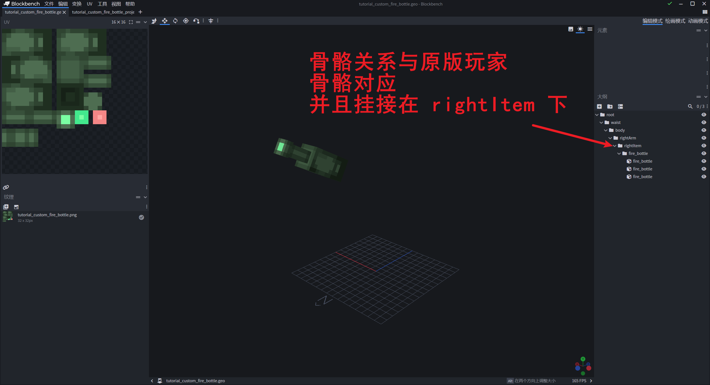
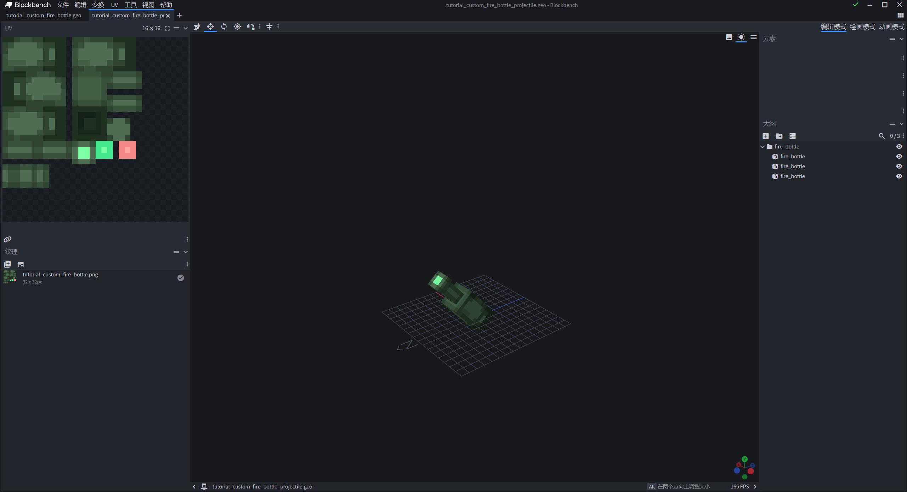
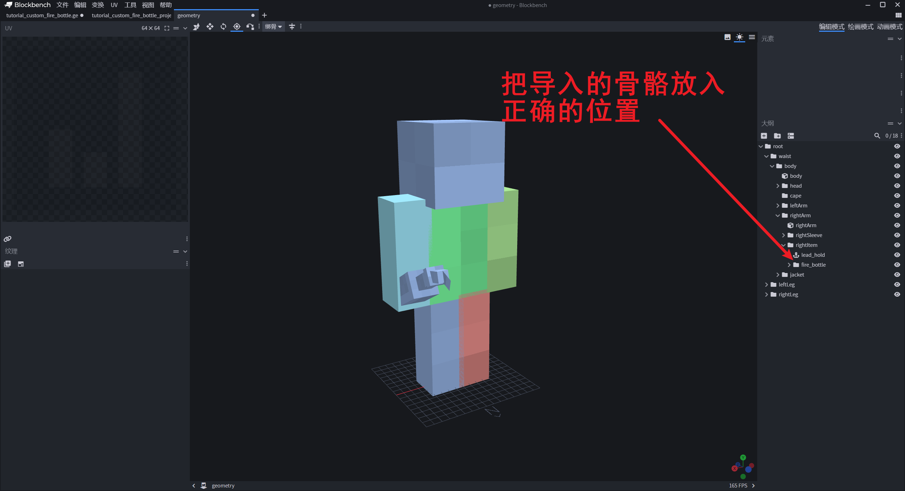
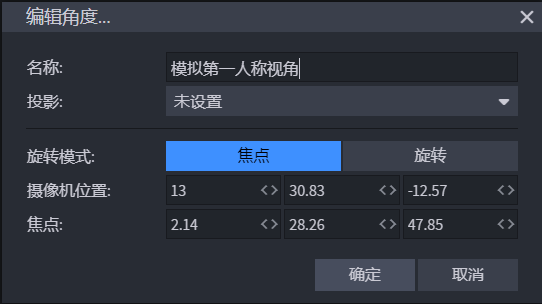
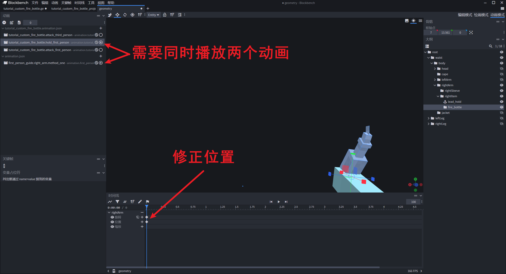
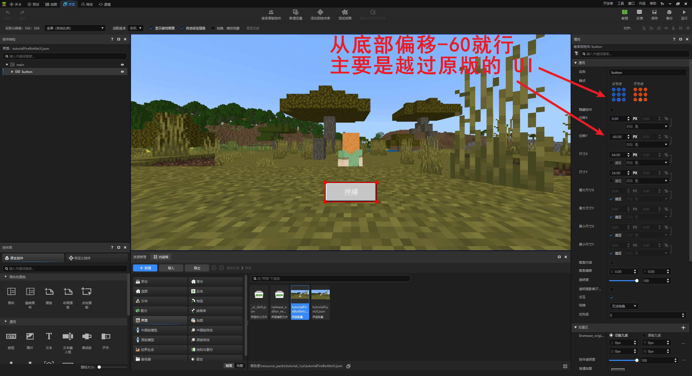

# 消耗类武器

> 温馨提示：开始阅读这篇指南之前，我们希望你对《我的世界》基岩版附加包有一定了解，有能力撰写 JSON 数据格式，并能够独立阅读《我的世界》开发者官网-开发指南或其他技术引用文档。

本文将帮助你添加一个可以投掷出去的燃烧瓶 3D 武器。（强烈建议阅读之前先阅读第一节课的内容，因为思路一样）

本文假定你熟悉 Molang、渲染控制器、动画和实体定义有基本的了解。本文不涉及美术资源的相关教程，如果对此感兴趣的同学可以自行学习和了解。

在本教程中，您将学习以下内容。

- ✅制作一个燃烧瓶，可投掷并造成伤害。

## 成果展示

还是一个动画完整，附带一个简单交互界面的燃烧瓶，可以扔出去造成伤害：


## 燃烧瓶制作

所有的 3D 武器都是有两种制作思路 ，由于燃烧瓶几乎是只提供给玩家使用的道具，所以我们这里直接采取第一种额外骨骼的方式。

### 模型制作

先来一个骨骼对应好的模型：



除此之外，我们还需要一个用于投掷出去的抛射物模型：



制作好之后导出到响应文件下就可以。

### 动画制作

我们先来准备一个用于制作动画的模型，复制一份原版的玩家模型，然后导入我们的自定义燃烧瓶模型，删除贴图：



#### 第三人称动画

由于骨骼是与玩家严格对齐，所以第三人称手持动画就不需要制作了。直接制作一个抬手仍出去的攻击动画：


由于第三人称的情况下手臂默认会有一个抬起的动画，所以第三人称的动画需要勾选上动画的「覆盖」模式。

#### 第一人称动画

还是按照之前的方法，先模拟出游戏中的第一人称视角。加入我们的模拟动画：

```json
{
	"format_version": "1.8.0",
	"animations": {
		"animation.first_person_guide.right_arm.method_one": {
			"loop": true,
			"bones": {
				"rightArm": {
					"rotation": [95, -45, 115],
					"position": [13.5, -10, 12]
				},
				"rightItem": {
					"position": [0, 0, -1]
				}
			}
		}
	}
}
```

再来一个模拟第一人称相机的视角：



再把除了右手之外的其他骨骼给隐藏掉，然后修正第一人称视角下的位置：



然后我们可以直接考虑复制第三人称攻击动画的帧，加入到第一人称攻击动画中，这样做主要是为了对齐关键动作的时间，然后再做一些修改，就可以得到我们第一人称的攻击动画了 ：


#### 抛射物的飞行动画

为了稍微「精致」一点儿，我们也要为投掷出去的抛射物制作一个旋转动画：


### 动画控制器

动画控制器很简单，一个第一人称使用，一个第三人称使用，除了播放的动画不一样之外，没有区别：

```json
{
    "format_version": "1.10.0",
    "animation_controllers": {
        "controller.animation.custom_fire_bottle_first_person": {
            "initial_state": "default",
            "states": {
                "default": {
                    "transitions": [
                        {
                            "first_person_attack1": "query.mod.custom_fire_bottle_attack == 1.0"
                        }
                    ]
                },
                "first_person_attack1": {
                    "animations": [
                        "custom_fire_bottle_attack_first_person"
                    ],
                    "transitions": [
                        {
                            "default": "query.any_animation_finished && query.mod.custom_fire_bottle_attack == 0.0"
                        }
                    ]
                }
            }
        },
        "controller.animation.custom_fire_bottle_third_person": {
            "initial_state": "default",
            "states": {
                "default": {
                    "transitions": [
                        {
                            "third_person_attack1": "query.mod.custom_fire_bottle_attack == 1.0"
                        }
                    ]
                },
                "third_person_attack1": {
                    "animations": [
                        "custom_fire_bottle_attack_third_person"
                    ],
                    "transitions": [
                        {
                            "default": "query.any_animation_finished && query.mod.custom_fire_bottle_attack == 0.0"
                        }
                    ]
                }
            }
        }
    }
}
```

### 渲染器

为了在第一人称下显示手臂，我们也需要对应修改原版的 `player.render_controllers.json` 文件：

```json
{
  "format_version": "1.8.0",
  "render_controllers": {
    "controller.render.player.first_person": {
      "geometry": "Geometry.default",
      "materials": [ { "*": "Material.default" } ],
      "textures": [ "Texture.default" ],
      "part_visibility": [
        { "*": false },
        // 修改原版渲染器，让它支持在手持自定义枪械和燃烧瓶时，显示右手臂
        { "rightArm": "query.get_equipped_item_name(0, 1) == '' || query.get_equipped_item_name(0, 1) == 'map' || query.get_equipped_item_name(0, 1) == 'custom_gun' || query.get_equipped_item_name(0, 1) == 'custom_fire_bottle'" },
        { "rightSleeve": "query.get_equipped_item_name(0, 1) == '' || query.get_equipped_item_name(0, 1) == 'map' || query.get_equipped_item_name(0, 1) == 'custom_gun' || query.get_equipped_item_name(0, 1) == 'custom_fire_bottle'" },
        { "leftArm": "(query.get_equipped_item_name(0, 1) == 'map' && query.get_equipped_item_name('off_hand') != 'shield') || (query.get_equipped_item_name('off_hand') == 'map' && !query.item_is_charged) || (!query.item_is_charged && (variable.item_use_normalized > 0 && variable.item_use_normalized < 1.0))" },
        { "leftSleeve": "(query.get_equipped_item_name(0, 1) == 'map' && query.get_equipped_item_name('off_hand') != 'shield') || (query.get_equipped_item_name('off_hand') == 'map' && !query.item_is_charged) || (!query.item_is_charged && (variable.item_use_normalized > 0 && variable.item_use_normalized < 1.0))" }
      ]
    },
```

然后还有燃烧瓶的渲染控制器（`tutorial_custom_fire_bottle.render_controllers.json`）：

```json
{
    "format_version": "1.8.0",
    "render_controllers": {
        "controller.render.tutorial_custom_fire_bottle": {
            "geometry": "Geometry.custom_fire_bottle",
            "materials": [{"*": "Material.default"}],
            "textures": ["Texture.custom_fire_bottle"]
        }
    }
}
```

### 抛射物的定义

我们还需要新建一个实体用来当做燃烧瓶的抛射物：

```json
{
    "format_version": "1.13.0",
    "minecraft:entity": {
        "description": {
            "is_experimental": false,
            "identifier": "tutorial:custom_fire_bottle_projectile",
            "is_spawnable": false,
            "is_summonable": false
        },
        "component_groups": {
        },
        "components": {
            "minecraft:despawn": {
                "despawn_from_distance": {}
            },
            "minecraft:physics": {},
            "minecraft:projectile": {
                "on_hit": {
                    "remove_on_hit": {},
                    "impact_damage": {
                        "catch_fire": true,
                        "knockback": false,
                        "damage": 1,
                        "destroy_on_hit": true
                    }
                },
                "gravity": 0.0,
                "power": 1.0,
                "offset": [
                    0,
                    0,
                    0
                ]
            },
            "minecraft:collision_box": {
                "width": 0.31,
                "height": 0.31
            },
            "netease:custom_entity_type": {
                "value": "projectile_entity"
            },
            "minecraft:pushable": {
                "is_pushable_by_piston": true,
                "is_pushable": true
            }
        },
        "events": {
        }
    }
}
```

资源包下的实体定义：

```json
{
    "format_version": "1.10.0",
    "minecraft:client_entity": {
        "description": {
            "identifier": "tutorial:custom_fire_bottle_projectile",
            "materials": {
                "default": "entity_alphatest"
            },
            "textures": {
                "default": "textures/models/tutorial_custom_fire_bottle"
            },
            "geometry": {
                "default": "geometry.tutorial_custom_fire_bottle_projectile"
            },
            "animations": {
                "move": "animation.tutorial_custom_fire_bottle_projectile.move"
            },
            "scripts": {
                "animate": [
                    "move"
                ]
            },
            "render_controllers": [
                "controller.render.default"
            ]
        }
    }
}
```

### 注入相关资源

把我们上面制作好的资源通过代码注入到玩家的渲染器下，并且监听了服务端传回来的状态同步事件：

```python
# -*- coding: utf-8 -*-
import mod.client.extraClientApi as clientApi
import time

import config

CompFactory = clientApi.GetEngineCompFactory()
gameComp = CompFactory.CreateGame(clientApi.GetLevelId())


class TutorialClientSystem(clientApi.GetClientSystemCls()):

    def __init__(self, namespace, name):
        super(TutorialClientSystem, self).__init__(namespace, name)
        self.ListenEvent()

    def ListenEvent(self):
        # 自定义事件
        self.ListenForEvent('tutorialMod', 'tutorialServerSystem', 'SyncCustomFireBottleStateEvent', self,
                            self.OnSyncCustomFireBottleStateEvent)

    def OnSyncCustomFireBottleStateEvent(self, args):
        playerId = args['playerId']
        value = float(args['value'])
        CompFactory.CreateQueryVariable(playerId).Set(config.FireBottleAttackVarName, value)

    def OnAddPlayerCreatedClientEvent(self, args):
        playerId = args['playerId']
        self.InitRender(playerId)  # 包括其他玩家也需要被初始化

    # 初始化绑定
    def InitRender(self, playerId):
        # 燃烧瓶
        self._InitToFireBottle(playerId)

        actorRenderComp = CompFactory.CreateActorRender(playerId)
        actorRenderComp.RebuildPlayerRender()

    # 燃烧瓶渲染器
    def _InitToFireBottle(self, playerId):
        queryVariableComp = CompFactory.CreateQueryVariable(playerId)
        queryVariableComp.Register(config.FireBottleAttackVarName, 0)
        queryVariableComp.Set(config.FireBottleAttackVarName, 0)

        actorRenderComp = CompFactory.CreateActorRender(playerId)
        # 控制器
        actorRenderComp.AddPlayerGeometry('custom_fire_bottle', 'geometry.tutorial_custom_fire_bottle')
        actorRenderComp.AddPlayerTexture('custom_fire_bottle', 'textures/models/tutorial_custom_fire_bottle')
        actorRenderComp.AddPlayerRenderController("controller.render.tutorial_custom_fire_bottle",
                                                  "query.get_equipped_item_name('main_hand') == 'custom_fire_bottle'")
        # 定义动画和控制器名称
        animations = ['hold_first_person', 'attack_first_person', 'attack_third_person']
        controllers = ['custom_fire_bottle_first_person', 'custom_fire_bottle_third_person']

        for anim in animations:
            animationKey = 'custom_fire_bottle_' + anim
            animationName = 'animation.tutorial_custom_fire_bottle.' + anim
            actorRenderComp.AddPlayerAnimation(animationKey, animationName)

        for controller in controllers:
            controllerKey = controller + "_controller"
            controllerName = 'controller.animation.' + controller
            actorRenderComp.AddPlayerAnimationController(controllerKey, controllerName)

        # 添加动画的触发条件
        actorRenderComp.AddPlayerScriptAnimate(
            'custom_fire_bottle_hold_first_person',
            "variable.is_first_person && query.get_equipped_item_name('main_hand') == 'custom_fire_bottle'"
        )
        actorRenderComp.AddPlayerScriptAnimate(
            'custom_fire_bottle_first_person_controller',
            "variable.is_first_person && query.get_equipped_item_name('main_hand') == 'custom_fire_bottle'"
        )
        actorRenderComp.AddPlayerScriptAnimate(
            'custom_fire_bottle_third_person_controller',
            "!variable.is_first_person && query.get_equipped_item_name('main_hand') == 'custom_fire_bottle'"
        )
```

### 编写 UI 文件

我们只需要一个拥有绝对定位的按钮的简单 UI：

 

界面也很简单：

```python
# -*- coding: utf-8 -*-
import mod.client.extraClientApi as clientApi

import config

ViewBinder = clientApi.GetViewBinderCls()
ViewRequest = clientApi.GetViewViewRequestCls()
ScreenNode = clientApi.GetScreenNodeCls()

Namespace = clientApi.GetEngineNamespace()
SystemName = clientApi.GetEngineSystemName()
CompFactory = clientApi.GetEngineCompFactory()
gameComp = CompFactory.CreateGame(clientApi.GetLevelId())


#ui布局绑定
class FireBottleUIScripts(ScreenNode):
    def __init__(self, namespace, name, param):
        ScreenNode.__init__(self, namespace, name, param)
        self.mPlayerId = clientApi.GetLocalPlayerId()
        self.mClientSystem = clientApi.GetSystem('tutorialMod', 'tutorialClientSystem')
        self.mItemComp = CompFactory.CreateItem(self.mPlayerId)
        self.mQueryVariableComp = CompFactory.CreateQueryVariable(self.mPlayerId)

        # 组件地址
        self.mBtnPath = "/button"

        # 界面所需的变量
        self.mCarriedItem = None

    def Create(self):
        print("===== Tutorial Custom Gun UI Create Finished =====")
        # 注册按钮的事件
        control = self.GetBaseUIControl(self.mBtnPath).asButton()
        control.AddTouchEventParams({"isSwallow": True})
        control.SetButtonTouchUpCallback(self.OnButtonUp)

        # 关注事件
        namespace, systemName = clientApi.GetEngineNamespace(), clientApi.GetEngineSystemName()
        self.mClientSystem.ListenForEvent(namespace, systemName, "OnCarriedNewItemChangedClientEvent", self, self.OnCarriedNewItem)

        # 刚创建时也自动触发一次
        self.OnCarriedNewItem({'itemDict': self.mItemComp.GetCarriedItem()})

    # region 按钮事件
    # --------------------------------------------------------------------------------------------
    def OnButtonUp(self, args):
        self._HandleThrow()
        # 按了一次之后就直接隐藏界面，避免误操作
        self._SetUIVisible(False)

    # endregion

    # region 事件监听
    # --------------------------------------------------------------------------------------------
    def OnCarriedNewItem(self, args):
        self.mCarriedItem = args['itemDict']
        if self._IsCarriedCustomGun():
            self._SetUIVisible(True)
        else:
            self._SetUIVisible(False)

    # endregion

    # region 类函数
    # --------------------------------------------------------------------------------------------
    def _IsCarriedCustomGun(self):
        if self.mCarriedItem and self.mCarriedItem['itemName'] == 'tutorial:custom_fire_bottle':
            return True
        return False

    def _SetUIVisible(self, flag):
        self.SetScreenVisible(flag)

    def _HandleThrow(self):
        throwTime = 0.25
        animTotalTime = 0.5
        gameComp.AddTimer(0, self._SetAttackStateAndSyncToOtherClients, 'start')
        gameComp.AddTimer(throwTime, self._SetAttackStateAndSyncToOtherClients, 'throw')
        gameComp.AddTimer(animTotalTime, self._SetAttackStateAndSyncToOtherClients, 'end')

    def _SetAttackStateAndSyncToOtherClients(self, state):
        # 设置本地自定义变量
        self.mQueryVariableComp.Set(config.FireBottleAttackVarName, 1.0 if state in ['start', 'throw'] else 0.0)
        # 通知其他客户端
        self.mClientSystem.NotifyToServer('SyncCustomFireBottleStateEvent', {'state': state, 'playerId': self.mPlayerId})

    # endregion
```

- 我们监听了 `OnCarriedNewItemChangedClientEvent` 事件，会在切换到该物品时显示按钮，也会在切换到其他物品时隐藏按钮；
- 另外我们在响应点击之后，立马就隐藏了界面，防止多次点击；

### 处理投掷事件

我们已经在界面文件中，在响应点击之后发送了事件给服务端，所以服务端只需要监听事件做出响应就可以：

```python
# -*- coding: utf-8 -*-
import mod.server.extraServerApi as serverApi

CompFactory = serverApi.GetEngineCompFactory()
gameComp = CompFactory.CreateGame(serverApi.GetLevelId())


class TutorialServerSystem(serverApi.GetServerSystemCls()):
    def __init__(self, namespace, name):
        super(TutorialServerSystem, self).__init__(namespace, name)
        self.ListenEvent()

    def ListenEvent(self):
        # 自定义事件
        self.ListenForEvent('tutorialMod', 'tutorialClientSystem', "SyncCustomFireBottleStateEvent", self,
                            self.OnSyncCustomFireBottleStateEvent)

    def OnSyncCustomFireBottleStateEvent(self, args):
        playerId = args['playerId']
        state = args['state']
        if state == 'throw':
            self._ThrowFireBottle(playerId)
        else:
            relevantPlayers = CompFactory.CreatePlayer(playerId).GetRelevantPlayer([playerId])
            self.NotifyToMultiClients(relevantPlayers, 'SyncCustomFireBottleStateEvent', {
                'playerId': playerId,
                'value'   : 1.0 if state == 'start' else 0.0
            })

    # 向前投掷燃烧瓶
    def _ThrowFireBottle(self, playerId):
        rot = CompFactory.CreateRot(playerId).GetRot()
        # 默认是向上抬一点
        rot = (rot[0] - 30, rot[1])
        param = {
            'power'    : 1.2,
            'gravity'  : 0.125,
            'direction': serverApi.GetDirFromRot(rot)
        }

        projectileComp = CompFactory.CreateProjectile(playerId)
        projectileComp.CreateProjectileEntity(playerId, 'tutorial:custom_fire_bottle_projectile', param)

        self._ReduceCarriedItemNum(playerId, 1)

    def _ReduceCarriedItemNum(self, playerId, reduceNum):
        itemComp = CompFactory.CreateItem(playerId)
        selectSlotId = itemComp.GetSelectSlotId()
        itemDict = itemComp.GetPlayerItem(serverApi.GetMinecraftEnum().ItemPosType.INVENTORY, selectSlotId)
        return itemComp.SetInvItemNum(selectSlotId, itemDict['count'] - reduceNum)
```

这里默认的投掷方向是玩家当前朝向向上偏移 30° 作为初始的燃烧瓶的速度方向。

### 进入游戏测试

完成上面的步骤，我们就可以进入游戏中愉快的测试了。

## 课后作业

本次课后作业，内容如下：

- 制作一个可投掷出去的 3D 道具，需要有一个简单可交互的界面、完整的第一、第三人称动画。
