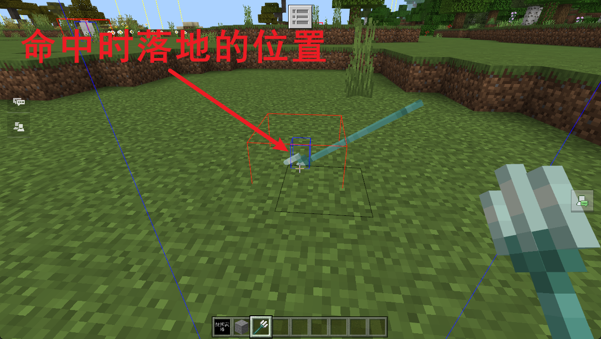

# 投掷类武器

> 温馨提示：开始阅读这篇指南之前，我们希望你对《我的世界》基岩版附加包有一定了解，有能力撰写 JSON 数据格式，并能够独立阅读《我的世界》开发者官网-开发指南或其他技术引用文档。

本文将帮助你添加一个类似于原版三叉戟的可投掷武器。（强烈建议阅读之前先阅读前面一节课的内容，因为思路一样）

本文假定你熟悉 Molang、渲染控制器、动画和实体定义有基本的了解。本文不涉及美术资源的相关教程，如果对此感兴趣的同学可以自行学习和了解。

在本教程中，您将学习以下内容。

- ✅类似于原版三叉戟的投掷类武器。

## 成果展示

类似于原版的三叉戟的自定义投掷类武器：


## 投掷类武器制作

还是一样的思路，先去官方的内容库中「偷」一个模型文件：


### 原版三叉戟

我们没有制作投掷类武器的经验，所以我们直接去原版查看三叉戟的 `attachable` 文件（位于 `definitionsattachables\trident.entity.json`）：

```json
{
  "format_version": "1.10",
  "minecraft:attachable": {
    "description": {
      "identifier": "minecraft:trident",
      "materials": {
        "default": "entity_alphatest",
        "enchanted": "entity_alphatest_glint"
      },
      "textures": {
        "default": "textures/entity/trident",
        "enchanted": "textures/misc/enchanted_item_glint"
      },
      "geometry": {
        "default": "geometry.trident"
      },
      "animations": {
        "wield": "controller.animation.trident.wield",
        "wield_first_person": "animation.trident.wield_first_person",
        "wield_first_person_raise": "animation.trident.wield_first_person_raise",
        "wield_first_person_raise_shake": "animation.trident.wield_first_person_raise_shake",
        "wield_first_person_riptide": "animation.trident.wield_first_person_riptide",
        "wield_third_person": "animation.trident.wield_third_person",
        "wield_third_person_raise": "animation.trident.wield_third_person_raise"
      },
      "scripts": {
        "pre_animation": [
          "variable.charge_amount = math.clamp((query.main_hand_item_max_duration - (query.main_hand_item_use_duration - query.frame_alpha + 1.0)) / 10.0, 0.0, 1.0f);"
        ],
        "animate": [
          "wield"
        ]
      },
      "render_controllers": [ "controller.render.item_default" ]
    }
  }
}
```

### 模型文件

那思路就很简单了，直接仿制一个三叉戟的模型文件，其余的东西都是可以通用的。所以我们把模型稍微改一下：


这里原版三叉戟的 `pivot` 影响了动画的对齐和命中效果，我们要保持**绝对一致**（也就是说这个 24 不能改）：


我们稍微观察一下三叉戟就大概明白了这个 `pivot` 是在什么位置：


如果打开「调试」中的「能见度边界框」的话，也能够发现这个锚点实际上就是命中的位置：



所以我们稍微更改一下我们的模型：


上面是用于手持的物品模型，对于处理用于**投掷出去的抛射物模型**，我们这里有两种方式处理：

- 不添加额外的模型，通过动画来修正投掷出去的动画。好处是不需要增加额外的动画，但。
- 添加额外的抛射物模型。好处是动画简单，而且能够复用，坏处就是要多处理一遍模型。

如果我们想要采用第一种方式的话，就需要把模型往下移，把锚点移动到矛的尖上：


但此时游戏中的握持方式就会很奇怪，因为我们自己的模型长度跟原版的三叉戟不一致：


所以我们这里不采用第一种方式，而是额外增加一个单独的用于投掷物实体的模型。

不过这里还是先放一下采用第一种方式时的动画，提供给需要的同学：

```json
{
    "format_version": "1.8.0",
    "animations": {
        "animation.tutorial_thrown_custom_throw_weapon.move": {
            "loop": true,
            "bones": {
                "pole": {
                    // 下列是采用第一种方式时采用的动画
                    "rotation": [
                        "-query.target_x_rotation + 90", // 这里需要旋转 90 正对 N 方向
                        "-query.target_y_rotation",
                        0.0
                    ],
                    "position": [
                        // 这里的 -24 对应了 pivot 偏移的 24
                        0, -24, 0
                    ]
                }
            }
        }
    }
}
```

OK，那我们采用第二种方式只需要新增一个锚点在原点，并且朝向 N 方向的模型就可以：


此时的动画文件，可以通用，就是让实体朝向运动方向：

```json
{
    "format_version": "1.8.0",
    "animations": {
        "animation.tutorial_thrown_custom_throw_weapon.move": {
            "loop": true,
            "bones": {
                "pole": {
                    // 下列是教程中采用的第二种方法的动画
                    "rotation": [
                        "-query.target_x_rotation",
                        "-query.target_y_rotation",
                        0.0
                    ]
                }
            }
        }
    }
}
```

### 基础物品定义

行为包下的物品定义文件：

```json
{
    "format_version": "1.10",
    "minecraft:item": {
        "description": {
            "category": "Equipment",
            "identifier": "tutorial:custom_throw_weapon",
            "custom_item_type": "ranged_weapon"
        },
        "components": {
            "netease:show_in_hand": {
                "value": false
            },
            "minecraft:max_damage": 10,
            // 保证使用足够长，否则动画和视角会重新开始
            "minecraft:use_duration": 99999
        }
    }
}
```

当我们把 `custom_item_type` 定义为 `ranged_weapon` 时，并且组件中拥有 `minecraft:use_duration` 时，我们在手持物品的情况下右键（手机是长按），就自动会有镜头缩放的效果：


### 抛射物实体文件

我们还需要额外创建一个抛射物实体，直接复制粘贴原版的三叉戟就好，只不过需要额外添加两个组件：

```json
{
    "format_version": "1.12.0",
    "minecraft:entity": {
        "description": {
            "identifier": "tutorial:thrown_custom_throw_weapon",
            "is_spawnable": false,
            "is_summonable": false,
            "is_experimental": false
        },
        "components": {
            "minecraft:collision_box": {
                "width": 0.25,
                "height": 0.35
            },
            "minecraft:projectile": {
                "on_hit": {
                    "impact_damage": {
                        "damage": 8,
                        "knockback": true,
                        "semi_random_diff_damage": false,
                        "destroy_on_hit": false
                    },
                    "stick_in_ground": {
                        "shake_time": 0
                    }
                },
                "liquid_inertia": 0.99,
                "hit_sound": "item.trident.hit",
                "hit_ground_sound": "item.trident.hit_ground",
                "power": 4,
                "gravity": 0.10,
                "uncertainty_base": 1,
                "uncertainty_multiplier": 0,
                "stop_on_hurt": true,
                "anchor": 1,
                "should_bounce": true,
                "multiple_targets": false,
                "offset": [0, -0.1, 0]
            },
            "minecraft:physics": {
            },
            "minecraft:pushable": {
                "is_pushable": true,
                "is_pushable_by_piston": true
            },
            "netease:custom_entity_type": {
                "value": "projectile_entity"
            },
            "netease:pick_up": {
                "item_name": "tutorial:custom_throw_weapon"
            }
        }
    }
}
```

我们需要额外添加 `netease:custom_entity_type` 来标识这个实体是抛射物，以及 `netease:pick_up` 组件，用来在玩家接触时拾取变成物品。

行为包下 `\entity` 文件：

```json
{
    "format_version": "1.10.0",
    "minecraft:client_entity": {
        "description": {
            "identifier": "tutorial:thrown_custom_throw_weapon",
            "materials": {
                "default": "entity_alphatest"
            },
            "textures": {
                "default": "textures/models/tutorial_custom_throw_weapon"
            },
            "geometry": {
                "default": "geometry.tutorial_thrown_custom_throw_weapon"
            },
            "animations": {
                "move": "animation.tutorial_thrown_custom_throw_weapon.move"
            },
            "scripts": {
                "animate": [
                    "move"
                ]
            },
            "render_controllers": [
                "controller.render.default"
            ]
        }
    }
}
```

### 代码注入第三人称动画

当我们把这些文件都准备好之后，你会发现第三人称并不会把手抬起来：


这就是我们在「自定义枪械」那一节课中说的，attachable 中的动画，只会影响武器，而不会反作用于玩家。

所以我们还需要在玩家手持投掷武器时，播放原版的投掷动画。

问题是我们并不知道原版的投掷动画是哪一个，我们要么去原版的文件中找（还是挺好找的），要么，就按 F3 直到出现下列的界面：


然后打开动画编辑器：


然后我们就可以在手持三叉戟的情况下，通过不断右键触发动画，来找到到底播放的是哪一个动画：


很快，我们就找到了播放的 `brandish_spear` 动画，一番搜索，就定位到了动画名称：

```json
animation.humanoid.brandish_spear
```

我们使用代码注入到玩家的控制器中：

```python
# -*- coding: utf-8 -*-
import mod.client.extraClientApi as clientApi

CompFactory = clientApi.GetEngineCompFactory()


class TutorialClientSystem(clientApi.GetClientSystemCls()):

    def __init__(self, namespace, name):
        super(TutorialClientSystem, self).__init__(namespace, name)
        self.ListenEvent()


    def ListenEvent(self):
        self.ListenForEvent(clientApi.GetEngineNamespace(), clientApi.GetEngineSystemName(), "AddPlayerCreatedClientEvent",
                            self, self.OnAddPlayerCreatedClientEvent)

    def OnAddPlayerCreatedClientEvent(self, args):
        playerId = args['playerId']
        self.InitRender(playerId)  # 包括其他玩家也需要被初始化

    # 初始化绑定
    def InitRender(self, playerId):
        # 投掷武器
        self._InitToThrowWeapon(playerId)

        actorRenderComp = CompFactory.CreateActorRender(playerId)
        actorRenderComp.RebuildPlayerRender()

    # 投掷武器的渲染
    def _InitToThrowWeapon(self, playerId):
        actorRenderComp = CompFactory.CreateActorRender(playerId)
        # 使用原版的动画
        actorRenderComp.AddPlayerAnimation('custom_throw_weapon_third_person_raise', 'animation.humanoid.brandish_spear')
        actorRenderComp.AddPlayerScriptAnimate(
            'custom_throw_weapon_third_person_raise',
            "!variable.is_first_person && query.get_equipped_item_name('main_hand') == 'custom_throw_weapon' && query.main_hand_item_use_duration > 0"
        )
```

这样，我们在第三人称的情况下，就可以播放原版的抬手动作了：


### 处理投掷事件

客户端代码：

```python
# -*- coding: utf-8 -*-
import mod.client.extraClientApi as clientApi

CompFactory = clientApi.GetEngineCompFactory()


class TutorialClientSystem(clientApi.GetClientSystemCls()):

    def __init__(self, namespace, name):
        super(TutorialClientSystem, self).__init__(namespace, name)
        self.ListenEvent()
        self.mTimeCounter = 0
        #
        self.mIsUsingItem = False  # 是否正在使用投掷类武器
        self.mStartUsingFrame = 0  # 开始使用物品的时间

    def ListenEvent(self):
        # 投掷武器相关的事件
        self.ListenForEvent(clientApi.GetEngineNamespace(), clientApi.GetEngineSystemName(), "ClientItemTryUseEvent", self,
                            self.OnClientItemTryUseEvent)
        self.ListenForEvent(clientApi.GetEngineNamespace(), clientApi.GetEngineSystemName(), "ItemReleaseUsingClientEvent", self,
                            self.OnItemReleaseUsingClientEvent)

    def Update(self):
        self.mTimeCounter += 1

    def OnClientItemTryUseEvent(self, args):
        if args['itemName'] == 'tutorial:custom_throw_weapon':
            self.mIsUsingItem = True
            self.mStartUsingFrame = self.mTimeCounter

    def OnItemReleaseUsingClientEvent(self, args):
        itemDict = args['itemDict']
        if itemDict and itemDict['itemName'] == 'tutorial:custom_throw_weapon':
            # 最大蓄力 2s，也就是说威力最多为 2 倍
            power = min(2.0, (self.mTimeCounter - self.mStartUsingFrame) / 30.0)
            self.NotifyToServer('ThrowCustomWeapon', {'playerId': args['playerId'], 'power': power}

```

服务端代码：

```python
# -*- coding: utf-8 -*-
import mod.server.extraServerApi as serverApi

CompFactory = serverApi.GetEngineCompFactory()

class TutorialServerSystem(serverApi.GetServerSystemCls()):
    def __init__(self, namespace, name):
        super(TutorialServerSystem, self).__init__(namespace, name)

    def ListenEvent(self):
        # 自定义事件
        self.ListenForEvent('tutorialMod', 'tutorialClientSystem', "SyncCustomGunAttackStateEvent", self,
                            self.OnSyncCustomGunAttackStateEvent)
        self.ListenForEvent('tutorialMod', 'tutorialClientSystem', "ThrowCustomWeapon", self, self.OnThrowCustomWeapon)

    def OnThrowCustomWeapon(self, args):
        playerId = args['playerId']
        power = args['power']

        param = {
            'power'    : 4 * power,
            'damage'   : 3 + power * 3,  # 最高伤害为 3+2*3=9 点伤害
            'direction': serverApi.GetDirFromRot(CompFactory.CreateRot(playerId).GetRot())
        }
        projectileComp = CompFactory.CreateProjectile(playerId)
        projectileEntityId = projectileComp.CreateProjectileEntity(playerId, 'tutorial:thrown_custom_throw_weapon', param)

        if projectileEntityId != '-1':
            self._ReduceCarriedItemNum(playerId, 1)

    def _ReduceCarriedItemNum(self, playerId, reduceNum):
        itemComp = CompFactory.CreateItem(playerId)
        selectSlotId = itemComp.GetSelectSlotId()
        itemDict = itemComp.GetPlayerItem(serverApi.GetMinecraftEnum().ItemPosType.INVENTORY, selectSlotId)
        return itemComp.SetInvItemNum(selectSlotId, itemDict['count'] - reduceNum)
```

### 进入游戏测试

一切准备好之后，就可以进入游戏测试了。然后你就得到了一个自定义的投掷类 3D 武器。

## 小结

我们这一节课是高度利用了原版的三叉戟物品的动画，如果你想要完全自定义的投掷动画，也可以参照自定义枪械那样，完全定制化动画。

## 课后作业

本次课后作业，内容如下：

- 实现自己的类似于原版三叉戟的投掷类 3D 武器；
