# 作品宣传图的设计与上传

当我们组件玩法完成之后，如何能让更多人了解和游玩你的作品？

实际上，最首要和基础的推广方式之一就是 **做好宣传图** 。一次好的玩法内容宣传，可以让玩家被宣传图和视频中所吸引，提起想要了解组件的内容兴趣，从而达到推广的目的。

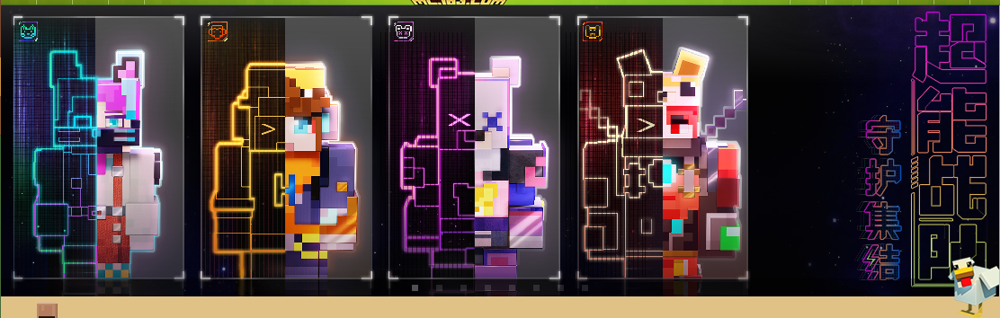

#### 在本章课程，您将学到

- 作品推广的方式与重要性。
- 作品上传所需材料的内容与规范。
- 优秀作品宣传设计分享。

## 了解宣传作品推广方式与重要性

### 平台宣传板块

首先，在使用开发者工具平台进行上传作品阶段，平台下就会有一块专门为作品预留的宣传板块，开发者们需要根据不同的上传位置进行宣传图的制作和上传，就能完成作品上传和宣传发布的一站式操作。

#### 电脑版

在电脑版的宣传图主要有 **好友动态** 、 **首页轮播图** 、 **首页排行榜** 、 **好友推荐** 、 **首页新品推荐** 、 **详情页轮播图** 、 **咨询首页推荐组件** 等组成。

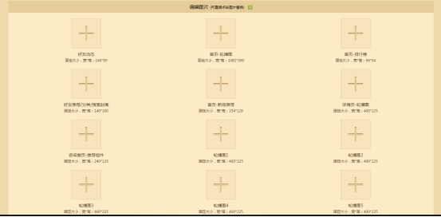

#### 手机版

相对于电脑版，手机版整体宣传板块制图会更加精简化，主要包含 **banner** ， **新icon** ,  **pos机** ， **轮播图** 。

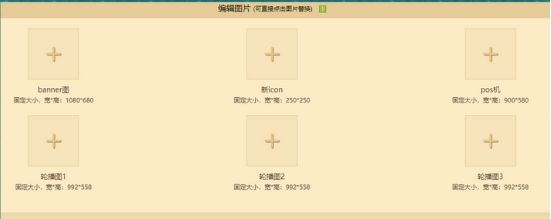

 **注意：不同版本和端的尺寸规格都有标注，一定要按照尺寸和规格进行制作，避免出现尺寸做错导致的积压和变形。**

### 视频宣传

合格的宣传图都是动静结合的，宣传图是静态视觉宣传，宣传视频就是动态视觉宣传。

将自己的玩法组件内容与视觉语言进行组合，制作出符合组件特色的宣传视频和视频封面，目的就是为自己的作品起到锦上添花的宣传作用。

在开发者平台下也有专门的预留给玩法视频上传宣传的位置，与宣传图上传一样，根据所提示的规格和尺寸进行制作上传即可。

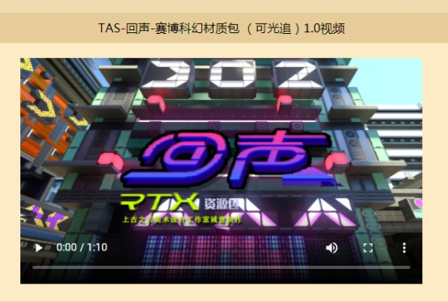

## 作品上传所需材料的内容与规范

### 上传所需要的素材内容

根据平台下的各类尺寸进行设计和制作素材的关键，则是可以统一给予一个主体核心设计，然后根据主体设计来进行不同尺寸的缩放和调整。

注意：在开发者平台PC/PE上架作品时候，通常尺寸都是横版偏多，建议可以将设计重点放在画面的中心。

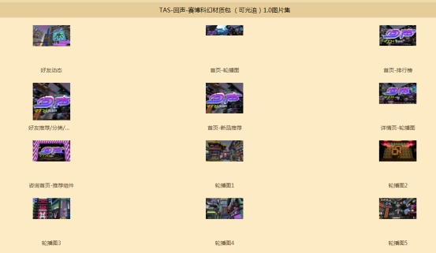

### 素材制作规范

在制作宣传图的过程中，需要多注意组件特色展示，包括宣传图的排版要突出显示组件最吸引玩家的地方，比如玩法宣传展示的是内容的趣味性和风格特色，材质包的展示是材质替换后整体场景转变，皮肤则需要突出展示人物穿戴后的造型改变等。

#### 合格的宣传图排版要做到主次有别

| banner图（原始图）        | banner图（分析图）        |
| ------------------------- | ------------------------- |
| 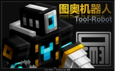 | 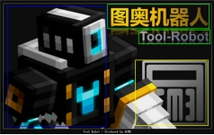 |

**玩法组件** ：此图为玩法组件banner图，图片中着重表现了玩法特色的模组和标题，主要信息和次要信息区分的很好。让观众第一眼就能知晓这款玩法组件的风格和内容走向。

#### 合格的场景宣传要做到不喧宾夺主

| 图1                                                 | 图2                                                  |
| --------------------------------------------------- | ---------------------------------------------------- |
| 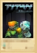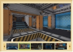 | 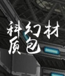 |

**材质（纹理）包** ： **图1** 和 **图2** 均为材质（纹理）包组件的轮播图和封面展示。从第一视觉上， **图1** 可以让玩家通过不同的场景来感受材质（纹理）包更替所带来的新鲜感和视觉体验，而 **图2** 则会无法给人第一时间传达它的特点和优秀的地方。

所以在轮播和封面的制作过程中一定不要喧宾夺主，要相辅相成的进行融合设计，以展示特点和特色来进行设计制作。

规避过于花哨的布局和不合理的排版，或者弱化重点突出缺点，并且使用非组件包内所包含的内容进行宣传设计，让作品本身因为宣传的导向性错误，导致错失玩家的关注和喜爱。

## 优秀作品宣传设计分享

有了明确的宣传途径和对于宣传图的设计理论想法，但打开界面却有点无从下手的时候，可以先看一些优秀宣传设计作品来进行学习和了解，例如以下的案例。

### 皮肤视觉类组件封面设计

| 图1                        | 图2                        |
| -------------------------- | -------------------------- |
| 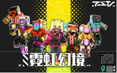 | 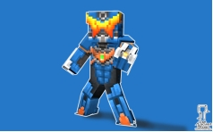 |

皮肤的宣传图 **图1** 以人物展示为主，文案和皮肤要主次分明，如果主次不一，类似 **图2** 背景与人物区分不出融合在一起，这样就会显得人物比较薄弱，无法凸显皮肤的特色。相比之下 **图1** 更好的展现了皮肤特色和视觉的美感。

### 玩法功能性类组件封面设计

| 图1                        | 图2                        |
| -------------------------- | -------------------------- |
| 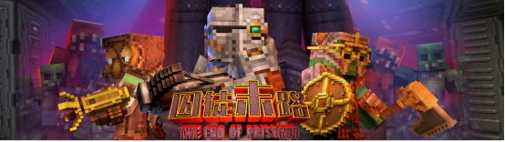 | 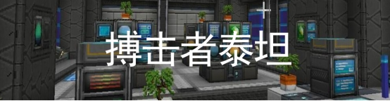 |

将自身玩法的特色展现和精简提炼在封面里面，例如 **图1** 是一款塔防僵尸生存类组件，设计中就可以将怪物、塔防、防卫武器等特色和精简的内容提炼展示出来。**图2** 则只是简单的进行了拼合，并没很好的展现玩法的特色和内容。所以相比较之下 **图1** 能更好的展现特点和吸引住玩家的关注。

