# 宣传素材的设计与制作

优秀设计作品看似复杂，但当一起学习了正确的构图排版、字体种类、颜色和组合形状等后，就算是新手设计小白，也可以制作出案例一样的宣传效果！接下来，我们一起分析学习宣传图中几个重点的板块和设计内容思路。

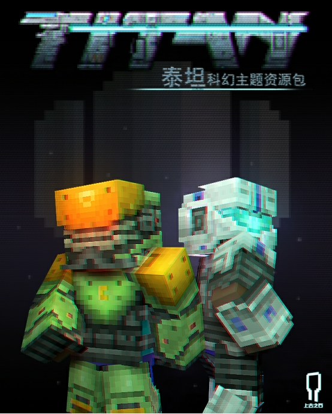

#### 在本章课程，您将学到

- 宣传图片构图、色彩与元素的设计
- 宣传视频的展示方式与包装
- 其他宣传素材的准备与建议

## banner封面图片构图排版（包含电脑版与手机版）

**banner封面图** 是玩法的核心展示图片。 **banner** 的美观度和表现出的内容质量将决定引流的效果，在玩家论坛、社区、新鲜事等板块进行宣传，好的 **banner图** 决定了玩家对你内容质量的第一印象。

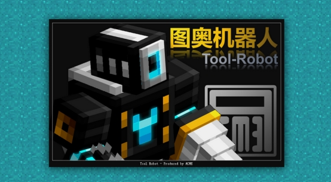

一般 **banner** 的设计排版最常见的是如下的结构，大标题与副标题相辅相成。这类排版适用于突出玩法主题、美观、且具有一定视觉冲击效果的 **banner图** 。

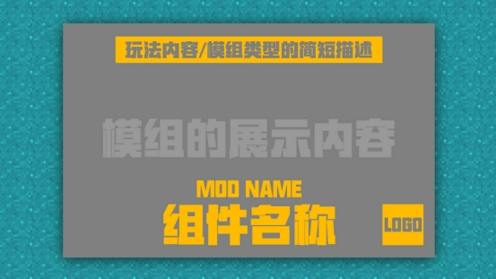

### 字体类型与颜色选择

字体建议尽量使用粗体的字体，可尝试使用与官方logo接近的字体样式，并且建议选择可商用的开源字体。

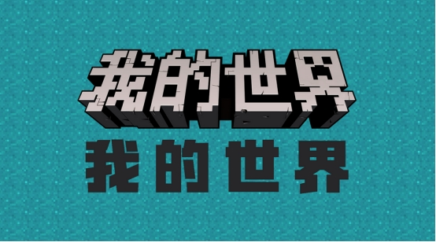

在不使用立体字体设计的前提上，一般建议选择渐变色来做平面字体，渐变也选择纯色渐变，后期能掌握好色彩搭配原理，可挑战其他色彩跨度大的渐变。

### 轮播图细节展示

轮播图被称作 **组件页内的banner** ，是一个能更详细展示组件特色的地方。

但注意不要在轮播图里放大段的使用说明，尽量展示纯游戏内的组件效果和组件特色图，引起特定部分玩家的兴趣，就是轮播图最大的作用。

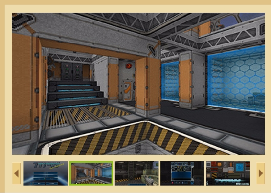

### 新Icon图片构图（手机版）

**新icon图** 是《我的世界》手机版中，资源中心区域组件展示给玩家的第一张图，它的主要功能在于给玩家传递第一印象，即看到 **icon** 能够判断，这组件是什么风格及类型模组。

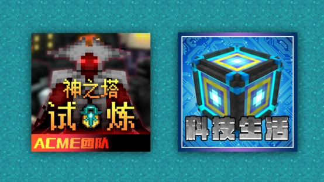

对于 **icon图** ，一般建议不堆叠过多元素，能在资源中心一众 **icon展示图** 中脱颖而出，成功吸引到玩家为最好。

以下为 **资源中心icon图** 简单一览：

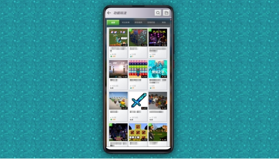

首先 **icon图片** 可以被划分为多个区域，这里建议是划分为3个区域：

**区域1** 会被平台评分内容遮挡，所以规避在右下角放置关键元素，也注意组件文字不要被评分遮挡到，会影响到整体美观。因为 **评分（区域3）** 的设定， **区域2部分** 是比较突兀的，所以最合适的处理方式是在底部拉一个小横条出来，将评分一起融合进整个icon图里，达成整体视觉效果。

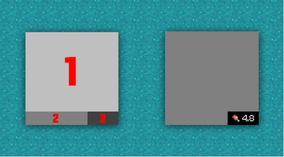

**提示：小横条的位置可以加上团队/工作室名字，也可以写组件名称或玩法类型。小横条与文字的配色选定后，可以让它作为工作室作品的特征标识存在，方便玩家认知和记忆。**

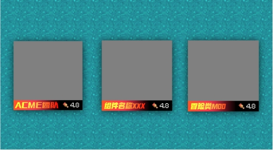

### POS图片

**POS图** 会出现在最后购买的结算界面。POS图需要传递的信息很简单：

- 感谢冒险家的支持，希望冒险家能关注工作室后续作品，或加入工作室讨论组。
- 预防冒险家余额不足，可提醒有其他渠道获取钻石。

制作建议：POS图的内容可以不用与组件内容相关，但需要具有一定的通用性和标志性。

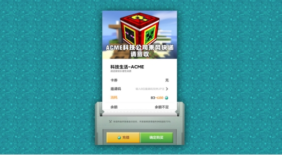

## 宣传视频展示和包装

在制作宣传视频展示的过程中，首先要纳好宣传视频想要展现的玩法内容主次。建议可以使用文档进行策划排序，然后根据策划内容进行录制和剪辑。草稿策划如下：

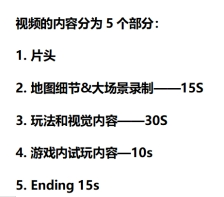

将玩法中最具特色的、趣味性或视觉的地方进行录制，以最大化地展现自己玩法的优点。

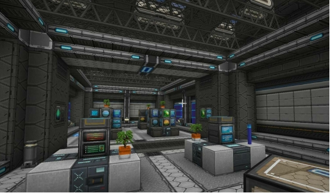

在视频的包装中，可以根据视频本身进行优化和调整，并且将视频的封面可以和banner进行统一风格化。可以更好地提升玩法宣传的完整性和统一性。

## 其他宣传素材的准备与建议

当然除了以上的宣传素材之外，我们还可以在准备一点放在组件简介内的宣传图片。

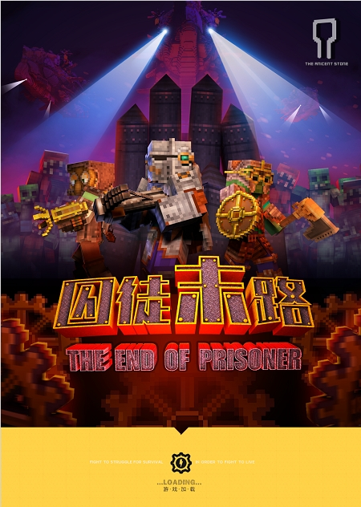

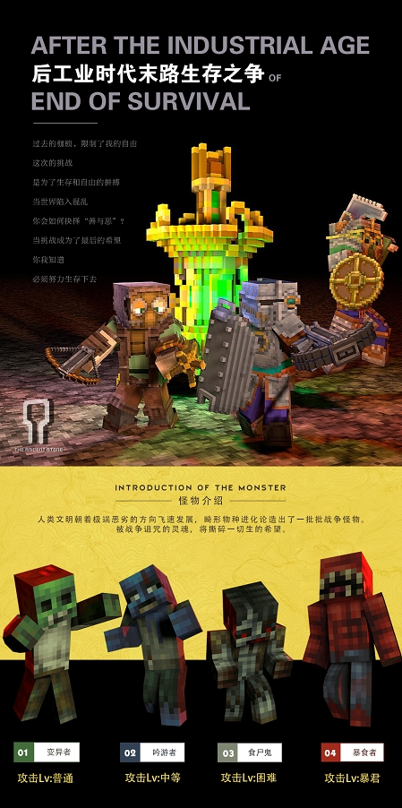

在组件内通过更详细的专题页设计来进行更综合性的介绍和展示，可以让通过宣传图被吸引进来的玩家们，进一步地来了解组件的更多细节。
