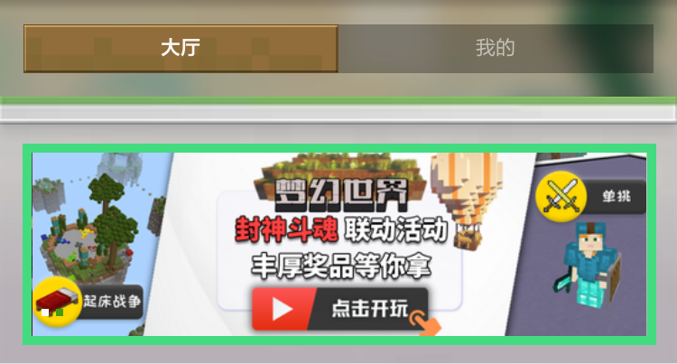
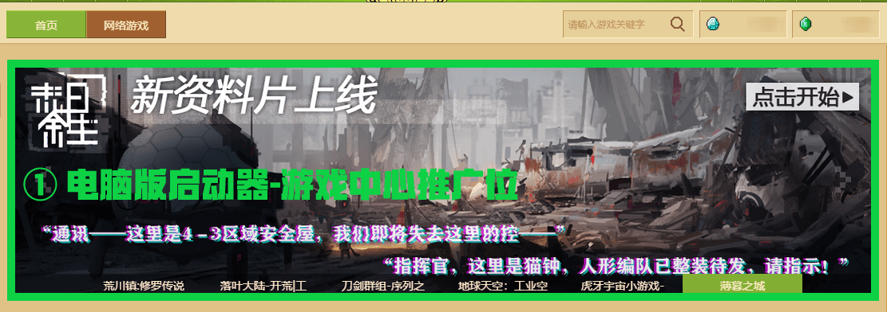
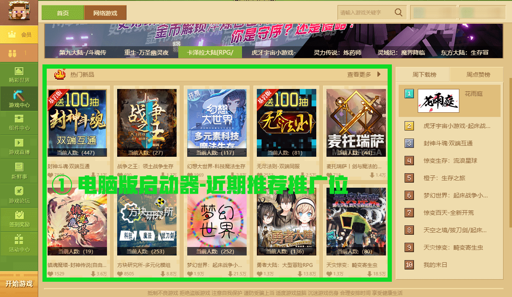

# 作品在游戏内的推广资源申请

《我的世界》开发者平台已接入自助申请游戏内多类推广资源的功能。游戏内提供多个流量推荐位来帮助您 **推广您的作品** 、 **吸引粉丝群** 并 **扩大您的受众群体** 。合理利用《我的世界》游戏内推广资源，您可将作品推至首页第一线，更好地提升作品的曝光量。结合推广资源周期曝光的特点，当推广时间覆盖节假日、小长假，则优秀的资源更容易在较短的时间内获得更多的流量。

#### 在本章课程，您将学到

- 认识手机版与电脑版的推广资源类型与入选形式。
- 了解推广资源的申请、竞拍规范与建议。
- 懂得如何参与作品推广节点活动。

## 推广资源类型与入选形式

### 手机版

| 网络游戏                                     | 资源中心                                     |
| -------------------------------------------- | -------------------------------------------- |
|  |  |

- 入选形示： **资源中心首页顶部** 与 **网络游戏首页顶部** 。
- 推广位数量：资源中心首页的顶部轮播图将提供4个申请位，网络游戏首页的顶部轮播图将提供3个申请位。
- 推广位播放形式：每次进入页面时，轮播图顺序打散，按照顺序播放。
- 资源类型：资源中心Banner位支持展示网络游戏与资源组件，网络游戏Banner位支持展示网络游戏。

### 电脑版

| 首屏弹窗                 | 精彩世界                 | 游戏中心                 |
| ------------------------ | ------------------------ | ------------------------ |
|  |  |  |

| 组件中心                 | 近期推荐                 |
| ------------------------ | ------------------------ |
|  |  |

- 入选形示： **精彩世界首页顶部** 、 **游戏中心首页顶部** 、 **游戏中心近期推荐（原热门新品）** 、 **组件中心顶部** 与 **客户端启动时的首屏弹窗** 。
- 推广位数量与展示资源类型：电脑版推广位支持 **申请** 与 **竞拍** 两种形示，不同的推广类型展示数量与展示资源类型略有不同，请查看下方表格。

| 是否支持竞拍 | 是否支持申请 | 可申请个数            | 可竞拍个数 | 推广位置         | 推广类型            |
| ------------ | ------------ | --------------------- | ---------- | ---------------- | ------------------- |
| ➖            | ✔️            | 5                     | 0          | 组件中心轮播图   | 资源组件            |
| ✔️            | ✔️            | 5                     | 1          | 精彩世界轮播图   | 网络游戏 & 资源组件 |
| ✔️            | ✔️            | 5                     | 1          | 游戏中心轮播图   | 网络游戏            |
| ✔️            | ✔️            | 4                     | 1          | 启动器首屏弹窗   | 网络游戏            |
| ➖            | ✔️            | 10+不限数量的新服位置 | 0          | 游戏中心近期推荐 | 网络游戏            |

- 推广位播放形式：除 **游戏中心近期推荐（原热门新品）** 外，玩家每次进入相应页面时，轮播图顺序打散，按照随机播放。 **游戏中心近期推荐** 的首页展示顺序将按照优先级进行排序，同优先级顺序下的网络游戏随机显示，优先级顺序分为 **新服** > **近期活动/更新** 。假设新服队列内的网络游戏无法占满近期推荐首页的前十个位置，将会采用 **近期活动/更新** 队列进行替补。

## 了解推广资源的申请、竞拍规范与建议

### 申请与竞拍规范

进入 **《我的世界》开发者平台** ，点击 **【推广与活动】** 模块，选择 **【手机版推广位申请/竞拍】** 或 **【电脑版推广位申请/竞拍】** 。

根据作品想出现的地方，在上方选择位置标签。接着在下方的标签分类上，选择 **【申请】** 或 **【竞拍】** 。

点击 **【返回可申请月】** ，日期列表将自动切换至可申请推广位的第一个申请月。

紧接着点击 **【申请】** 或 **【竞拍】** ，出现轮播图推广位申请表单。确定好推广类型，申请内容内可以选择 **已上架** 的作品名称。

接着继续填写 **【展示周内外联动或活动情况】** 、 **【组件/网络特色情况】** 和 **【展示周内是否有更新内容】** 。

<table style="border-collapse: collapse; width: 100%;" border="0" width="1091" cellspacing="0" cellpadding="0">
<tbody>
<tr style="height: 16.50pt;">
<td class="et2" style="height: 16.50pt; width: 123.75pt;" width="165" height="22">类型</td>
<td class="et2" style="width: 288.00pt;" width="384">分级</td>
<td class="et2" style="width: 54.00pt;" width="72">评分</td>
</tr>
<tr style="height: 16.50pt;">
<td class="et3" style="height: 49.50pt; width: 123.75pt;" rowspan="3" width="165" height="66">展示周内外联动或活动情况</td>
<td class="et2">跨组件、跨开发者或跨平台联动与活动</td>
<td class="et2">3</td>
</tr>
<tr style="height: 16.50pt;">
<td class="et2">签到/玩法小活动</td>
<td class="et2">2</td>
</tr>
<tr style="height: 16.50pt;">
<td class="et2">无明显联动或活动</td>
<td class="et2">1</td>
</tr>
<tr style="height: 16.50pt;">
<td class="et3" style="height: 49.50pt; width: 123.75pt;" rowspan="3" width="165" height="66">组件/网络游戏特色情况</td>
<td class="et2">明显创新特色、或是通过新的sdk功能实现特色玩法</td>
<td class="et2">3</td>
</tr>
<tr style="height: 16.50pt;">
<td class="et2">小量创新</td>
<td class="et2">2</td>
</tr>
<tr style="height: 16.50pt;">
<td class="et2">特色不明显，或无明显特色</td>
<td class="et2">1</td>
</tr>
<tr style="height: 16.50pt;">
<td class="et3" style="height: 49.50pt; width: 123.75pt;" rowspan="3" width="165" height="66">展示周是否有更新内容</td>
<td class="et2">基础玩法或框架扩展</td>
<td class="et2">3</td>
</tr>
<tr style="height: 16.50pt;">
<td class="et2">原有玩法</td>
<td class="et2">2</td>
</tr>
<tr style="height: 16.50pt;">
<td class="et2">小型维护与debug，或无更新</td>
<td class="et2">1</td>
</tr>
</tbody>
</table>

若存在其他诉求，可以在 **【其他申请情况说明】** 栏目下补充说明。

不同的位置需要不同的轮播图素材，相应尺寸在提交表单均有提示。 点击 **【上传轮播图素材】** 后即可提交申请。将鼠标悬浮在轮播图素材上传入口，可查看到素材在客户端内实际预览的效果。

### 提交申请时的一些建议

在您注明申请的作品是新组件、新服时，官方会在 **【展示周是否有更新内容】** 上酌情加分，同时能很好阐述特色的，在收到申请提交时有更大概率成功。

详细填写 **【展示周内外联动或活动情况】** 、 **【组件/网络特色情况】** 和 **【展示周内是否有更新内容】** 有助于提高推广位申请成功的概率，三者将作为官方下放推广资源的 **重要参考指标** 。

**若内容较长且需要引用更加丰富的富媒体进行说明，可提供视频链接、外部文档链接。** 请在填写说明内容时 **务必对好说明类型** ，以便使审核人员更好地了解您提交的作品内容。

## 了解活动参与推广

进入 **《我的世界》开发者平台** ，点击 **【推广与活动】** 打开下拉表，点击下拉表中的 **【活动参加】** 按钮，即可进入 **【活动参加】** 管理界面。

该模块主要为面向全体开发者征集的作品特卖折扣活动。当有活动举办时，您可以将自己符合活动的作品勾选上，并点击添加按钮，即可成功送审活动组件，官方将在一定的工作日内进行审核，符合条件的组件即可成功参加特卖活动。

