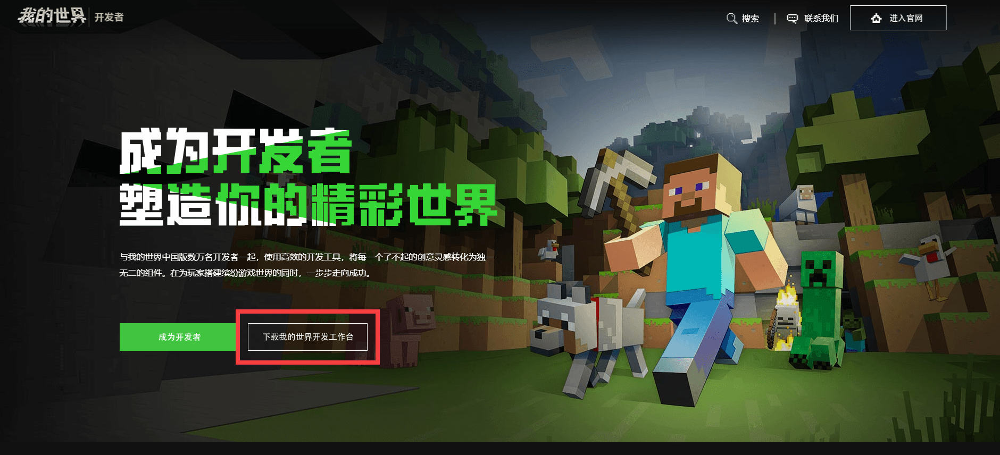
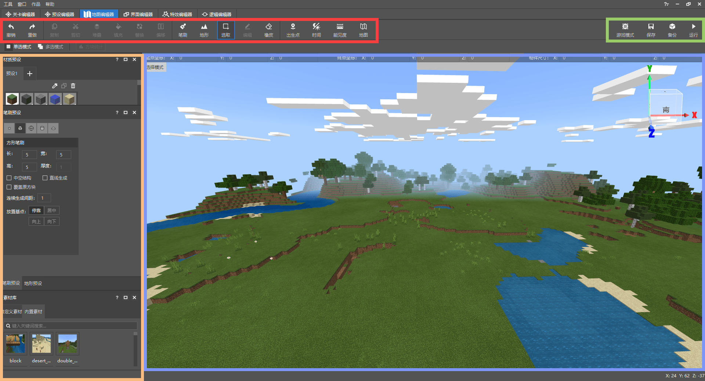
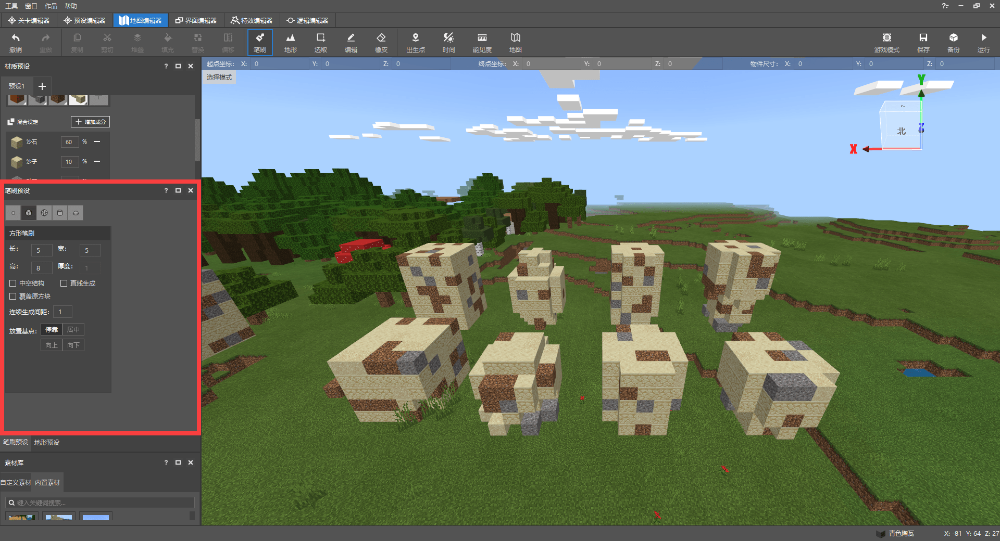
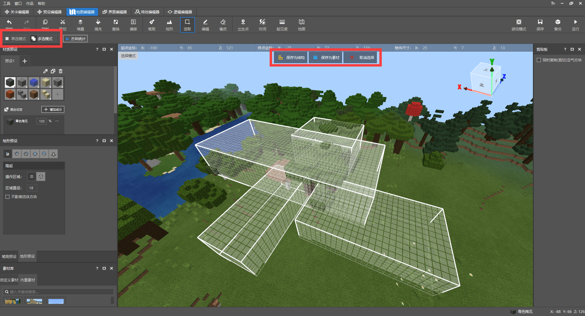
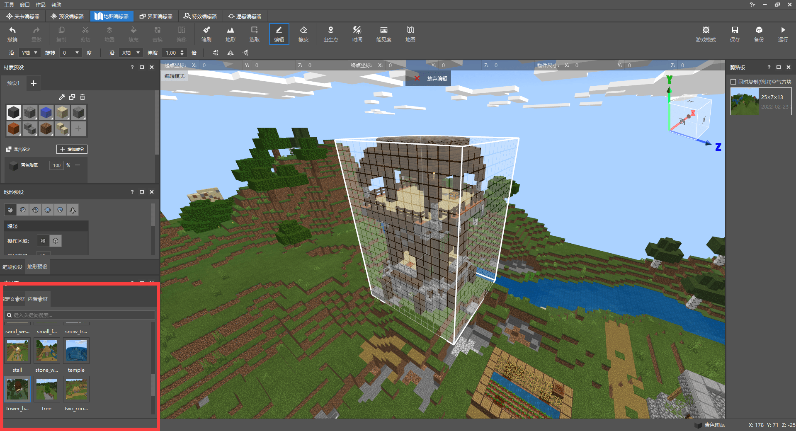
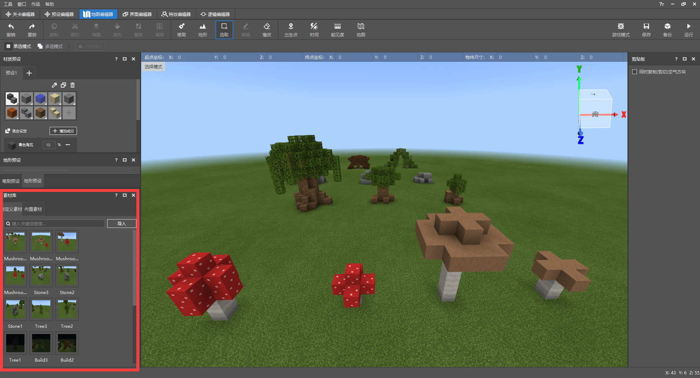

# 什么是开发工作台？

<iframe src="https://cc.163.com/act/m/daily/iframeplayer/?id=624583ef75882ab49558bce9" width="800" height="600" allow="fullscreen"/>

在[我的世界开发者官网](https://mc.163.com/dev/index.html)主页上可以下载我的世界中国版开发者们的“利器”：**我的世界开发工作台**。

开发工作台集成了多种开发者需要常用的功能：新闻资讯、开发动态、收益数据等...；最重要的是它提供了便利的开发工具，可以使组件开发变得更加简单、高效。

## 打开并使用编辑器

在创作栏中，新建一个空白地图；创建后在作品库的基岩版组件中找到新建的地图，点击编辑即可打开编辑器。

打开编辑器会默认切换到地图编辑器，算上它一共有6种编辑器：

- 关卡编辑器：新建自定义游戏内容（物品、方块），提供放置预设、特效等的舞台；
- 预设编辑器：创建零件、预设并对其编辑；
- 地图编辑器：对地图的地形、建筑等进行修改。保存结构、素材以便复用；
- 界面编辑器：制作UI界面；
- 特效编辑器：制作粒子、序列帧特效；
- 逻辑编辑器：编写可视化蓝图代码。

以上6种编辑器在开发中都有或多或少的用处，在本章中将介绍地图编辑器，讲解如何使用地图编辑器制作建筑并保存为素材方便后续使用。

## 地图编辑器

点击编辑后，会默认打开地图编辑器；

如图所示，红色框内为工具栏，我们将使用这里的工具进行制作；橙色框内有笔刷材质、笔刷预设以及素材库，制作好的建筑可以保存为素材，在素材库中随时调出使用；蓝色框则是游戏画面，移动飞行等操作均和游戏内一致；绿色框内则有一些附加的功能。

### 笔刷工具

选择笔刷工具，在**材质预设窗口**和**笔刷预设窗口**调整笔刷的材质和大小，然后点击地图任意位置即可放置方块，同时也支持拖动鼠标一键放置多次。

材质预设窗口还可以使用吸管吸取点击的材质；也可以将材质混搭，同时刷出多种方块材质，让地形更加自然。

笔刷还可以选择形状并调整长宽高，在笔刷预设窗口选择，分为：单点笔刷、方形笔刷、球形笔刷、圆柱笔刷、半球笔刷。其它功能也有其用处，合理运用，事半功倍：

- 中空结构：笔刷生成的形状内部为空气。
- 直线生成：选择两点，在这两点形成一条线生成形状。
- 覆盖原方块：笔刷将会对操作的原方块进行替换。
- 连续生成间距：在拖动放置时，与上次生成形状的距离。
- 放置基点：基于笔刷点击位置，选择形状将会生成在哪一侧。
- 放置方向：旋转笔刷的形状。

### 地形工具

地形工具可以对地形进行调整，如平滑、侵蚀等；下一章节将会对地形工具着重介绍，在这里不多赘述。

### 选取工具

选择选取工具后，拖动鼠标即可划出范围，在选取后，可以按下选区的某个边进行放大或缩小或是拖动对应XYZ轴的箭头移动。

多选模式还可以一次调整多个选区，更加便利。

在选择选区后可以将选取内的方块保存为结构或保存为素材，结构可以通过feature在世界中随机生成。素材会保存在编辑器中，就算切换地图，这些素材依然可以使用。除了开发者自己保存的素材，编辑器内还有一些内置素材，这些素材均来自原版的结构：村庄房屋、林地宅邸、沉船等。

当有了选区后，我们可以对选取进行下一个工具的编辑操作。

### 编辑工具

编辑模式下，工具栏一直处于灰色无法点击状态的6种工具亮了起来，这些工具是基于编辑工具使用的。我们将这棵树框选起来，接下来就可以对这个选区内的树进行如下操作：

- 复制：保留选区内的方块，复制出一份可以任意放置的素材。
- 剪切：清空选区内的方块，复制出一份可以任意放置的素材。
- 堆叠：将选区内的方块以某个方向连续复制，直接放置。
- 填充：将选区用某个方块填满。
- 替换：替换选区内的某个方块为另一个方块，如：草方块 -> 泥土
- 偏移：使选区向任意XYZ移动，不影响选区内的方块。

复制，剪切操作还会在编辑器右侧的剪贴板中留有记录，如果不小心误操作，还可以通过剪贴板选择回来。

### 橡皮工具

点击或拖动，即可清除地图中的方块：

## 制作建筑并保存为素材

接下来，我们使用地图编辑器制作一些建筑装饰，并且使用选取工具将它们框选起来保存到素材库中。

如果提前做好了建筑，可以将存档导入到编辑器中再进行保存；点击 **本地导入-选择存档-导入**。接下来再找到导入的地图点击编辑，就能看到提前做好的建筑了。

当然也可以利用地图编辑器直接开始制作。使用半球形状的笔刷，在材质预设中添加多种方块：石头、原石、青色陶瓦等并调整混合比例，简单修改大小、放置基点和放置方向，随便点两下；大小、材质形状不一的石块就出来了。

*编辑器的窗口可以随意拖拽放置，为了看的更直观，图片中把材质预设窗口放在了右侧*

还可以使用单点笔刷或是橡皮工具微调，亦或是点击右上角的游戏模式进入到地图中亲自修改。

使用选取工具快速放置方块，在制作建筑的时候可以事半功倍，节省很多时间；不过一般适用于一些需要重复且大量的填充工作上，在一些小型的建筑上并不推荐，会适得其反。

下一章节我们会学习如何使用地形工具，到时也需要选取和编辑工具协同使用，所以地图编辑器的各个工具都是相辅相成的。

制作完建筑后，使用选取工具将建筑圈起来，并点击上方的保存为素材并修改名字，然后就可以在自定义素材库中看到了；去除空气和去除流体如字面意思，就是在保存素材的时候是否将空气和流体（水、岩浆）也保存进去，将由开发者视情况决定。

**课后作业：** 尝试使用地图编辑器制作建筑、装饰，或是导入外部存档，将制作的建筑保存为素材。
