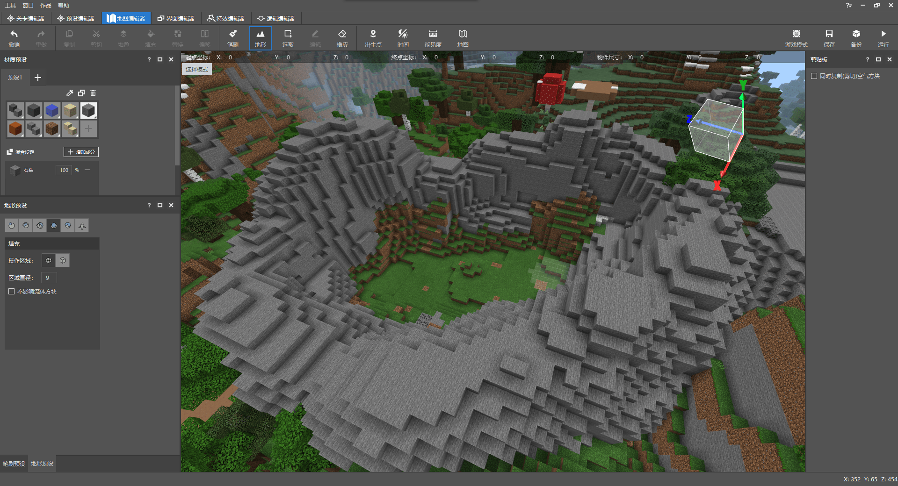
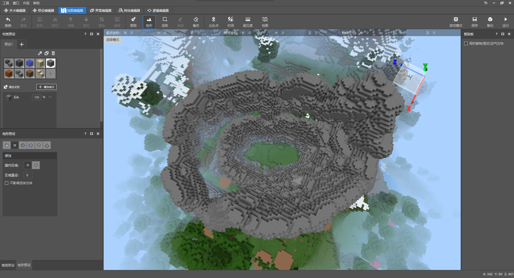
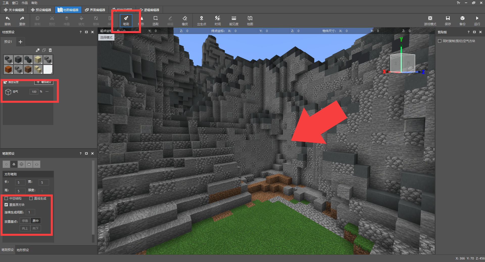
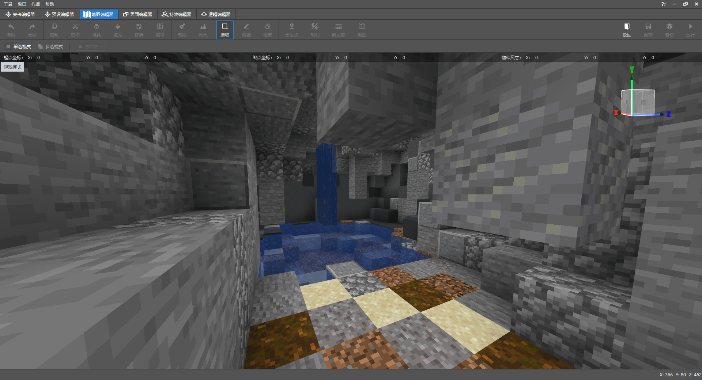
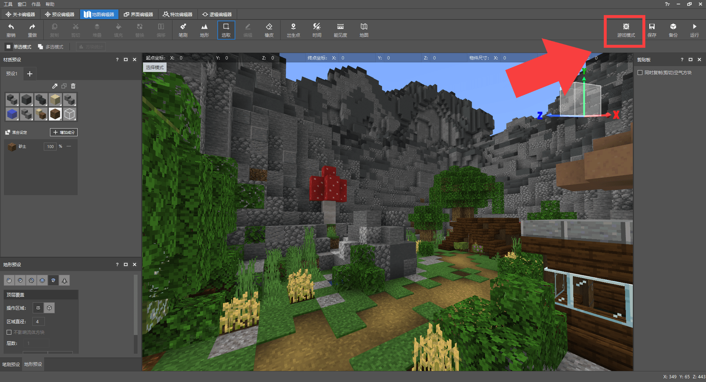

# 游戏场景在玩法地图中的地位

<iframe src="https://cc.163.com/act/m/daily/iframeplayer/?id=6245844875882ab49558bcef" width="800" height="600" allow="fullscreen"/>

在第一章内容中，我们介绍了组成一张玩法地图必备的要素，其中就包括：游戏场景。简要来说可以分成地形+建筑，捏造好地形，在地形中“贴上”建筑，就已经形成游戏场景了。

场景在游戏地图中是非常重要的，玩家进入游戏后第一步就是欣赏游戏场景，在游玩过程中也无时无刻不与场景打交道；建筑大观类型的地图中，只有场景建筑，没有任何玩法，即使这样也有很多玩家愿意花费时间欣赏和体验，所以这就是为什么玩法地图需要打磨好场景。

*以《我的海滨农场》举例，地图场景由岛屿地形（灰色部分）和建筑（彩色部分）组成；而海洋则充当边界的身份。*

建筑方面，无论是在地图编辑器中使用工具制作，还是进入存档手动制作都是由开发者亲自设置的方块组成在一起，一步一步拼接起来。而地形不太一样，使用地形工具可以快速生成大量的方块并由开发者调试；本章就要教大家如何使用编辑器的地形工具制作地形并简单介绍地形软件WorldPainter。

## 地形工具

打开地图编辑器，在工具栏中我们可以找到地形工具，同时还会有一个“地形预设”窗口。我们可以使用这些预设捏造地形：

- 隆起：将地形慢慢鼓起，层层堆叠越来越高。
- 侵蚀：逐渐削减地形方块直至平面。
- 平滑：使地形摩擦的更加平滑，坡度更加自然。
- 填充：可以将坑洞填充起来，直至平面，和隆起类似。
- 顶层覆盖：通过材质预设选择方块，并在地形顶部涂刷。
- 植物：点击生成原版的植物。

除植物外这些预设都可以在预设窗口调整操作的区域为圆形或方块、调整区域大小、是否影响流体方块（勾选后地形工具则会避开流体）；

### 隆起

点击地面，可以使地形慢慢鼓起来，点击范围内的方块决定隆起的方块材质；

### 侵蚀

与隆起差不多相反，每次点击或按住，地形则会不断被削减，直至成为平面。

### 平滑

使参差不齐的地形逐渐平滑，平滑的标准与原版生成的地形类似。

### 填充

对坑洞使用，可以很快将其堵实，如果一直在同一位置点击，填充为平面后将不会继续向上堆叠，这点与隆起不同。

### 顶层覆盖

顶层覆盖可以在材质预设窗口选择方块，在点击的地方涂刷一层方块。与其它预设不同的是，顶层覆盖还可以选择涂刷的层数以及效果：顶层覆盖、顶层替换、表层替换；这三种效果略微有所不同。

### 植物

选择植物类型，点击即可生成（需要在环境事宜的方块上，如树木需要在泥土或草方块上）

## 捏造地形

接下来我们使用这个地形预设并配合其它工具捏造简单的地形。先使用选取工具从树林中清出一片范围：选取范围 -> 替换 -> 树叶和木头替换为空气。

### 山体

利用笔刷工具或是地形工具的隆起，圈起一片范围；随意一点，根据自己的想法任意捏造，圈起范围的这些石头就捏成山体，当然目前来看是完全无法使用的，非常不自然而且也完全不像山。

然后通过侵蚀，削减一些坡度，尽量让这些规则的球体看起来不再“规则”，更加自然。

这里需要提醒一下，捏造地形的方式和风格并不需要统一，每个开发者都有自己的想法，开发出的成品也是五花八门的；发散创意，也是开发中关键的一步！例如地形也完全可以不偏向自然、拟真，方方正正也是很好的选择：

*《丛林激流》Demo地图的大厅就是使用地图编辑器的笔刷功能制作的，整体看起来自然不违和。*

回到教程内容，继续在石头山体的外圈刷更高的山体，体现出重峦叠嶂的层次感。并且通过侵蚀、平滑使其更加自然。

若只有一种方块，山体会非常的单调、不自然；所以我们需要将其框选起来，随机替换一些颜色类似或是可以是山体更加自然的方块材质：石头 -> 石头60%，圆石20%，安山岩/磨制安山岩20%。整体替换后，再根据山体的坡度或是层数使用顶层覆盖涂刷其它材质的方块。

这个山体我主要在坡度的位置和山顶的位置分别涂刷了青色陶瓦和灰色混凝土、混凝土粉末方块，整体呈灰黑色调，没有过多地修饰，一眼看过去会觉得光秃秃的。开发者们在学习了方法以后，一定可以更好的利用工具制作好看的地形。

### 湖泊

因为山体内预留的空间较小，如果在这个范围内捏造一个湖泊，可能就没有其它的活动空间了，所以我打算从山体的某一位置掏出一个湖泊，类似溶洞的效果；

可以使用笔刷工具，将材质预设修改为空气，勾选覆盖原方块并且把放置基点调整为居中，这样我们就DIY出一个大型的橡皮擦。

掏出一个新的区域后，我们继续对其粉刷，使其更加自然，融入地形。

除此之外，我还在溶洞上方的山体上也挖除了一个小水池，并且将水池下方与溶洞打通，这样水就会流向溶洞的水池，形成关联。

至此，我们的地形就捏造的差不多了，现在整体来看，还是很荒凉，无论是山上还是盆地内，或是溶洞的水池，都没有任何其它的东西，于是，我们需要添加植被和自然景观。利用原版的花草、石锥等继续完善地形。

原版有大量修饰洞穴、溶洞的方块和植被，所以我们利用这些就可以装饰出好看的场景。

而山体围绕的区域内，还记得上一章节保存的树木、石头等素材吗，这时候就可以派上用场了。

直接在素材库内点击想要放置的素材，然后在编辑器中放置；点击地图中的某个位置，并不会让素材直接生成，而是以选区的方式显示，开发者还可以拖动XYZ轴微调位置，确定后再点击确定生成。如果不小心放置在了错误的位置，可以点击撤销按钮回退此步操作，也可以再次使用选取工具将放置的建筑框选起来并进行其它编辑操作。

把所有的素材按照自己的想法放置，目前来看，我们的场景已经有一个很不错的效果了；比较有意思的是，我们几乎没有依赖编辑器外的内容，而且制作的建筑等装饰都可以反复利用，也就素材复用。

如果对目前的效果依然不满意，还可以继续调整，点击编辑器右上角的游戏模式，手动制作吧。

## WorldPainter(地形工具)

WorldPainter是一个专用于Minecraft地形制作的软件工具，这个软件功能非常强大，熟练掌握该软件，各式各样的大型自然地形景观都没有问题。

WorldPainter官网地址：https://www.worldpainter.net/

在官网下载并安装后，打开WorldPainter主页面，可以看到软件内也有很多与编辑器相似的工具，除此之外还有很多编辑器并没有的强大功能；所以如果想要制作更专业、更庞大的地形，则非常推荐学习并使用WorldPainter。

不过WorldPainter仅支持对JAVA版游戏地图的导出，导出后只能运行在JAVA版游戏上，需要借助其它工具将存档转换为基岩版，推荐使用：[Chunker](https://chunker.app/)，它支持基岩版和JAVA版的存档格式，上传地图文件即可互相转换，还可以一键更改世界设置。

**课后作业：** 使用我的世界工作台地图编辑器完成简单地形捏造：湖泊、山体。
