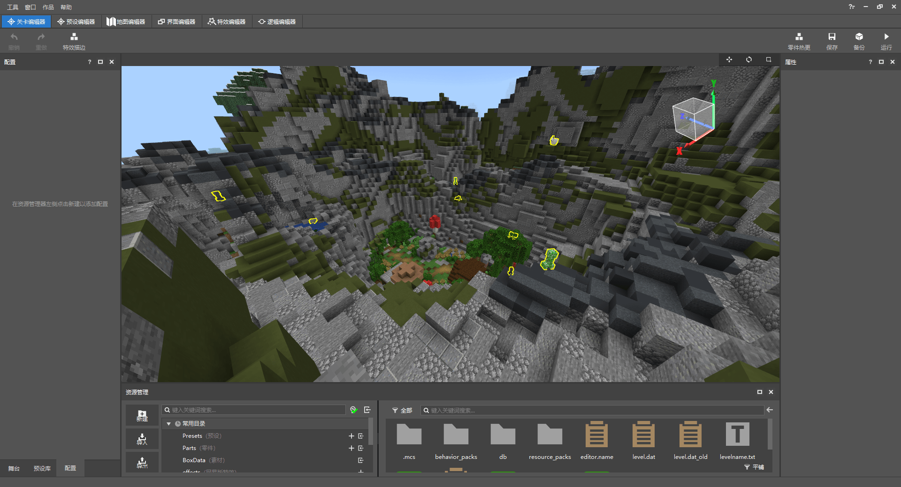
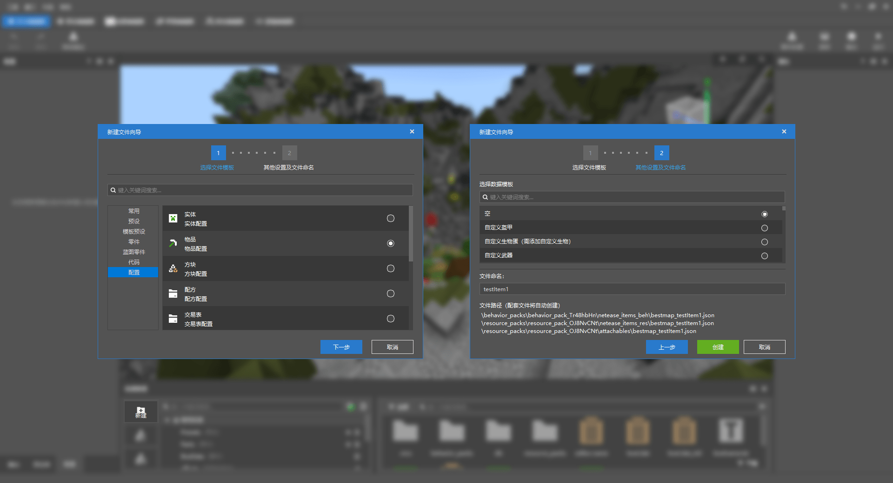
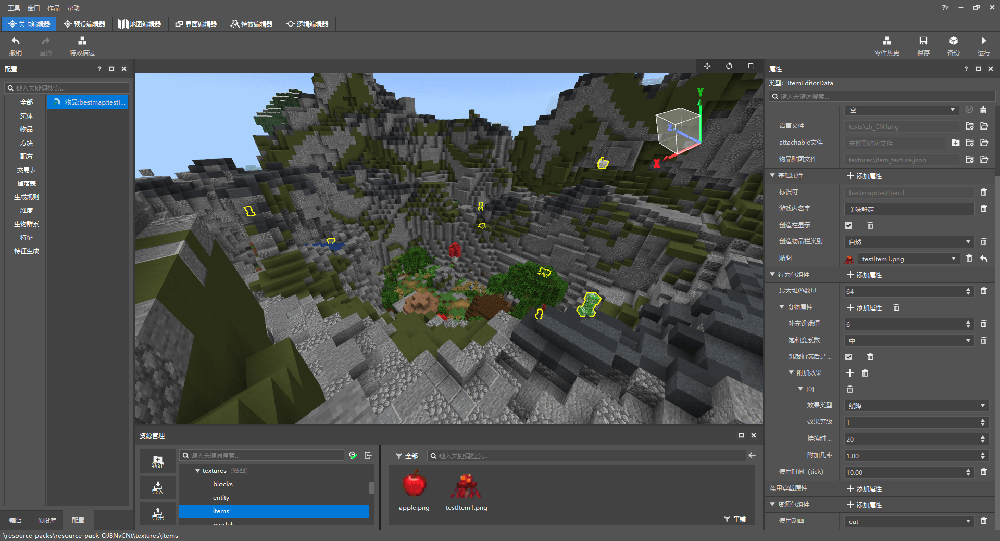
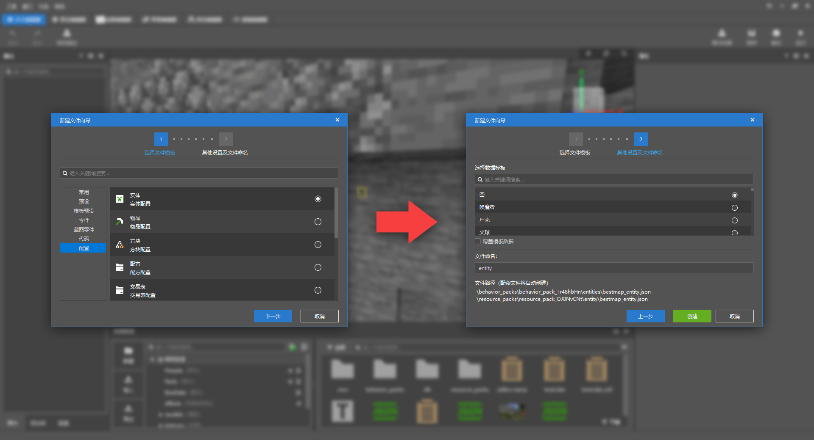
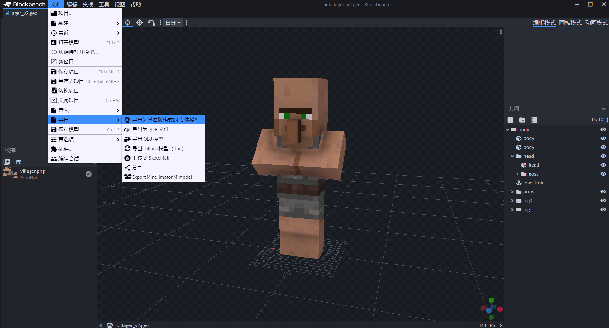
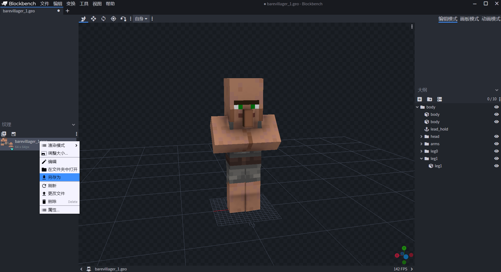
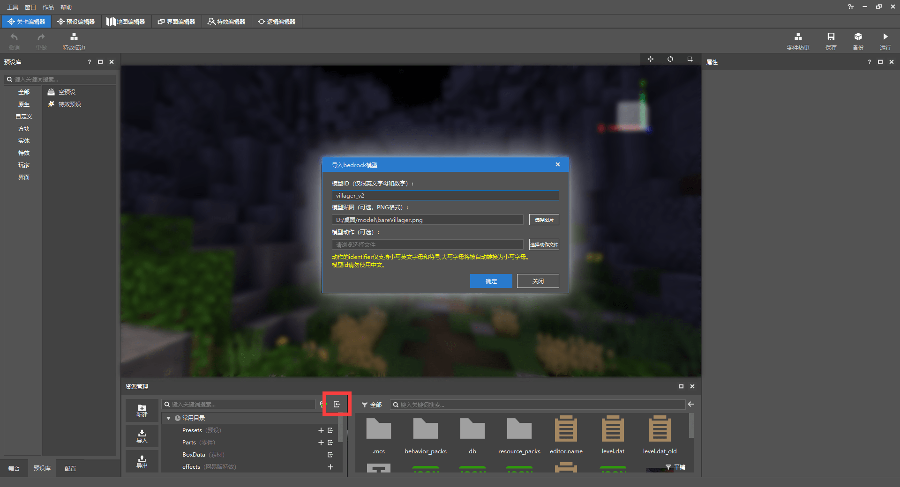
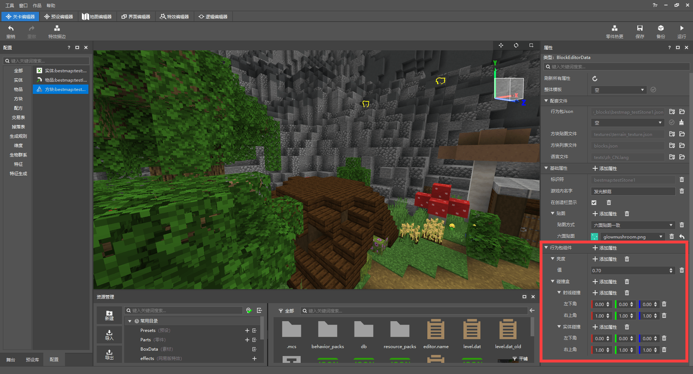

# 突破原版的束缚

<iframe src="https://cc.163.com/act/m/daily/iframeplayer/?id=6245852c48e274908924ef22" width="800" height="600" allow="fullscreen"/>

当我们制作玩法地图时，可能会用到大量的方块和物品，甚至是生物。但原版的内容是有限的，当我们不再满足于原版的内容后，就需要额外添加更多。所以这章来介绍如何使用关卡编辑器快速创建自定义内容。

## 熟悉关卡编辑器

关卡编辑器主要有三个窗口： **配置、属性和资源管理窗口** ；同样重要的还有预设库(显示创建的预设)和舞台(预设放置在地图上后出现在这里)。

在关卡编辑器创建的自定义内容都将在配置中找到，点击某一个，就可以看到它的属性；而资源管理窗口就是可以快速找到地图文件（上一章中的资源包也可以在这里找到）

*实体在地图编辑器中不显示，在关卡编辑器中显示且会被黄色框选中*

## 新建自定义内容

在资源管理窗口的左侧点击新建，选择配置，新建一个空模板物品并为其文件命名。点击创建后就可以在配置窗口中看到了。自定义内容由命名空间和名称组成（不能为中文），例如：bestmap:Item1。

创建完后，在左侧配置窗口中选择后，可以修改其属性； **以物品举例** ，分为：

- 配套文件：可以快速打开该物品的文件和所在文件夹。
- 基础属性：修改物品名称、贴图文件等。
- 行为包组件：为物品添加行为上的特性和功能。
- 盔甲穿戴属性：设定物品为穿戴装备时的特性。
- 资源包组件：为物品添加资源效果上的特性与功能。

我们为这个物品添加一些基础属性，点击 **添加属性** 按钮，把可以选择的基础属性都添加上，并修改成名为美味鲜菇的食物并且使其会在创造栏中显示。物品贴图则是用原版的蘑菇简单修改一下。

在行为包组件为其添加食物属性、堆叠数量和使用时间；资源包组件中添加使用动画。最后属性窗口和效果是这样的：

按照这种方法，添加其它功能的自定义物品、自定义方块也都非常简单。编辑器内置了大量的特性和属性供开发者自由搭配，总能创造出不一样的效果！

### 自定义实体

新建物品或方块只需要画出它们的贴图，一般为16x16像素的图片。但游戏中的实体（也叫生物）和物品不一样，它们需要模型才能显示在世界中，点击新建-配置-实体配置，创建一个空模板的自定义实体；

除了空模板外，还可以选择“数据模板”，数据模板是编辑器预设好的实体配置，若是选择数据模板，创建后默认会有该模板的属性。

在资源包组件中可以看到 **模型** 和纹理，这是实体必须设置的；制作模型和绘制贴图需要利用其它的软件制作，完成后再导入到编辑器中，这里推荐使用     **BlockBench** ，它是一款简便易用的模型设计软件，十分适合萌新开发者快速上手制作模型。

BlockBench官网：https://www.blockbench.net/

安装并打开BlockBench，新建基岩版模型

接下来就可以开始新建块并制作模型；还可以在原版的资源包中找到原版生物的模型（生物模型路径：···\models\entity），在blockbench中打开可以详细看到原版的生物模型是如何组成的，对于新手开发者的参考学习是有很大帮助的！

模型制作完成后，连同贴图导出，模型为json文件，贴图为png格式的图片。

*导出模型*文件到本地

*导出贴图图片文件到本地*

在编辑器的资源管理窗口，点击导入 **BlockBench-json模型（生物）** ，修改模型的ID并选择对应贴图。

导入模型后，将模型和贴图应用的自定义实体上；如果在编辑自定义实体的组件时遇到困难，还可以使用模板一键替换原版实体的属性，然后只需要简单修改就可以了。在新建实体时就可以选择数据模板，创建后默认会有该模板的属性；或是在实体的属性窗口中选择整体模板并点击“对号”按钮刷新。

选用僵尸的模板，删除其攻击相关的属性并修改为刚刚导入的模型和贴图，这样就做好了，点击运行进入到游戏中测试一下：

### 自定义方块

和物品与实体的方法一样，点击新建-配置-方块配置；在关卡编辑器中，大部分的原版自定义内容的创建方法都差不多，所以只需要简单的学习就可以掌握这些方法并进行开发。

创建一个自定义方块，绘制并选择贴图，在行为包组件中添加亮度和碰撞盒，就可以制作出一个发光的方块。

值得注意的是，方块的贴图方式有两种： **六面贴图一致** 和六面贴图自选，其功能与名字一样。前者只需要绘制一张贴图，方块的 **六个面（上、下、东、南、西、北）** 都为这一张贴图；若为后者，则可以绘制最多6张贴图并分别设置。想要实现一些方块的效果就需要注意改变贴图方式，如原版的工作台、书架和熔炉。

**课后作业：** 绘制方块、物品的贴图并使用关卡编辑器添加到游戏中；制作模型并尝试新建自定义实体或覆盖原版实体模型或贴图。

