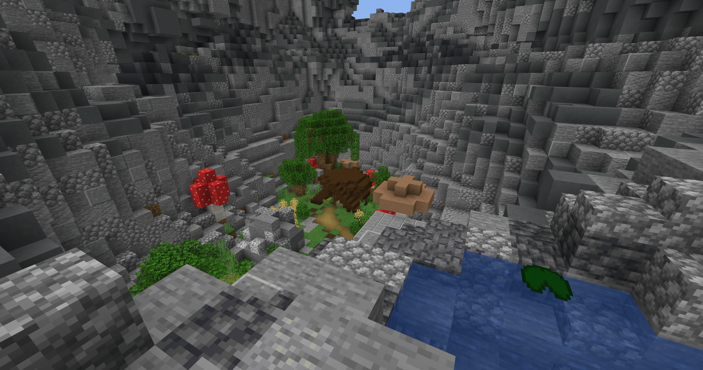
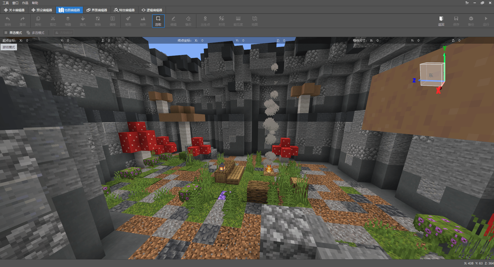
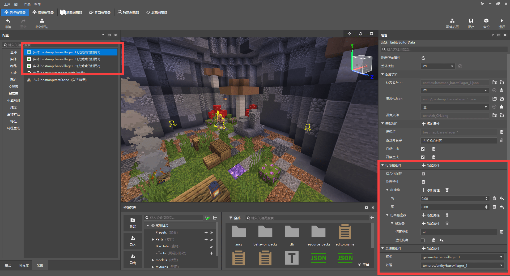
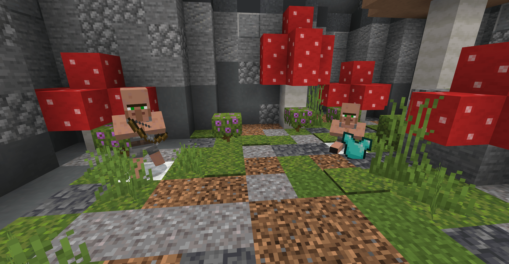
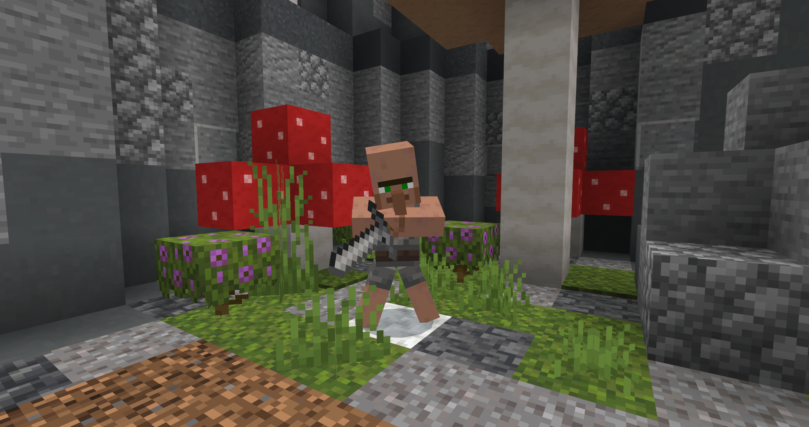
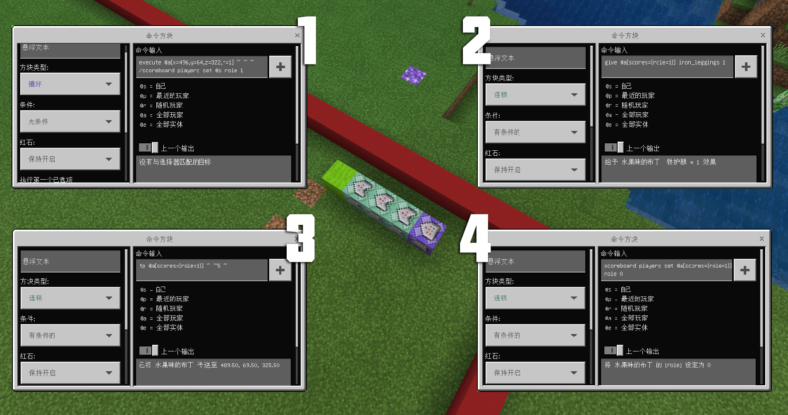
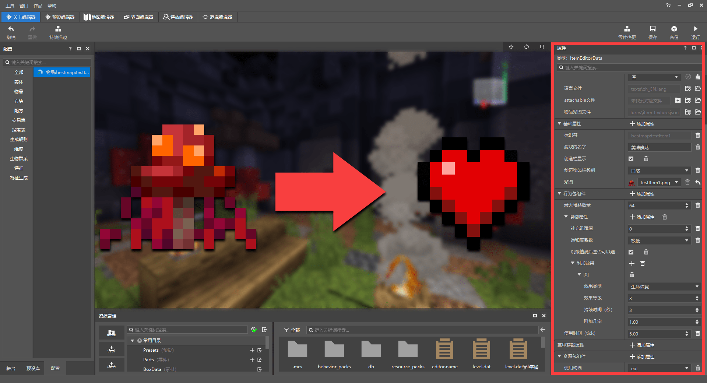
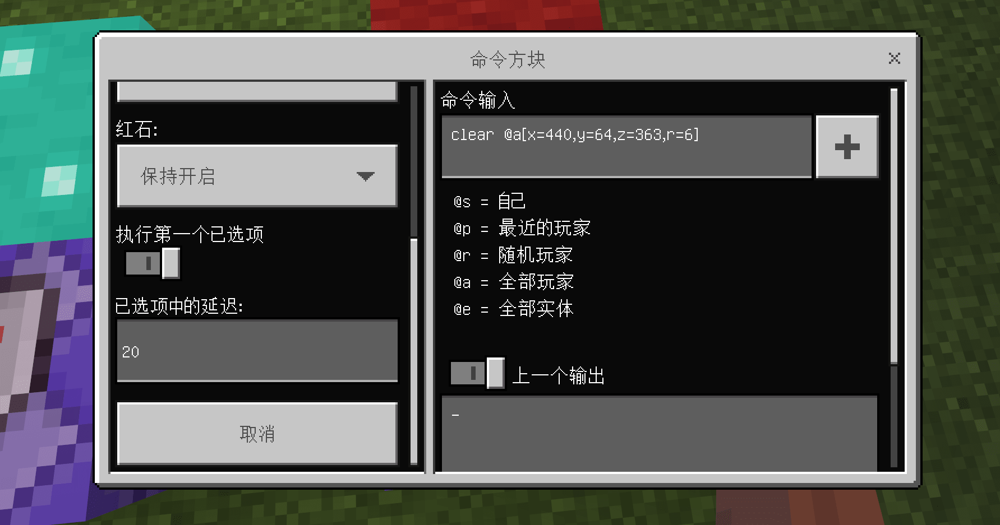
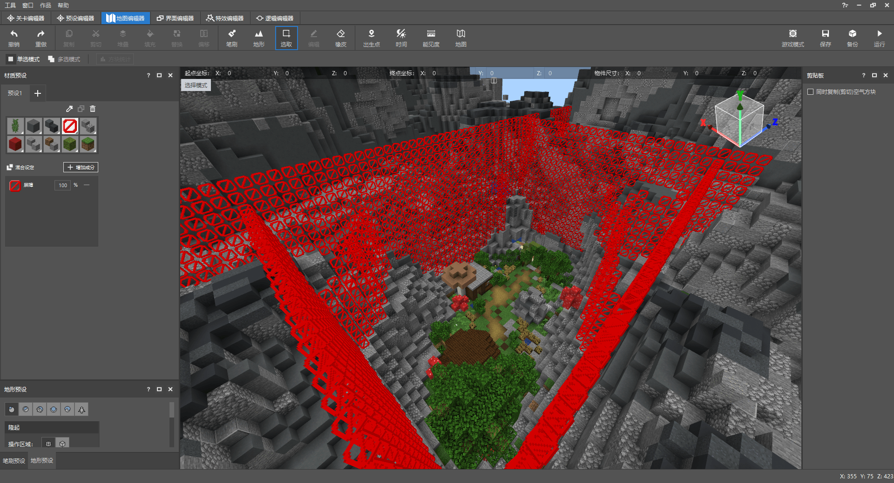

# 正式开始制作玩法地图

<iframe src="https://cc.163.com/act/m/daily/iframeplayer/?id=624585cdb647e504b5299d90" width="800" height="600" allow="fullscreen"/>

在前面的章节中我们已经知道了什么是玩法地图，学会了制作地图场景、利用命令和命令方块制作简单的玩法功能、通过修改资源包改变场景的视觉效果、添加自定义内容。

掌握了这些技巧，我们就可以准备实战，从零开始制作一张玩法地图了。

## 地图设想

遥望我的世界的各种经典玩法，能够长久不衰一直被玩家喜爱的玩法就是小游戏（Minigame）。甚至一些生存服务器内也会有一些小游戏活动。而在小游戏大类中，KitPVP（职业战争）则是出类拔萃的玩法。所以本章的内容，我们就来利用玩法地图制作职业战争小游戏。

游戏场景就利用前面章节已经制作好的地图：



 玩法方面，玩家可以在大厅中选择职业并在进入战场（游戏场景）时获得职业的装备，玩家需要利用装备与其它玩家对战。在此玩法上可以有两种分支：

- 游戏单局进行，玩家同时加入：当所有玩家准备好并选择完职业后开始游戏，仅一条命，活到最后的玩家获胜。
- 游戏持续进行，玩家任意加入：玩家选择职业后可自行进入游戏场景，不设复活限制，也没有获胜条件。

前者可以使玩法更具体，更有竞技性；而后者更倾向PVP战斗的爽快体验，玩家可以在复活后第一时间再次回到游戏场景中加入战斗。这次我们选择后者，不过在制作过程中也会讲解前者的思路。

## 制作大厅

因为是小游戏地图，所以我们需要先建造一个大厅，玩家在加入游戏或战败复活后会来到这里选择职业进入游戏场景。



利用地图编辑器的笔刷工具选择圆柱笔刷，围上一片区域，方块材质则与游戏场景的地形风格类似，在区域内放置一些复用的素材（蘑菇、石堆），在玩家出生点位置搭建了一个篝火营地（紫水晶方块用于标记玩家出生位置）。

在BlockBench中分别制作3个NPC模型，这里修改了原版村民的模型动作，添加了物品用来区分NPC对应的职业。利用自定义实体在大厅展示职业信息。并且使用实体会比告示牌或其它文字引导更有魅力和生动。


分别导出模型和贴图后，切换到关卡编辑器逐个导入；自定义实体不需要太多属性，只要放置在大厅中就可以了，所以这三个实体就只有：持久化保存（实体不会消失）、物理特性（实体会受到重力影响）、碰撞箱（实体的宽和高）、伤害感应器（设置该实体不会被攻击到）。



三个实体的属性都类似，只有模型和贴图不一样，加入到游戏后，把他们分别放置在大厅的位置上：





## 添加玩法功能

在大厅中放置的三个NPC就是对应地图中的三个职业，当玩家靠近NPC时将会选择该职业并传送至游戏场景。

选择一处区域用于存放制作功能的命令方块，一般会选择玩家不会看到或是发现的区域，所以不推荐放在游戏场景附近。


场景都是封闭的，所以我直接把命令方块选择放在大厅的附近，各位开发者在参考学习的时候也能很快找到这里。

对于命令方块的区域有一个关键点是需要注意的，当某个区块附近没有玩家存在的时候，系统会自动卸载该区块，若是命令方块的区域被卸载掉，命令方块也就无法再生效，所以我们需要使用一条命令来设置区域为常加载状态，这样就不会被卸载区块。

```命令
玩家手动输入：
/tickingarea add <xyz> <xyz>
小提示：<xyz>为常加载区域的坐标，通常为方体区域的左下角和右上角，通过两点坐标来构成方体区域
	   坐标可以在游戏中开启显示或是选择某个方块在地图编辑器的右下角看到该方块的坐标
```

### 使用命令方块制作功能

先输入一段命令 **新增职业计分板** ，用来给玩家贴上职业标签；通过修改玩家计分板的数值来给玩家贴上 **职业标签** ，例如：1 - 重甲职业 2 - 箭矢职业 3 - 突破职业 0 - 未选择职业

```命令
玩家手动输入：
/scoreboard objectives add role dummy 职业
```

然后记录NPC的坐标，使用 **循环命令方块** 检测玩家靠近NPC位置时给该玩家贴上职业标签。

```命令
循环命令方块：
/execute @a[x=?,y=?,z=?,r=1] ~ ~ ~ /scoreboard players set @s role 1
```

execute命令可以改变命令执行者和执行位置，通过目标选择器选择在某xyz坐标1格范围内的玩家并以该玩家执行命令。通过execute选择该玩家后，目标选择器就可以设置为@s指向自己。

在循环命令方块后连续放置3个顺序指向的连锁命令方块，用于给予玩家装备、传送到游戏场景和归置职业标签。



图中按指向顺序标出了1234的命令方块窗口，请注意一定要保证 **命令方块的指向** ，否则连锁命令方块会无法执行。

其中目标选择器的参数 **[score]** 代表判断该目标的计分板某标签分数用于判断职业，是重要的参数。图中的四个命令方块是实现此功能最基本的条件，若是想调整职业的装备，还可以在中间 **继续添加连锁命令方块** 给予物品即可。


每一条命令方块链可完成1个职业的功能，我们再继续添加2条，把选择职业并传送的功能完善。一个职业的完整的命令链如下所示：

```命令
循环命令方块：execute @a[x=443,y=64,z=355,r=1] ~ ~ ~ /scoreboard players set @s role 1
连锁命令方块：give @a[scores={role=1}] iron_leggings 1
连锁命令方块：give @a[scores={role=1}] iron_boots 1
连锁命令方块：give @a[scores={role=1}] leather_chestplate 1
连锁命令方块：give @a[scores={role=1}] stone_sword 1
连锁命令方块：give @a[scores={role=1}] bestmap:testItem1 3
连锁命令方块：tp @a[scores={role=1}] 352 83 442
连锁命令方块：effect @a[scores={role=1}] slow_falling 5 1
连锁命令方块：scoreboard players set @a[scores={role=1}] role 0
以上的所有命令方块均指向下一个命令方块
需要注意的是，在give指令中，若是给予自定义物品需要把自定义物品的命名空间和名称都写出，而原版物品可以省略命名空间"minecraft"。

```

传送玩家的坐标点设置在游戏场景的上空，并为传送过来的玩家设置缓降效果。


### 添加回复道具

不同的职业需要有不同装备和效果，如果原版的内容不能满足想法，就需要添加自定义内容来扩展，比如我想添加一种恢复血量的道具给所有职业或是某个职业，这时就需要添加自定义物品。

打开关卡编辑器，新建自定义物品，设置基本的属性，并为其添加食物属性（不补充饱食度仅添加治疗药水效果）将使用时间调低，使用动画改为eat。



当然，如果不添加新的自定义内容，也可以通过修改材质包的方式把原版的药水改为其它样子。

### 场景互动功能

新建自定义方块并绘制贴图，添加到游戏中，在游戏场景放置几个这样的方块；当玩家踩到的时候会获得状态效果。

使用命令方块检测玩家脚下的方块，当方块是设定的方块时就给予玩家药水效果。此功能仅需要一条命令即可。

```命令
execute @a ~ ~ ~ detect ~ ~-1 ~ <命名空间:方块标识符> 0 /effect @s jump_boost 1 3
```

把此命令添加到保持开启的循环命令方块中，效果如下：


当命令方块执行的时候，左上角会出现提示，若是循环执行，则会瞬间出现大量的提示，我们也可以通过命令修改游戏规则将其关闭：

```命令
关闭命令方块的提示(将false修改为true即可打开)：
/gamerule commandblockoutput false
/gamerule sendcommandfeedback false
```

> 大量使用无延迟的循环命令方块会导致游戏卡顿，可以在不影响游戏的情况下适当调整部分循环命令方块的延迟或是利用红石信号将循环命令方块改为红石控制。

## 继续完善地图

到目前为止，我们的地图已经 **可以开始游戏** 了，除了继续添加新内容或玩法外，还有一些 **细节需要打磨** 。

### 背包物品

比如：当玩家被击败，背包物品会掉落在场景中，其它玩家捡到依然可以使用；或是在有死亡不掉落的情况下，玩家被击败回到大厅也依然会保留这些物品。

**解决方法** 其实有很多，选择任意一个恰当的即可，例如：

- 开启死亡不掉落，在选择职业的时候先清除玩家背包再给予新的装备。
- 开启死亡不掉落，使用命令方块持续清除大厅内玩家的背包物品。
- 关闭死亡不掉落，使用命令方块持续清除物品掉落物。

举例的这三种都有其优缺，这张地图则选择第二种，不过我们只需要持续 **清除以出生点为范围的几格区域** 即可，因为玩家被击败后是一定会在大厅的重生点复活的，所以只需要清除小范围即可。若是清除整个大厅范围，可能会影响到选择职业时的装备发放。



记录玩家重生点的坐标（XYZ），使用clear（清除玩家背包物品）命令，利用目标选择器（@a=所有玩家）清除6格范围内（r=6）的玩家背包物品。可以适当为循环命令方块添加延迟。

### 游戏模式和难度

地图的默认游戏模式是生存，这时玩家可以任意 **破坏方块** ，显然这和地图的玩法是背道而驰的，可以在菜单中直接修改世界的默认游戏模式为冒险，这样玩家就不能破坏了。


如果想让地图的规则更固定一些，也可以用命令方块持续修改所有玩家的游戏模式。

而**游戏难度**也需要特意设置一下，简单—困难模式下玩家的血量恢复速度较正常，但是游戏场景内会刷怪（除非有充足的亮度）；若是和平模式下玩家恢复血量的速度又过快，玩家间很难对抗，不同职业间的游戏平衡也不同。其实只需要使用命令简单修改一下游戏规则就可以了：

```命令
修改游戏规则domobspawning将怪物的生成关闭
/gamerule domobspawning false
```

### 场景边界

为了让玩家不会意外离开大厅和游戏的范围，为大厅和游戏场景添加空气墙，也就是在边界的位置放置屏障或其它障碍物，让玩家无法越过。



## 另一种思路

如果将地图改为统一开局，玩家需要在大厅全部准备就绪再开始，那么最少应该有如下改动：

- 玩家选择职业不会立即获得装备和传送，只会贴上职业标签，当游戏开始时统一发放装备
- 设立胜利条件，游戏开始后检测游戏场景内存活的玩家，当只剩1人时游戏结束

本章教程中就不针对这种思路提供方法，而是交给各位新手开发者自行尝试！

**课后作业：** 从零开始完整制作一张地图：要求具有基本的玩法和功能逻辑，能够正常游玩且地图内的所有游戏场景都符合主题，不论是自由创作或是跟随教程创作都可以！


