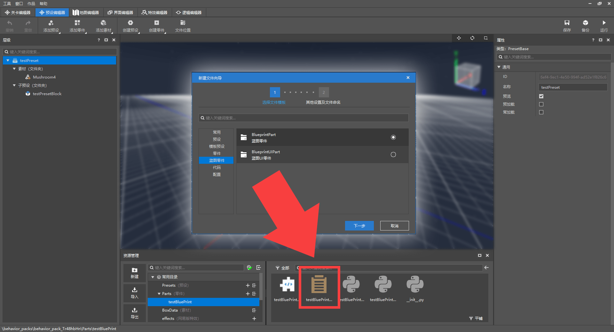
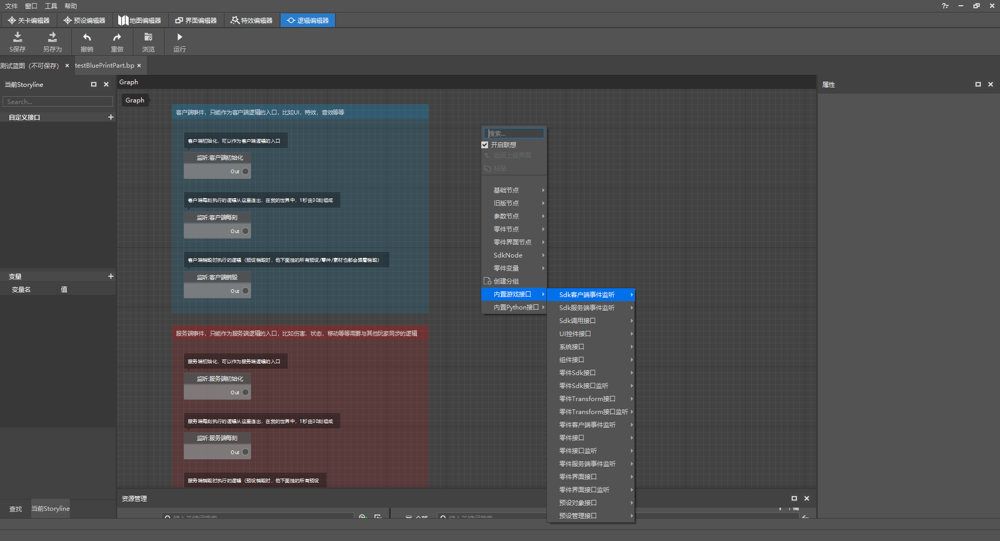
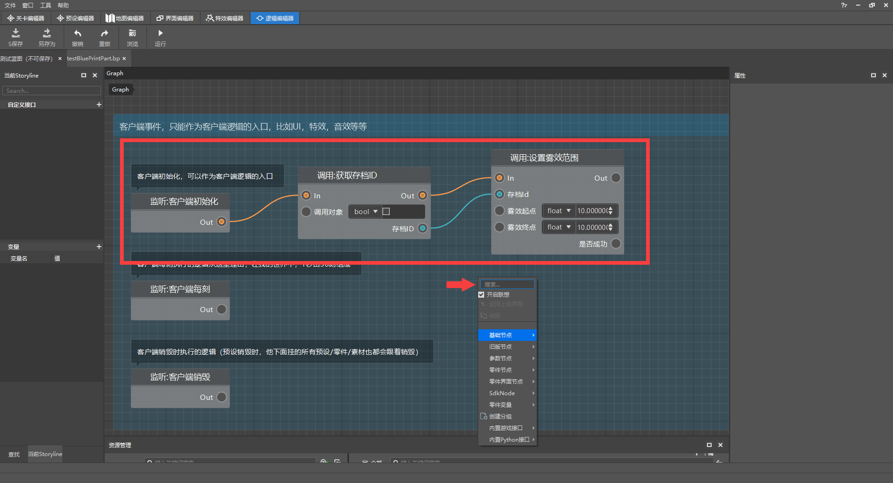
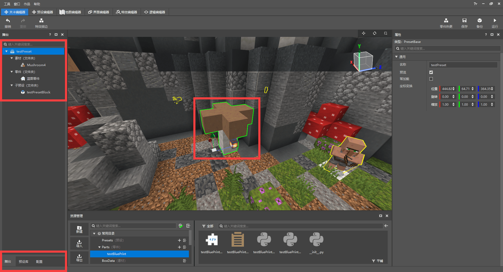

# 实现功能其实很简单

<iframe src="https://cc.163.com/act/m/daily/iframeplayer/?id=62458611b8a81f8fa083c0d3" width="800" height="600" allow="fullscreen"/>

现在的玩法大部分都是由命令方块制作的，如果有另一种非常高效且简单的方法协同创作，相辅相成，那么玩法地图的开发将会更加轻松。而我的世界开发工作台的预设编辑器和逻辑编辑器正是这样的存在。

*预设编辑器页面*

在关卡编辑器中，除了配置还有两外两个窗口：预设库和舞台。预设库顾名思义就是储存预设的仓库，所有创建的预设都将在这里看到，如果将预设应用到地图中，就可以在舞台窗口中看到，舞台是展示存在于地图场景中的所有预设的窗口

## 创建预设

点击上方创建预设，可以看到一共有：空预设、实体预设、特效预设、玩家预设、方块预设、界面预设6种。这六种分别对应不同的功能，用法和用处也都不一样。

### 空预设

空预设内什么也没有，我们需要自己为其添加内容； **先打开地图编辑器，右键素材选择导入为预设素材** ，这样才可以在预设编辑器中看到该素材。

新建一个空预设，点击预设编辑器上方“添加素材”按钮将导入的素材添加到这个预设里，就可以看到了。

空预设的属性只有名称、是否预览、预加载和常加载（将鼠标放在选项上可以看到详细解释）。

### 实体预设

实体预设的属性有很多，因为这个预设代表一个实体，在属性窗口中可以选择与某个 **实体关联** ，然后对这个预设的实体进行相关的属性设置。

### 特效预设

这个预设需要配合粒子特效或序列帧特效，使用特效编辑器制作后再与该预设关联即可。

### 玩家预设

玩家预设可以对游戏玩家进行调整，如：饥饿值、死亡不掉落、是否可跳跃等属性； **玩家预设仅可创建一个。**

### 方块预设

与特效、生物预设类似，不过是与方块做关联，可以选择原版或自定义的方块。

### 界面预设

需要配合界面编辑器使用，在玩家的客户端显示UI界面，如：按钮、进度条等。

## 添加零件和子预设

在预设中是可以再添加另一个预设的，也就是嵌套。比如我们将创建的空预设中添加一个建筑素材，再往这个预设里添加方块预设，会是什么样的？

点击添加预设或是直接在资源管理中拖进层级窗口中，方块预设被添加到了空预设的子预设文件夹中。

除了预设之间嵌套，我们还可以添加一个非常重要的东西：零件。

零件能实现各种各样天马行空的想法，不过需要通过编写代码填充零件的功能。普通的零件不适合不会编程的萌新开发者；他们需要的是一个可视化编程工具：逻辑编辑器来配合零件。

创建一个蓝图零件，双击资源管理窗口中的.bp文件跳转至逻辑编辑器。

接下来我们在逻辑编辑器中编写的功能就会被赋予到零件上，而装载了零件的预设也就有了这些功能，一环套一环，不断的堆砌零件和预设，这样就形成了庞大的开发资源！是不是对玩法地图的开发又多了一些兴趣呢？

回到逻辑编辑器，这里已经提前放置了一些可能会用到的事件：客户端时间和服务端事件，不同的功能需要分别作用在这两个之中，所以需要作出区分。

右键网格界面可以创建一个蓝图节点，再将蓝图节点用线连接，就可以实现逻辑功能，比如：

创建一个设置世界雾效范围的接口节点，可以看到这个节点需要3个参数（存档ID、雾效起点和雾效范围），存档ID用另一个节点来获取，雾效起点和雾效终点由我们自己输入数值，然后从客户端初始化时间节点开始逐个连线，就完成了。

**玩家进入世界的时候，客户端会进行初始化，此时零件检测到该事件并获取存档的ID然后设置雾效。**

在逻辑编辑器中有很多可用的接口，如果眼花缭乱看不过来可以查询接口文档，然后利用搜索功能查找添加。

MODAPI接口文档网址：<a href="../../../mcdocs/1-ModAPI/接口/通用/索引.html" rel="noopenner">点击链接打开网页</a>。

完成后，我们将该逻辑保存，回到预设编辑器，将蓝图零件添加到预设中：

再切换至关卡编辑器，将预设添加到舞台（地图）中，点击开发测试，进入到游戏中测试效果。

若是想更深入地学习和了解预设编辑器、逻辑编辑器，可以在开发者官网的开发指南中找到很多相关教程：<a href="../../../mcguide/20-玩法开发/12-可视化编程/00-第一个蓝图Mod/00-教程视频.html" rel="noopenner">第一个蓝图Mod教程</a>。

## 使用预设和蓝图添加功能

了解了预设编辑器和逻辑编辑器后，我们继续为地图添加更多功能。

新建玩家预设，取消玩家的自动恢复血量和开启玩家死亡不掉落，这样可以解决不同的游戏难度而导致的血量恢复速度不一致的问题；

新建的玩家预设会自动添加到关卡编辑器的舞台中，玩家预设有且只有一个。

分别创建3个实体预设并与大厅的三个NPC关联，为每个实体预设添加一个特效预设并放在NPC的头上做引导标识。

将实体预设拖到关卡编辑器中，粒子和实体就一起出现在了地图中，而且实体会一直根据预设中的样子（粒子处于实体头顶）保留。

**需要注意的是：在预设编辑器中修改某个预设的属性，这个预设在关卡编辑器中也会同步更新；但是如果在关卡编辑器的舞台中单个修改某个预设，那这个预设将不会再被统一修改。**

在右上角切换操作方式，可以对预设进行拖动、旋转和缩放；若是像细致的调整，则可以在属性窗口微调数值。

接下来创建一个空预设用来装载一些基础的功能：当玩家死亡后清空该玩家的背包物品。

我们使用命令方块实现了此功能，不过是当玩家回到大厅时再清空；我们可以利用逻辑编辑器替换为更好的方式。

右键创建一个监听玩家复活时触发的事件后调用“使用游戏内指令”接口。

- 事件：监听某个事件，当事件发生时脚本会做出响应并带回一些参数，如触发事件的玩家ID。
- 接口：执行某个功能，大部分接口都需要参数才可以执行，如玩家ID或是存档ID。

监听玩家复活事件可以带回该玩家的ID，调用接口并对这个ID执行就可以了。

接口的所需参数和输出的参数在选中某个节点后都会在属性窗口中显示；若是不了解接口如何使用，鼠标放在节点上会显示该接口的具体信息和链接。

简单创建3个节点并连接就实现了此功能，进入游戏中测试一下：

## 生成道具物品

在游戏场景内随机生成一些物品道具，玩家捡到会有不同的效果。利用预设和蓝图零件实现这个功能并不难，而且还有很多可控的条件。

创建空预设和蓝图零件，进入逻辑编辑器编写零件的功能逻辑。首先先来创建一个自定义接口，在里面编写生成物品实体的逻辑（在地图中生成物品）。

**自定义接口：** 编写自定义接口会在新的窗口编写逻辑，会有1个输入和输出，逻辑将在输入后开始运行并在输出处结束，编写好自定义接口后可以在主窗口的逻辑功能中反复调用。*自定义接口像是工厂，你可以随意调整工厂的工作方式（编写逻辑），也可以随时让工厂开始运作（调用自定义接口）*

然后在主逻辑中创建1个可反复触发自定义接口的定时器，每隔一段时间就执行一次，即生成1次物品。

简单的创建几个节点并将其连接起来就完成了一个简单的功能，切换到关卡编辑器中点击运行测试一下。

物品已经可以成功生成，继续添加节点编写玩家捡到并给予药水效果的逻辑。

当节点较多的情况下，各种线路可能会比较杂乱，不利于理解；图中实现逻辑的方法只是其中一种，可能有更好的方法等待实现。

大致的流程是这样的：监听玩家捡起物品 -> 利用变量保存事件带回来的参数（玩家ID、物品实体ID） -> 将玩家捡起的物品名进行比较，若是曲奇则取消玩家的捡起动作并销毁该物品 -> 给予玩家药水效果

像是 生成物品的坐标、生成的物品、玩家捡起的物品判断、给予玩家药水效果 这些功能都是可以继续添加逻辑使其更加丰富的，比如将生成物品设为多个或是将生成的坐标随机分布；逻辑编辑器都是可以做到的，不过这就需要各位开发者熟能生巧，好好利用了。

**课后作业：** 利用预设编辑器和逻辑编辑器实现如下任意功能：

- 在地图中固定坐标或随机坐标生成随机物品（利用内置Python接口-随机节点）
- 当玩家死亡时，给予击杀者物品或是添加状态效果（利用监听玩家死亡事件节点）
- 改变玩家选择职业的方式，由走到NPC附近改为点击NPC（利用监听玩家攻击实体事件节点）
- 任意发挥，实现玩法功能逻辑

