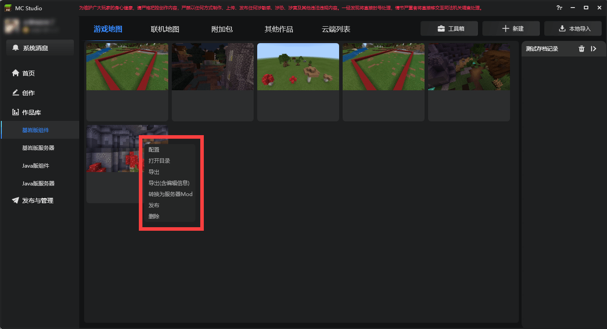
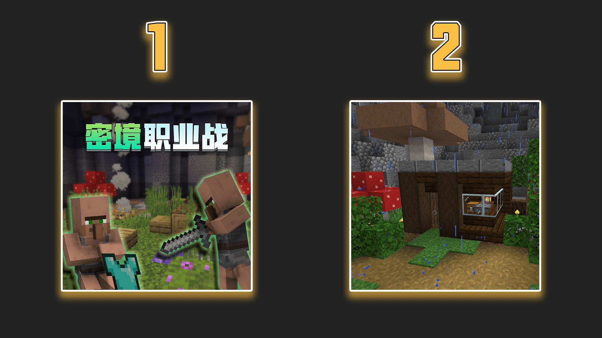
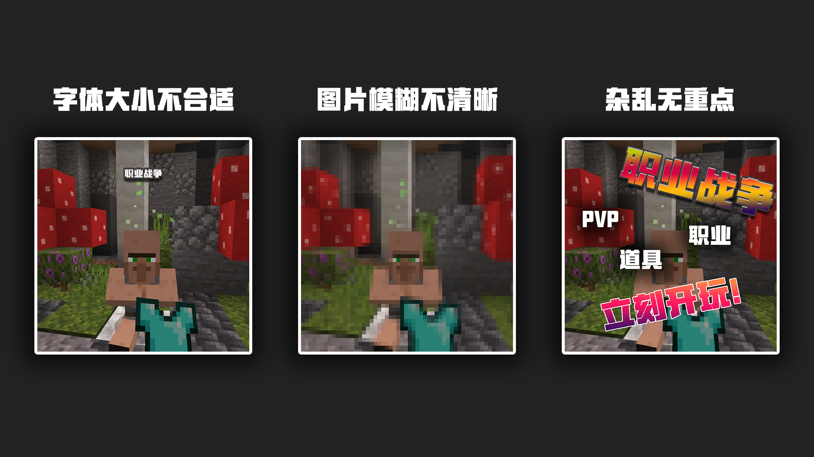

# 包装作品并发布

<iframe src="https://cc.163.com/act/m/daily/iframeplayer/?id=62458672b8a81f8fa083c0d9" width="800" height="600" allow="fullscreen"/>

当玩法地图完成时，我们就可以将其打包并上传至开发者平台发布了；不过在发布之前，我们还需要制作对应的宣传图片、视频等，所以本章节将介绍如何导出并制作合格的宣传图上传至开发者平台。

## 作品打包

在我的世界开发者工作台中右键，可以打包导出作品；也可以直接发布，我的世界开发工作台会直接将作品打包并跳转至开发者平台发布页面。 **推荐自行导出作品并备份后再前往开发者平台发布。**

## 宣传图片

发布作品时，除了填写一些基本的信息外，必须的banner图、icon图、pos机等图片文件都是很重要的，因为这些是与作品曝光有直接关系的。“人靠衣装马靠鞍”，虽然不太适合形容，但字面意思还是有道理的。 **合理的包装作品，是一名合格的开发者必须要做的。**

### Icon图

对比下面两张图片，你会对哪个感兴趣并想要体验？

相信大部分人都会对第一张图片感兴趣，因为在第一张图片中我们可以一眼看到很多信息：拿起装备的村民、明显的地图名称；而第二张图片看不到任何信息，只有简单的一些建筑，甚至看不出这是一张玩法地图。

在第一印象上，合理的包装就体现了其重要性。所以，尝试在宣传图上多下功夫吧，最重要的目的是吸引玩家的眼球，引起兴趣。

### Banner图

Banner图是横向的大图，虽然在一般情况下不需要，但如果作品比较优秀或是参加一些曝光活动，则需要Banner图做展示。

### pos机

POS机图片是指在玩家购买组件时弹出的图片，当玩家看到这张图片的时候，说明玩家想要获取该组件，这时不论是继续展示作品或是感谢支持都是可以的。

### 轮播图

轮播图可以挑选3张展示，这是让玩家了解作品的最好途径之一，无论是直接展示游戏实际画面，还是添加文字或是渲染效果都是可以的，其目的也是引起玩家注意。

既然轮播图可以展示三张，就请好好挑选， **不要将同一张图片上传三次** ，非常不建议这么做。

### 视频

当作品为付费下载的时候，就必须上传视频，而视频的内容则是与作品相关，具体的规范请参考于此：<a href="../../../mcguide/35-上架与入驻/课程06-作品视频格式导出与规范.html" rel="noopenner">作品视频格式导出与规范</a>。

视频的形式多种多样，可以拍摄创意小短片、或是文字介绍作品、语音讲解介绍作品、也可以作品的实况展示；

## 包装建议

- 所有需要的图片对应格式都在发布页面有详细说明，建议严格按照格式要求制作图片和视频
- 保证图片的清晰度和图片内容的辨识度较高，能够让玩家第一眼看到重点，吸引眼球
- 图片和视频的风格尽量倾向原版或靠近作品的风格，减少违和感。

更详细的作品宣传图制作规范和建议可以参考另外的教程：[宣传美术教程](../../40-美术教程/7.宣传教程/01.组件上架图片的制作建议.html)

**课后作业：** 制作合格的宣传图并发布一张完整的玩法地图

