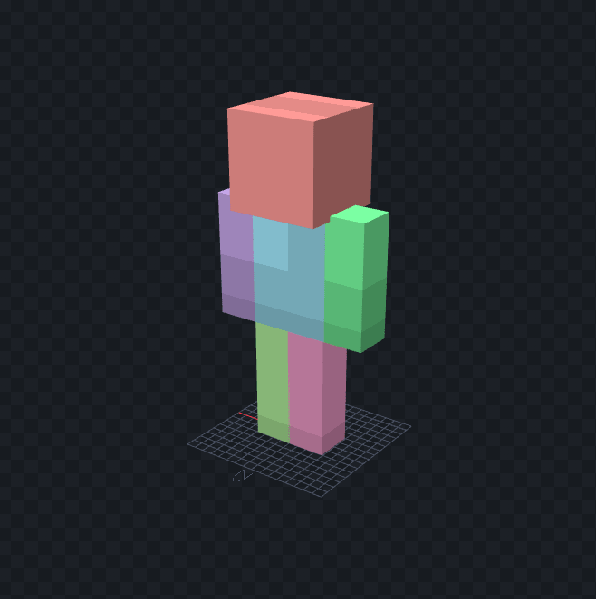

---
front:
hard: 入门
time: 15分钟
---
# 我的世界基础概念

在本章中，我们将从宏观到微观开始了解我的世界中的各种内容。

<iframe src="https://cc.163.com/act/m/daily/iframeplayer/?id=62ce4236a240f794f8c2c745" width="800" height="600" allow="fullscreen"/>

## 存档、世界、区块

在我的世界中，玩家需要首先创建一个世界才能开始游戏。如下图为中国版的创建世界界面。

但是对于我们开发者来说，其更准确的名称应该为“存档”。

而我们进入游戏后看到的主世界、下届、末地，等不同的维度，才叫做一个“世界”

即存档，是所有世界和世界内的所有数据信息的总称。

每个世界都是由一个个区块构成的。区块是世界里一个大小为16x256x16个方块的部分，是游戏地图加载卸载的基本单位。

游戏一般只会加载玩家附近的区块和出生点区块，伴随着玩家的深入探索，会动态对区块进行加载和卸载，来保证游戏运行的效率。

区块的X坐标：Floor(X坐标 / 16)，区块的Z坐标：Floor(Z坐标 / 16)，Floor意为向下取整。

一个区块(X, Z)中坐标最小点的坐标为(X * 16, 0, Z * 16)，坐标最大点的坐标为(X * 16 + 15, 255, Z * 16 + 15)。

## 实体

实体指每一个在游戏中出现的动态的对象。

实体有很多种种类，下面列出了几种实体类型和对应的部分物品，供读者理解。

### 生物实体

- 羊
- 牛
- 蜜蜂

### 物品实体

- 呈掉落物形式的物品

### 抛射物实体

- 箭
- 雪球

### 方块实体

- 箱子
- 唱片机

> 方块实体中的箱子，唱片机，明明都是方块，为什么叫他方块实体。他们和普通方块有什么区别？

方块实体指可以存储数据的方块，例如箱子可以存储玩家存放在箱子内的物品信息，而一般的方块不具备该属性。具体该部分描述也可以查看下方[方块](#方块)的介绍。

同时玩家也是一种生物实体，包括本地玩家和其他玩家，在游戏中，由玩家自己控制的称为本地玩家，否则为其他玩家。

## 物品

物品栏中具有使用属性的物品、地面上的掉落物等都称为物品。其中掉落物也是实体的一种，是物品实体。

掉落物实际上是一个识别名为Item的实体，在玩家走到该实体附近的时候，会获取其实体对应的物品数据，并将其添加到物品栏中，删除掉落物实体。

##  方块

方块是组成世界的最小单位。并且我的世界的玩法就是由挖掘和放置方块展开的。

方块的长宽高均为1，不同的方块具有不同的材质。

部分方块拥有方块实体，可以用来存储方块的内部信息。

例如箱子是一个用来存储玩家物品的方块。玩家可以打开箱子存放物品栏中放不下的物品。在玩家存放物品后，程序会将其箱子内的物品信息存储到箱子对应的方块实体上。并且在箱子放置/销毁时，程序也会自动创建/删除其对应的方块实体。

## 模型和纹理

模型即游戏内方块、实体对应的外观形状。在中国版我的世界的开发中，可以使用两种模型。

一种是原版中使用的，基于多个立方体，通过拉伸，组合，旋转而组成的模型。

另一种是骨骼模型，即使用3dmax等建模软件搭建的模型。游戏中的大部分生物都可以被替换为骨骼模型，进而实现不同的表现效果。

模型不具有任何材质纹理，需要另外绘制材质纹理与其组合，下面是一个原版的僵尸的模型和其贴图。

经过组合后，才成为我们游戏中的僵尸的样子。

同时，我们可以在游戏中动态对实体的贴图进行切换。例如在游戏中，马有不同的颜色，不同的品种，但是他们共用一个模型。我们可以使用同样的模型，并根据其内部的数据来切换它需要使用的贴图。

下图是游戏资源文件中马的贴图。可以看到骷髅马，僵尸马，骡，和不同颜色的马只是贴图的不同。使用得当可以大量减少重复劳动。

同时模型一般都配合有动画，例如海豚游泳的动画，来实现更好的视觉效果，带来更好的游戏体验。

动画可以由代码来控制播放时机，播放速度等等的属性。

## 游戏界面

界面即我们在游戏中看到的所有用户交互区域。

例如点击熔炉后的烧制界面。

界面都由一个个小的控件组成、比如图片、进度条、按钮、文本。

这些单个的控件组成在一起，再配合上操作的逻辑，就形成了游戏中的界面。

再中国版中我们制作的界面一般为手机端界面，所以需要考虑如何更方便手机端触摸的操作。

如果需要适配电脑端操作，则需要分别制作双端的界面，并判断用户的运行平台，再决定渲染出哪个界面。

## 粒子和特效

在游戏中我们常常需要借助粒子特效来加强视觉的表达效果。

例如营火的冒烟粒子。

在模组的制作中，我们一般用粒子和序列帧，来完成此类的效果。

### 序列帧

通过一帧帧的图片不断进行切换形成的动画效果，在游戏中为一个平面面片。

### 粒子

通过不断发射多个不同大小规模的平面面片形成的特效效果，通过替换贴图材质等可以模拟丰富的表现。