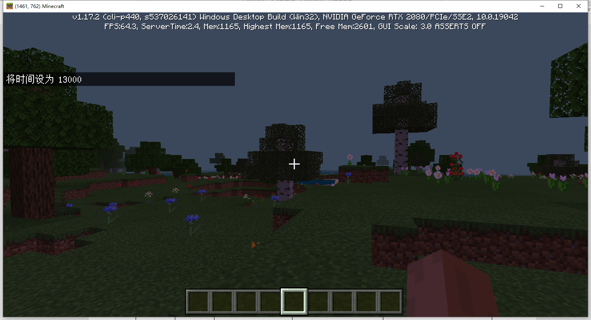
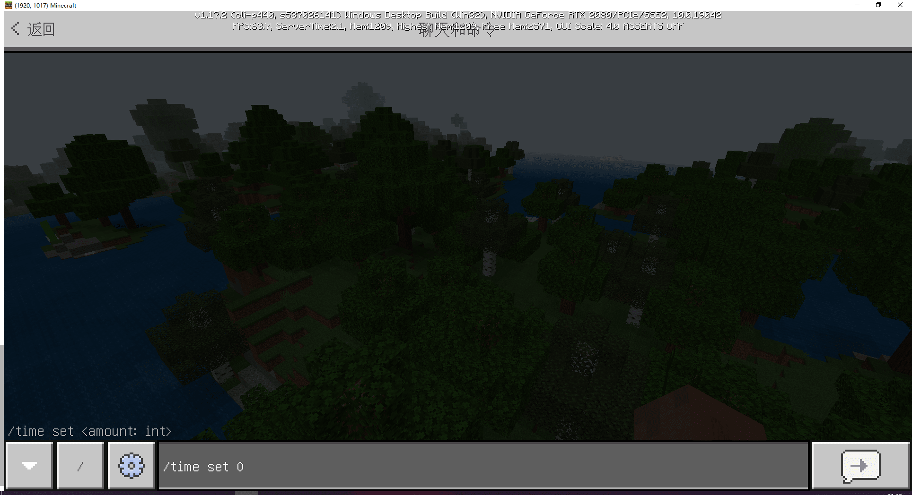
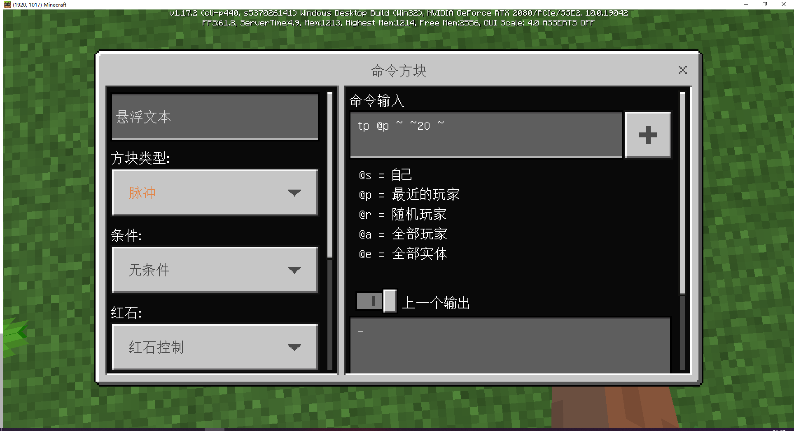
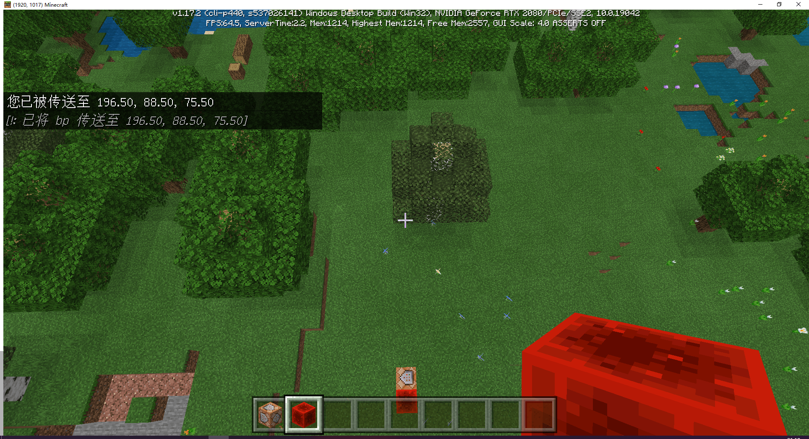
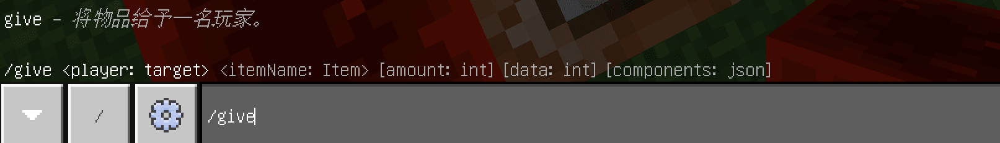
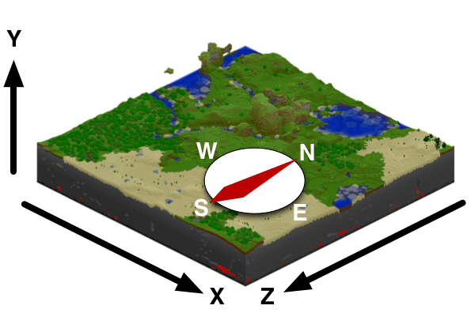
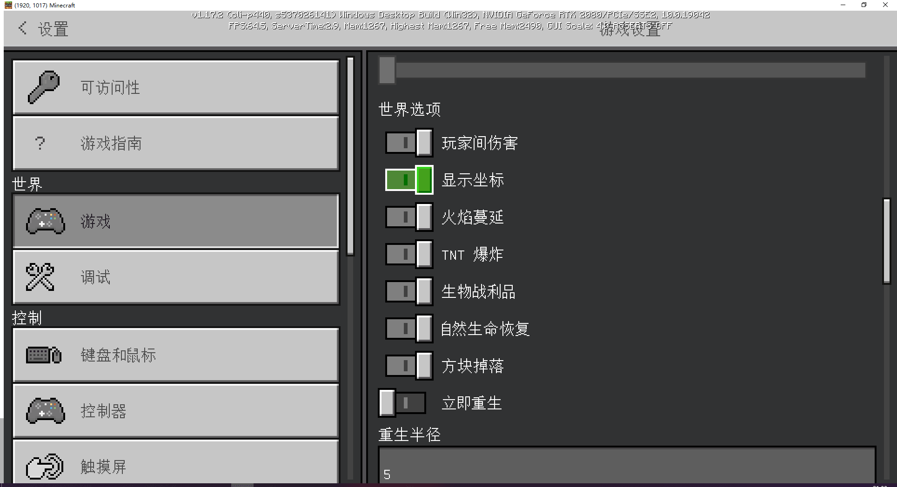
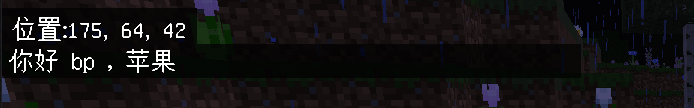
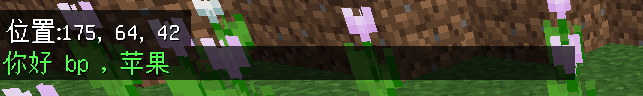

# 我的世界原版命令

## 认识命令

<iframe src="https://cc.163.com/act/m/daily/iframeplayer/?id=62ce430de6c041f257897fc2" width="800" height="600" allow="fullscreen"/>


命令是指在我的世界原版游戏中自带的控制台命令，这些命令可以在游戏的聊天窗口中、命令方块中被执行。

各种命令相互搭配，也可以实现一些类似模组的玩法。

### 命令功能展示

发送一个游戏内标题


修改游戏时间



击杀所有僵尸


召唤一道闪电


如此功能繁多的命令，可以和模组SDK进行互补。也可以不借助模组SDK来完成很多游戏玩法。

所以学习我的世界原版命令，也是玩法开发中一项非常重要的内容。

## 命令执行方法

### 聊天框

我们随意进入一个游戏存档之后，可以按下回车进入聊天框。

随后在聊天框内输入/开头的任意字符，即使用控制台指令。

例如我们需要设置游戏时间为白天，可以输入```/time set 0```并回车，来修改游戏时间



同时可以看到命令的参数提示，要求/time set 的最后一个数字是数量，类型为int。

### 命令方块

命令也可以在命令方块中执行。命令方块默认不出现在创造物品栏中，需要使用命令来获取。

使用同样的方法打开聊天框，在聊天框内输入```/give @s command_block```即可获取命令方块。

然后将它放在地上，即可进行设置。

在左侧默认设置不改变的情况下，我们输入命令```tp @p ~ ~20 ~```，然后使用红石信号激活这个命令方块。



命令方块就会执行这个命令，并把我们的y高度提高20格。



## 命令参数

命令会根据命令参数来修改执行的结果。

就比如```/give @s command_block```这个命令，@s 和 command_block 都是这个命令的参数。

参数通常使用空格进行分隔。

在聊天框内输入/give 即可查看该命令的帮助



在这里，<>括号所表示的内容为必填参数，[]括号所表示的内容为可选参数。

括号内分别是参数的含义和类型。

比如```player: target```即玩家参数，参数类型是一个目标，即目标选择器。

所以我们的命令```/give @s command_block```的含义就是给@s这个目标一个command_block。

@s为目标选择器的命令执行者，选择器会在下面介绍。

## 目标选择器

在很多命令中，都有一个类型为target的参数。比如刚刚的/give命令。

大多数以实体或玩家作为参数的命令，可以通过某些限定条件来选择一个或多个实体或玩家，而不必指定实体名、玩家名或UUID。要用条件来选择实体或玩家，应先输入一个**目标选择器变量**，如有需要，还可再使用一个或多个**目标选择器参数**以制定具体的条件（可选）。

### 目标选择器汇总表

| 变量 | 功能           |
| ---- | -------------- |
| `@p` | 距离最近的玩家 |
| `@r` | 随机玩家       |
| `@a` | 所有玩家       |
| `@e` | 所有实体       |
| `@s` | 命令的执行者   |

使用这些选择器，就可以限制这个命令将会对谁执行。

同时还可以使用目标选择器搭配目标选择器参数，来筛选实体。

例如需要筛选出所有僵尸，则目标选择器为`@e[type=zombie]`，如果需要筛选出2个僵尸，则为`@e[type=zombie,c=2]`

这里的`type=`筛选实体类型，`c=`限制了选择的数量。

## 坐标

坐标在数字上反映了实体在世界中的位置。

坐标基于一个由互相垂直且交于一点（即原点）的三条坐标轴形成的网格，即一个空间直角坐标系。

- X轴的正方向为东，其坐标反映了玩家距离原点在东（+）西（-）方向上的距离。
- Z轴的正方向为南，其坐标反映了玩家距离原点在南（+）北（-）方向上的距离。
- Y轴的正方向为上，其坐标反映了玩家位置的高低程度。
- 坐标系的单位长度为一个方块长，每一方块为1立方米。

因此，三条坐标轴形成了右手坐标系（拇指为X轴，食指为Y轴，中指为Z轴），通过这样可以更为简单地记住各坐标轴。



### 绝对坐标

在游戏中，可以通过游戏设置打开显示坐标，来查看自己的位置。这里显示的坐标就是绝对坐标。



### 相对坐标和局部坐标

在命令中，你不仅可以使用绝对坐标（即具体的坐标值），还可以使用相对坐标和局部坐标来表示位置。

#### 相对坐标

相对坐标使用`~`来表示，例如刚刚输入命令方块的`/tp @p ~ ~10 ~`就是一个使用相对坐标来表示的位置。

首先我们来看一下tp的命令参数定义。


这里我们的命令对应的是红框所划出的参数。

相对坐标的波浪号后面可以跟一个数字，代表坐标的偏移量。例如`~ ~10 ~`就代表目标当前位置的y坐标+10。同样`~`就是`~0`的简写。

#### 局部坐标

局部坐标使用`^`来表示，如果输入命令`/tp @p ^ ^ ^3`就会使玩家向前移动3格。

这里的局部坐标表示和相对坐标类似，和相对坐标不同的是，局部坐标的坐标原点是以玩家的坐标为中心，以玩家面朝方向为z轴正方向。

即无论玩家视角面朝什么方向，使用`/tp @p ^ ^ ^3`都会使玩家朝他面朝的方向进行移动。

> **绝对坐标**可以和**相对坐标**或**局部坐标**混合使用，而**相对坐标**和**局部坐标**不能混合使用。

## 原始文本

原始文本是一串由Json构成的文本。

可以在`/tellraw`,`/titleraw`命令中使用。

原始文本的Json的基本结构如下：

```json
{
    "rawtext": [  # 包含所有文本对象的列表
        {
            "text": "",  # 文本原始内容，和translate不能共存
            "translate": "",  # 使用玩家所选择的语言显示的翻译识别符，即zh_CN.lang语言文件中的key
            "selector": "",  # 在文本中直接将"@a"，"@s"等选择器会被转换
            "with": []  # 包含translate中的聊天字符串参数的列表
        }
    ]
}
```

我们分别执行下面命令

```
/tellraw @a { "rawtext": [ { "translate" : "commands.op.success", "with": [ "开发者" ] } ] }
/tellraw @a { "rawtext": [ { "translate" : "commands.op.success", "with": { "rawtext": [ { "translate" : "item.apple.name" } ] } } ] }
```

可以查看命令的效果。


这里就是将`command.op.success`对应的"已将 %%s 设置为管理员"语言文本设置，使用with中的参数，进行了替换。

同样我们可以自己编写一个消息，例如

```
/tellraw @a { "rawtext": [ { "translate" : "你好 %%s ， %%s", "with": { "rawtext" : [ { "translate" : "%%s", "with" : { "rawtext" : [ { "selector" : "@s" } ] } }, { "translate" : "item.apple.name" } ] } } ] }
```

可以看到执行效果。



但是这样的提示文本颜色非常单一，我们可以使用格式化代码来对其添加颜色和格式。

格式化代码由一个小节号(§)和一个数字构成。

例如§a，代表从这里开始的文本都变成绿色。我们加上格式化代码后再次尝试命令

```
/tellraw @a { "rawtext": [ { "translate" : "§a你好 %%s ， %%s", "with": { "rawtext" : [ { "translate" : "%%s", "with" : { "rawtext" : [ { "selector" : "@s" } ] } }, { "translate" : "item.apple.name" } ] } } ] }
```



可以看到文字已经变成了绿色。

所有可用的颜色和格式对应图如下。


> **如何快速使用键盘打出小节符**
>
> 按住键盘的`Alt`键不松，依次在小键盘按下`1`、`6`、`7`，按完后松开`Alt`，即可打出小节号

