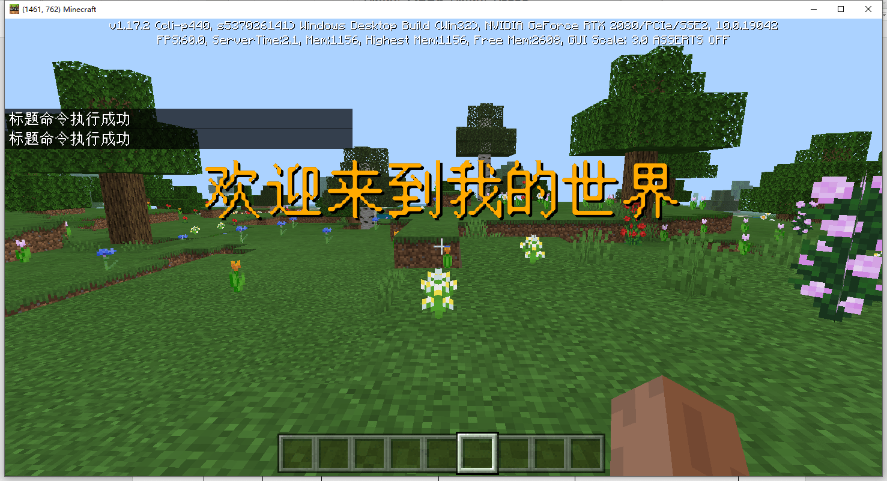
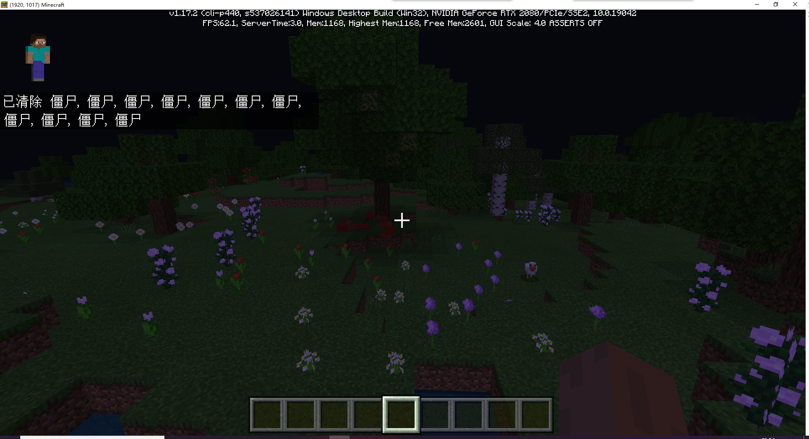
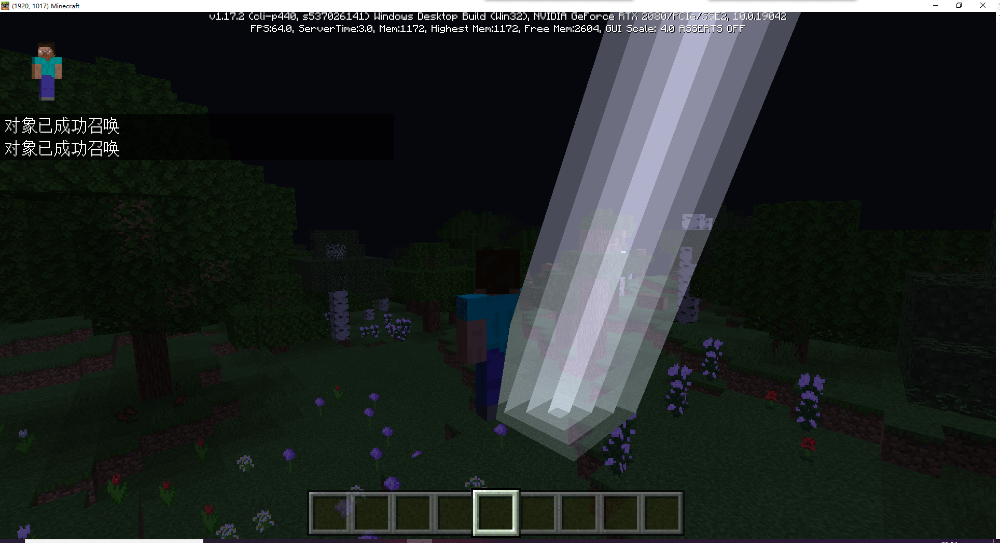
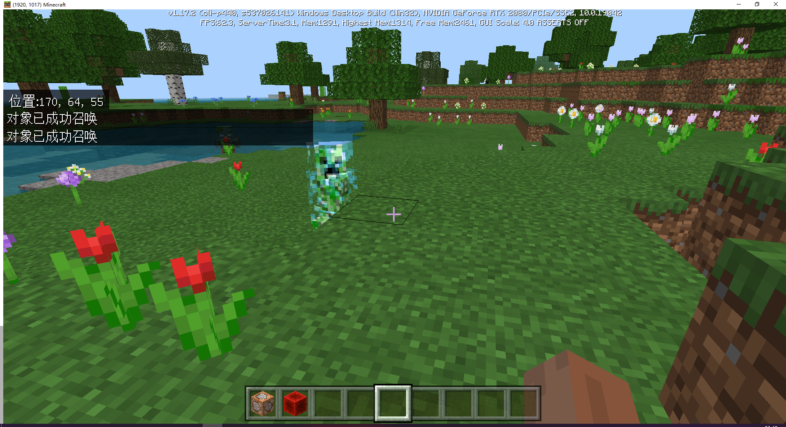

---
front:
hard: 入门
time: 10分钟
---
# 常用命令

在上一节学习了命令的基本使用方法之后，我们就可以开始来学习一些常用的命令啦！

## /title

发送一个游戏内标题



上图效果是使用命令`/title @s title §6欢迎来到我的世界`来实现的。

使用帮助

`title <*玩家：目标*> clear`（移除屏幕标题）

`title <*玩家：目标*> reset`（将各选项复位至默认值）

`title <*玩家：目标*> title <*标题文字：字符串*>`（将文字显示为主标题）

`title <*玩家：目标*> subtitle <*标题文字：字符串*>`（将文字显示为副标题）

`title <*玩家：目标*> actionbar <*标题文字：字符串*>`（在快捷栏上方显示的标题）

`title <*玩家：目标*> times <*渐入：整数*> <*保持：整数*> <*渐出：整数*>`（设置渐入、保持和渐出的持续时间）

## /kill

杀死/清除实体



上图效果是使用命令`/kill @e[type=zombie]`来实现的。

使用帮助

`kill [target: target]`

## /ride

用于使实体骑乘其他实体、停止实体的骑乘/使坐骑逐出自己的骑手、召唤坐骑/骑手。

使用方法

```
ride <骑手：目标> start_riding <坐骑（单个）：目标> [传送规则：传送规则] [骑乘方式：骑乘方式]
```

让指定的骑手骑乘指定的坐骑。

```
ride <骑手：目标> stop_riding
```

让指定的骑手停止骑乘。

```
ride <坐骑：目标> evict_riders
```

让指定的坐骑逐出它的骑手。

```
ride <坐骑：目标> summon_rider <实体类型：实体类型> [生成事件：字符串] [命名标签：字符串]
```

在每个没有被骑乘也没有骑乘别的实体的坐骑的位置召唤一个实体，然后让它们骑乘到坐骑上。

```
ride <骑手：目标> summon_ride <实体类型：实体类型> [骑乘规则：骑乘规则] [生成事件：字符串] [命名标签：字符串]
```

在每个骑手的位置召唤一个实体，然后让骑手骑乘它们。

## /tp

将实体传送到指定位置

具体使用方法已经在[上一节](./1-我的世界原版命令.html#相对坐标)介绍过

## /summon

召唤一个实体



上图效果是使用命令`/summon lightning_bolt ~ ~ ~`来实现的。

使用方法

```
summon <entityType: EntityType> [spawnPos: x y z] [spawnEvent: string] [nameTag: string]
```

```
summon <entityType: EntityType> <nameTag: string> [spawnPos: x y z]
```

## /execute

`/execute`可以在改变执行者、执行位置和角度，添加限制条件，并储存其输出值的情况下执行另一条命令。

使用方法

```
execute <origin: target> <position: x y z> <command: command>
```

可以限制在指定方块被检测到时才执行命令：

```
execute <origin: target> <position: x y z> detect <detectPos: x y z> <block: Block> <data: int> <command: command>
```

例如我们需要检测1只苦力怕，并在其位置生成闪电，就可以使用如下命令。

`/execute @e[type=creeper,c=1] ~ ~ ~ summon lightning_bolt ~ ~ ~`



可以看到苦力怕的位置召唤了一道闪电将其劈成了闪电苦力怕。

## 更多命令

如果想要了解更多命令，可以访问[维基百科](https://zh.minecraft.wiki/w/%E5%91%BD%E4%BB%A4)。

