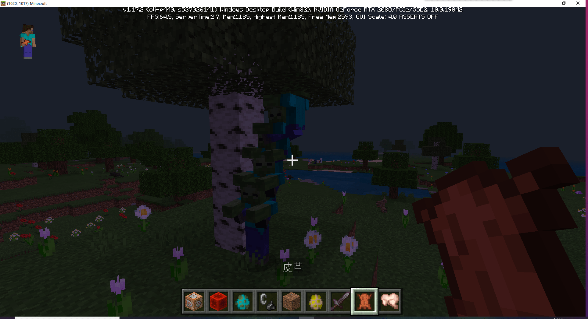

---
front:
hard: 入门
time: 5分钟
---
# 课后作业

## 要求

- 使用/ride命令实现一个实体叠叠乐。

- 使用/execute命令在所有玩家位置处召唤一个苦力怕

## 操作步骤

### /ride

召唤一只僵尸，多次输入指令

```
/ride @e[type=zombie,c=1] summon_ride zombie
```

输入的越多，叠叠乐叠的越高。



### /execute

执行命令

```
/execute @a ~ ~ ~ summon creeper ~ ~ ~
```

命令解释：

@a 代表所有玩家

~ ~ ~ 代表玩家当前的位置

summon creeper ~ ~ ~ 代表筛选出的玩家执行这个命令

