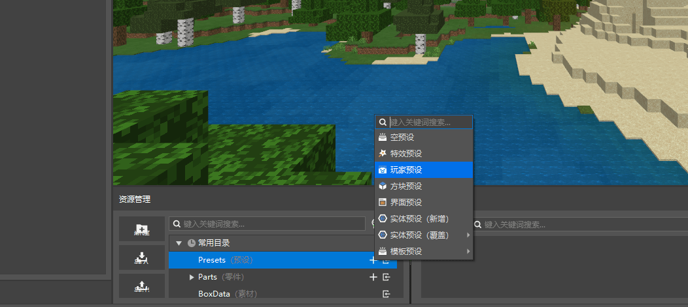
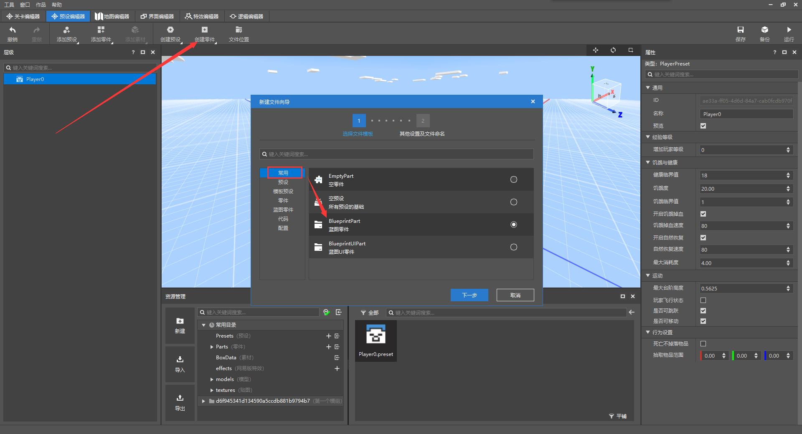
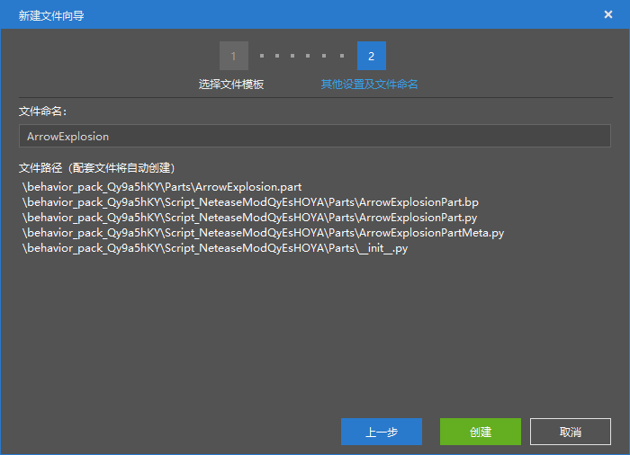
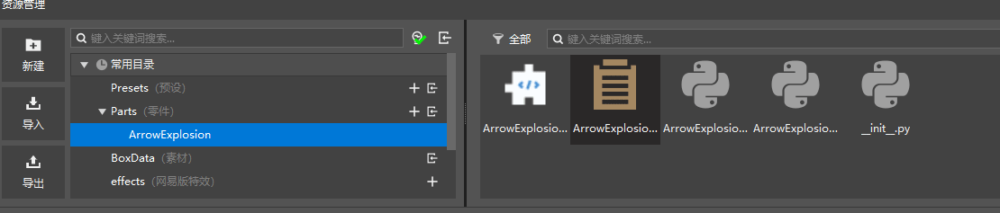
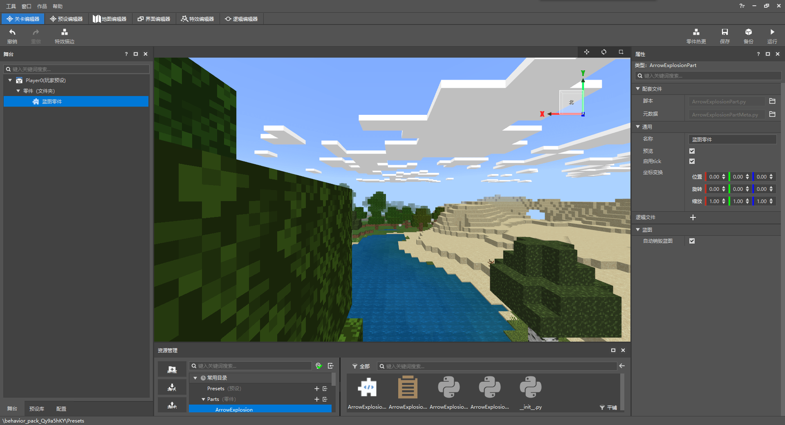

# 创建并编辑预设

<iframe src="https://cc.163.com/act/m/daily/iframeplayer/?id=62ce56336b13db499d06212f" width="800" height="600" allow="fullscreen"/>

本章我们将使用关卡编辑器、预设编辑器、逻辑编辑器来带领大家独立制作一个小mod——爆炸箭头。

首先我们新建一个空白附加包，切换到关卡编辑器。

然后在资源管理界面中，找到目录`Presets(预设)`，点击右边的加号，新建一个玩家预设。

玩家预设是一种自动加载的预设，每个世界中只能存在一个玩家预设。

点击后，会弹出一个设置预设名的窗口，这里直接点击确定即可。

创建完成后，会自动跳转到预设编辑器。

在预设编辑器中，点击创建零件，然后依次选择 常用，蓝图零件。

点击下一步，在命名窗口中可以给这个蓝图起个名字。比如我们这个蓝图实现了爆炸箭头的功能，所以给它命名为`ArrowExplosion`，然后点击创建。

创建完成后，可以到资源管理的常用目录中，点击`Parts(零件)`，即可看到我们刚刚创建的零件目录，点击即可看到对应文件。

图中第一个为零件文件，可以将其拖拽到预设上进行绑定。第二个为蓝图文件，可以在逻辑编辑器中进行编辑。

将其拖拽到`Player0`的预设上，即可完成零件和预设的绑定。

然后我们切换回关卡编辑器，可以看到，舞台中已经有了一个Player0的玩家预设，并且零件中已经显示出了我们刚刚绑定的蓝图零件。

点击蓝图零件，可以在右侧属性窗口类型为`ArrowExplosionPart`，即可确认这是我们刚刚创建的蓝图零件。

至此关卡编辑器和预设编辑器的设置全部完成，下面将开始逻辑编辑器的学习。
