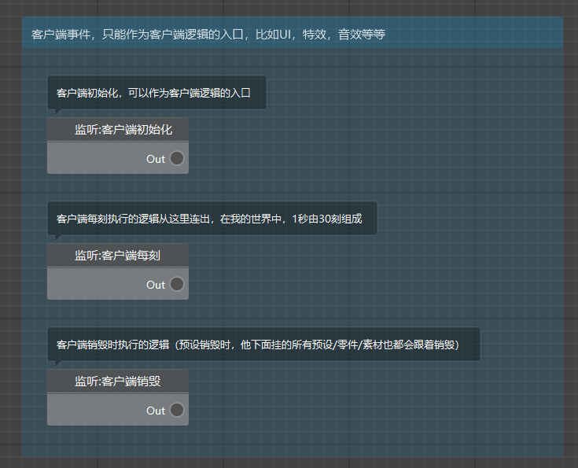
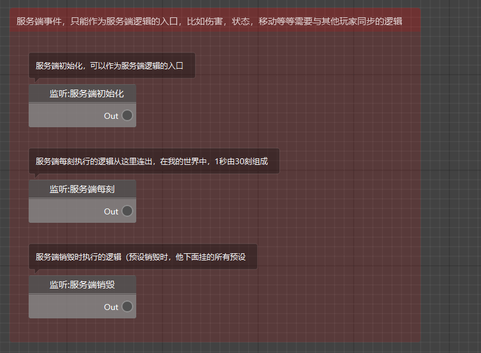
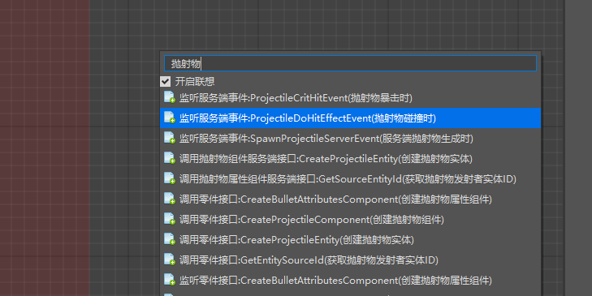
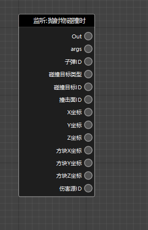
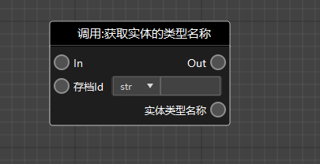
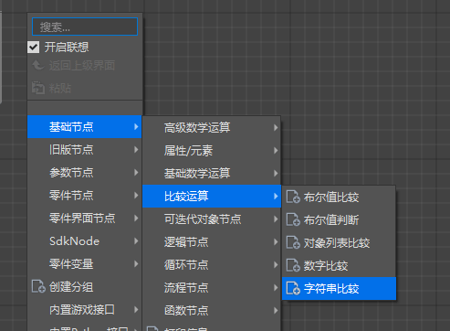
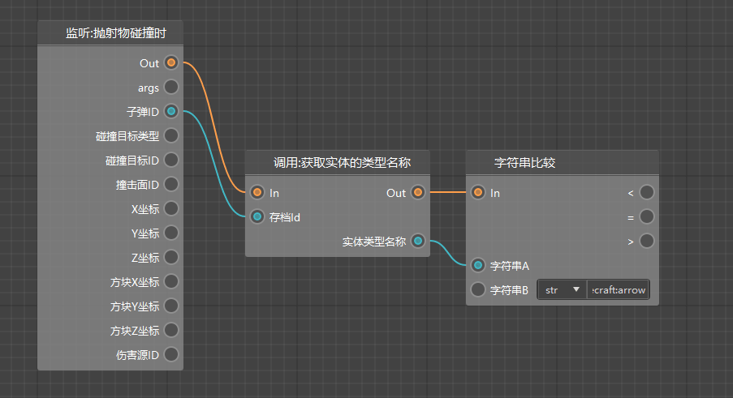
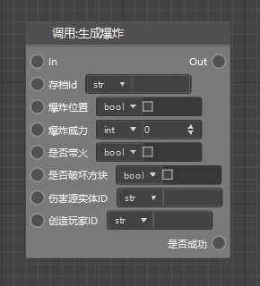
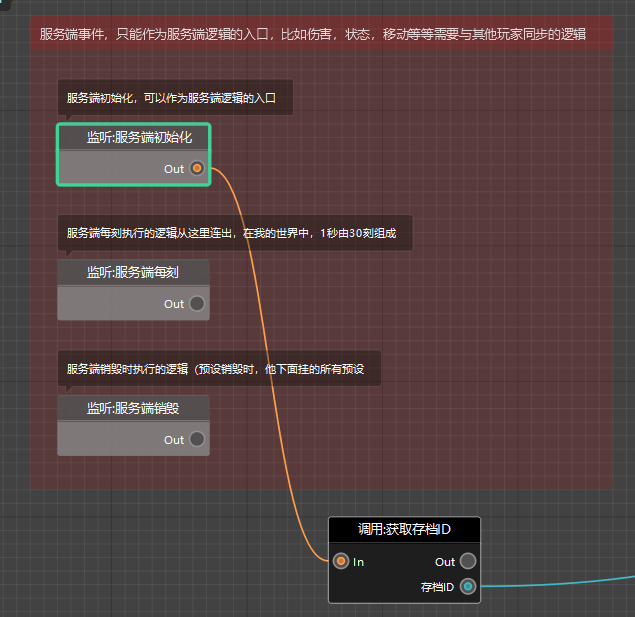
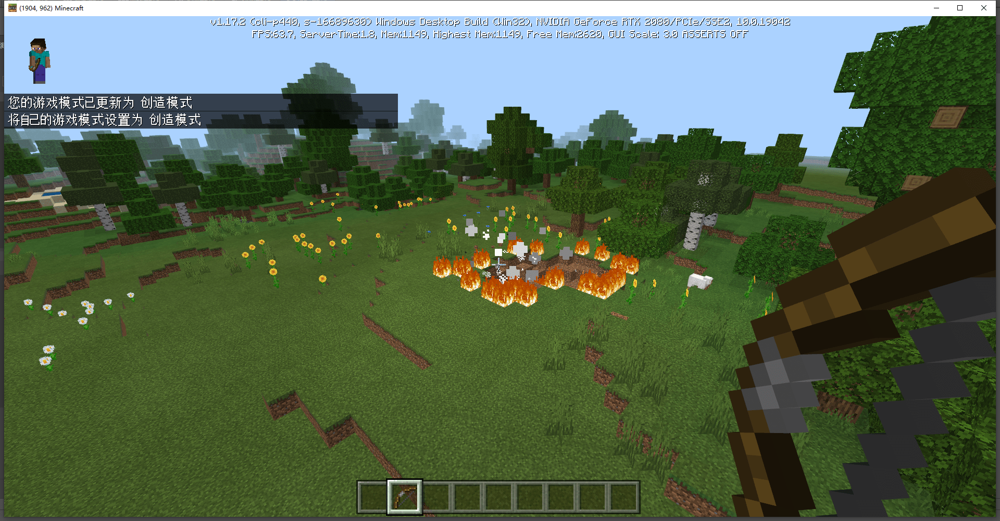

# 逻辑编辑器基础

本节我们将介绍逻辑编辑器的基本操作逻辑。

## 基础操作

继续上一节的内容，在资源管理的窗口中，找到`ArrowExplosion`这个零件的蓝图文件，双击打开。

即可打开逻辑编辑器并打开该蓝图文件。

鼠标左键在Graph窗口中拖动，即可选中逻辑对象。

对逻辑对象右键可以打开操作菜单，在空白处右键可以打开创建节点的菜单。按住右键拖动，可以移动逻辑编辑器的视图。

鼠标滚轮滚动，则可以对Graph窗口进行缩放。

## 概念讲解

在新建的蓝图文件中，可以发现，现有的逻辑主要为两大块，分别是服务端事件，和客户端事件。

同时服务端和客户端事件中，都对应了3个节点

- 初始化
- 每刻
- 销毁

初始化和销毁很好理解，它们分别会在服务端或客户端启动/关闭的时候被执行。

每刻是指服务端或客户端在每刻执行的逻辑，在我的世界中，1秒有30刻。可以简单地理解为，在每刻这个节点后的逻辑，会在游戏中被每秒执行30次。

> 为什么代码分为服务端和客户端？
>
> 因为我的世界在单人游戏时，是同时启动了服务端和客户端。
>
> 服务端负责游戏的逻辑运算，比如红石、伤害等等。
>
> 而客户端只负责游戏视觉部分的运算，比如渲染、特效、界面等等。
>
> 所以在编写逻辑时必须要注意观察节点的使用范围，不能在服务端调用客户端的代码，也不能在客户端调用服务端的代码。

刚刚提到的一共6个节点，通常作为所有节点的头部，即程序的入口。

并且在上图中，每个节点后都有一个Out端口，这里叫做输出端口。将输出端口和输入端口相连接，就代表了节点之间的连接顺序，从而构成逻辑关系。

## 逻辑编写

### 思路分析

除此之外，监听事件也可以作为程序的入口，比如我们即将制作的爆炸箭头。

爆炸箭头的实现方式如下：

1. 监听抛射物碰撞的事件
2. 判断投掷物是不是箭头
3. 获取坐标，维度相关参数
4. 删除箭头的实体
5. 在对应坐标和维度生成一个爆炸

我们这个模组的入口就是**监听抛射物碰撞的事件**，即只有监听到这个事件，我们的逻辑会继续往下运行。

分析完操作逻辑，我们就要一步一步地进行逻辑编辑器的创作。

### 上手操作

首先在空白处右键，在搜索框输入，抛射物，找到`监听服务端事件:ProjectileDoHitEffectEvent(抛射物碰撞时)`，点击进行节点的创建。

> 为什么一上来就知道搜索抛射物呢？
>
> 我们可以在进行开发前，先确定自己需要监听的事件或者接口是否能在API文档中找到，
>
> 然后确定事件或接口的描述，并在逻辑编辑器中输入关键字进行搜索，方便创建。
>
> API文档链接：[点我](https://mc.163.com/dev/apidocs.html)

创建完成后，可以看到这个节点的后边后方有许多的参数输出端口，每个端口都对应了这个事件触发时的具体值。

我们可以将这些值带入下一个节点中，并完成一定的计算，最后实现模组的逻辑功能。

监听完成后，我们就需要判断这个子弹ID对应的实体，是否是弓箭。同样右键新建节点，搜索并选中`GetEngineTypeStr(获取实体的类型名称)`

创建完成后，可以看到，这个节点左侧有一个`实体Id`的输入端口，右侧有个实体名称的输出端口。

通过该节点的运算，可以将子弹Id得出对应的实体类型名称来判断是不是箭头。

我们需要将存档Id和子弹Id相连接，并把上一个节点的Out和这个节点的In相连。

> Out和In之间的连线为橙色，叫做执行连线。
>
> 两个节点之间只有使用执行连线进行连接，才会在上一个节点执行完成后触发下一个与其连接的节点。
>
> 而子弹Id和存档Id之间的连线为蓝色，叫做数据连线。
>
> 代表数据的传递，不代表执行顺序。

得到了实体类型名，我们就需要判断这个名称是不是箭头，也就是`minecraft:arrow`。

继续添加节点，进行字符串比较。

创建完成后，填入对应参数，将节点进行连接，效果如图。

然后我们创建一个生成爆炸的节点，并给他填入参数，爆炸威力设置为3，勾选带火，破坏方块。

除了存档Id这个参数，大部分参数都非常好理解。那么存档Id是什么呢？

存档Id是用来区分存档的，一般需要在服务端或客户端初始化的时候，进行获取。

我们可以在初始化之后使用接口`获取存档ID`，进行存档Id的获取。

同时我们需要创建一个levelId变量，并在需要的时候调用它。在左侧变量窗口点击+号，输入变量名levelId。

在获取存档ID后赋值`levelId`

然后按照图示连接方式，创建剩下的节点，并进行连接。

最后还需要销毁掉箭头这个实体，注意一定要选择**服务端接口**，而不是客户端接口。

> 如果不销毁箭头这个实体，会在产生爆炸后，箭的实体落下，继续触发事件，从而一直爆炸。
>
> 感兴趣的可以尝试不添加销毁实体的节点并查看效果。

连接效果如图

### 测试

完成蓝图文件的编辑后，我们点击运行按钮进入游戏测试。

可以看到射出弓箭，弓箭落地后产生爆炸。

那么我们的爆炸箭就制作完毕了。

