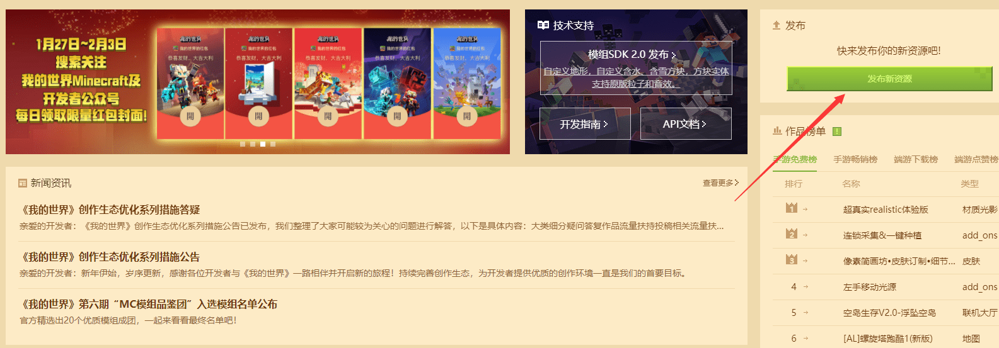
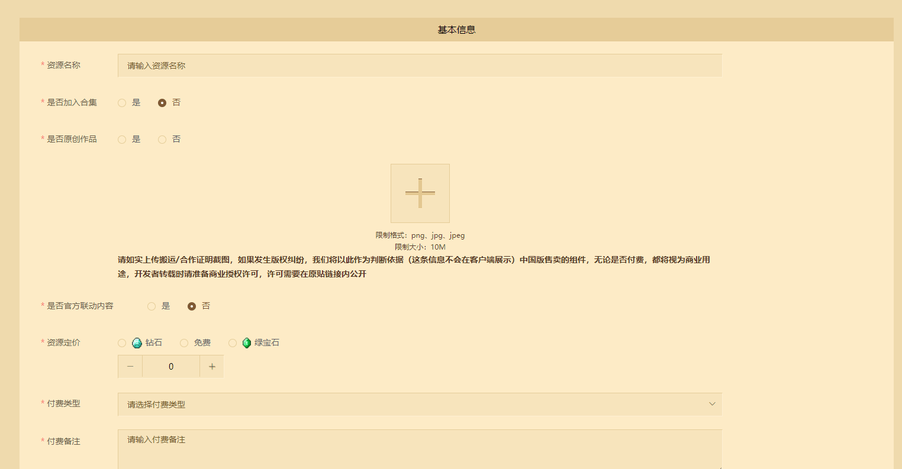
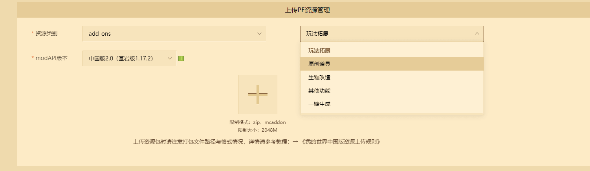
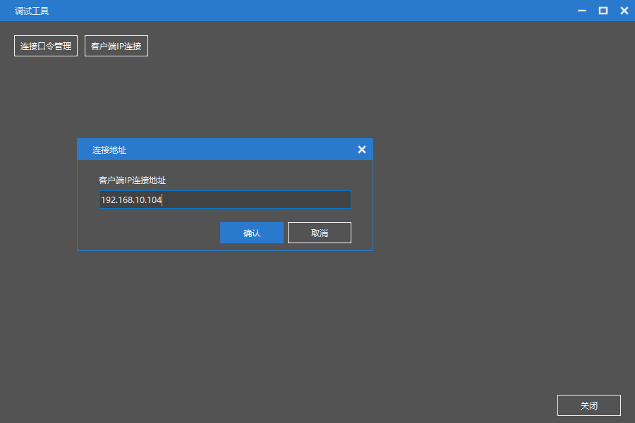
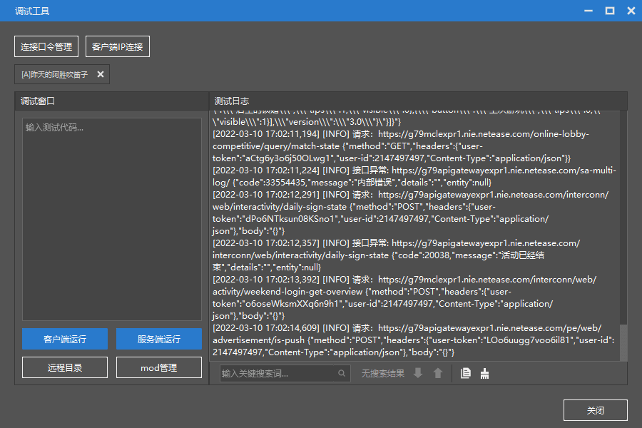
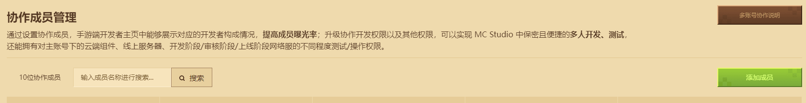

# 投稿及开平的使用

本节内容中，将会介绍如何使用开发者平台进行作品的投稿，还有开发者平台中的一些工具的使用。

开发者平台地址: [点我](https://mcdev.webapp.163.com/#/login)

## 投稿

登录开发者平台首页，直接点击右侧的发布新资源，即可开始发布作品。

在弹出的窗口中选择手机版作品，随后就可以进入作品信息的填写界面。

在这里我们依次填写作品的名称，定价等信息，带*的为必填项。付费类型选择`add on`。

填写完成后，需要上传模组资源。资源类别选择`add on`，小分类可以根据自己的模组的内容来选择。

接下来就需要找到我们的模组的资源文件，并将其压缩上传。

进入开发者工作台，找到我们需要发布的模组，右键点击，点击`导出`，并选择保存路径。

然后在开发者平台中点击`+`来上传资源，选择刚刚导出的zip。

上传完成，填写详细信息中的介绍，上传上一节讲到的图片。

上传完成之后点击保存，就可以在作品管理中看到我们的模组了，点击提交审核，就可以等待审核通过后上架模组啦！

## 自测

有时候电脑环境和手机环境的不一致，会导致模组在手机上无法运行。这时候我们就需要进行手机端自测。

对上传后的模组点击**自测**按钮，等待机器审核通过后，就可以在手机测试端进行测试。

然后在手机上扫码下载好手机测试客户端。

使用开发者账号登录游戏，就可以在资源中心中找到自己的模组，下载后就可以在手机上进行体验。

如果体验过程中出现问题，可以将手机连接到和电脑同一个局域网中，在手机上找到局域网IP。

例如我这里的IP是`192.168.10.104`，然后在开发者工作台->作品库->工具箱中找到调试工具。

然后在手机中打开我的世界测试版客户端。

打开调试工具后，点击`客户端IP连接`，输入刚刚找到的IP

如果是第一次连接手机客户端，必须保证我的世界测试版是打开的状态。如果没有打开，则再次输入IP再次连接。

连接成功后就可以看到测试日志，在进入游戏后，模组中的调试信息和报错信息均会体现在日志中。

## 反馈

在模组上架后，玩家可以使用游戏内的反馈功能进行反馈，可以在开发者平台，作品管理->玩家反馈管理中查看玩家的反馈。

## 收益查看

作品上架后，可以在开发者平台，收益管理处查看收益情况。

同时每个月的收益结算信息也会在这里展示。开发者需要自己在每月开放结算后，提交相关信息并申请结算。

## 数据分析

在这里你可以使用开发者平台，利用折线图的形式可视化地看到你的作品的销售情况。

可以看到新增购买、收益、积分、日活的数据。

## 协作成员管理

当模组不是一个人在开发时，就需要使用写作成员管理来添加开发者子账号。

这样就可以让每一个开发成员都登录自己的开发者子账号使用开发者工作台。也可以使用子账号登录我的世界测试版客户端来进行资源的测试。

同时也可以使用开发者工作台进行多人测试，对于团队开发来说是一个必备的功能。

