---
front:
hard: 入门
time: 15分钟
---
# 开始配置玩法功能

在本节中，将会带领大家制作一个简单的实体并了解物品、方块的基本配置功能。

<iframe src="https://cc.163.com/act/m/daily/iframeplayer/?id=660a288c95446edbdc2ba1ae" width="800" height="600" allow="fullscreen"/>

## 实体

经过基础玩法教程的学习，相信大家一定都对实体有了基础的认识。那么对于一个实体来说，它的AI和行为表现是一个实体至关重要的，接下来我们将会带领大家新建，并配置一个简单的实体。

首先打开我的世界开发工作台后，新建一个空白附加包，然后进入编辑器。

在关卡编辑器内，点击新建按钮，在配置分类，找到实体，点击下一步。

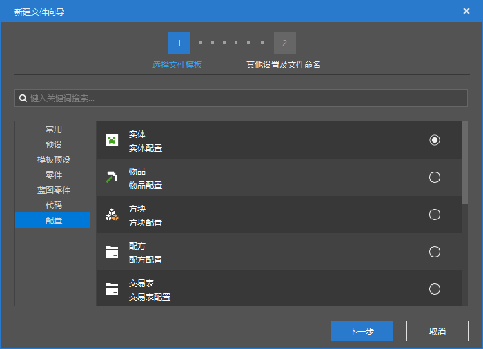

在数据模板处，我们选择一个僵尸的模板，并将它命名为`custom_zombie`，作为示例进行讲解。

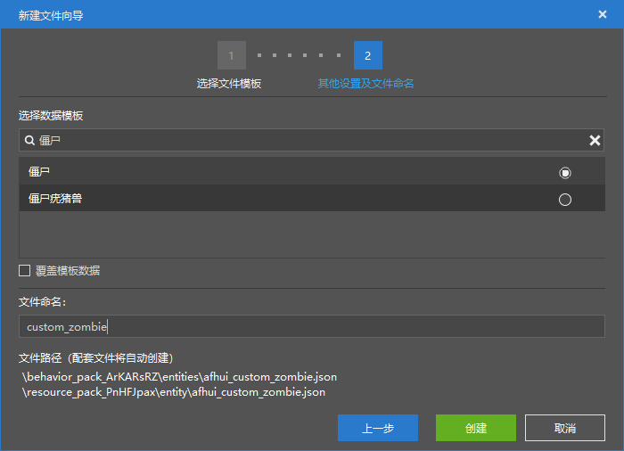

随后在右侧的属性面板，就可以看到这个新的自定义僵尸的各种属性。

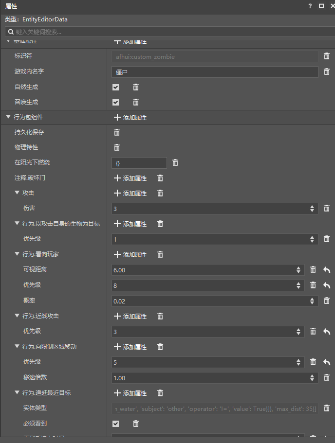

我们大致翻阅一下这个自定义僵尸的所有属性，可以看到，一个实体在编辑器中，有3个大分类的属性可以供我们进行配置，它们分别是

- 基础属性
- 行为包组件
- 资源包组件

### 基础属性

基础属性可以看到我们的自定义实体的标识符，此处是在编辑器中是无法进行修改的，但是我们可以在游戏中使用summon命令，搭配标识符，召唤出我们配置的自定义僵尸的实体。

同时此处还可以配置游戏内名字，即它在游戏中显示的名称，例如下图中，我们将它改成`自定义僵尸`，那么如果在游戏中我们被这个僵尸击杀，死亡消息中就会显示 自定义僵尸。

自然生成和召唤生成后面的勾选框，代表了是否允许这个实体以这种方式被生成。将鼠标移动到属性的名字上，如果有注释内容，则会显示这个属性的注释，如下图所示。

> 可使用/summon生成

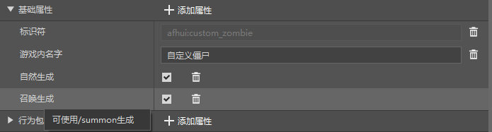

### 行为包组件

在这里需要引入一个概念，所有的我的世界基岩版的附加包，都分为行为包和资源包两个包体。行为包顾名思义就是定义了行为的包体，而资源包主要是图片、音频、模型等美术上的资源。

所以我们的行为包组件中，主要负责配置了这个实体在行为逻辑上的一些定义，比如这个僵尸是否会着火，血量是多少，攻击力是多少，攻击方式如何等等。

点击行为包组件这个大分类的右侧的`添加属性`按钮，即可选择并添加一些不在目前实体中的可用的行为属性。

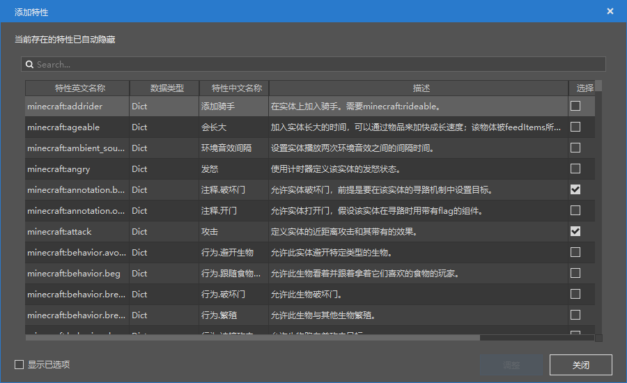

在添加属性的弹出窗口中，可以清楚地看到特征英文名称，数据类型，中文名称，描述。我们可以在这里找到我们想要添加或删除的属性，并点击右下角的调整按钮，对实体行为进行调整。

> 细心的同学们可能发现了数据类型这个列
>
> 那么这里大多数的数据类型都是Dict，是什么意思呢？
>
> Dict是一个字典，可以理解为一个映射，代表这种配置项还有许多子参数可以设定。
>
> 数据类型还有很多，下面是一些基本的数据类型和它们通俗的解释，供参考
>
> | 数据类型 |        定义         |
> | :------: | :-----------------: |
> |   Bool   | 布尔值(真/假,是/否) |
> |   Int    |    整数(1,2,100)    |
> |  Float   | 实数(3.1415,0.0001) |
> |   Str    | 文本(你好,我的世界) |

同时我们也可以在`Search...`窗口中，搜索关键词，例如搜索`在阳光下燃烧`。

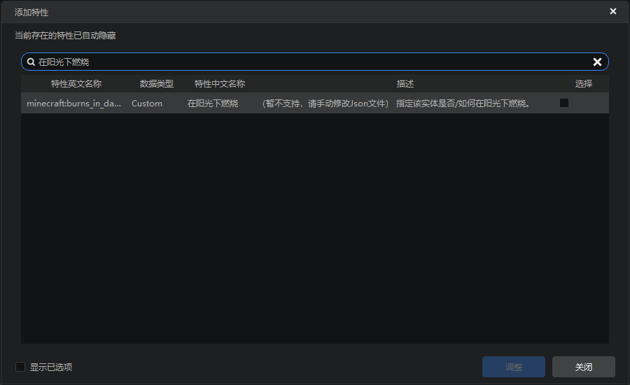

接下来我们可以尝试一下，通过修改行为，让这个僵尸在阳光下不燃烧。

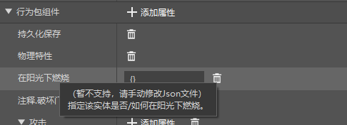

找到在阳光下燃烧这个属性，鼠标悬停在这个字上，可以看到这个属性的具体含义。虽然他不支持编辑，但是我们可以将其删除，点击右边的垃圾桶图标，即可将这个属性删除。删除后我们进入游戏查看效果。

进入游戏后我们有两种方式生成出自定义的这个怪物，一种是使用summon命令，还有一种是使用刷怪蛋。

在编辑器中找到我们这个自定义实体的标识符，比如我这里是`afhui:custom_zombie`，就在游戏中输入`/summon afhui:custom_zombie`

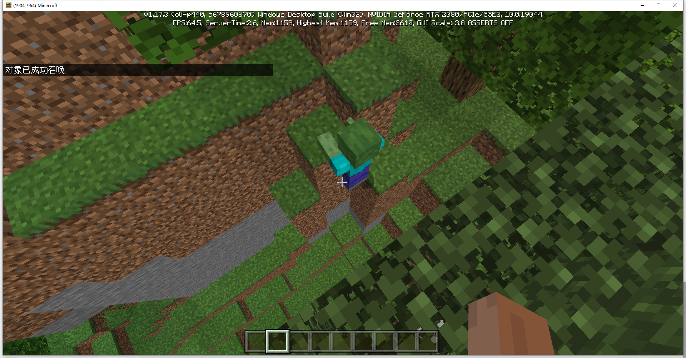

可以看到我们的自定义僵尸成功被召唤，且不会在阳关下燃烧。

还可以使用刷怪蛋来生成这个生物。在创造物品栏的刷怪蛋分类中，找到包含实体标识符的刷怪蛋，像原版刷怪蛋一样使用即可。

(因为我们没有配置这个刷怪蛋的对应物品名，所以这里显示的物品名是一大串英文)

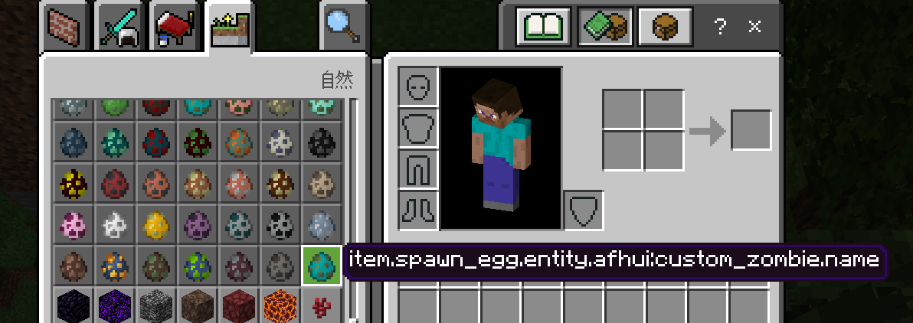

### 资源包组件

资源包组件定义了这个实体的模型和纹理，可以将实体的模型、纹理切换成我们自己想要的模型上。

## 物品

创建物品的大体步骤和实体一样。

点击新建按钮，在配置分类，找到物品，点击下一步。选择数据模板或者空模板，输入命名并进行创建。

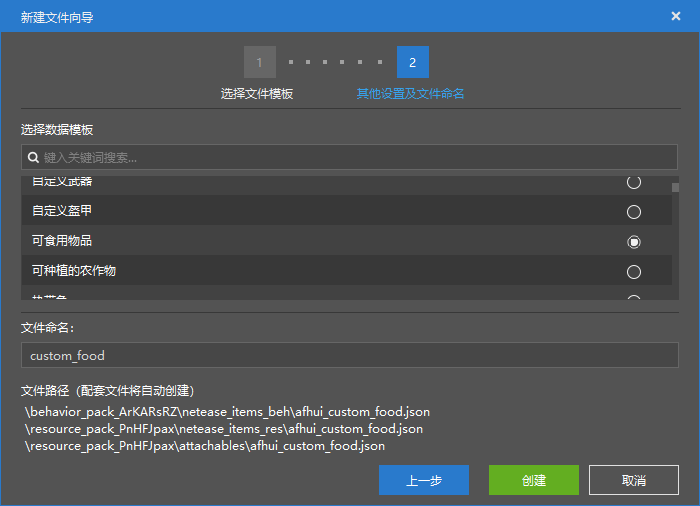

例如这里可食用物品，然后输入名字，进行创建。

创建后物品的属性和实体的属性大体上同样分为基础属性、资源包组件、行为包组件。但是物品多了一个盔甲可穿戴属性，用来配置盔甲的动画、模型、纹理等功能。操作方式和实体基本一致。

在这里我们制作一个回复10点饱食度、拥有生命提升效果的加强苹果作为例子。

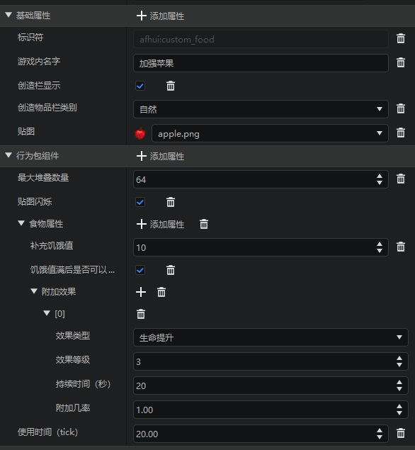

按照上图进行配置，进入游戏后就可以找到我们的加强苹果，在吃下后可以补充10点饥饿度并给予生命提升的药水效果。

## 方块

同样是在新建中点击配置分类，选择方块。这里我们可以选择自己想要的数据模板，输入名字进行创建。

例如我们可以创建一个发光方块作为演示。

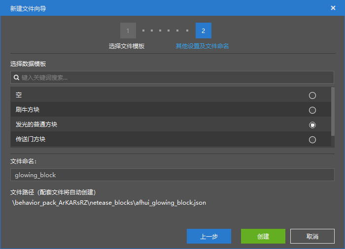

在属性栏中，我们可以对这个自定义方块的各种属性进行设置。

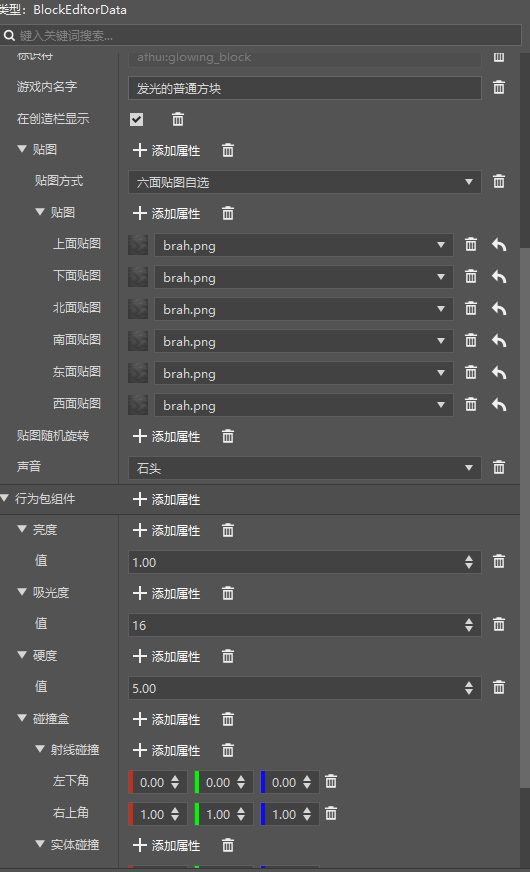

决定这个方块会发光的属性就是它的亮度属性。

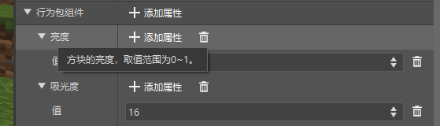

将鼠标移动到亮度这个标签上，就可以看到相关说明。方块的亮度值可以在0-1之间取值。

那么不难猜出这个值越大，亮度越大。我们修改这个数值后进入游戏验证我们的猜测。

- 亮度0.1

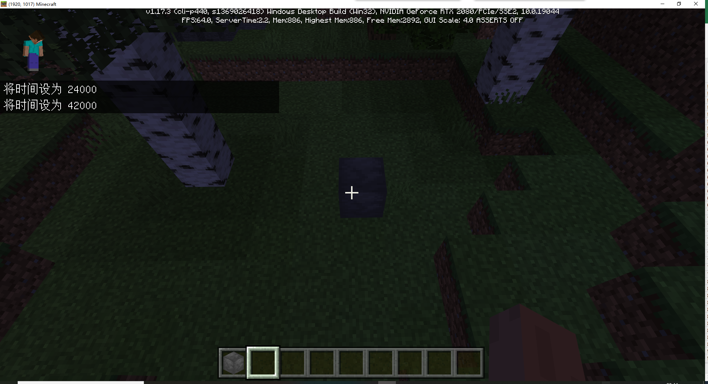

- 亮度1.0

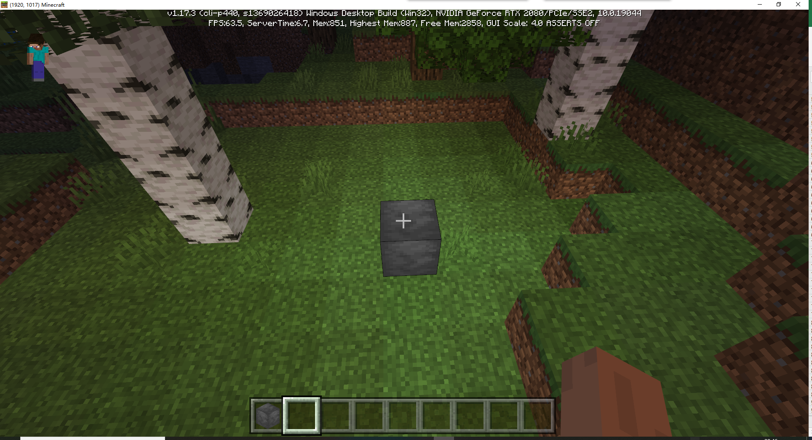

在学习了实体、物品、方块的配置方法后，相信大家都可以看出来编辑器的使用对各种游戏玩法的编辑都是大同小异，只需要对游戏有一定的了解，就可以轻松地添加游戏内容 。
