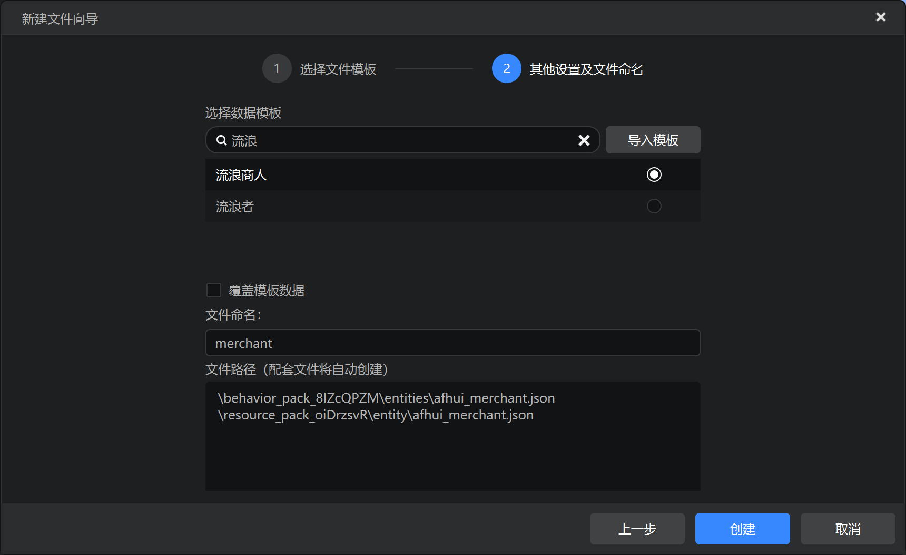
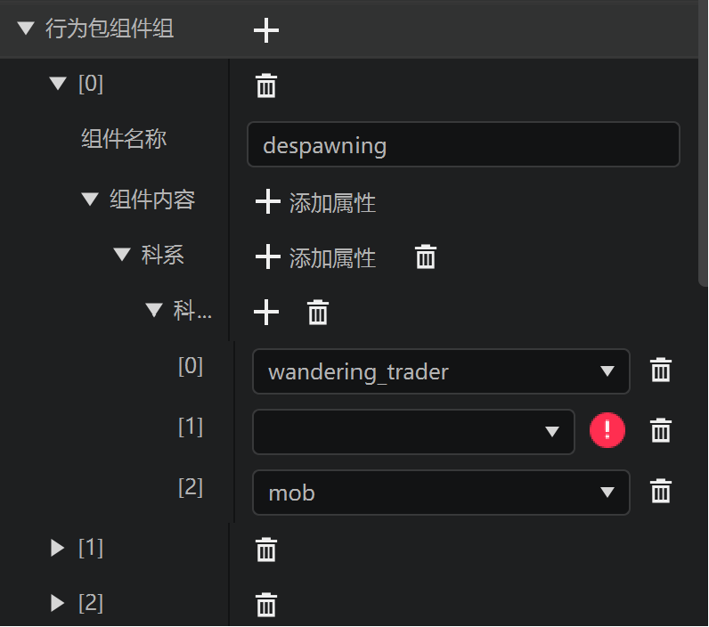
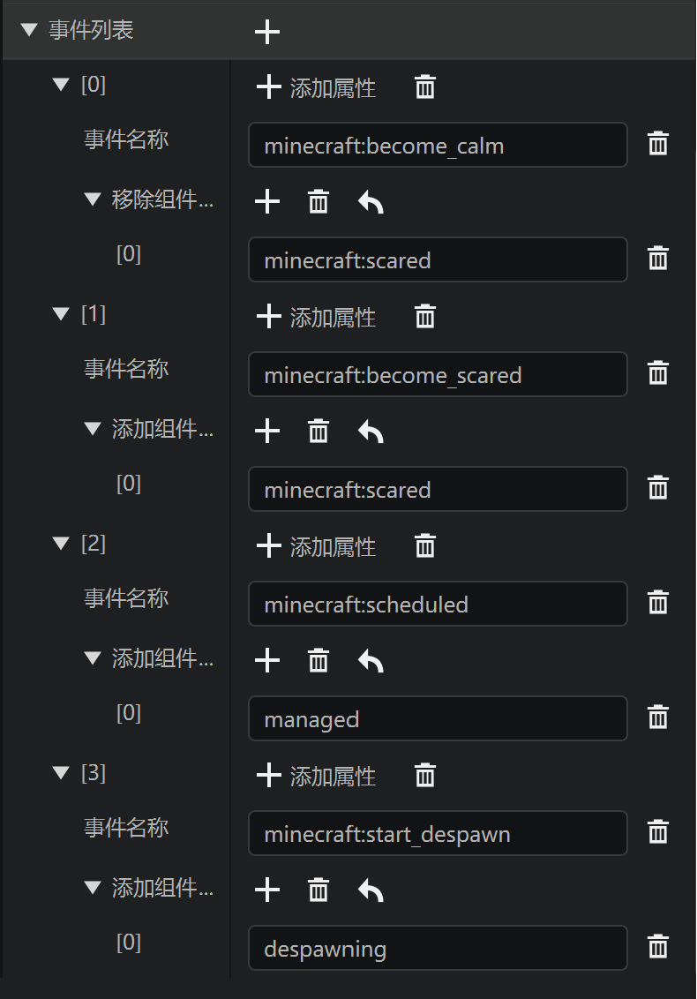
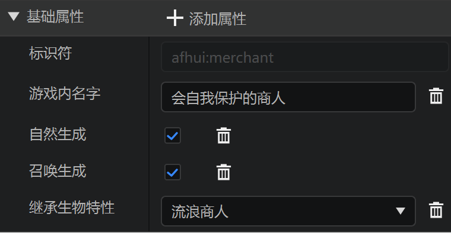
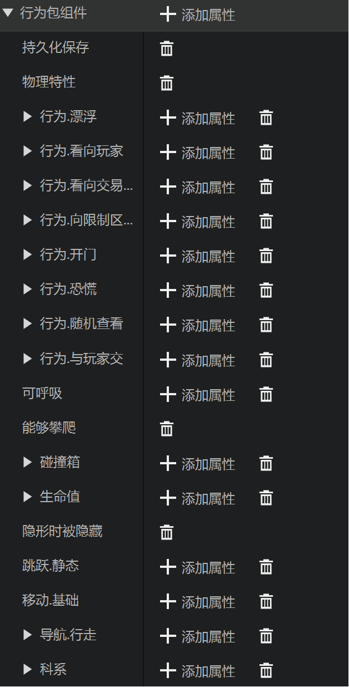
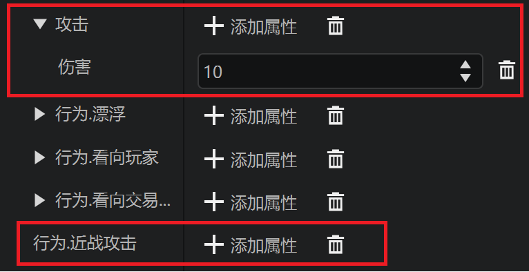
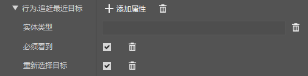
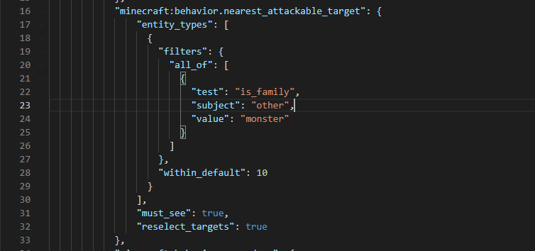
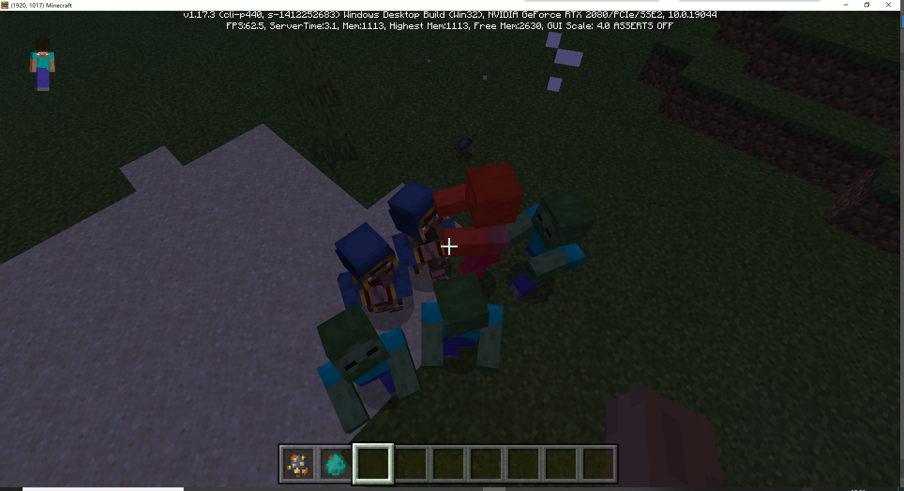

# 功能玩法课后作业

在学习了实体编辑的基本功能之后，我们来尝试做一个新的流浪商人，具有自我保护的能力！

## 创建实体

首先新建一个空的实体，并给它命名，这里我们起名叫`merchant`，使用流浪商人的实体模板。



创建完成后，我们就创建了一个和原版行为一模一样的流浪商人。

## 删除原版逻辑

因为不再需要原版的逻辑，所以我们需要在行为包组件组中，删除所有的组件组：[0] [1] [2]。



并删除所有的事件：[0] [1] [2] [3]



修改游戏内名字，方便和原版流浪商人作出区分



接下来我们可以删除交易（暂时不需要这个功能）、避开生物（躲避和主动攻击敌对生物冲突）相关的行为包组件，只保留最基础的行为包组件方便我们后续的编辑。实际操作时，不必和下图完全一样，可根据自己的想法自行增改。



## 配置攻击能力

接下来，我们为其添加近战攻击的能力，和攻击力。



但是这样配置，它并不会进行自我保护，所以我们还需要添加一个`行为.追赶最近目标`的行为，并按照图片进行配置。其中实体类型编辑器暂不支持编辑，我们需要手动打开json进行编辑。



我们在配置文件栏中，找到行为包Json，点击打开文件，将`entity_types`这一项改为下方的内容。

> 这段实体类型的意思是选择所有 实体种族 为 monster 的实体
>
> 在这里我们只做了解，想要学习具体语法可以参考[基岩版Wiki](https://bedrock.dev/zh/docs/stable/Entities#Filters)或者原版文件
>
> 原版文件可以在`MCStudioDownload\game\MinecraftPE_Netease\版本\data\`文件中找到
>
> MCStudioDownload文件夹在电脑上某个硬盘的根目录内，可自行查找。

```
				"entity_types": [
                    {
                        "filters": {
                          "all_of": [
                            {
                              "test": "is_family",
                              "subject": "other",
                              "value": "monster"
                            }
                          ]
                        },
                        "within_default": 10
                      }
                ],
```

修改后的json文件是这样的



接下来保存后，点击运行进入游戏，进行测试。



可以看到，我们放出的流浪商人，已经可以主动攻击所有敌对生物了。
