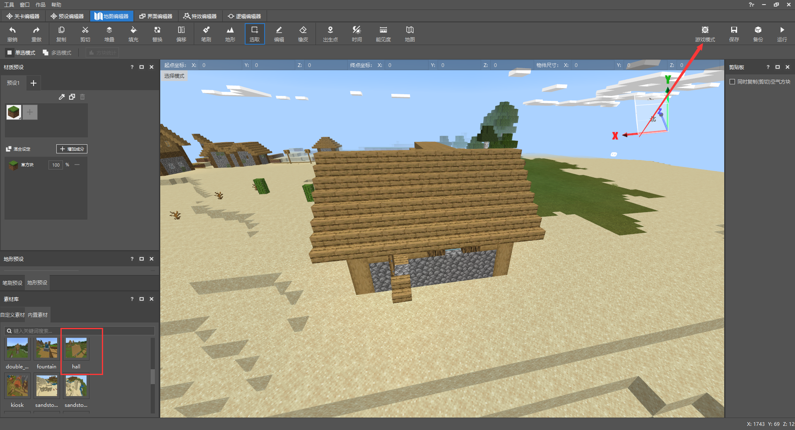
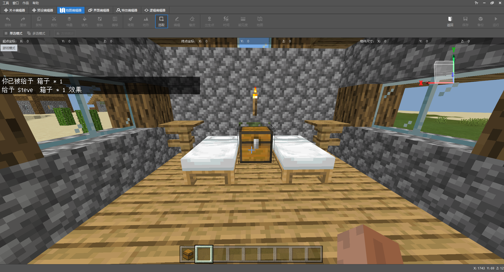
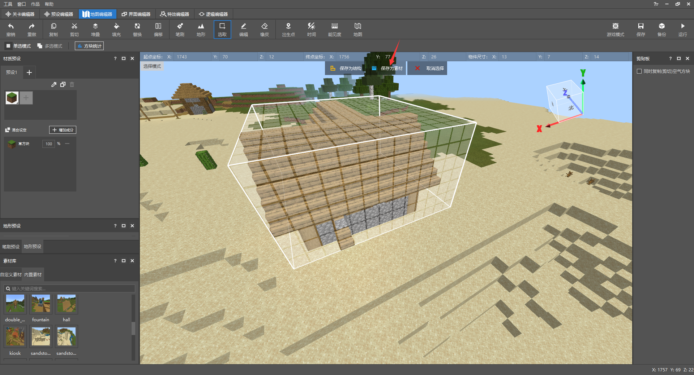
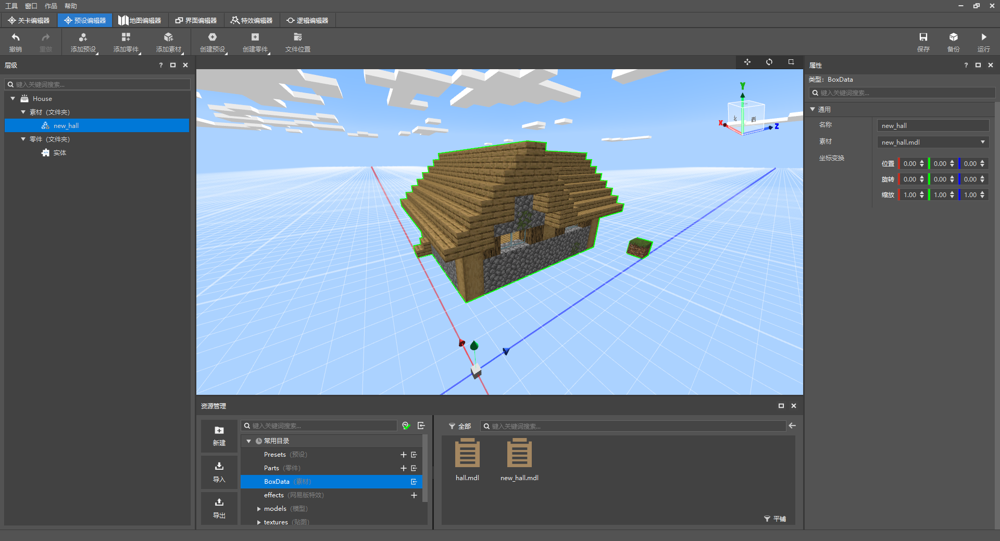
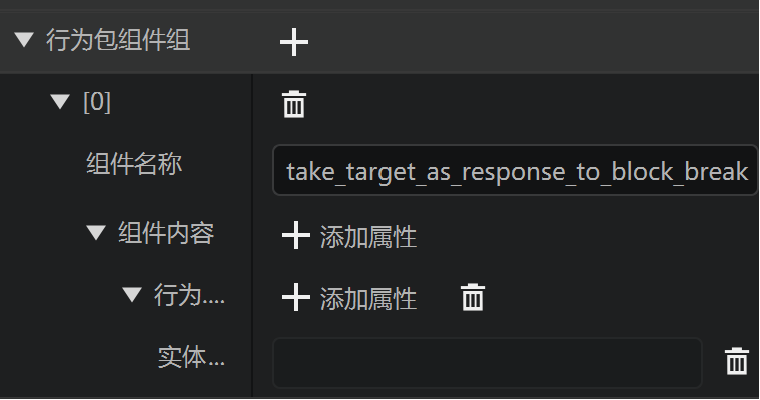
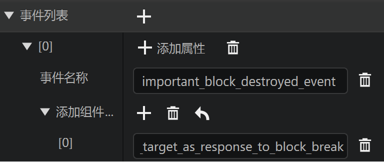
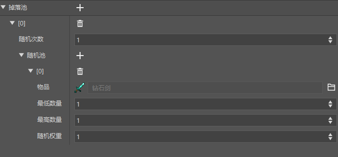
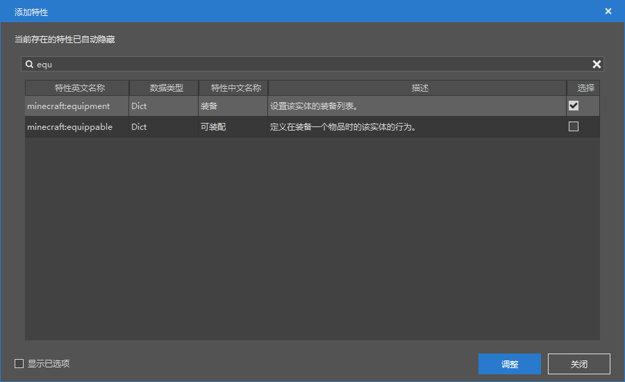

# 小屋预设课后作业

在学习了预设的基础用法后，可以尝试完成以下要求，来熟悉预设的用法。

- 在小屋素材内放置箱子方块
- 为自定义流浪商人添加猪灵似的攻击盗宝贼的行为
- 使用掉落表为自定义流浪商人添加初始装备

## 在素材内放置箱子方块

要在素材内放置箱子方块，首先我们需要将原来的`hall.mdl`这个素材，放置到地图中，然后对其进行编辑，再保存成新的一个素材。

打开地图编辑器，在素材库中，找到hall这个素材，点击选中，然后在地图中放置。



然后点击右上角的游戏模式，将编辑器切换到游戏的玩家视角，进入游戏，在房子中放置一个箱子。



放置完成后，按ESC退出。然后使用选取工具，重新选择这个小屋，并将其保存成素材，命名为`new_hall`，然后将选中的部分删除，将地形恢复原样。



然后再素材库中找到自定义素材，对刚刚保存的`new_hall`这个素材右键，选择`导入为预设素材`。

回到预设编辑器，将素材的`hall`删除，更换为`new_hall`。



至此，素材内的箱子就放置完成。

## 攻击盗宝贼的行为

进入关卡编辑器，找到我们的自定义流浪商人的实体。

在开始之前，我们需要了解一些新的知识。

### 行为包组件(components)

在行为包组件中，定义了影响实体行为的组件。

例如攻击盗宝贼行为将要用到的`minecraft:block_sensor`组件，用于检测周围方块被破坏。

但是在实际游戏中，实体的行为并非一尘不变的，例如未驯服的狼，默认情况下不会跟随玩家，但是在驯服后，会主动跟随玩家。

> 所以一般在编辑实体时，需要将实体**永不改变**的行为组件编写在此处。

### 行为包组件组(component_groups)

行为包组件组是行为包组件的集合。

一个组件组可以包含多个组件，通常可以把实体的一个状态下所用到的所有组件都编写在一个行为包组件组中。

例如狼实体，包含了以下状态的组件组：

- 幼仔
- 成年
- 野生
- 愤怒
- 驯服

狼实体会在不同情况下，动态增加或删除组件组，来实现特定的玩法。

### 事件(events)

定义一个事件，可以在事件被触发时，删除/添加指定的组件组。

例如狼实体，在驯服事件触发时，有以下的组件组修改

删除

- 野生

添加

- 驯服

### 步骤分析

在了解了上面的知识点后，我们可以得出，要实现检测破坏箱子方块之后，攻击盗宝贼的行为，需要额外用到行为包组件组和事件。

#### 行为包组件组

定义一个`take_target_as_response_to_block_break`分组，用来更新这个流浪商人的行为包组件，让它攻击玩家。



其中包含组件`行为.追赶附近目标`，实体类型为所有玩家，仍然需要手动打开json编辑。

```
				  "entity_types": [
                    {
                      "filters": {
                        "test": "is_family",
                        "subject": "other",
                        "value": "player"
                      },
                      "max_dist": 16
                    }
                  ]
```

#### 事件

定义一个`important_block_destroyed_event`，在玩家破坏箱子后触发，然后给实体添加`take_target_as_response_to_block_break`这个组件分组，让它攻击玩家。



#### 行为包组件

`minecraft:block_sensor`可以用来检测周围的方块，是否有破坏之类的事件，在检测到后，触发某个json事件。因为编辑器暂时不支持编辑这个组件，所以手动编辑json，将它放到`components`这个节点下（对应编辑器中的行为包组件）。

```json
		"minecraft:block_sensor": {
          "sensor_radius": 16,
          "on_break": [
            {
              "block_list": [
                "minecraft:chest"
              ],
              "on_block_broken": "important_block_destroyed_event"
            }
          ]
        }
```

其中`on_block_broken`的意义就是触发事件，添加行为包组件组。

最终配置完成的json文件如下，其中修改的部分进行了注释，可以参考。

```json
{
    "format_version": "1.12.0",
    "minecraft:entity": {
        "components": {
            "minecraft:attack": {
                "damage": 10
            },
            "minecraft:behavior.float": {
                "priority": 0
            },
            "minecraft:behavior.look_at_player": {
                "look_distance": 8,
                "priority": 8,
                "probability": 0.02
            },
            "minecraft:behavior.melee_attack": {

            },
            "minecraft:behavior.nearest_attackable_target": {
                "entity_types": [
                    {
                        "filters": {
                            "all_of": [
                                {
                                    "subject": "other",
                                    "test": "is_family",
                                    "value": "monster"
                                }
                            ]
                        },
                        "within_default": 10
                    }
                ],
                "must_see": true,
                "reselect_targets": true
            },
            "minecraft:behavior.open_door": {
                "close_door_after": true,
                "priority": 6
            },
            "minecraft:behavior.random_look_around": {
                "priority": 9
            },
            "minecraft:behavior.restrict_open_door": {
                "priority": 5
            },
            "minecraft:behavior.sleep": {

            },
            "minecraft:can_climb": {

            },
            "minecraft:economy_trade_table": {
                "convert_trades_economy": true,
                "display_name": "商人",
                "new_screen": true,
                "table": "trading/trade.json"
            },
            "minecraft:jump.static": {

            },
            "minecraft:loot": {
                "table": "loot_tables/loot.json"
            },
            "minecraft:movement": {
                "value": 0.5
            },
            "minecraft:movement.basic": {

            },
            "minecraft:navigation.walk": {
                "avoid_water": true,
                "can_open_doors": true,
                "can_pass_doors": true,
                "can_path_over_water": true
            },
            "minecraft:persistent": {

            },
            "minecraft:physics": {

            },
            "minecraft:pushable": {
                "is_pushable": true,
                "is_pushable_by_piston": true
            },
            // 用来检测周围的方块
            "minecraft:block_sensor": {
                "sensor_radius": 16,
                "on_break": [
                  {
                    "block_list": [
                      "minecraft:chest"
                    ],
                    "on_block_broken": "important_block_destroyed_event"
                  }
                ]
              }
        },
        // 新增的组件分组
        "component_groups":{
            "take_target_as_response_to_block_break": {
                "minecraft:behavior.nearest_attackable_target": {
                  "priority": 7,
                  "entity_types": [
                    {
                      "filters": {
                        "test": "is_family",
                        "subject": "other",
                        "value": "player"
                      },
                      "max_dist": 16
                    }
                  ]
                }
            }
        },
        // 新增的事件定义
        "events": {
            "important_block_destroyed_event": {
                "add": {
                  "component_groups": [
                    "take_target_as_response_to_block_break"
                  ]
                }
            }
        },
        "description": {
            "identifier": "afhui:merchant",
            "is_experimental": false,
            "is_spawnable": true,
            "is_summonable": true
        }
    }
}
```

## 使用掉落表配置初始装备

首先使用资源管理，新建一个掉落表，命名为`merchant_weapon`

在掉落池中添加一个钻石剑。



这样即配置完成，如果想要随机性，也可以再添加多种不同类型的剑。

然后回到自定义流浪商人的实体配置，在行为包组件中搜索装备并新增。



添加后，在行为包组件中找到装备一栏，点击添加属性，新增`表`这个属性，填入`loot_tables/merchant_weapon.json`，也就是我们刚刚创建的掉落表。

到此为止，要求已经全部完成，保存后就可以点击运行进入游戏测试啦！

> 为什么进入游戏后看不到这个流浪商人手持剑呢？
>
> 因为我们没有给它配置相关的持剑动画，渲染设置，所以这把剑只能够提升它的攻击力，不可显示。
