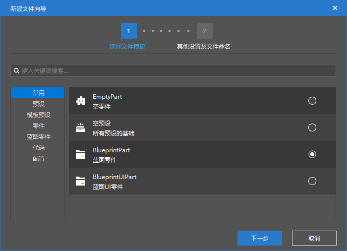
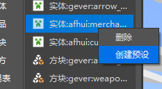
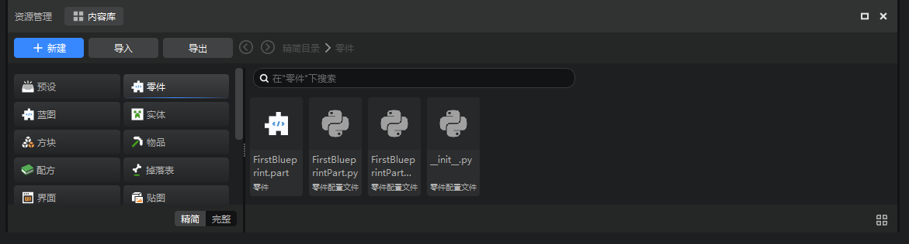
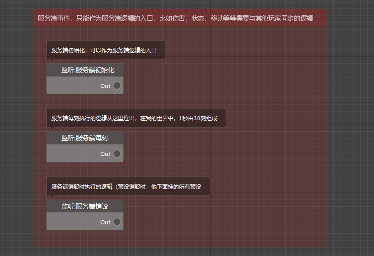
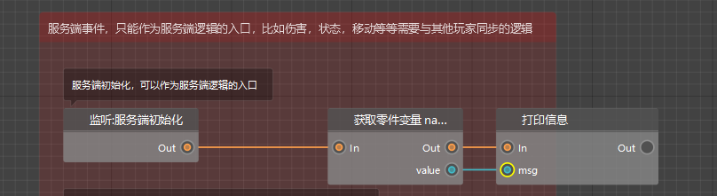
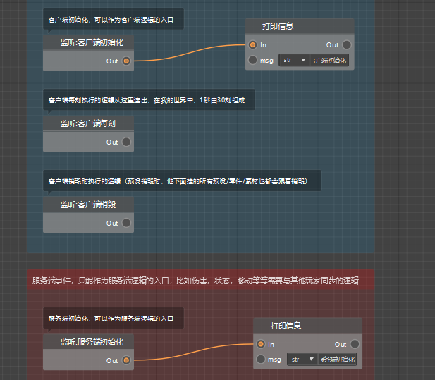
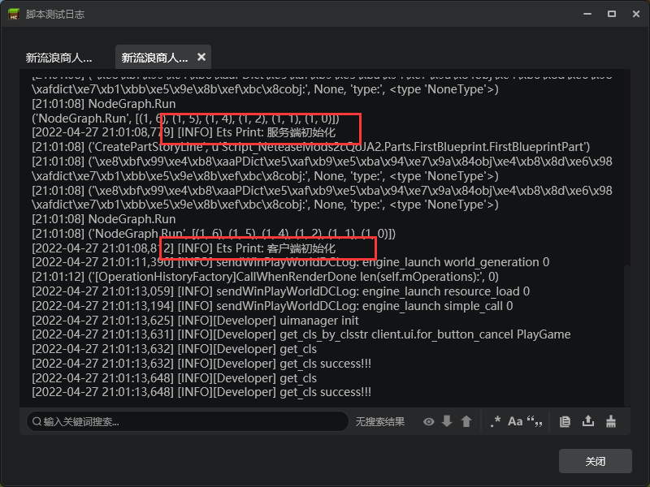

# 制作第一个蓝图零件

学习了预设编辑器后，相信大家都对预设和零件有了一定的了解。在本章中，将会主要介绍零件中自定义功能最强大的一个——蓝图零件。

蓝图零件相信大家在玩法组件基础教程中已经接触过了，并且按照教程完成了一个爆炸弓的制作。那么现在，我们将开始深入了解蓝图零件和逻辑编辑器。

在这一节的教学中，我们还是会使用上一章使用预设编辑器制作的玩法地图，没有完成制作的可以在 [这里](https://g79.gdl.netease.com/preset_tutorial_res.zip) 进行下载并导入。

<iframe src="https://cc.163.com/act/m/daily/iframeplayer/?id=6328655ee6c041f2578ca7fa" width="800" height="600" allow="fullscreen"/>

## 零件的挂载

我们在关卡编辑器中，先新建一个蓝图零件。

名字我们填写`FirstBlueprint`，方便后面做区分。

创建完成后，在配置栏中找到我们的自定义流浪商人，右键，为其创建预设。

文件命名这里填写`EntityMerchant`，当然也可以根据自己的喜好进行命名。

创建完成后会自动切换到预设编辑器，在资源管理中，找到`Parts(零件)`，并点击`FirstBlueprint`这个我们刚刚创建的蓝图零件。

在这里可以看到我们蓝图零件的相关文件。其中，第一个文件可以拖动到预设身上，完成零件和预设的挂接、第二个文件是逻辑文件，双击即可在逻辑编辑器中打开。后面的三个.py结尾的，我们会在后续课程中讲到，这里暂时略过。

现在需要做的，就是将第一个文件，拖动到左侧层级窗口中，实体预设下。

这样就完成了零件与预设的挂接。这样，每当这个实体预设被加载的时候，都会初始化其拥有的所有零件，并按照逻辑编辑器中的逻辑关系进行运行。

反之，如果只是创建了零件，并编写了逻辑代码，但是它并没有挂接到任何预设上，或者被挂接的预设始终没有被加载，那么零件中的逻辑代码是不会被运行的。

## 逻辑的编写

双击逻辑文件，打开逻辑编辑器。可以看到逻辑编辑器中已经预置了一些节点，他们分别是：

- 监听：客户端初始化
- 监听：客户端每刻
- 监听：客户端销毁
- 监听：服务端初始化
- 监听：服务端每刻
- 监听：服务端销毁

不难看出，监听分为2部分，分别是客户端和服务端。每个端又有3个监听，分别是初始化、销毁、每刻。

初始化和销毁是对立的，一个是开始，一个是结束。每刻则是开始到结束过程中的阶段，我的世界服务端和客户端，将1秒定义为30刻，每刻所对应的节点，都会每秒被执行30次。

客户端和服务端的区别，会在后面详细介绍，这里只做简单了解。

可以看到这些节点的右侧，都有一个Out，并且有一个圆圈，我们叫它端口。

### 节点间的连接方式

在端口处，按下鼠标，往外拖动，可以看到一条线，松开鼠标，会弹出节点选择面板，在这里选择后即可创建节点。例如我们这里需要在服务器被初始化的时候，打印消息“服务器初始化”，就可以按照下方动图进行创建节点并自动进行连接。

这样就创建了一个打印信息的节点，并将它和服务端初始化进行连接。除了这种创建方式之外，我们还可以直接在空白处右键，创建一个节点，然后再手动将上一个节点的Out端口和下一个节点的In端口相连。

### 执行连线和数据连线

可以发现，无论是使用哪种方式进行节点之间的连线，我们从Out端口链接到下一个In端口处的连线，都是橙色的连线。

这样的橙色连线，是**执行连线**，代表了逻辑节点之间的执行顺序。程序会始终从一个节点的Out端口，向下一个In端口所连接的节点执行。

除此之外，还有一种连线，是蓝色的，如下图所示。这样的连线是**数据连线**，只代表了数据的传递关系，不代表执行顺序。

> 上图的逻辑的意思是，在初始化之后，获取当前零件的name，并将这个name进行打印。
>
> 即将零件的名称，传递给了打印信息这个节点，用来输出。

在了解了基本的节点连接之后，我们分别给服务器和客户端初始化的时候，打印信息。

这样，就完成了逻辑的第一个蓝图零件的制作，我们可以进入游戏查看日志，检查是否配置正确。

如果配置正确，进入游戏后，就可以看到红色框选出来的输出信息。