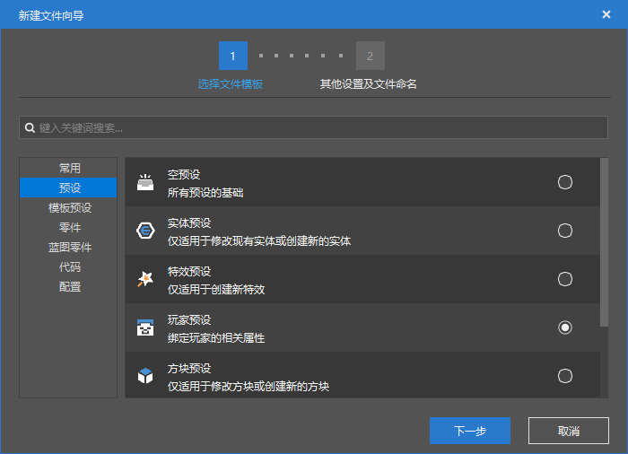
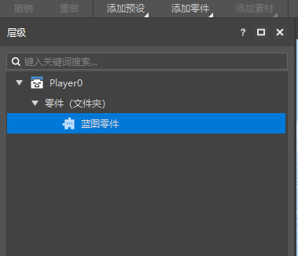
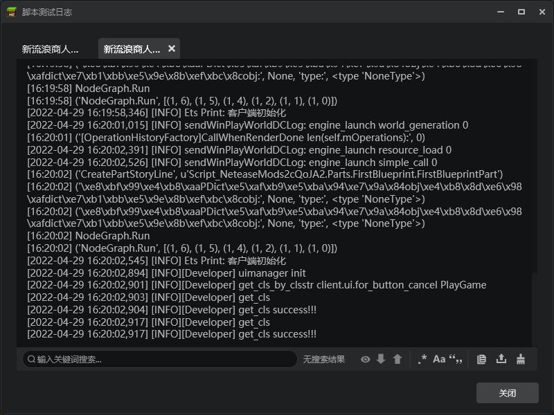

# 蓝图零件课后作业

课后作业要求如下：

- 将第一个蓝图零件，挂接到玩家预设上，并观察日志输出

## 操作步骤

新建一个玩家预设

打开预设编辑器，编辑玩家预设，将`FirstBlueprint`零件拖动到玩家预设上。

这样就配置完成，我们可以进入游戏并观察日志。可以看到应该服务器和客户端的输出各有2次。因为有1个玩家实体和一个流浪商人实体，所以每个实体都会触发1次客户端和服务器。

