---
front:
hard: 进阶
time: 20分钟
---
# 逻辑编辑器的基础概念（4）

在学习使用了官方提供的各种零件接口和SDK接口之后，现在我们就可以尝试自己自定义一个接口啦。

<iframe src="https://cc.163.com/act/m/daily/iframeplayer/?id=6328664ee6c041f2578ca804" width="800" height="600" allow="fullscreen"/>

## 什么是自定义接口

在大型玩法开发中，我们会发现有时候很多地方都需要调用相同的功能，执行除了参数以外，几乎一样的逻辑节点。那么自定义接口就可以很好地解决这个问题，我们可以自定义一个接口，并且定义接口内部执行的逻辑节点。并且自由地调用它。这样可以极大地简化我们的逻辑代码。

## 定义自定义接口

在逻辑编辑器中，我们在左侧可以看到自定义接口一栏。在这里就可以创建一个自定义接口。

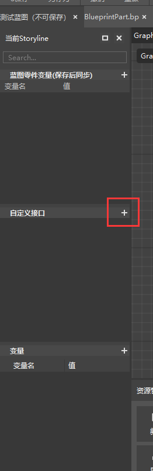

点击自定义接口右侧的加号，就可以创建一个自定义接口。然后修改其名字，我们这里改成`f_test`，需要注意，自定义接口必须以`f_`开头。

并且在顶部可以看到`Graph > f_test`，代表我们正在编辑的接口。

点击Graph即可返回到原来的编辑界面。双击左侧的自定义接口中的`f_test`，即可返回这个自定义接口的编辑。

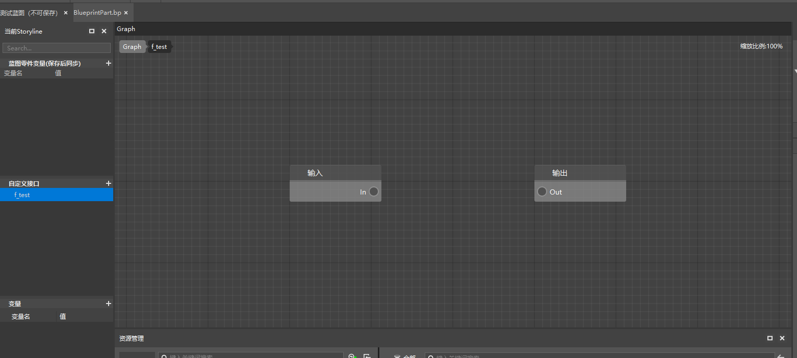

我们可以在这里编写我们需要的逻辑，从In的输入处开始执行，直到输出处的Out，就退出自定义函数。

自定义函数必须要从In到Out有一条完整的执行连线，否则无法正常工作。

例如我们在这里循环从1打印到100，然后链接输出。

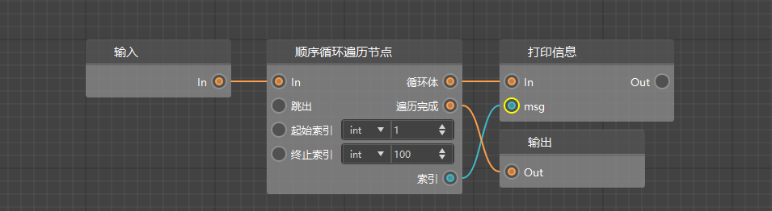

这样就完成了自定义接口的编辑。我们回到Graph界面。

可以从左侧自定义接口中，选中`f_test`，并拖动到编辑界面中，就创建了一个节点调用我们的自定义接口。然后我们把它连接到服务端初始化之后来执行，查看日志窗口的输出效果。

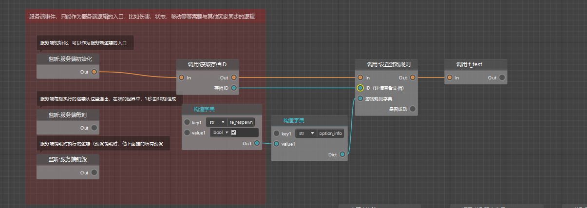

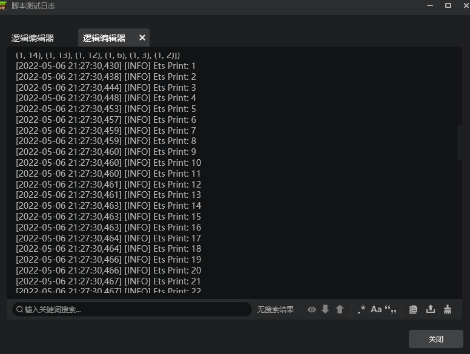

可以看到像预期一样，从1打印到了100。

## 自定义接口的参数

自定义接口如果只是能像刚刚所做的那样，能把一部分节点，封装到一个接口中，进行调用，就会显得很死板，因为其中的值都被固定。

遇到这种情况，我们就可以给它创建一个参数，在外部调用这个接口的时候，将参数带入接口，就可以让这个接口的实用性大大提高。

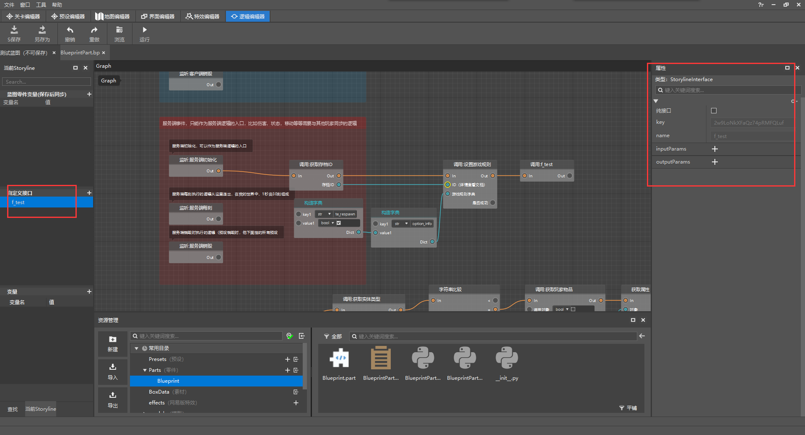

在左侧自定义接口选中了要编辑的自定义接口后，右侧属性面板就会出现相应的配置。可以看到有一个`inputParams`栏，还有一个`outputParams`栏。

我们可以在这里新增输入和输出参数，让它在运行前传入一些值，在运行结束后，再传出一些值。

假如还是刚才的循环的自定义接口，我们希望传入参数，指定它从1循环到多少，我们就可以新增一个`inputParams`，点击加号新增。

如果我们还需要这个接口将某个运算结果传递回来，也可以新增一个`outputParams`，作为返回值。

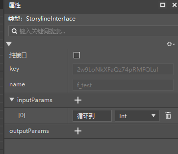

我们这里先新增一个输入参数，定义它的名字为`循环到`，类型为`int`，然后再次回到自定义接口编辑处。就可以看到输入的节点多了一个循环到的端口，我们可以将它进行对应的参数传递，来达到预期的效果。

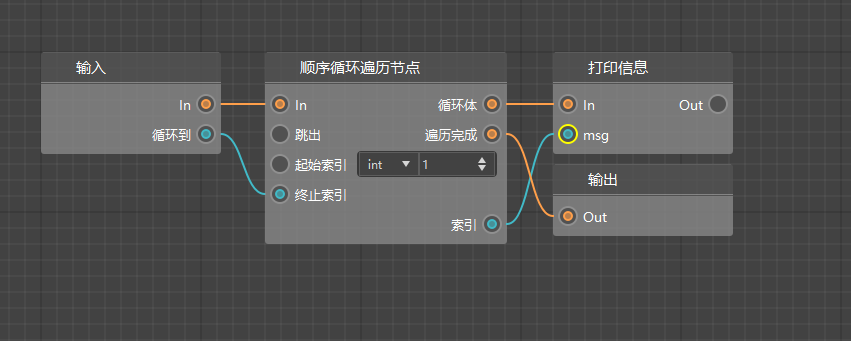

这样我们就可以在自定义接口外部定义需要循环多少次。现在就可以输入需要循环到的数字。

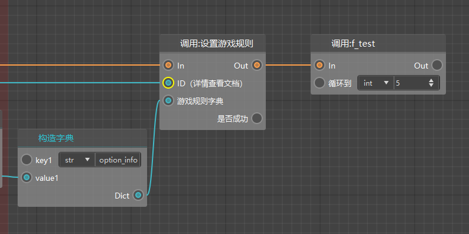

## Python模块

除了逻辑编辑器已经提供的接口外，我们还可以直接调用Python的内置模块，来实现更强大的功能。

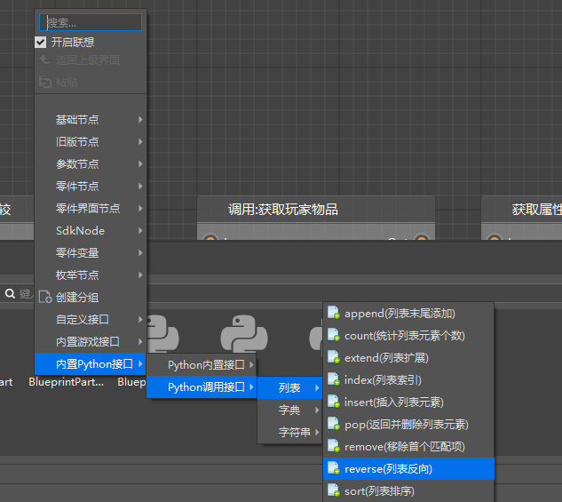

细心的同学可能早就发现了，在我们的编辑器中，还有一个内置Python接口的分类，在这里可以调用一些Python提供的接口，例如对列表和字典的工具函数。

具体使用方法可以查阅Python的函数文档。

## 课后作业

在`实体受到伤害`事件中，利用自定义接口 定义`实体标识符`、`手持物品名称`、`物品列表`三个参数，并重新实现攻击实体会随机掉落物品列表内的物品`的逻辑。

### 操作步骤

首先我们需要新建一个自定义接口，这里叫做`f_dropRandomItem`，并给它定义3个输入参数，物品列表的类型应该为list，但是这里并没有列出list，所以选择Any代表任意。

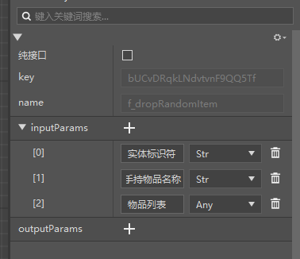

接下来我们可以把部分之前已经编写过的逻辑节点，复制到自定义接口中。然后对其连线进行调整。最后的效果如图:

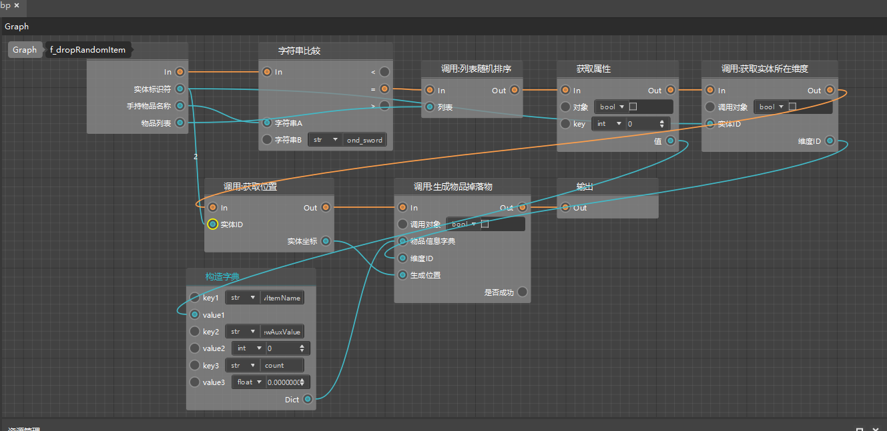

完成配置后，再回到Graph中，直接将随机生成掉落物的逻辑节点，替换成调用自定义接口就可以了。

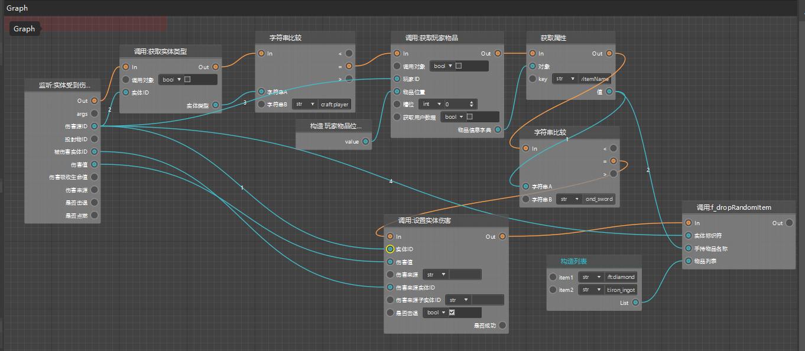