---
front:
hard: 进阶
time: 30分钟
---
# 界面的制作和逻辑编写

本节将会介绍如何使用界面编辑器、逻辑编辑器、预设编辑器，来制作一个界面。

<iframe src="https://cc.163.com/act/m/daily/iframeplayer/?id=63286c08e6c041f2578ca84e" width="800" height="600" allow="fullscreen"/>

## 界面绘制

首先来学习如何使用界面编辑器。切换到界面编辑器之后，我们首先需要创建一个界面，才能进行编辑。

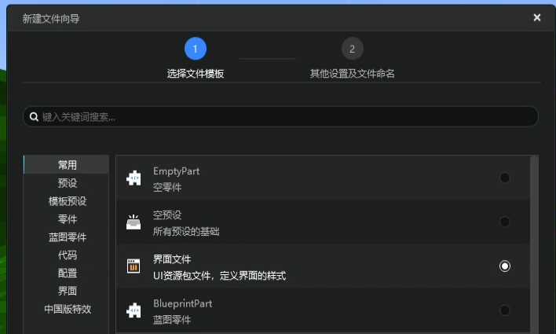

在资源管理中，新建界面，我们给他命名成`团队名_界面名`，以防止冲突。这里我们叫做`soldier_screen`。

这样，我们选中刚创建的界面，就可以开始编辑了。界面的上方工具栏，是一些可以快捷创建界面控件的按钮。

点击这些按钮，就可以在被选中的结构下，创建一个新的控件。

左侧显示了目前界面的控件的父子关系，并且可以看到默认已经创建了一个main控件，这是一个画布，是一个界面的根控件。

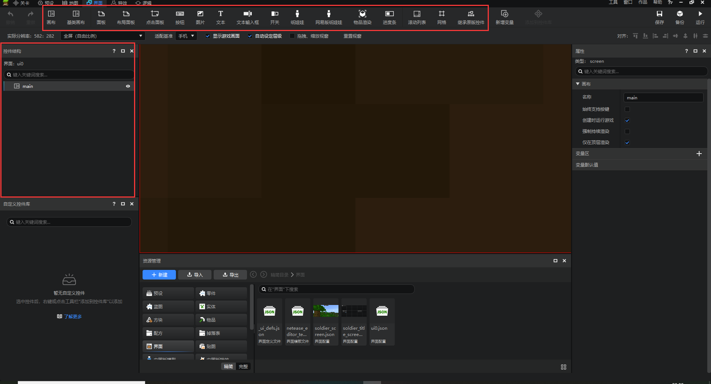

接下来我们尝试制作一个简单的显示玩家实时坐标的界面。

例如现在我们点击上方的面板按钮，创建一个叫做`main_panel`的控件，在`main`下。

然后修改他的父子锚点到右下角，这样就可以看到面板的红色轮廓，被固定在了界面的右下角。

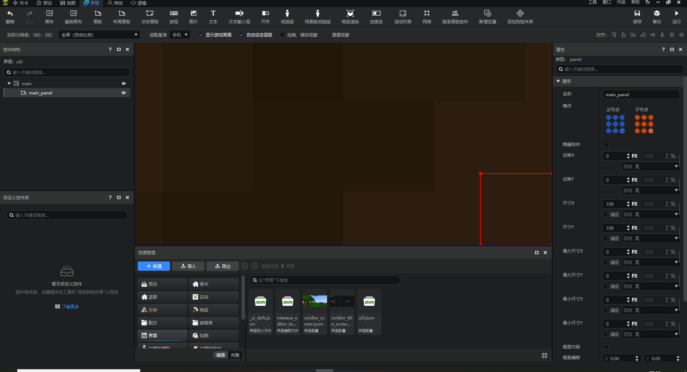

相应的，属性面板还可以设置它的位移坐标，尺寸大小。

例如我们这里将位移X改为`-10+父控件尺寸X*1%`，位移Y改成`父控件尺寸Y*-1%`。尺寸Y修改为20。

可以看到，尺寸控制了这个控件的大小，目前红色框为一个100x20的矩形。

而位移控制了它相对于锚点位置的偏移值。使用跟随父控件，可以基于百分比进行设置，这样可以在分辨率不同的情况下更好地进行界面的适配。

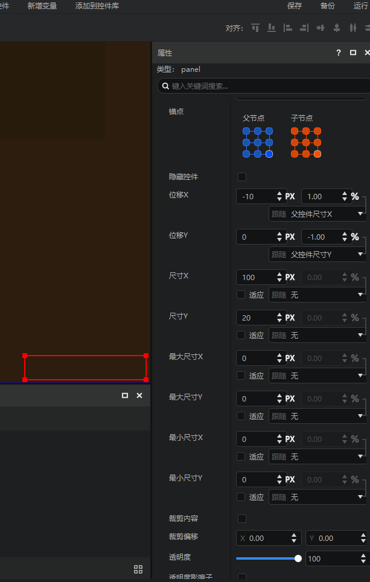

同时，游戏界面上方的分辨率选择框，可以选择预览的长宽比，我们这里选择`21:9`，可以看到位移X和Y，是基于父控件（目前是整个屏幕）的1%进行了偏移。

由此可以看出，使用百分比的相对位置进行布局，可以在屏幕分辨率不同的情况下，轻松地对界面的位置进行适配，而不会出现因为分辨率更变出现界面布局错乱的情况。

> 虽然基于百分比的布局这样看来很方便，但是它实际上是在界面初始化的时候，根据玩家屏幕的分辨率计算出来的值
>
> 在PC端游戏中途，调整窗口大小，分辨率动态改变的情况下，会出现布局错乱的情况。这就需要开发者们自行对比，选择更适合自己使用的。

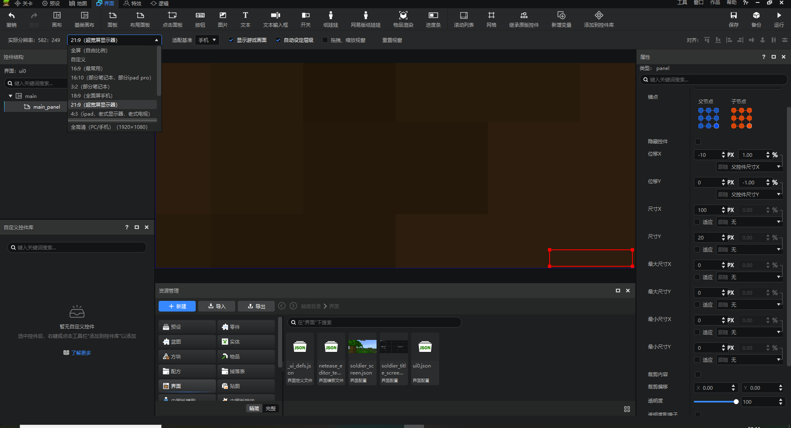

设置完位置后，我们可以给这个面板添加一个图片，作为背景。

选中`main_panel`控件后，点击图片按钮，新建一个图片。

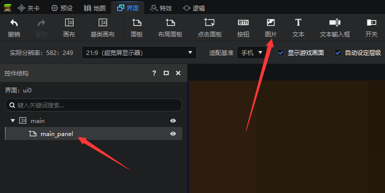

并且尺寸X，尺寸Y全部勾选适应。这样就可以使这个图片完全撑满它的父容器，即`main_panel`这个面板。

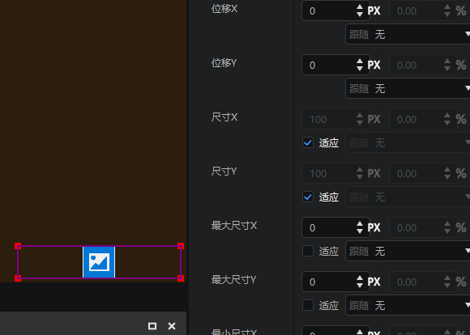

接下来，我们可以更换这个图片控件使用的图片资源，使用一个原版的图片资源。点击右侧文件夹按钮，选择图片`./ui/effect_background.png`

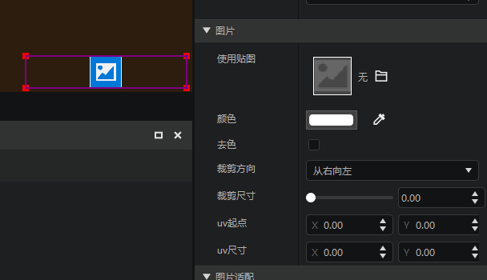

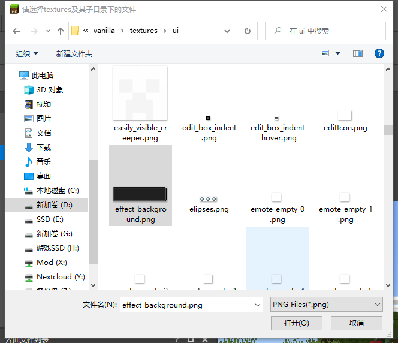

这样我们就成功给这个图片换成了药水效果的背景图片，这是一个原版的九宫格资源，如果自己绘制图片界面，建议让美术同学绘制九宫格资源，具体的规则[点我](https://mc.163.com/dev/mcmanual/mc-dev/mcguide/16-%E7%BE%8E%E6%9C%AF/50-%E8%B4%B4%E5%9B%BE%E8%A7%84%E8%8C%83%E5%8F%8A%E4%B9%9D%E5%AE%AB%E6%A0%BC%E4%BD%BF%E7%94%A8.html)。

接下来我们可以，继续在`main_panel`下创建一个文本控件，同样尺寸X，尺寸Y适应，并给它改名为`pos_text`。

需要注意的是，目前我们所创建的所有控件的命名，都是为了后续编写逻辑的时候更方便的通过它们的名字来找到它们。

比如我们现在的这个文本控件，所在的路径就应该是`/main_panel/pos_text`，后面我们可以使用逻辑编辑器，通过逻辑节点找到它，并修改它的值。

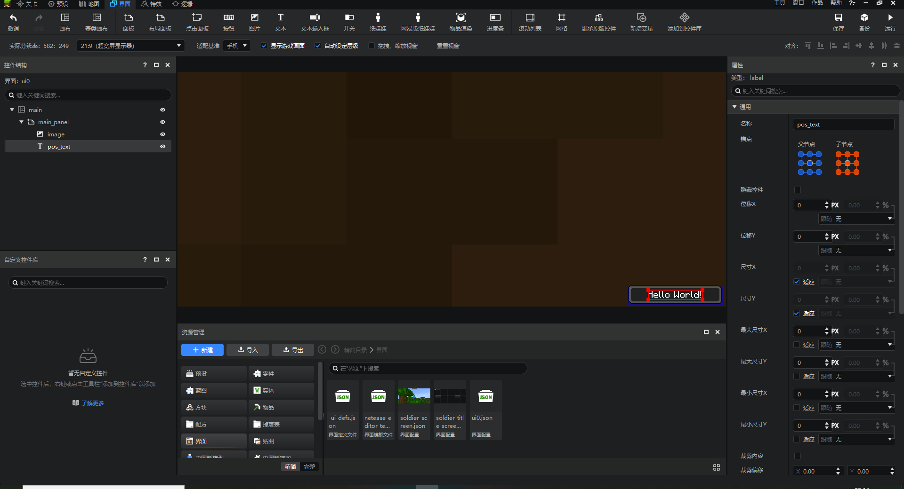

## 创建预设

绘制完了界面，我们就需要到预设编辑器，创建一个界面预设。

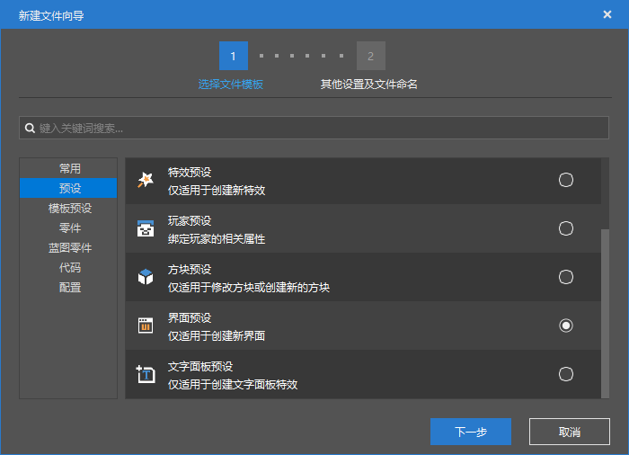

第一个文件命名我们这里叫做`PosUI`，需要保证这个名字唯一，它将会被用作创建这个界面的标识符。

同时底部还有一个文件命名，这里是对应的界面的控制文件命名，也需要保证每个界面对应的文件唯一。

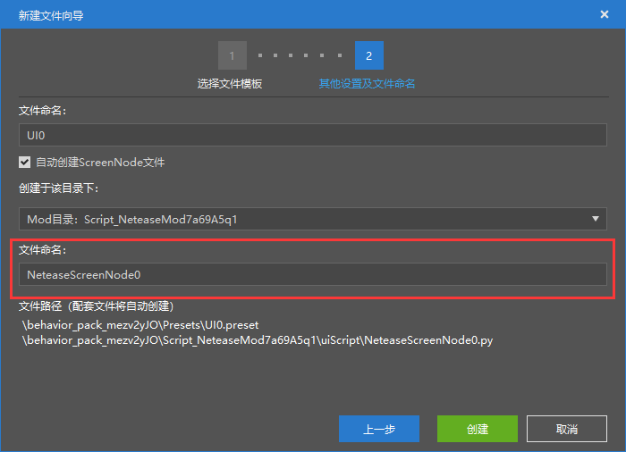

预设创建完成后，就可以看到界面中已经自动勾选了我们之前所编辑的界面，如果没有，可以在`绑定的界面画布`处自行选择。

在属性窗口中，主要需要关注的就是下面框选的地方。

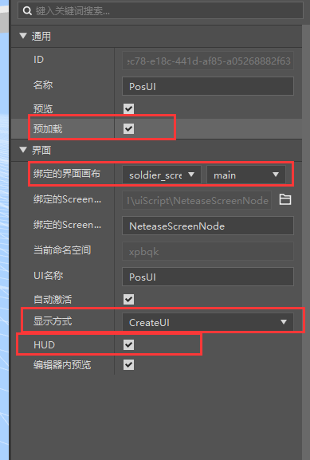

### 预加载

预加载**一定要勾选**，只有勾选了预加载，这个界面才会被显示。

### 绑定的界面画布

选择界面编辑器中的界面文件和对应的画布，画布一般是main。

### 显示方式

#### CreateUI

使用CreateUI创建的界面，会直接在玩家的游戏界面上进行叠加。

一般适用于创建HUD。

#### PushScreen

使用PushScreen创建的界面，会以栈的形式来创建一个界面，在游戏中只显示这个界面，不显示类似物品栏，操作按钮等界面。并且在PC端调用会自动呼出鼠标。

一般适用于创建类似箱子，熔炉等单独的操作界面。

### Hud

勾选Hud，那么界面将会悬浮在游戏窗口中，不会影响游戏的实际交互。

例如原版中的血条，饱食度，物品栏的界面，就都是Hud。

### 逻辑编写

那么完成了配置，我们的界面进入游戏之后就可以正常显示了。

接下来我们就要创建一个蓝图UI零件，来为这个界面编写逻辑。

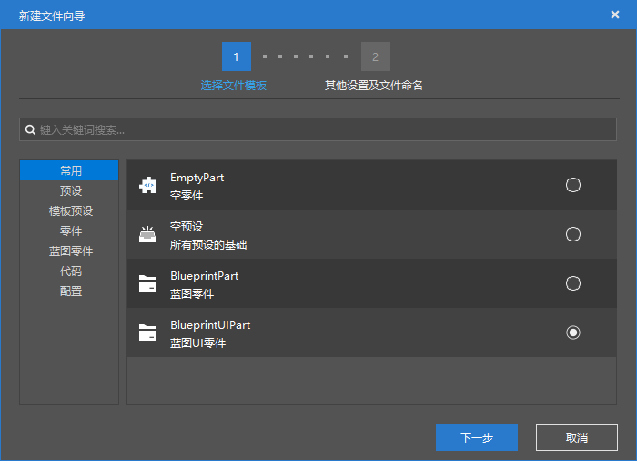

同样的，把新创建的零件，挂接到界面预设上。然后双击逻辑文件，打开逻辑编辑器。

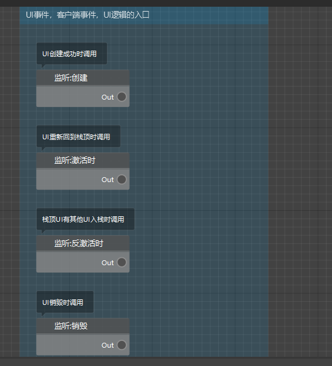

可以看到，相比于一般的蓝图零件，多了一块UI相关的事件监听。

其中，`创建`和`监听`，是使用任意方式创建的界面，可以触发的函数。而`激活时`和`反激活`时，是使用`PushScreen`方式创建的界面，额外会触发的事件。

接下来，我们要实现实时更新坐标，就需要在服务端每刻处，创建一个`GetBaseUIControl`接口的节点，用来获取对象。

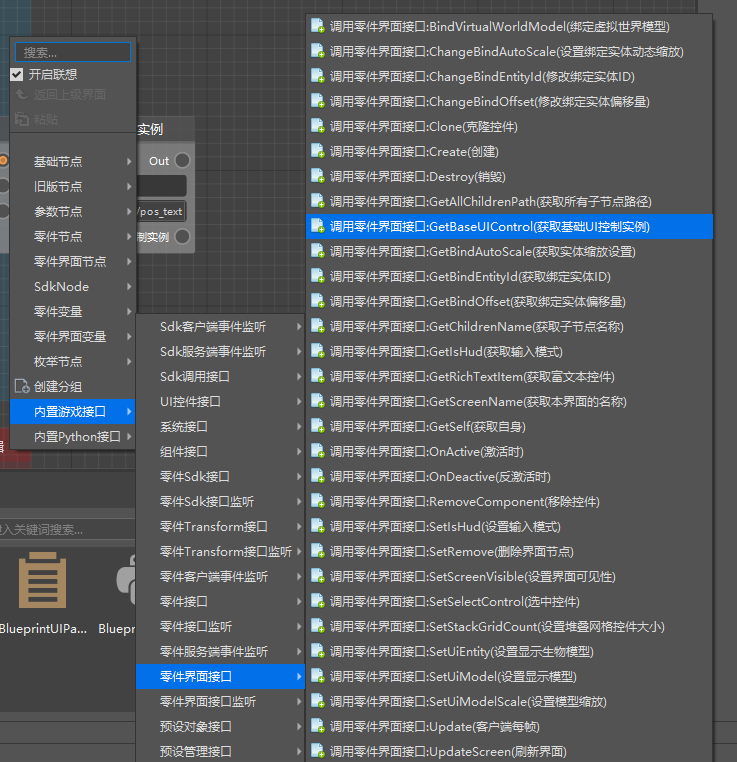

节点中的控件路径，就是我们之前的文本标签`/main_panel/pos_text`，经过这个节点的运算，就可以得到文本所对应的基础控件对象，我们接下来要把它转换成更加具体的文本控件对象，才能更改文本的值。

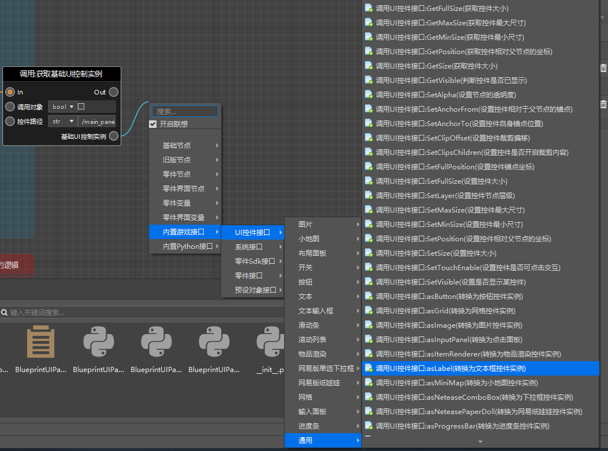

找到`asLabel`接口，将它转换成文本控件对象，然后再次调用`SetText`节点，设置文本的值。

那么文本的值就需要我们获取玩家的坐标信息，查阅文档，使用`GetPos`即可，并拼接字符串。

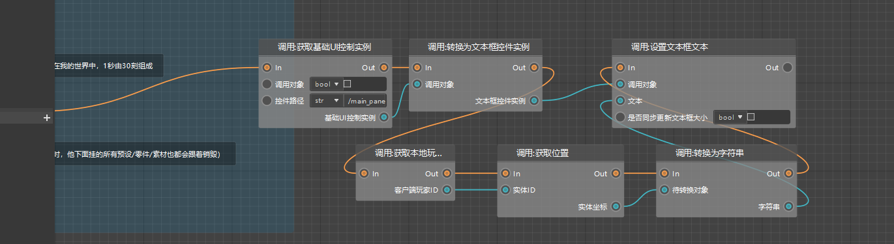

完成后效果如图，这样就可以在客户端每Tick中，更新文本控件的内容，实时显示坐标。

当然这也是有很多可以优化的地方的，例如我们的坐标信息其实并不需要1秒更新30次。

进入游戏后，可以看到右下角出现了界面，并且显示了我们的实时坐标。

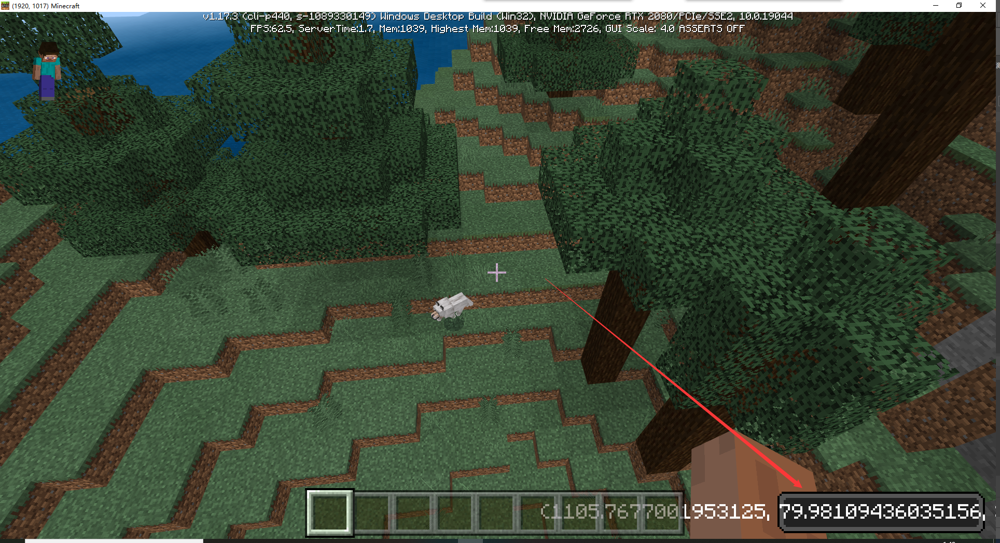

不过由于小数点过长，不能完整显示。大家可以自行尝试修改界面位置到屏幕的正中间，并修改尺寸X，来让图片包住文本。

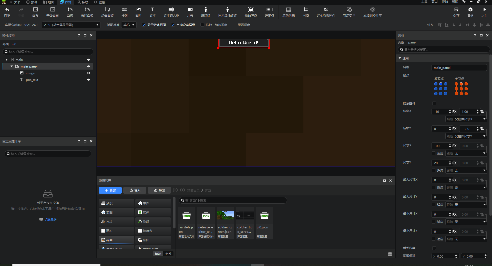

只需要将`main_panel`的锚点全部修改为中上方的即可。

总结下来，需要在逻辑中，修改界面内部的数据，总共有一下几个步骤

1. 根据控件路径，通过`GetBaseUIControl`，获取基础控件示例
2. 根据控件的具体种类不同，通过`asXXXX`，将其转换为具体的示例（例如我们这里的Label文本，类似的还有Button按钮）
3. 调用对应的示例内的接口，来达到实际修改的效果

所有UI相关接口，都可以在[文档](https://mc.163.com/dev/mcmanual/mc-dev/mcdocs/1-ModAPI/%E6%8E%A5%E5%8F%A3/%E8%87%AA%E5%AE%9A%E4%B9%89UI/UI%E6%8E%A7%E4%BB%B6.html?catalog=1)中查到。

## 课后作业

课后作业要求制作一个界面，将玩家输入的内容通过title的方式，广播给所有在线玩家。

### 界面绘制

- 创建一个`soldier_title_screen`界面，进行编辑。
- 添加一个叫`main_panel`的面板，锚点居中，尺寸X和尺寸Y分别为200,150。
- `main_panel`下添加图片，尺寸X，尺寸Y适应，图片更换为原生图片`./ui/achievements_dialog.png`。

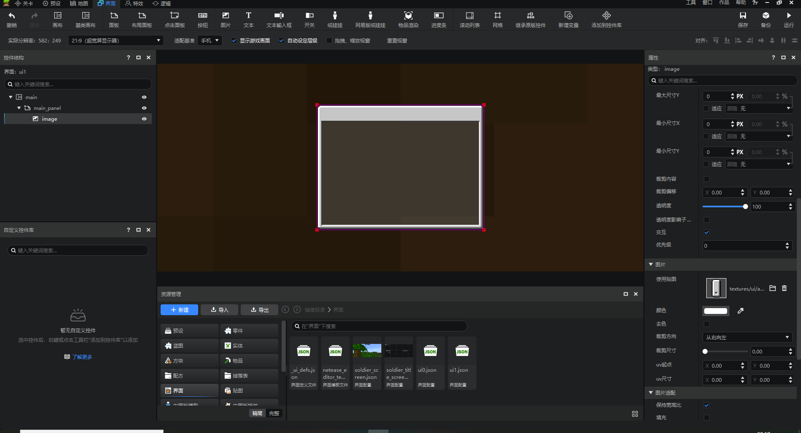

- 这样就完成了一个简单的窗口框架。接下来我们添加 文本输入框 和 按钮，在`main_panel`节点下。
- 将文本输入框的尺寸修改为`180,27`，名称修改为`title_text`。
- 将按钮的名称修改为`confirm_button`尺寸X修改为50，尺寸Y修改为20。字体缩放倍数修改为0.5，文本修改为`发送`。位移Y设置为`35`。

完成后效果如图，大家可以自由发挥，为页面添加更多元素。例如添加一个文本框，并填写：`发送title的内容`，作为提示。

并且可以自由调整这个界面的尺寸，让它看起来更加美观。

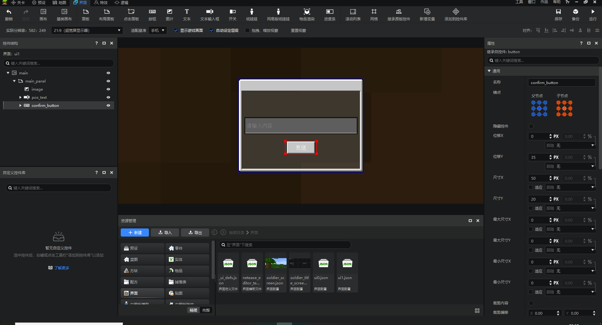

例如这里添加了一个文本作为标题。

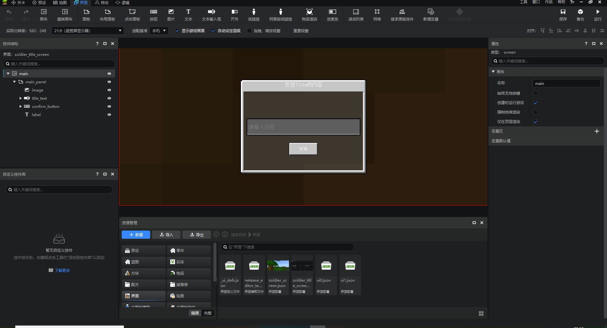

这样我们就完成了界面的编辑，大家可以参照自己的界面，是否和教程中的路径一致。

需要检查的是文本框的路径是否为`/main_panel/title_text`，按钮的路径是否为`/main_panel/confirm_button`，后面逻辑的编写会用到。

### 创建预设

新建一个界面预设，文件命名都改为`TitleScreen`。

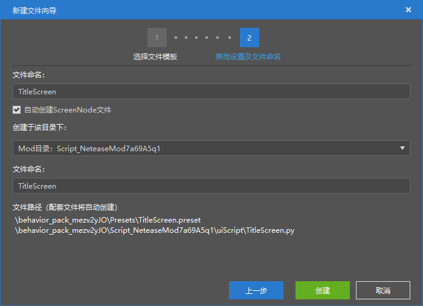

1. 勾选预加载
2. 修改绑定的界面画布为`soldier_title_screen`
3. 修改显示方式为PushScreen

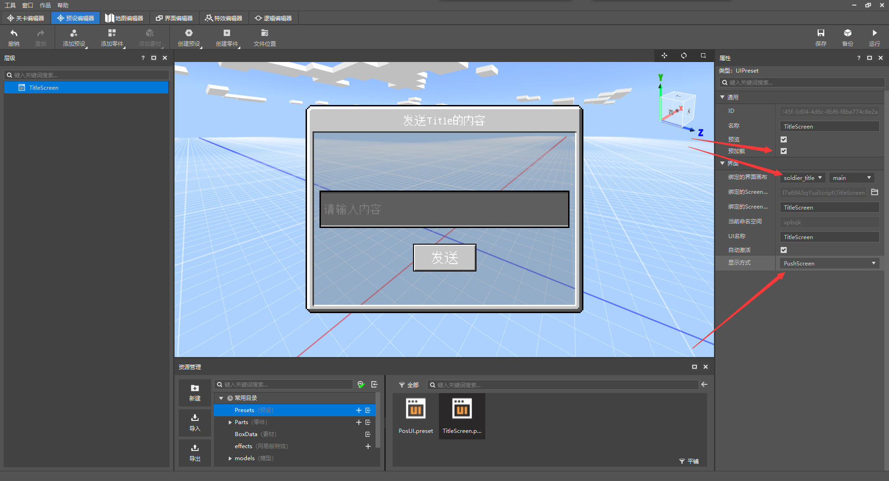

接下来新建一个蓝图UI零件，进行挂接，并打开对应的逻辑文件。

### 逻辑编写

在创建时，根据路径获取按钮的实例，并开启按钮的回调功能。具体操作如下：

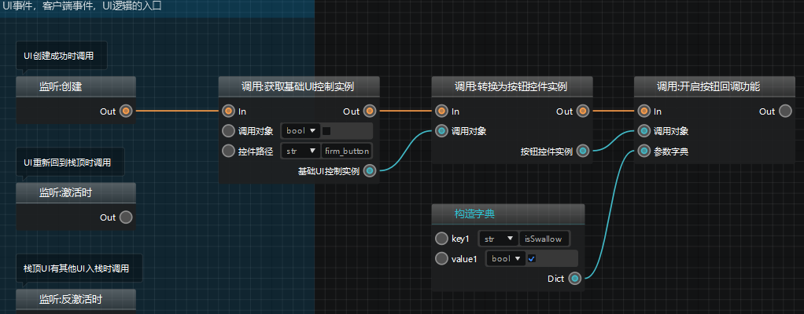

需要注意的是，参数字典，可以在[文档](https://mc.163.com/dev/mcmanual/mc-dev/mcdocs/1-ModAPI/%E6%8E%A5%E5%8F%A3/%E8%87%AA%E5%AE%9A%E4%B9%89UI/UI%E6%8E%A7%E4%BB%B6.html#addtoucheventparams)中找到，这里我们直接设置为True。

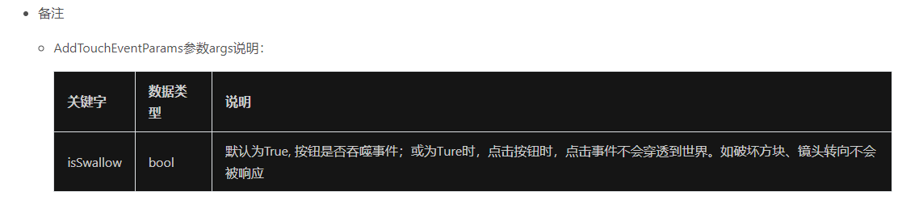

接下来我们新建一个自定义接口`f_ConfirmButtonClick`，用来编写按钮点击之后的响应逻辑。并添加一个类型为Any的参数，命名为`args`，这个是按钮的点击事件参数，具体类型为一个dict，可以打印查看，我们可以不使用，但是需要在自定义接口中设置这个参数。

首先我们正常获取这个文本框的实例，然后获取其中的文本，这就是我们要发送的内容。

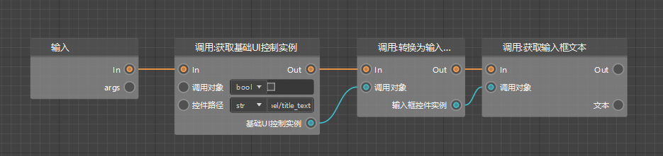

接下来因为要调用命令来发送title，而UI是客户端逻辑，不能直接调用服务端接口。所以我们需要使用通知服务端接口，来发送这个信息到服务端，并让服务端来处理这个数据。

通知服务端接口主要需要2个参数，一个是事件名称，一个是事件数据。

事件名称应该是一个文本，可以自己根据喜好来起名，用来区分每个通信的内容。在整个玩法组件的开发中，应该和其功能对应唯一。

例如我们这里设置为`SendTitle`，那么就应该认定，所有发送title数据的通信，都用这个事件名称来定义，防止数据混淆。

事件数据应为一个Dict，是具体的事件数据的载体，会完整地发送到服务端。

了解了通信的基本流程之后，就可以来编写对应的逻辑。

这里我们构造一个字典，key1为`text`，value1为title的内容，并把这字典作为事件数据，发送事件`SendTitle`到服务端。

发送完毕后，调用`PopScreen`，来以堆栈管理的形式关闭这个界面。

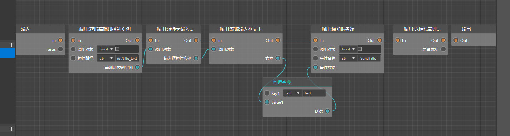

编辑完这个函数，我们回到Graph界面，在开启按钮回调功能之后，使用`SetButtonTouchUpCallback`设置这个按钮的回调函数。

这个接口的调用对象为按钮控件示例，回调函数，通过**获取零件变量**，获取名为`f_ConfirmButtonClick`的自定义接口，即我们刚刚编辑的函数。

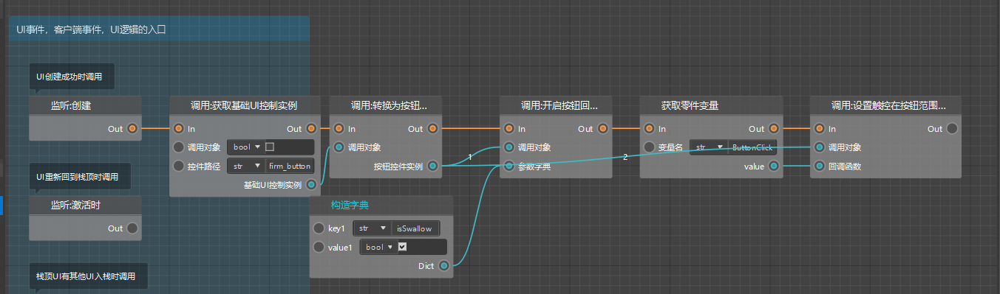

完成了客户端的按钮的逻辑，就需要在服务端监听这个自定义事件，来完成title信息的发送。

同样需要新建一个自定义接口，我们这里新建一个叫做`f_OnRecvTitle`的自定义接口，参数同样是any类型的args，这个参数就是我们从客户端发送过来的字典。

然后我们在服务端初始化的时候，使用获取自身接口，再获取零件变量，获取到我们名为`f_OnRecvTitle`的自定义接口作为回调函数，然后调用监听自身事件，来监听我们的`SendTitle`事件

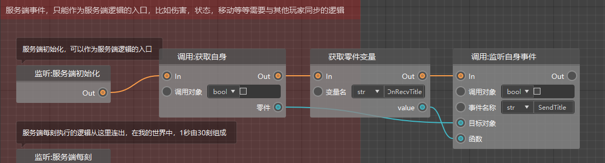

接下来我们继续编辑`f_OnRecvTitle`来获取args参数中的text文本。并将它和title命令`title @a title `拼接(注意最后有一个空格)，最后在游戏内执行。

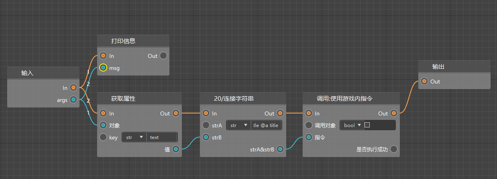

这里我们打印了输入参数的args，方便大家更直观的在日志中看到args中的内容。

需要注意的是，使用游戏内指令这个接口根据文档，有3个参数，其中`playerId`和`showOutput`都是可以选参数，我们这里都选择不填，所以需要将这个节点的这两个参数均删除，否则仍然算作填写了一个空的str参数。

至此，我们的界面就制作完成。如果在关闭界面之后仍然需要打开，则可以调用`PushScreen`来打开，其中命名空间和界面名称都可以在我们界面预设处可以找到，打开参数可以不用填写。

命名空间可以命名成自己的mod英文名，在关卡编辑器上方的作品按钮，可以找到

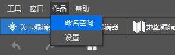

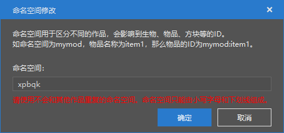
